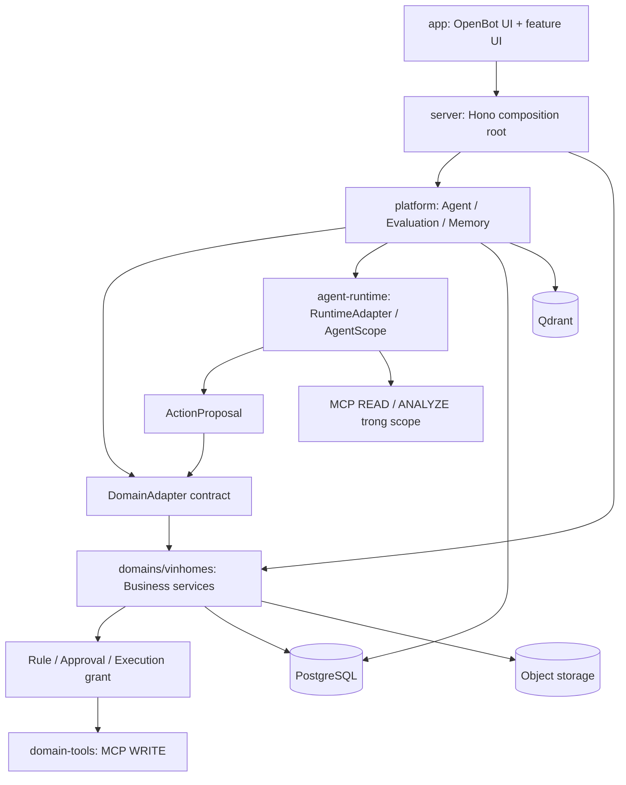

# AI Workforce Platform

Nền tảng AI dùng chung cho nhiều lĩnh vực, với **Vinhomes là domain nghiệp vụ đầu tiên**. Platform quản lý Agent, capability, evaluation, runtime và memory; từng domain quản lý dữ liệu, quy tắc và hành động nghiệp vụ của mình.

README này là tài liệu bàn giao cho technical lead và các team: code nằm ở đâu, từng package phải làm gì, tích hợp OpenBot thế nào, phối hợp qua contract nào và điều kiện nào được coi là hoàn thành.

**Repository sản phẩm:** [nguyennanganhdev/AI-Workforce-Platform](https://github.com/nguyennanganhdev/AI-Workforce-Platform). Đây là repo các thành viên clone để làm việc và gửi PR.

**Trạng thái repo: đã nhập nền OpenBot trên nhánh tích hợp.** React/Vite, Hono/auth, Drizzle, worker và deployment assets đã nằm trong repo. Router Platform/Vinhomes dùng chung host; business use cases Vinhomes, AgentScope, Qdrant và multi-tenant domain mapping vẫn cần triển khai.

**OpenBot nguồn đã clone:** [CopilotKit/OpenBot](https://github.com/CopilotKit/OpenBot) tại `E:\openbot-upstream`, ghim commit `3c73cf00efba46122dfd0447485e2b61f1d6a2cd`. Source đã nhập vào repo sản phẩm; checkout riêng dùng để đối chiếu; xem [hồ sơ nguồn và mapping](docs/architecture/OPENBOT_INTEGRATION.md).

## Mục lục

- [1. Kiến trúc và công nghệ](#overview)
- [2. Danh mục package và cấu trúc repo](#packages)
- [3. Chạy bộ khung hiện tại](#quickstart)
- [4. Clone và tích hợp OpenBot](#openbot)
- [5. Nhiệm vụ chi tiết của từng package](#implementation)
- [6. Contract và cách các package phối hợp](#contracts)
- [7. Hạ tầng, cấu hình và triển khai](#operations)
- [8. Phân công team và thứ tự thực hiện](#delivery)
- [9. Tiêu chí nghiệm thu và quy trình PR](#acceptance)
- [10. Tài liệu tham chiếu](#references)

<a id="overview"></a>

## 1. Kiến trúc và công nghệ

Kiến trúc đích là **backend TypeScript tổ chức theo module**, kèm Python runtime và các MCP service có ranh giới riêng. Platform và Vinhomes cùng nằm trong Hono server; không tách mỗi thư mục thành một microservice.

| Thành phần | Quyết định theo thiết kế | Vai trò |
|---|---|---|
| Product/UI shell | OpenBot fork | Shell, navigation, trải nghiệm tương tác và điểm tích hợp UI |
| Backend API | Hono + TypeScript | Control plane platform và application service nghiệp vụ |
| Agent runtime | AgentScope 2.0 sau `RuntimeAdapter` | Thực thi agent, lập kế hoạch, điều phối và stream event |
| Runtime/UI transport | HTTP và AG-UI tại boundary phù hợp | Chuyển request/event; chi tiết tích hợp theo OpenBot fork |
| Tool protocol | MCP | Chuẩn hóa tool và tích hợp hệ thống ngoài |
| Dữ liệu authoritative | PostgreSQL | Business state, platform metadata, audit, outbox và idempotency |
| Semantic retrieval | Qdrant | Vector phục vụ truy hồi; quyền và revision do PostgreSQL quyết định |
| File/evidence/artifact | Object/file storage | Nội dung file; metadata và quyền thuộc service sở hữu |
| Deployment | Docker/Helm theo OpenBot conventions | Đóng gói và vận hành các process thực tế |

AgentScope 2.0 là lựa chọn P0 của tài liệu thiết kế. Version SDK cụ thể, dependency lock và tính tương thích Python cần được team Runtime xác minh trước khi tích hợp. Runtime khác, governance toolkit và fleet manager nằm trong P1/spike.



Đây là sơ đồ đích, không phải danh sách service đã chạy trong repo. Agent được đề xuất hành động; domain giữ quyền phê duyệt và thực thi side effect. Khi runtime lỗi, người dùng và hệ thống nghiệp vụ vẫn phải xử lý Incident/Task/WorkOrder qua luồng human/system.

<a id="packages"></a>

## 2. Danh mục package và cấu trúc repo

Trong tài liệu này, **package kiến trúc** là một vùng code có trách nhiệm và owner rõ ràng. Nó chưa mặc nhiên là npm workspace, Python distribution đã đóng gói hay service deploy độc lập.

Repo dùng **Bun 1.3.14 workspace app/server/worker** và `bun.lock`. Agent-computer/supervisor có manifest riêng. Python runtime giữ pyproject.toml; shared/domain-tools chưa phải workspace độc lập.

| Package / vùng code | Owner chính | Đơn vị chạy dự kiến | Trạng thái hiện tại |
|---|---|---|---|
| Root | Technical lead + DevOps | Tooling chung | Bun manifest/lockfile, TS config, scripts |
| `app/` | Frontend | UI build theo shell OpenBot | React/Vite shell đã nhập; custom features còn khung |
| `server/` | Platform + Vinhomes | Một Hono API process | Hono/auth/services đã nhập; custom domain router rỗng |
| `server/src/platform/` | Platform | Module trong Hono server | Port DomainAdapter, health, README module |
| `server/src/domains/vinhomes/` | Vinhomes | Module trong Hono server | Khung nghiệp vụ, chưa có use case thực thi |
| `server/src/db/` | Data + owner schema | Persistence dùng bởi server | Drizzle upstream và khung schema domain đích |
| `shared/platform/` | Platform | Contract import bởi producer/consumer | Context, domain/action/runtime DTO, event envelope |
| `shared/domains/vinhomes/` | Vinhomes | Contract nghiệp vụ | Event envelope và status vocabulary |
| `agent-runtime/` | Runtime, thuộc Platform | Python service | TypedDict và RuntimeAdapter Protocol |
| `domain-tools/` | Integrations, phối hợp Vinhomes | MCP service theo integration | Khung tool/provider, chưa có executable |
| `charts/openbot/` | DevOps | Deployment manifests | Chart upstream đã nhập; chưa nghiệm thu deployment |
| `scripts/`, `tests/`, `.github/` | Các team + QA/DevOps | Kiểm tra local/CI | Boundary checks, scaffold tests, workflow CI |
| `docs/`, `docx/`, `research/` | Owner từng chủ đề | Tài liệu và spike | Kiến trúc, ERD, ADR, contract và khu vực nghiên cứu |

```text
AI-Workforce-Platform/
├── app/
│   └── src/
│       ├── features/
│       │   ├── platform/                 # Agent builder, registry, catalogs...
│       │   └── domains/vinhomes/         # Resident, management, operations...
│       └── routes/                       # Compose các màn hình vào shell
├── server/
│   └── src/
│       ├── index.ts                      # Khởi động process HTTP
│       ├── app.ts                        # Composition root
│       ├── platform/                     # Generic control plane
│       ├── domains/vinhomes/             # Business application services
│       └── db/
│           ├── schema/platform/
│           ├── schema/domains/vinhomes/
│           ├── migrations/platform/
│           └── migrations/domains/vinhomes/
├── shared/
│   ├── platform/                         # Contract generic
│   └── domains/vinhomes/                 # Contract nghiệp vụ
├── agent-runtime/
│   ├── pyproject.toml
│   └── src/
│       ├── contracts/
│       ├── runtime/
│       ├── supervisor/
│       ├── agents/
│       └── domain_adapters/
├── domain-tools/
│   ├── shared/
│   └── vinhomes/
│       ├── technical/
│       ├── cleaning/
│       ├── security/
│       └── reporting/
├── charts/openbot/
├── scripts/
├── tests/
├── .github/workflows/
├── docs/                                 # Hướng dẫn áp dụng và triển khai
├── docx/                                 # Thiết kế/ERD gốc dạng Markdown
├── research/                             # Platform và domain spike
├── package.json
├── bun.lock
└── tsconfig.json
```

Tên thư mục MCP trong repo hiện tại là `technical`, `cleaning`, `security`, `reporting`. Tài liệu thiết kế gốc dùng hậu tố `-mcp`; khi tạo file và phân công công việc, sử dụng đường dẫn thực tế nêu trên.

<a id="quickstart"></a>

## 3. Cài đặt, kiểm tra và chạy dự án

### 3.1. Cài dependency và kiểm tra source

Yêu cầu: Bun **1.3.14**, Node.js 24 và Python 3.11+ (`python` trong PATH). Repo sản phẩm đã chứa source OpenBot; không cần checkout upstream bên cạnh để build.

```sh
git clone https://github.com/nguyennanganhdev/AI-Workforce-Platform.git
cd AI-Workforce-Platform
git switch chore/import-openbot
npm install --global bun@1.3.14
bun install --frozen-lockfile
bun run check
bun run build
```

Nhánh `chore/import-openbot` dùng trong thời gian review; sau khi merge, dùng nhánh chính. npm ở trên chỉ cài Bun; dependency dự án dùng Bun và `bun.lock`. Build/check không cần credential AI. UI build tạo `app/dist`, không commit output.

### 3.2. Chạy toàn bộ stack local

Đọc [quickstart upstream đã nhập](OPENBOT_README.md#quick-start) và [configuration](docs/configuration.md). Thực hiện trong repo sản phẩm:

1. Bật Docker Desktop Linux containers hoặc Docker Engine.
2. Sao chép `.env.example` thành `.env` nếu chưa có. Điền CopilotKit Intelligence/project key, model credential và cấu hình theo deployment của bạn. Có thể dùng Intelligence managed hoặc self-hosted.
3. Trên Windows, dùng Bash có Bun và Docker CLI hoạt động, ví dụ WSL2 đã tích hợp Docker Desktop. Cài dependency trong môi trường chạy; không dùng chung `node_modules` Windows/Linux.
4. Chạy từ Bash:

```sh
bun install --frozen-lockfile
bash scripts/start.sh
```

Script khởi động dependency, áp dụng migration upstream và chạy service. UI mặc định `http://localhost:3010`; API `http://localhost:3001`. Dừng bằng `bash scripts/stop.sh`.

Template dùng `OPENBOT_SINGLE_USER=true` cho phát triển local; cấu hình sign-in trước khi cho nhiều người truy cập. Không commit `.env`. `bun run dev` chỉ chạy UI + server khi database/config đã sẵn sàng, không thay script Docker. Example hiện là `examples/fintech`, chưa phải tenant package Vinhomes.

### 3.3. Lệnh và endpoint

| Lệnh | Phạm vi |
|---|---|
| `bun install --frozen-lockfile` | Cài workspace app/server/worker đúng lockfile |
| `bun run dev` | Generate config, chạy UI và Hono |
| `bun run build` | Build UI và kiểm build server/worker |
| `bun run typecheck` | Typecheck ba workspace |
| `bun run typecheck:workforce` | Strict check module/contract custom |
| `bun run check:architecture` | Import boundaries với tsconfig từng workspace |
| `bun run check:runtime` | Python syntax/import; chưa chạy AgentScope |
| `bun run test:workforce` | Tests auth/router integration và boundary |
| `bun run check` | Typechecks, boundaries, Python và Workforce tests |
| `bun run test:ci` | Full Bun suite; cần dependency ngoài workspace và test PostgreSQL theo CI |

`GET /health` là health upstream. `GET /api/platform/health` trả `{"status":"ok","mode":"scaffold"}`; mode mô tả các module custom còn là khung, không phản ánh DB/AI readiness.

`/api/platform/*` và `/api/domains/*` dùng guard OpenBot; chỉ GET platform health công khai. Domain route chưa triển khai trả 404 sau auth. Trusted tenant/subject context cho business use case vẫn phải bổ sung trước mutation đầu tiên.

Full suite được cấu hình ở [.github/workflows/architecture.yml](.github/workflows/architecture.yml) với pgvector/PostgreSQL, migration và các dependency agent/desktop riêng. Chạy `bun run test:ci` chỉ sau root install trên Windows chưa tái tạo đầy đủ môi trường CI. Xem [validation](docs/architecture/OPENBOT_INTEGRATION.md).

<a id="openbot"></a>

## 4. OpenBot đã được nhập vào dự án

Nguồn: [CopilotKit/OpenBot](https://github.com/CopilotKit/OpenBot), commit `3c73cf00efba46122dfd0447485e2b61f1d6a2cd`, version `0.0.15`, license MIT. `E:/openbot-upstream` là checkout đối chiếu; source đã nằm trong repo sản phẩm.

| Source | Vị trí / xử lý trong dự án |
|---|---|
| UI React/Vite | `app/`; giữ shell/router/auth, bổ sung các feature Platform/Vinhomes |
| Hono/auth/services | `server/`; một host và guard chung, router custom compose trong `src/app.ts` |
| Drizzle/schema/migration | `server/src/db/`, `server/drizzle/`; giữ baseline, mapping logical schema domain tiếp theo |
| Shared helper | `shared/*.ts`; khác với pure contracts ở `shared/platform` và `shared/domains` |
| Routines worker | `worker/`; workspace riêng theo upstream |
| Computer/browser lifecycle | `agent-computer/`, `supervisor/`; giữ dependency/build assets |
| Agent mẫu, examples, desktop | Giữ source để tránh cắt dependency; chưa phải AgentScope/Vinhomes implementation |
| Docker/Helm | Root deployment assets, `charts/openbot/`; cần image/config của sản phẩm khi deploy |
| Tooling | Bun workspace, `bun.lock`, `tsconfig.base.json`, test preloads và scripts Workforce |
| License/README | `LICENSE`, `OPENBOT_README.md` giữ attribution và hướng dẫn nguồn |

Không nhập `.git`, `.claude` hoặc các workflow phát hành upstream. CI riêng của dự án chạy check/build/test, không publish/deploy tự động. Tài liệu release/signing upstream là tài liệu tham khảo; các workflow đó chưa được kích hoạt trong repo sản phẩm.

Generic code upstream được giữ vị trí để bảo toàn hành vi. Team sẽ chuyển dần sang `server/src/platform` theo use case; không tạo hai nguồn state cho cùng aggregate. Vinhomes persistence/use cases, AgentScope runtime, Qdrant và domain tenant mapping vẫn cần triển khai.

Boundary checker kiểm dependency Platform/Vinhomes và UI/MCP; shared helper upstream ở root là vùng implementation kế thừa. Resolve alias theo tsconfig gần file nhất; module custom vẫn chặn unresolved/computed import. Upstream asset resolution được workspace typecheck/build kiểm tra; test fixtures tách khỏi production import rules.

Mọi thành viên làm feature và PR trong **AI-Workforce-Platform**. Không dùng `file:../openbot-upstream`. Khi nâng cấp, so sánh commit upstream với baseline, port qua PR và kiểm thử; source import không tự hợp nhất hai Git history bằng `git pull`.

Chi tiết mapping, thay đổi và giới hạn kiểm chứng: [OpenBot integration](docs/architecture/OPENBOT_INTEGRATION.md).

<a id="implementation"></a>

## 5. Nhiệm vụ chi tiết của từng package

### 5.1. Root — tooling và điều phối repository

**Owner:** technical lead và DevOps, với reviewer từ các team khi thay toolchain. **Đã có:** `package.json`, lockfile, TypeScript strict config, `.editorconfig`, `.gitignore` và script kiểm tra.

Root chịu trách nhiệm tái lập môi trường, thống nhất dependency và chạy tác vụ xuyên package. Business logic nằm trong module sở hữu, không đặt vào root script.

**Nhiệm vụ triển khai:**

1. Đối chiếu Node/package manager của OpenBot với scaffold Node 24/npm; ghi rõ lựa chọn cuối cùng và cập nhật CI cùng lúc.
2. Nếu dùng workspace, thêm manifest cho những package thực sự cần dependency/build riêng, khai báo exports và điều chỉnh module resolution/boundary checker.
3. Bổ sung lệnh UI build/dev, server production build và test suites khi implementation xuất hiện. Chỉ công bố lệnh đã chạy được trong repo.
4. Thêm `.env.example` sau khi có tên biến cấu hình thực tế; kiểm tra config lúc khởi động và tài liệu hóa giá trị bắt buộc.

**Đầu ra nghiệm thu:** fresh clone cài được từ lockfile và chạy đúng các lệnh README; CI dùng cùng toolchain; không có dependency ngầm vào máy một thành viên.

### 5.2. `app/` — UI shell và feature frontend

**Owner:** Frontend; Platform/Vinhomes review nghiệp vụ tương ứng. **Đã có:** React/Vite shell, router/auth và build; custom feature vẫn là khung.

Nhập UI shell từ OpenBot vào package này. Team Frontend sở hữu navigation, layout, session UX, API client, màn hình và trạng thái loading/error/empty. Backend vẫn kiểm quyền; việc ẩn nút trên UI không thay thế authorization.

| Module dưới `app/src/` | Nhiệm vụ triển khai | Phụ thuộc chính |
|---|---|---|
| `routes/` | Gắn màn hình vào shell, navigation, route guard và error boundary theo upstream | Router/auth của OpenBot |
| `features/platform/agent-builder/` | Agent Request, clarification, AgentSpec draft, chọn model/tool/skill/KB/policy | Factory và catalog API |
| `features/platform/agent-registry/` | Danh sách Agent, version, lifecycle, deployment | Registry/version/deployment API |
| `features/platform/capabilities/` | Quản lý catalog và xem binding/permission | Capability API |
| `features/platform/evaluation/` | EvalRun, evidence, review và kết quả publish gate | Evaluation API, reviewer scope |
| `features/platform/memory/` | Memory review, revision, redaction và sync status | Memory API |
| `features/platform/admin/` | Tenant administration, domain installation, phân quyền quản trị | Identity/tenancy/domain API |
| `features/domains/vinhomes/resident/` | Gửi yêu cầu, bổ sung thông tin/evidence, theo dõi và xác nhận kết quả | Intake/Incident API |
| `features/domains/vinhomes/management/` | Ban quản lý triage, approval và xem báo cáo | Domain scope, action/reporting API |
| `features/domains/vinhomes/operations/` | Assignment, Task, WorkOrder, evidence, QC và redo | Task/execution API |
| `features/domains/vinhomes/sanitation/` | CleaningPlan/A5, checklist, xử lý và kiểm tra vệ sinh | Sanitation/Task/QC API |
| `features/domains/vinhomes/shared/` | Component/hook dùng chung riêng Vinhomes | Domain DTO; không thành thư viện generic mặc định |

**Trình tự:** nhập shell → nối auth/API client → hoàn thành luồng ResidentRequest đầu tiên → thêm màn hình quản trị và agent. API mock được dùng để phát triển/test theo contract đã thống nhất và phải được chọn rõ bằng môi trường.

**Đầu ra nghiệm thu:** build UI chạy trong CI, route refresh hoạt động, session expiry/error hiển thị rõ, tenant switch không giữ dữ liệu tenant trước, không import backend repository. UX stream có xử lý disconnect/cancel khi tích hợp runtime.

### 5.3. `server/` — API host và composition root

**Owner:** Platform cho server foundation; các team sở hữu router/use case của mình. **Đã có:** OpenBot bootstrap/auth/services; router Workforce ghép vào cùng app.

| File / vùng | Nhiệm vụ |
|---|---|
| `server/src/index.ts` | Khởi động HTTP, validate config, bind address/port, shutdown process và đóng tài nguyên |
| `server/src/app.ts` | Tạo/inject client, repository, application service và concrete DomainAdapter; compose router |
| `server/src/platform/routes.ts` | Đăng ký API platform; không chứa business logic của domain |
| `server/src/domains/vinhomes/routes.ts` | Đăng ký API Vinhomes sau auth/tenant middleware |

**Nhiệm vụ triển khai:** hợp nhất Hono/OpenBot host, auth middleware, trusted RequestContext, validation đầu vào, error response, correlation propagation, service-to-service authentication và resource lifecycle. Chọn vị trí middleware theo conventions upstream; không tạo hai cơ chế identity cạnh tranh.

API prefix hiện được mount là `/api/platform` và `/api/domains/vinhomes`. Ngoài `/api/platform/health`, các URL chi tiết sẽ được định nghĩa trong OpenAPI cùng use case. Thêm readiness riêng khi server đã có dependency cần kiểm tra.

**Đầu ra nghiệm thu:** một composition root rõ ràng; auth failure không lọt vào use case; request mang tenant/actor đã xác thực; lỗi được chuẩn hóa; server khởi động/tắt không bỏ tài nguyên hoặc request dang dở ngoài chính sách đã chọn.

### 5.4. `server/src/platform/` — generic control plane

**Owner:** Platform. **Đã có:** health route, public DomainAdapter port re-export và README module. Các chức năng dưới đây chưa có application service thực thi.

| Module | Nhiệm vụ phải triển khai | Đầu ra / điểm kiểm chứng |
|---|---|---|
| `context/` | Tạo RequestContext từ auth, tenant, actor và correlation/trace | Không tin tenant/actor gửi trong body |
| `tenancy/` | Identity integration, membership và tenant isolation | Request sai tenant hoặc không có membership bị từ chối |
| `domains/` | DomainPackage/DomainInstallation, lookup adapter theo namespace và tenant installation | Domain chưa được cài không được gọi; platform không import Vinhomes repository |
| `agents/factory/` | Clarification → draft AgentSpec → binding → static validation | Draft có binding rõ; factory không tự cấp quyền/publish |
| `agents/registry/` | Danh tính Agent, owner, slug, tra cứu và administration | Registry có tenant scope và audit |
| `agents/versions/` | AgentVersion/spec snapshot, version/hash và lifecycle | Spec bất biến khi vào formal evaluation/publish; thay spec tạo version mới |
| `agents/deployments/` | Bind published version với domain installation/environment | Chỉ version đủ điều kiện được deploy; suspend/retire được áp dụng |
| `capabilities/models/` | ModelProfile và model binding | Runtime nhận cấu hình đúng version, không đưa secret vào DTO công khai |
| `capabilities/mcp/` | MCP server/version catalog và metadata kết nối | Binding pin server/version; kiểm trạng thái khả dụng/security |
| `capabilities/tools/` | Tool/version, schema, effect và permission | READ/WRITE được phân loại, không tự mở quyền qua catalog |
| `capabilities/skills/` | Skill/version catalog và binding | AgentVersion truy vết được skill đã dùng |
| `capabilities/knowledge/` | KB/source/revision và access scope | Context chỉ dùng revision và nguồn được phép |
| `policies/` | Policy/version, generic governance contract và binding | Rule nghiệp vụ Vinhomes vẫn thuộc domain |
| `evaluation/` | EvalSuite/Run/assertion/evidence, regression baseline, publish gate và publish review | Publish bị chặn khi gate/review chưa đạt |
| `runtime/` | Gateway Python service; WorkflowSession/RunStep/AgentRun metadata; event/cancel/resume orchestration | Không gọi runtime node là business Task; lỗi runtime được phản ánh rõ |
| `actions/` | Tiếp nhận/định tuyến ActionProposal qua DomainAdapter | Không thực thi business WRITE hoặc tự tạo approval |
| `memory/` | Metadata/revision/review/redaction, vector sync và retrieval | Re-check PostgreSQL sau vector search trước khi trả context |
| `audit/` | Platform audit, outbox và idempotency | Truy vết actor/tenant/correlation; event không mất khi transaction commit |
| `integrations/` | Client hệ thống ngoài cho platform, retry/timeout và credential boundary | Không chứa application service hoặc business state Vinhomes |

**Phụ thuộc:** shared platform contract, platform DB schema, identity integration và runtime transport. Concrete domain adapter được inject từ composition root. Platform không đọc trực tiếp contract nội bộ hoặc bảng nghiệp vụ Vinhomes.

**Đầu ra nghiệm thu package:** một AgentVersion có thể được tạo, kiểm tra, review và deploy đúng quyền; thêm domain mới không cần thay Agent Factory schema; Agent/runtime failure không làm domain core phụ thuộc bắt buộc vào AI.

### 5.5. `server/src/domains/vinhomes/` — nghiệp vụ Vinhomes

**Owner:** Vinhomes. **Đã có:** skeleton module và router; chưa có persistence, authorization hoặc state transition thực thi.

Luồng canonical cần được xây dựng bằng domain services:

```text
ResidentRequest → Case → IssueCandidate → ResidentReport → Incident
→ Task → ActionRequest → RuleDecision → Approval nếu cần
→ WorkOrder → Evidence → QC → Incident RESOLVED → Resident confirmation → CLOSED
```

Đây là luồng nghiệp vụ tổng quát, không có nghĩa mọi request ánh xạ một-một qua tất cả entity: một Case có nhiều vấn đề; nhiều ResidentReport có thể cùng Incident; Incident có nhiều Task/WorkOrder.

| Module | Nhiệm vụ phải triển khai | Đầu ra / điểm kiểm chứng |
|---|---|---|
| `context/` | Resolve actor sang project/tower/apartment scope, kiểm subject access | Quyền được xác định bằng membership và tenant thực tế |
| `property/` | Project, tower, apartment, property membership và thời hạn hiệu lực | Không truy cập căn hộ/project ngoài scope |
| `intake/` | ResidentRequest, IssueCandidate, IssueRelation, ResidentReport | Validate AI proposal trước lưu; xử lý bổ sung thông tin và materialization |
| `cases/` | Vòng đời Case và nhóm yêu cầu đầu vào | Một Case chứa được nhiều request/vấn đề |
| `incidents/` | Canonical Incident, triage, relation, resolve/close | Ticket chỉ là tên UI; status NEW/OPEN/RESOLVED/CLOSED |
| `tasks/` | Business Task, assignment, dependency, version và domain_data | Dependency/blocked state không bị nhầm với runtime RunStep |
| `actions/` | ActionRequest, rule evaluation, idempotency và execution grant | Revalidate actor/scope/version/payload trước chấp nhận và thực thi |
| `approvals/` | Approver scope, quyết định, expiry và audit | Approval một Task không làm toàn Incident thành WAITING_APPROVAL |
| `work-orders/` | Assignment/execution/result, failed/completed và redo_of | Lần làm lại giữ liên kết bản cũ; không xóa lịch sử thực thi |
| `evidence/` | File metadata, EvidenceRef, upload/download access | Evidence liên kết đúng tenant/subject, file access được kiểm quyền |
| `qc/` | QCResult, evidence, kết luận và đường xử lý lại | QC fail không tự đưa Incident sang resolved |
| `sanitation/` | Workflow A5, CleaningPlan versioned JSON trong Task.domain_data | Tái sử dụng Task/WorkOrder/Evidence/QC, chưa tách A5 service/bảng riêng |
| `resident-services/` | Booking, invoice và các dịch vụ theo use case đã chọn | Mỗi dịch vụ có rule/state/contract cụ thể, tránh CRUD toàn bộ ERD trước |
| `reporting/` | Read model, báo cáo nghiệp vụ và root-cause analysis | Query/report được scope theo actor/tenant và dữ liệu nguồn |
| `integrations/` | Concrete DomainAdapter, client runtime port/MCP/external service | Adapter gọi domain application services; không có business state thứ hai |
| `events/` | Business event/outbox, notification projection | Event Vinhomes tách platform audit; consumer xử lý retry an toàn |

**Thứ tự ưu tiên:** property/context → intake/cases → Incident/Task → action/approval → WorkOrder/evidence/QC → sanitation và dịch vụ tiếp theo. Human/system path phải dùng được trước khi nối AI vào cùng application services.

**Đầu ra nghiệm thu package:** xử lý được luồng cư dân đến đóng Incident, kiểm tenant/actor/version đầy đủ, retry không tạo tác động trùng, có audit và human flow khi runtime unavailable.

### 5.6. `server/src/db/` — persistence và migration

**Owner:** Data/DevOps cho connection/migration infrastructure; Platform và Vinhomes sở hữu schema tương ứng. **Đã có:** Drizzle/schema/migration upstream và khung logical schema domain. Mapping trước khi thêm nghiệp vụ.

| Vùng | Logical schema đích | Dữ liệu chính |
|---|---|---|
| `schema/platform/identity.ts` khi triển khai | `platform_identity` | Tenant, user và identity integration |
| Platform domain/agent/capability schema | `platform_domain`, `platform_agent`, `platform_capability` | Installation, AgentVersion và catalog/binding |
| Platform evaluation/runtime schema | `platform_evaluation`, `platform_runtime` | Eval/publish, session, step, run và decision |
| Platform memory/audit schema | `platform_memory`, `platform_audit` | Revision/review/vector ref, audit/outbox/idempotency theo mapping đã chốt |
| Vinhomes property/intake schema | `vh_property`, `vh_intake` | Property membership, Case, request/candidate/report |
| Vinhomes operations schema | `vh_operations` | Incident, Task, action/approval, WorkOrder và QC |
| Vinhomes content/services schema | `vh_content`, `vh_services` | File/evidence và dịch vụ cư dân theo ERD |

Các tên file/schema là đích triển khai, chưa phải table đang tồn tại. Mapping table chi tiết phải đối chiếu ERD và được owner review trong migration PR.

**Nhiệm vụ triển khai:** chọn ORM theo upstream, connection pool/config, transaction boundary, migration runner/ledger, constraints/indexes, optimistic version, audit/outbox và fixture tối thiểu hai tenant. Một runner quản lý thứ tự migration: identity trước domain; không có hai runner tự thay đổi shared schema độc lập.

Domain chỉ hard FK sang identity tenant/user khi cần. AgentVersion/AgentRun/WorkflowSession dùng stable ref, provenance snapshot và correlation thay vì FK bắt buộc. Cùng transaction phải lưu được state thay đổi và outbox; external side effect cần idempotency/reconciliation riêng, không giả định transaction DB bao phủ hệ thống ngoài.

**Đầu ra nghiệm thu:** fresh database migrate thành công; upgrade từ baseline được kiểm thử; tenant constraint, concurrency và retry có integration tests; migration đã deploy không bị sửa lịch sử; có phương án recovery phù hợp thay đổi dữ liệu.

### 5.7. `shared/platform/` — contract generic

**Owner:** Platform; mọi consumer liên quan review khi đổi boundary. **Đã có:** các file contract dưới đây, chưa có runtime validation/schema codegen.

| File | Vai trò | Việc cần hoàn thiện |
|---|---|---|
| `context.ts` | ActorRef, RequestContext, subject/scope, JSON value | Chốt ID/tenant/actor semantics và quy tắc tạo context từ auth |
| `domain-contracts.ts` | DomainAdapter, DomainContext, capability và evidence descriptor | Implement consumer/adapter và contract test cho sáu phương thức |
| `action-contracts.ts` | Proposal, validation result và receipt | Chốt provenance, validation/error mapping, version và idempotency với domain |
| `runtime-contracts.ts` | Plan, session, step, checkpoint, event DTO | Chốt wire schema, event semantics, compatibility và validation với Python |
| `events.ts` | Platform event envelope có stream riêng | Thêm event-name/payload union cụ thể cùng producer/consumer |

AgentSpec, capability/evaluation contract, common error và validation schema được bổ sung khi use case cần. Giữ shared contract độc lập Hono/ORM/AgentScope; không export entity database hoặc credential từ package này.

**Đầu ra nghiệm thu:** producer/consumer dùng chung một nghĩa của DTO; thay đổi breaking có version/migration plan; wire data được validate tại transport. Interface TypeScript chỉ kiểm lúc phát triển, không xác thực payload HTTP.

### 5.8. `shared/domains/vinhomes/` — contract nghiệp vụ

**Owner:** Vinhomes; Frontend và Integrations là consumer chính. **Đã có:** `events.ts` và `state-machines.ts` chứa status vocabulary; chưa có transition guards.

**Nhiệm vụ triển khai:** thêm DTO property/intake/incident/task/action/work-order/evidence/tool theo từng feature; phân biệt input command, output view và persistence model; định nghĩa event payload cụ thể; thống nhất expected version, idempotency, pagination và lỗi nghiệp vụ khi API cần.

Các status hiện có là vocabulary theo ERD. Quyền chuyển trạng thái, điều kiện QC/approval và optimistic concurrency phải kiểm trong domain service. `WAITING_APPROVAL` không được thêm vào Incident chỉ để phản ánh một Task đang chờ.

**Đầu ra nghiệm thu:** UI, domain và MCP consumer tương thích; input/output cần thiết được mô tả trong OpenAPI; platform generic không phải import package này để hoạt động.

### 5.9. `agent-runtime/` — Python runtime service

**Owner:** Runtime, thuộc Platform. **Đã có:** `pyproject.toml` chưa khai báo SDK dependency, TypedDict wire DTO và `RuntimeAdapter` Protocol. Chưa có `main.py`, HTTP service, AgentScope adapter hoặc Dockerfile.

| Thành phần | Nhiệm vụ triển khai |
|---|---|
| `src/main.py` — sẽ thêm | Composition/transport root, config, service authentication, tenant/session authorization và lifecycle |
| `src/contracts/` | Parse/validate DTO wire; giữ semantics đồng bộ với TypeScript |
| `src/runtime/base.py` | Port generic cho create/execute/checkpoint/resume/cancel/stream |
| `src/runtime/agentscope_adapter.py` — sẽ thêm | Bọc AgentScope SDK, map plan/event/error và tool binding; chỉ file adapter import SDK theo rule hiện tại |
| `src/runtime/session.py` — sẽ thêm | Quản lý session lifecycle/identity và isolation |
| `src/runtime/checkpoint.py` — sẽ thêm | Persist/load checkpoint, version và resume semantics |
| `src/runtime/events.py` — sẽ thêm | Event identity, correlation, thứ tự/delivery semantics và mapping transport |
| `src/supervisor/` | Planner, participant selector, replanner theo generic context và capability |
| `src/agents/` | Generic reception/factory/evaluator/orchestrator roles |
| `src/domain_adapters/vinhomes.py` — sẽ thêm | Prompt/context mapping Vinhomes được inject từ composition root |

Protocol hiện có sáu operation: `create_session`, `execute_step`, `checkpoint`, `resume`, `cancel`, `stream_events`. Gateway TypeScript gọi transport được xây quanh Protocol; không import trực tiếp Python/AgentScope class.

**Nhiệm vụ triển khai:** xác minh SDK/version tương thích, khóa dependencies, chọn transport framework, tạo executable, xác thực service, scope session, timeout/cancel, checkpoint/resume, stream disconnect/reconnect và contract round-trip tests. Xác định rõ dữ liệu checkpoint do ai ghi và qua interface nào; không cho runtime sửa trực tiếp bảng nghiệp vụ.

Runtime được READ/ANALYZE/PROPOSE trong scope; action có side effect đi qua domain. `tenantId` trong RuntimeSessionRef là dữ liệu định danh, không tự chứng minh quyền truy cập session.

**Đầu ra nghiệm thu:** chạy được một session bằng AgentScope sau adapter, stream event đến gateway/UI, cancel có semantics rõ, checkpoint/resume được kiểm thử; không lẫn dữ liệu giữa tenant/session; lỗi model/tool được báo và truy vết.

### 5.10. `domain-tools/` — MCP và external providers

**Owner:** Integrations cùng Vinhomes. **Đã có:** README service và `src/providers/`; chưa có MCP transport, tool executable hoặc provider thực tế.

| Package | Phạm vi | Deliverable đầu tiên đề xuất |
|---|---|---|
| `domain-tools/shared/` | Auth client, correlation, error mapping và grant verification dùng chung | Helper có consumer thực tế; không chứa approval rule |
| `domain-tools/vinhomes/technical/` | Tool kỹ thuật/bảo trì qua service hệ thống liên quan | Một READ tool và một WRITE tool được scope/grant kiểm soát |
| `domain-tools/vinhomes/cleaning/` | Tool phục vụ vệ sinh và thực thi kế hoạch | Provider contract cho thao tác được domain A5 yêu cầu |
| `domain-tools/vinhomes/security/` | Tool nghiệp vụ an ninh | Read/action contract được owner an ninh chốt; quyền nhạy cảm rõ ràng |
| `domain-tools/vinhomes/reporting/` | Lấy/xuất dữ liệu báo cáo qua service API | READ scoped report và artifact/result contract |

Tên/tool operation cụ thể phải được domain owner xác nhận; bảng này phân vùng công việc, không cam kết external system hiện có API tương ứng.

Mỗi service được triển khai theo cấu trúc:

```text
src/
├── index.ts                      # Khởi động và đăng ký MCP transport
├── tools.ts                      # Input/output schema và tool handlers
├── client.ts                     # Service API client, auth, timeout/correlation
└── providers/
    ├── mock-provider.ts          # Chỉ được chọn rõ trong dev/test
    └── real-provider.ts          # Adapter cho hệ thống thực tế
```

**Quy tắc thực thi:** MCP không truy cập PostgreSQL/Qdrant trực tiếp và không quyết định approval. WRITE xác minh grant gắn tenant, action, payload, expiry và replay/idempotency trước gọi provider. Provider result trả về domain để cập nhật business state qua application service.

**Đầu ra nghiệm thu:** tool schema được validate; mock/real có contract test; service credentials được cấu hình; timeout/retry không nhân đôi side effect; grant thiếu/giả/hết hạn/sai tenant hoặc payload bị từ chối. Chỉ thêm process/container riêng khi service đã có executable và nhu cầu vận hành rõ.

### 5.11. `charts/openbot/` và deployment assets

**Owner:** DevOps, phối hợp các owner service. **Đã có:** Helm chart, Dockerfile và Compose upstream; chưa kiểm chứng deployment sản phẩm.

**Nhiệm vụ triển khai:** nhập conventions từ fork, cấu hình image/build context, service ports, liveness/readiness, resource requests/limits, secret injection và ingress. Bổ sung PostgreSQL/Qdrant/object storage theo topology đã chọn; thiết kế migration job chạy một lần trước rollout service phụ thuộc.

Local Compose nên cho developer khởi động được đúng tập dependency cần thiết; production chart phải dùng cấu hình môi trường riêng. Dockerfile runtime/MCP chỉ được tạo khi executable, dependency lock và health semantics đã rõ. Không suy ra Helm deploy thành công từ scaffold health.

**Đầu ra nghiệm thu:** image build tái lập được; môi trường mới provision/migrate/start đúng thứ tự; service có identity/network access đúng phạm vi; rollout và recovery được diễn tập; nguồn cấu hình được mô tả tại [mục hạ tầng](#operations).

### 5.12. `scripts/`, `tests/`, `.github/` — chất lượng và cộng tác

**Owner:** mỗi team chịu test của mình; QA/DevOps duy trì convention và CI. **Đã có:** import boundary checks, Python smoke, health/architecture tests và GitHub Actions chạy Bun frozen install, checks/build và full tests.

| Vùng | Nhiệm vụ tiếp theo |
|---|---|
| `scripts/check-architecture.mjs` | Mở rộng resolver/rules có chủ đích khi thêm upstream workspace/alias; giữ tests cho forbidden dependency |
| `scripts/check-runtime.py` | Bổ sung Python lint/type/test tooling khi runtime có implementation; hiện chỉ là syntax/import check |
| `tests/` | Contract, tenant isolation, domain transition, transaction/idempotency và integration suites |
| `.github/workflows/` | Thêm UI build, Python tests, DB migration/integration, MCP provider tests và image build theo tiến độ |
| `.github/pull_request_template.md` | PR nêu hành vi, owner, boundary thay đổi và bằng chứng kiểm tra |
| CODEOWNERS — sẽ thêm | Map đường dẫn tới GitHub team/handle thật khi đã được phân công |

Nếu đặt test cạnh module, cập nhật discovery/script trong cùng PR. Boundary checker là lớp kiểm tra cấu trúc bổ sung; raw SQL, HTTP call hoặc hành vi authorization vẫn cần code review và integration test riêng.

**Đầu ra nghiệm thu:** thay đổi sai dependency bị CI chặn; mọi executable mới có suite/build tương ứng; review liên team được route đúng người, không dùng CODEOWNERS với handle giả.

### 5.13. `docs/`, `docx/`, `research/` — thiết kế và tri thức dự án

**Owner:** team sở hữu quyết định/use case; technical lead review thay đổi kiến trúc chung.

| Vùng | Nội dung và nhiệm vụ |
|---|---|
| `docx/` | Tài liệu thiết kế/ERD gốc dạng Markdown; giữ nguồn quyết định và sửa khi thay đổi mô hình được chốt |
| `docs/architecture/` | Bản đồ triển khai, ownership, code convention; thêm hồ sơ tích hợp upstream khi nhập OpenBot |
| `docs/contracts/` | Contract conventions, OpenAPI platform/domain; cập nhật cùng producer/consumer |
| `docs/erd/` | Index trỏ về ERD gốc; tránh duy trì hai bản ERD lệch nhau |
| `docs/adr/` | Quyết định và hệ quả; 15 ADR hiện ghi baseline thiết kế, không chứng nhận feature đã triển khai |
| `research/platform/` | P1 alternative runtime/governance/fleet spike; ghi câu hỏi, bằng chứng và kết luận |
| `research/domains/vinhomes/` | Domain discovery, tool mapping và nghiên cứu gold set đã ẩn danh |

Spike không được import vào P0 một cách ngầm định. Khi quyết định đưa kết quả vào sản phẩm, tạo task triển khai, cập nhật ADR/contract và viết code trong package sở hữu.

**Đầu ra nghiệm thu:** tài liệu chỉ rõ đã có/chưa có, owner và quyết định nguồn; đường dẫn/lệnh đúng với repo; PR thay boundary cập nhật tài liệu liên quan trong cùng thay đổi.

<a id="contracts"></a>

## 6. Contract và cách các package phối hợp

### 6.1. Dependency và điểm tích hợp

| Consumer | Được dùng | Ranh giới cần giữ |
|---|---|---|
| UI | Shared DTO và HTTP/stream API | Không import server repository hoặc DB client |
| Platform | Shared platform contract, platform schema và injected domain port | Không import `shared/domains/vinhomes` hoặc Vinhomes implementation |
| Vinhomes | Contract generic/domain, schema của mình, injected gateway/client | Không import trực tiếp implementation platform hoặc domain khác |
| Domain DB schema | Schema của mình và platform identity | Không hard FK tới AgentRun/AgentVersion/WorkflowSession |
| Python generic runtime | Runtime contract và injected domain mapping | AgentScope SDK giới hạn trong implementation adapter |
| MCP | Tool/shared contract, service API và external provider | Không đọc/ghi trực tiếp PostgreSQL/Qdrant |
| Composition root | Concrete implementations cần để nối dependency | Không chuyển business logic về root |

Giữa module cùng package, công bố application API qua `index.ts` khi module có implementation. Route xử lý transport; service giữ use case/authorization/transaction; repository giữ persistence. Không tạo đủ lớp/file rỗng chỉ để khớp template.

### 6.2. DomainAdapter cần thực hiện gì?

| Phương thức | Trách nhiệm của domain |
|---|---|
| `resolveSubject(context, ref)` | Kiểm scope và trả context hợp lệ của subject |
| `validateAction(context, proposal)` | Kiểm trước proposal; kết quả hợp lệ chưa phải execution grant |
| `submitAction(context, proposal)` | Kiểm lại trong transaction, áp dụng idempotency và tiếp nhận thành ActionRequest |
| `listCapabilities(context, scope)` | Trả capability READ/ANALYZE/PROPOSE phù hợp quyền effective |
| `resolveActorScope(context)` | Resolve membership và quyền hiệu lực của actor |
| `getEvidence(context, refs)` | Kiểm quyền từng evidence và trả descriptor được phép |

Implementation dự kiến nằm ở `server/src/domains/vinhomes/integrations/adapter.ts`, gọi application services của domain. File này chưa có trong scaffold; việc thêm adapter phải đi cùng use case thật và contract tests, không trả thành công giả.

### 6.3. Từ đề xuất AI đến side effect

```text
Runtime tạo ActionProposal
  → Platform route tới installed DomainAdapter
  → Domain kiểm actor / tenant / subject / payload / business version
  → Domain tiếp nhận ActionRequest bằng idempotency key
  → RuleDecision và Approval nếu cần
  → Domain cấp execution grant
  → MCP kiểm grant, gọi real provider
  → Domain nhận kết quả, cập nhật WorkOrder/Evidence/Event
```

Receipt từ `submitAction` chỉ xác nhận tiếp nhận, không chứng minh action đã được approve hoặc thực thi. Producer metadata là provenance cần xác minh; nó không thay RequestContext đã xác thực. Validation trước và mutation phải xử lý race bằng transaction/version đúng use case.

Idempotency theo tenant/key; cùng key khác payload phải bị từ chối. Domain và Integrations cùng chốt chiến lược retry/reconciliation khi provider timeout sau khi đã tạo side effect. Event cần identity/correlation; consumer chịu được delivery lặp.

### 6.4. TS/Python, OpenAPI và contract version

Runtime DTO hiện được mirror bằng tay giữa TypeScript và Python. Trước khi mở transport, team chọn wire validation/schema hoặc codegen, thêm round-trip/compatibility tests và chốt error/event semantics. Không xem TypedDict hoặc interface là input validation.

Contract mới phải có producer và consumer owner review. Breaking change cần version và kế hoạch chuyển consumer trước khi deploy độc lập. Hiện OpenAPI platform chỉ mô tả health; OpenAPI Vinhomes có `paths: {}` và chưa cam kết business API.

<a id="operations"></a>

## 7. Hạ tầng, cấu hình và triển khai

### 7.1. Service topology dự kiến

| Process / hạ tầng | Phụ thuộc / quyền truy cập cần thiết | Owner |
|---|---|---|
| UI build/serving | Hono API và stream endpoint qua cấu hình public | Frontend + DevOps |
| Hono server | PostgreSQL, memory integration/Qdrant, storage, runtime/MCP clients theo module | Platform + Vinhomes |
| Python runtime | Model provider, tool endpoint được cấp scope, platform gateway/checkpoint interface đã chốt | Runtime |
| MCP services | Domain/service API, external provider và cơ chế verify grant | Integrations |
| PostgreSQL | Schema/role/migration/backup | Data + DevOps |
| Qdrant | Collection/index/embedding metadata mapping, sync/rebuild | Platform Memory + DevOps |
| Object storage | File bucket/path, access policy, metadata mapping và retention | Vinhomes/Platform theo artifact + DevOps |

Python runtime và MCP không được tự sửa business tables. Deployment tách process không bắt buộc tách từng module platform/domain thành service riêng.

### 7.2. Cấu hình cần bàn giao

**Server đã đọc cấu hình OpenBot tại `server/src/config.ts`; tên biến thực tế ở `.env.example`.** Các nhóm sau mô tả trách nhiệm cấu hình; tham chiếu `.env.example` và `docs/configuration.md` cho required settings:

| Nhóm | Nội dung phải chốt |
|---|---|
| Server/UI | API base URL, host/port, allowed origins, public stream route |
| Identity | Issuer/session mechanism, client configuration, tenant mapping và service identity |
| PostgreSQL | Connection settings, schema roles, pool, migration credentials |
| Runtime/model | Runtime endpoint, timeout, model profile, credential references |
| MCP/providers | Endpoint/transport, service credentials, provider mode và retry policy |
| Execution grant | Issuer/verifier, key distribution, expiry, payload binding và replay handling |
| Qdrant/embedding | Endpoint/collection, model/dimension/version và sync strategy |
| Storage | Endpoint/bucket/path conventions, access và upload/download policy |
| Observability | Logs, metrics, trace/correlation và redaction |

Service owner định nghĩa biến/config thực tế, `.env.example`, validation và cách inject khi deploy. Frontend chỉ nhận cấu hình public; credentials do backend/service sở hữu. Không yêu cầu developer đoán tên biến từ README.

### 7.3. Thứ tự bootstrap môi trường đích

1. Provision PostgreSQL và storage cần cho use case; thêm Qdrant khi bật memory/vector flow.
2. Chạy migration có version và dữ liệu bootstrap đã kiểm soát cho identity/domain installation/catalog cần thiết.
3. Khởi động Hono, kiểm readiness và identity flow; human/domain operation phải hoạt động.
4. Khởi động MCP/provider integration, rồi runtime với capability được cấp và transport đã xác thực.
5. Serve UI, kiểm request → domain → runtime/proposal → approval/execution theo luồng đã triển khai.

Đây là thứ tự triển khai đề xuất. Đã có scripts/Compose/Helm upstream; xem quickstart mục 3. DevOps vẫn cần nghiệm thu image/config sản phẩm trước deployment.

<a id="delivery"></a>

## 8. Phân công team và thứ tự thực hiện

Các tên dưới đây là vai trò, không yêu cầu phải có đúng số team tương ứng. Lead có thể gộp vai trò nhưng mỗi deliverable cần một owner chịu trách nhiệm.

| Vai trò | Nơi làm việc chính | Deliverable mở đầu |
|---|---|---|
| Technical lead | Root, architecture, contract boundaries | Chốt OpenBot URL/SHA, mapping và toolchain |
| Frontend | `app/` | Nhập shell, nối identity/API, ResidentRequest UI |
| Platform | `server/src/platform/`, `shared/platform/` | RequestContext, domain installation, Registry/Version |
| Vinhomes | Domain backend và shared domain | Property scope, intake, Incident/Task, human flow |
| Runtime | `agent-runtime/`, runtime gateway phối hợp Platform | AgentScope adapter, authenticated transport, session/events |
| Integrations | `domain-tools/`, domain integration client | MCP READ trước, grant-protected WRITE sau |
| Data/DevOps | DB infrastructure, root CI, deployment | Migration framework, local dependencies, deploy pipeline |
| QA | Tests của từng package và luồng xuyên package | Tenant/contract/idempotency tests, E2E acceptance |

### 8.1. Các mốc triển khai

| Mốc | Phạm vi | Điều kiện hoàn tất / mở mốc sau |
|---|---|---|
| M0 — Scaffold | Cấu trúc, port, health, import checks | Lệnh quickstart và CI scaffold chạy được |
| M1 — OpenBot foundation | Nhập shell/server/auth/tooling; DB identity/property nền | Fresh clone chạy UI + API; tenant/actor thật; mapping upstream được lưu |
| M2 — Luồng nghiệp vụ đầu tiên | ResidentRequest → Case → Incident/Task, thao tác người dùng | Domain chạy khi AI tắt; quyền/transaction/version được kiểm thử |
| M3 — Agent integration | Registry/Version, evaluation/publish tối thiểu, runtime + MCP READ | AgentVersion hợp lệ chạy qua adapter; output là proposal, không tự WRITE |
| M4 — Controlled execution | Action/Approval/Grant/MCP WRITE/WorkOrder/Evidence/QC | Retry, expiry, replay và redo/QC có test; audit end-to-end |
| M5 — Mở rộng | A5/dịch vụ, memory, regression/gold set, domain adapter mẫu mới | Không đổi Factory schema để thêm domain; quyền memory/revision đúng |

Sau khi chốt contract, Frontend làm UI với mock rõ ràng, Vinhomes làm application services, Platform làm control plane và Runtime/Integrations làm adapter/provider song song. Mốc nghiệm thu được xét trên luồng tích hợp; không đợi xây hết catalog/ERD rồi mới chạy use case đầu tiên.

### 8.2. Cách giao task cho thành viên

Mỗi task ghi đủ: package/module sở hữu, trigger/use case, input/output contract, schema/migration thay đổi, dependency đang chờ, tiêu chí nghiệm thu và reviewer. Ví dụ task “tiếp nhận ResidentRequest” phải giao đồng thời domain service/contract/API, quyền actor, idempotency và bằng chứng test; UI có task consumer tương ứng.

Review chéo bắt buộc theo trách nhiệm: DomainAdapter/ActorRef/subject giữa Platform–Vinhomes; runtime DTO giữa Platform–Runtime; proposal/grant giữa Platform–Vinhomes–Integrations; UI API giữa backend owner–Frontend; identity/FK/migration giữa Data và owner hai phía. Mapping cụ thể xem [OWNERSHIP](docs/architecture/OWNERSHIP.md).

<a id="acceptance"></a>

## 9. Tiêu chí nghiệm thu và quy trình PR

Một package được coi là bàn giao khi có implementation tương ứng phạm vi được giao, executable/build nếu cần, cấu hình được tài liệu hóa, contract nhất quán, test hành vi và reviewer owner. Thư mục/README/DTO riêng lẻ không được tính là feature đã hoạt động.

| Hạng mục | Bằng chứng cần có khi liên quan |
|---|---|
| Cấu trúc | Boundary checks qua; public API rõ; không import repository xuyên owner |
| Contract | OpenAPI/DTO/error/event đồng bộ producer–consumer; validation tại transport |
| Quyền | Test tenant/actor/subject scope và denial paths; không tin identity từ body |
| Persistence | Migration, constraint/index, transaction và optimistic concurrency tests |
| Side effect | Idempotency, grant verification, retry/reconciliation và audit |
| Runtime | Session isolation, event, timeout/cancel, checkpoint/resume và failure mapping |
| UI | Build, loading/error/empty state, auth/session và API integration smoke |
| Deployment | Dependency lock, image/manifests, health/readiness, config và recovery hướng dẫn |
| Bàn giao | README module cập nhật trạng thái; owner/consumer biết phần đã có và deferred |

PR cần mô tả vấn đề và hành vi sau thay đổi, package bị ảnh hưởng, contract/schema thay đổi, kết quả checks/tests và giới hạn còn lại. Chạy `bun run check` cho scaffold và các lệnh bổ sung của package đã triển khai. Không bỏ import rule chỉ để làm xanh CI; nếu boundary thay đổi có chủ đích, cập nhật ADR/rule/tests cùng PR.

<a id="references"></a>

## 10. Tài liệu tham chiếu

| Tài liệu | Khi cần đọc |
|---|---|
| [System Design](docx/04_SYSTEM_DESIGN_STRUCTURE_ARCHITECTURE.md) | Quyết định nền tảng, cây code đích và invariants |
| [System ERD](docx/01_SYSTEM_ERD_COMPLETE.md) | Shared identity, cross-system reference và inventory tổng thể |
| [Vinhomes ERD](docx/02_VINHOMES_DOMAIN_ERD.md) | Business aggregate, state, action, WorkOrder/QC và A5 |
| [Platform ERD](docx/03_PLATFORM_ERD.md) | Factory, catalog, evaluation, runtime và memory |
| [Architecture map](docs/architecture/README.md) | Dependency rules và điểm nối implementation |
| [OpenBot integration](docs/architecture/OPENBOT_INTEGRATION.md) | Checkout nguồn, commit baseline, toolchain thực tế và mapping |
| [Ownership](docs/architecture/OWNERSHIP.md) | Phân công và reviewer liên team |
| [Team guide](docs/architecture/TEAM_GUIDE.md) | Cách tổ chức module, route/service/repository và PR |
| [Contract guide](docs/contracts/README.md) | DTO conventions và thay đổi contract |
| [Platform OpenAPI](docs/contracts/platform.openapi.yaml) | HTTP contract đã mô tả cho scaffold |
| [Vinhomes OpenAPI](docs/contracts/domains/vinhomes.openapi.yaml) | Vị trí bổ sung business HTTP contracts |
| [ADR index](docs/adr/README.md) | 15 quyết định baseline và hệ quả đối với code |

Các tài liệu thiết kế là baseline kiến trúc; README này mô tả cách áp dụng vào repo hiện tại. Nếu implementation thay đổi quyết định gốc, cập nhật ADR và tài liệu nguồn tương ứng. Hono bootstrap hiện tại tham chiếu [hướng dẫn Node.js chính thức](https://hono.dev/docs/getting-started/nodejs).
