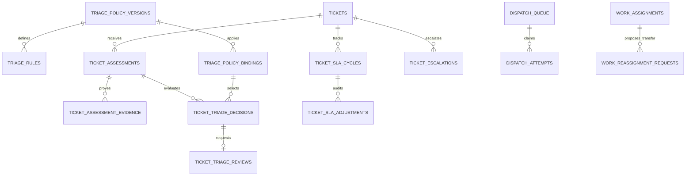

# Bổ sung database V3 — Đánh giá sự cố, ưu tiên và điều phối

## 1. Phạm vi và quyết định kiến trúc

Tài liệu bổ sung cho `DB_AI_Platform_Builder_Vinhomes_Reviewed_V2.md`, tập trung nghiệp vụ đánh giá mức độ nghiêm trọng, xác nhận ưu tiên, SLA và hàng đợi sửa chữa. Có **12 bảng mới**, **6 bảng hiện có được mô tả lại đầy đủ với thay đổi V3**. Các bảng còn lại kế thừa V2. Đây là thiết kế, chưa phải migration đã triển khai. Không thay code nguồn hoặc database đang chạy.

Các trao đổi về mỗi tài khoản BQL có groupchat riêng, routing_destinations và Supervisor template chưa được đưa vào V2. Bổ sung này không tuyên bố đã triển khai các thay đổi đó; khi triển khai phải tích hợp routing/workspace riêng. Engine đánh giá độc lập với instance Supervisor: cùng ticket luôn có một nguồn quyết định chính thức trong DB, dù Reception và nhiều agent cùng đề xuất.

| Khái niệm | Ý nghĩa | Nguồn chính thức |
|---|---|---|
| Severity | Hậu quả/phạm vi ảnh hưởng hiện tại: unknown, minor, moderate, major, critical; not_applicable cho dịch vụ thường | Quyết định applied |
| Urgency | Mức cần hành động sớm được đề xuất: unknown/routine/soon/immediate | Assessment, được policy kiểm tra |
| Priority | Thứ tự phục vụ nghiệp vụ: low/normal/high/critical | Quyết định applied, projection tickets |
| Emergency | Cờ xử lý khẩn từ dấu hiệu/rule sàn, không chỉ điểm tổng | Quyết định applied + escalation |
| Confidence | Mức tự báo độ chắc chắn của người/model đánh giá | Assessment; không coi là xác suất đúng đã hiệu chuẩn |
| Queue rank | 10/20/30/40 ánh xạ priority, không đổi severity | Projection dispatch_queue |

Reception hỏi và đề xuất ngay lúc tiếp nhận. Subagent chuyên môn/nhân viên bổ sung facts. Supervisor điều phối bước xác minh. **Backend Rule Engine** chạy chính sách có phiên bản, kiểm tra quyền và áp dụng quyết định; dispatcher chọn công việc đủ điều kiện. Không cần agent riêng có quyền tự ghi ưu tiên. Người có quyền management/admin theo phạm vi duyệt hạ mức hoặc can thiệp quy tắc; customer gửi thông tin và staff ghi quan sát, không tự đổi priority chính thức.

Tất cả bảng mới là **bảng ứng dụng tự quản lý**, LangGraph/AgentScope không tự sinh chúng. source_run_id truy về agent_runs → runtime_session_bindings → runtime_identities → execution_principals; không nhận thread/user key từ browser để cấp quyền. Không bổ sung cột vào checkpoint framework.

## 2. Quy tắc phân loại và chọn policy

Các mức trong tài liệu là quy ước thiết kế, không phải mức an toàn/SLA tiêu chuẩn cho mọi domain. Team nghiệp vụ cần publish chính sách thực tế trước bật tự động. Không sử dụng một công thức điểm tùy ý như severity×urgency để quyết định mọi tình huống; dấu hiệu khẩn phải có rule sàn riêng.

1. Domain từ tenant và đối tượng phục vụ đã xác minh; với Vinhomes đối chiếu site.domain_id. Một người có nhiều căn hộ cần chọn và xác minh căn hộ cụ thể. Không dùng domain/địa chỉ do model đoán.
2. Tra binding đúng domain/request_kind, phạm vi sâu nhất rồi category chính xác trước fallback category NULL. Khi chưa xác minh địa bàn chỉ được dùng tenant-scope fallback của domain đã xác minh. Không có hoặc trùng binding thì policy_missing và review, không chọn ngẫu nhiên.
3. Validate facts theo schema đã pin. Ví dụ impact_extent=single_unit/multiple_units/building, spread_status=contained/spreading/unknown, affected_unit_count kiểu integer, service_disrupted bool/unknown. Khóa, đơn vị, timestamps và provenance được allowlist; dữ kiện model diễn giải vẫn có thể sai.
4. Chạy emergency_floor trước, lấy mức sàn cao nhất. Chạy decision rule có thứ tự; unknown không phải false. Thiếu facts bắt buộc dùng unknown_priority của policy và mở review có hạn. Dấu hiệu khẩn đủ điều kiện không chờ model confidence cao hoặc ảnh upload xong mới gửi cảnh báo.
5. Cập nhật tự động chỉ nâng/giữ mức đã có; hạ severity/priority hoặc gỡ emergency cần phiếu review và người đủ quyền. Human override không được vượt tenant/assignment/approval/giới hạn công suất và phải nêu lý do, không sửa âm thầm dấu vết rule.
6. Policy version mới chỉ được áp dụng khi re-evaluate có event; không thay âm thầm mọi ticket đang chạy. Quyết định mới pin policy/binding/rule và engine_version.

Ví dụ rule minh họa cú pháp, **không phải cấu hình an toàn mặc định để deploy**:

```json
{
  "rule_code": "WATER_SPREAD_MULTIPLE_UNITS",
  "rule_kind": "decision",
  "precedence": 10,
  "condition_expr": {"all": [
    {"eq": [{"fact": "spread_status"}, "spreading"]},
    {"gte": [{"fact": "affected_unit_count"}, 2]}
  ]},
  "severity_result": "major",
  "priority_result": "high",
  "requires_human_review": true
}
```

## 3. Quan hệ chính



## 4. Quy ước cưỡng chế

- Mọi bảng mới có UUID PK, tenant_id và UNIQUE(tenant_id,id). Các FK được ghi gọn `target.id` trong từ điển phải triển khai composite `(tenant_id,target_id)` tới `(tenant_id,id)` khi đích có tenant. FK users dùng TEXT và kiểm tra tenant_memberships/scoped_user_roles phù hợp; actor admin xuyên tenant phải có audit.
- Ngoài cùng tenant, phải xác minh cùng ticket/generation/domain và quan hệ nguồn. Dùng composite FK khi có cột đích, constraint trigger cho chuỗi quan hệ; CHECK chỉ kiểm tra row hiện tại. [PostgreSQL constraints](https://www.postgresql.org/docs/18/ddl-constraints.html).
- RLS tenant cộng phạm vi tài nguyên; application role không được ghi trực tiếp projection/decision. Agent chỉ qua tool đề xuất; service apply riêng có quyền giới hạn. Source_run là chứng cứ audit, không giấy phép vĩnh viễn.
- Append-only: assessments+evidence, decisions, adjustments. Bảng review/escalation/job mutable có transition qua transaction và ticket_events. Policy draft mutable; nội dung đã publish không đổi. ON DELETE RESTRICT và retention thống nhất với V2.
- Giá trị enum dùng CHECK hoặc PostgreSQL enum. JSONB chỉ cho facts/AST/snapshot có schema, không thay FK cho quyền và actor. Không lưu nội dung suy luận nội bộ của model.
- Clock UTC TIMESTAMPTZ, hạn loại trừ theo [from,to), engine thời gian dựa trên server. Phân biệt observed_at do thiết bị/nguồn báo với submitted_at server.
- CHECK các ticket_generation>=0, version/fencing>=0, decision_seq/version_no/precedence>0. Parent-child cùng generation phải qua FK/trigger, không chỉ kiểm tra số không âm. ENUM unknown và NULL là hai khái niệm khác nhau: unknown là kết quả chưa xác định, NULL thường là chưa phát sinh quan hệ.

## 5. Từ điển 12 bảng mới

### 5.1. `triage_policy_versions` — Ứng dụng tự quản lý

Phiên bản chính sách phân loại mức độ và ưu tiên.

| Cột | Kiểu | Ràng buộc | Ý nghĩa |
|---|---|---|---|
| `id` | UUID | PK, NOT NULL; DEFAULT gen_random_uuid() | Định danh bản ghi |
| `tenant_id` | UUID | NOT NULL; FK → `tenants.id` | Tenant sở hữu dữ liệu |
| `domain_id` | UUID | NOT NULL; FK → `domains.id` | Tham chiếu domains.id |
| `policy_code` | TEXT | NOT NULL | Mã dòng chính sách trong domain |
| `version_no` | INT | NOT NULL | Phiên bản dương, không sửa nội dung sau publish |
| `status` | TEXT | NOT NULL | draft/published/retired |
| `engine_version` | TEXT | NOT NULL | Phiên bản bộ diễn giải rule cần để tái hiện |
| `input_schema_version` | TEXT | NOT NULL | Phiên bản JSON Schema facts, bao gồm kiểu và đơn vị |
| `input_schema` | JSONB | NOT NULL | Schema facts allowlist; unknown khác false |
| `unknown_priority` | TEXT | NOT NULL | Ưu tiên dự phòng khi thiếu thông tin: normal/high/critical |
| `review_timeout_seconds` | INT | NOT NULL | Hạn yêu cầu người có thẩm quyền xác minh; >0 |
| `max_fact_age_seconds` | INT | NOT NULL | Ngưỡng facts cần xác minh lại; >0 |
| `max_queue_wait_seconds` | INT | NOT NULL | Ngưỡng chờ cần escalation; >0 |
| `policy_hash` | TEXT | NOT NULL | SHA256 canonical của schema, tham số và toàn bộ rules |
| `created_by` | TEXT | NOT NULL; FK → `users.id` | Tham chiếu users.id |
| `published_by` | TEXT | NULL; FK → `users.id` | Tham chiếu users.id |
| `published_at` | TIMESTAMPTZ | NULL | Thời điểm publish |
| `created_at` | TIMESTAMPTZ | NOT NULL; DEFAULT now() | Thời điểm server ghi nhận |
| `updated_at` | TIMESTAMPTZ | NOT NULL; DEFAULT now() | Thời điểm cập nhật bởi transaction nghiệp vụ |

**Ràng buộc và xử lý:** UNIQUE(tenant_id,domain_id,policy_code,version_no); version_no>0. FK domain cùng tenant. published bắt buộc published_by/published_at và đủ rules/schema; nội dung/rules bất biến từ publish, chỉ lifecycle retired được thay đổi có audit. Không chọn bản mới nhất theo thời gian khi chạy: phải chọn binding có hiệu lực. Retired không xóa lịch sử; binding mới không được chọn retired. unknown_priority không được low; đây là cấu hình tenant đã duyệt, không mức chuẩn ngành. Admin publish; management có quyền phạm vi có thể soạn draft. Không lưu Python/SQL tùy ý trong rule.

### 5.2. `triage_policy_bindings` — Ứng dụng tự quản lý

Gắn chính sách vào domain địa bàn và loại dịch vụ.

| Cột | Kiểu | Ràng buộc | Ý nghĩa |
|---|---|---|---|
| `id` | UUID | PK, NOT NULL; DEFAULT gen_random_uuid() | Định danh bản ghi |
| `tenant_id` | UUID | NOT NULL; FK → `tenants.id` | Tenant sở hữu dữ liệu |
| `domain_id` | UUID | NOT NULL; FK → `domains.id` | Tham chiếu domains.id |
| `scope_id` | UUID | NOT NULL; FK → `access_scopes.id` | Tham chiếu access_scopes.id |
| `category_id` | UUID | NULL; FK → `service_categories.id` | Tham chiếu service_categories.id |
| `request_kind` | TEXT | NOT NULL | incident/service_request |
| `policy_version_id` | UUID | NOT NULL; FK → `triage_policy_versions.id` | Tham chiếu triage_policy_versions.id |
| `valid_from` | TIMESTAMPTZ | NOT NULL | Bắt đầu áp dụng |
| `valid_to` | TIMESTAMPTZ | NULL | Kết thúc loại trừ, NULL vô hạn |
| `status` | TEXT | NOT NULL | active/disabled |
| `configured_by` | TEXT | NOT NULL; FK → `users.id` | Tham chiếu users.id |
| `created_at` | TIMESTAMPTZ | NOT NULL; DEFAULT now() | Thời điểm server ghi nhận |
| `updated_at` | TIMESTAMPTZ | NOT NULL; DEFAULT now() | Thời điểm cập nhật bởi transaction nghiệp vụ |

**Ràng buộc và xử lý:** status active/disabled; CHECK valid_to IS NULL OR valid_to>valid_from. scope kind tenant/site/zone/building; tenant scope là fallback trong domain_id cụ thể, không toàn domain khác. Domain của địa bàn phải khớp domain_id. category NULL là fallback mọi category trong domain. Policy version cùng domain và tenant, published lúc tạo binding. Resolver ưu tiên độ sâu building>zone>site>tenant, rồi category chính xác trước NULL. Không có hai binding active trùng khoảng cho cùng tenant/domain/scope/category/request_kind: dùng hai EXCLUDE GiST riêng cho category NULL và NOT NULL, [valid_from,valid_to). FK/trigger xác minh quan hệ, không tin domain từ client. Không sửa target/version hoặc valid_from của binding đã dùng; chỉ kết thúc valid_to/disable có audit, thay bằng binding mới.

### 5.3. `triage_rules` — Ứng dụng tự quản lý

Các điều kiện và kết quả do backend thực thi xác định.

| Cột | Kiểu | Ràng buộc | Ý nghĩa |
|---|---|---|---|
| `id` | UUID | PK, NOT NULL; DEFAULT gen_random_uuid() | Định danh bản ghi |
| `tenant_id` | UUID | NOT NULL; FK → `tenants.id` | Tenant sở hữu dữ liệu |
| `policy_version_id` | UUID | NOT NULL; FK → `triage_policy_versions.id` | Tham chiếu triage_policy_versions.id |
| `rule_code` | TEXT | NOT NULL | Mã ổn định trong policy version |
| `rule_kind` | TEXT | NOT NULL | emergency_floor/decision |
| `precedence` | INT | NOT NULL | Thứ tự dương trong từng loại rule |
| `condition_expr` | JSONB | NOT NULL | AST allowlist: all/any/not/eq/in/gt/gte/exists; không code tự do |
| `severity_result` | TEXT | NOT NULL | minor/moderate/major/critical; decision cho service_request cho phép not_applicable |
| `priority_result` | TEXT | NOT NULL | low/normal/high/critical; emergency_floor là mức sàn |
| `requires_human_review` | BOOLEAN | NOT NULL; DEFAULT false | Bắt buộc mở phiếu xác minh |
| `reason_template` | TEXT | NOT NULL | Mẫu giải thích có mã facts, không chứa PII cố định |
| `created_at` | TIMESTAMPTZ | NOT NULL; DEFAULT now() | Thời điểm server ghi nhận |

**Ràng buộc và xử lý:** UNIQUE(policy_version_id,rule_code); UNIQUE(policy_version_id,rule_kind,precedence). emergency_floor đánh giá tất cả và lấy severity/priority cao nhất trong các rule true; decision lấy rule true có precedence nhỏ nhất. Kết quả cuối không thấp hơn floor. Điều kiện chạy ba giá trị true/false/unknown; not unknown vẫn unknown, chỉ true mới match. Rule decision cuối là catch-all true cho facts đủ; thiếu required facts dùng unknown_priority và mở review. Các tham chiếu facts phải hợp schema, kiểu/đơn vị tương thích. Draft được sửa bởi quản trị; trigger chặn mọi DML rule của policy published/retired. Agent không được tạo rule. emergency_floor không cho not_applicable. Binding service_request chỉ publish khi decision rules trả not_applicable cho dịch vụ thường; phát hiện dấu hiệu incident phải mở xác minh/reclassify, không đổi facts để ép vào service_request. Publish validator kiểm tra policy tương thích mọi request_kind đang bind.

### 5.4. `ticket_assessments` — Ứng dụng tự quản lý

Đề xuất đánh giá bất biến từ Reception chuyên gia hoặc người phụ trách.

| Cột | Kiểu | Ràng buộc | Ý nghĩa |
|---|---|---|---|
| `id` | UUID | PK, NOT NULL; DEFAULT gen_random_uuid() | Định danh bản ghi |
| `tenant_id` | UUID | NOT NULL; FK → `tenants.id` | Tenant sở hữu dữ liệu |
| `ticket_id` | UUID | NOT NULL; FK → `tickets.id` | Tham chiếu tickets.id |
| `ticket_generation` | INT | NOT NULL | Snapshot tickets.reopen_count |
| `basis_ticket_version` | BIGINT | NOT NULL | Version của ticket mà người đánh giá đã đọc |
| `basis_decision_id` | UUID | NULL; FK → `ticket_triage_decisions.id` | Tham chiếu ticket_triage_decisions.id |
| `stage` | TEXT | NOT NULL | intake/specialist/onsite/reassessment |
| `assessor_kind` | TEXT | NOT NULL | agent/human/system |
| `assessor_user_id` | TEXT | NULL; FK → `users.id` | Tham chiếu users.id |
| `source_run_id` | UUID | NULL; FK → `agent_runs.id` | Tham chiếu agent_runs.id |
| `input_schema_version` | TEXT | NOT NULL | Phiên bản facts schema đã sử dụng |
| `facts` | JSONB | NOT NULL | Facts có value, observed_at, provenance, confidence nếu có; không chứa chain-of-thought |
| `proposed_severity` | TEXT | NOT NULL | unknown/minor/moderate/major/critical/not_applicable |
| `proposed_urgency` | TEXT | NOT NULL | unknown/routine/soon/immediate |
| `proposed_priority` | TEXT | NULL | Đề xuất low/normal/high/critical; NULL chưa đề xuất |
| `confidence` | NUMERIC(5,4) | NULL | Tự báo độ chắc chắn 0..1; không phải xác suất đã hiệu chuẩn |
| `rationale` | TEXT | NOT NULL | Giải thích nghiệp vụ ngắn, dựa trên dữ kiện |
| `observed_at` | TIMESTAMPTZ | NOT NULL | Thời điểm sự kiện/dữ kiện được quan sát |
| `submitted_at` | TIMESTAMPTZ | NOT NULL | Thời điểm server nhận đánh giá |
| `idempotency_key` | TEXT | NOT NULL | Khóa chống lặp trong ticket |
| `supersedes_assessment_id` | UUID | NULL; FK → `ticket_assessments.id` | Tham chiếu ticket_assessments.id |
| `created_at` | TIMESTAMPTZ | NOT NULL; DEFAULT now() | Thời điểm server ghi nhận |

**Ràng buộc và xử lý:** UNIQUE(ticket_id,idempotency_key). Append-only cùng evidence trong transaction nộp. Agent bắt buộc source_run_id và user NULL; human bắt buộc assessor_user_id và source_run NULL; system cả hai NULL, chỉ nguồn backend allowlist. Run cùng tenant và đang có capability ticket; nhân viên chỉ assignment có quyền, management đúng scope. proposed_severity=not_applicable chỉ cho service_request. Supersedes cùng ticket/generation và không chu trình. confidence NULL hoặc BETWEEN 0 AND 1. Mỗi thay đổi facts là đánh giá mới; sửa đề xuất không trực tiếp cập nhật tickets.priority. observed_at do nguồn báo có mức tin cậy, submitted_at là server timestamp. Facts thời gian/ảnh không được mặc định chính xác.

### 5.5. `ticket_assessment_evidence` — Ứng dụng tự quản lý

Nguồn chứng minh cho từng dữ kiện của đánh giá.

| Cột | Kiểu | Ràng buộc | Ý nghĩa |
|---|---|---|---|
| `id` | UUID | PK, NOT NULL; DEFAULT gen_random_uuid() | Định danh bản ghi |
| `tenant_id` | UUID | NOT NULL; FK → `tenants.id` | Tenant sở hữu dữ liệu |
| `assessment_id` | UUID | NOT NULL; FK → `ticket_assessments.id` | Tham chiếu ticket_assessments.id |
| `fact_key` | TEXT | NOT NULL | Khóa hoặc JSON pointer có trong facts schema |
| `message_id` | UUID | NULL; FK → `messages.id` | Tham chiếu messages.id |
| `event_id` | UUID | NULL; FK → `ticket_events.id` | Tham chiếu ticket_events.id |
| `evidence_item_id` | UUID | NULL; FK → `evidence_items.id` | Tham chiếu evidence_items.id |
| `object_id` | UUID | NULL; FK → `file_objects.id` | Tham chiếu file_objects.id |
| `source_hash` | TEXT | NOT NULL | SHA256 nội dung snapshot hoặc object gốc |
| `excerpt_redacted` | TEXT | NULL | Trích yếu đã giảm PII; có thể NULL |
| `created_at` | TIMESTAMPTZ | NOT NULL; DEFAULT now() | Thời điểm server ghi nhận |

**Ràng buộc và xử lý:** CHECK đúng một message_id/event_id/evidence_item_id. object_id bắt buộc chỉ cho evidence_item, bằng accepted original object của file, verified clean; event/file cùng ticket, message thuộc Reception ticket hoặc groupchat có nhiệm vụ ticket và quyền đã kiểm tra. UNIQUE từng assessment/fact/source qua partial indexes. fact_key phải tồn tại; source_hash trùng snapshot được server lấy, không tin hash do model cung cấp. Message thay đổi/xóa không làm đổi snapshot lịch sử; quyền đọc bằng chứng vẫn kiểm tra ở nguồn. Thêm evidence chỉ trong transaction tạo assessment; sau đó append-only toàn bộ đề xuất. Không có nguồn liên kết thì facts đó vẫn có thể ghi là customer_report/unverified, policy không coi là verified.

### 5.6. `ticket_triage_decisions` — Ứng dụng tự quản lý

Kết quả engine và quyết định áp dụng ưu tiên có nguồn gốc.

| Cột | Kiểu | Ràng buộc | Ý nghĩa |
|---|---|---|---|
| `id` | UUID | PK, NOT NULL; DEFAULT gen_random_uuid() | Định danh bản ghi |
| `tenant_id` | UUID | NOT NULL; FK → `tenants.id` | Tenant sở hữu dữ liệu |
| `ticket_id` | UUID | NOT NULL; FK → `tickets.id` | Tham chiếu tickets.id |
| `ticket_generation` | INT | NOT NULL | Thế hệ ticket |
| `decision_seq` | INT | NOT NULL | Thứ tự tăng dưới khóa ticket |
| `assessment_id` | UUID | NOT NULL; FK → `ticket_assessments.id` | Tham chiếu ticket_assessments.id |
| `policy_binding_id` | UUID | NOT NULL; FK → `triage_policy_bindings.id` | Tham chiếu triage_policy_bindings.id |
| `policy_version_id` | UUID | NOT NULL; FK → `triage_policy_versions.id` | Tham chiếu triage_policy_versions.id |
| `matched_rule_id` | UUID | NULL; FK → `triage_rules.id` | Tham chiếu triage_rules.id |
| `previous_applied_id` | UUID | NULL; FK → `ticket_triage_decisions.id` | Tham chiếu ticket_triage_decisions.id |
| `review_id` | UUID | NULL; FK → `ticket_triage_reviews.id` | Tham chiếu ticket_triage_reviews.id |
| `outcome` | TEXT | NOT NULL | applied/review_required/rejected/stale |
| `decision_mode` | TEXT | NOT NULL | automatic/provisional/human_confirmed/human_override |
| `severity` | TEXT | NOT NULL | unknown/minor/moderate/major/critical/not_applicable |
| `priority` | TEXT | NOT NULL | low/normal/high/critical |
| `is_emergency` | BOOLEAN | NOT NULL | Cờ lane khẩn, chỉ từ rule floor hoặc người được phép xác nhận |
| `evaluation_trace` | JSONB | NOT NULL | Mã rules đã xét, floor rules, facts còn thiếu, hash policy/engine; không raw reasoning |
| `reason` | TEXT | NOT NULL | Lý do áp dụng hoặc không áp dụng |
| `basis_ticket_version` | BIGINT | NOT NULL | Version CAS đầu vào |
| `applied_ticket_version` | BIGINT | NULL | Version ticket sau apply, chỉ khi outcome=applied |
| `decided_at` | TIMESTAMPTZ | NOT NULL | Thời điểm backend quyết định |
| `approved_by` | TEXT | NULL; FK → `users.id` | Tham chiếu users.id |
| `idempotency_key` | TEXT | NOT NULL | Khóa duy nhất trong ticket |
| `created_at` | TIMESTAMPTZ | NOT NULL; DEFAULT now() | Thời điểm server ghi nhận |

**Ràng buộc và xử lý:** UNIQUE(ticket_id,decision_seq); UNIQUE(ticket_id,idempotency_key). Append-only. Mọi FK ticket/assessment/previous/review cùng ticket và generation, ngoại lệ previous NULL khi reopen. Rule thuộc policy, binding trỏ đúng policy; policy domain khớp ticket. applied có applied_ticket_version và ghi projection/event/outbox cùng transaction; outcome khác không đổi projection. previous_applied_id bằng current pointer trước apply. Human modes bắt buộc approved_by có management/admin đúng phạm vi và review_id; automatic/provisional approved_by NULL. Hạ priority/severity hoặc gỡ emergency từ quyết định hiện hành cần review và người có thẩm quyền; AI chỉ đề xuất. is_emergency=true bắt buộc priority=critical; false không đồng nghĩa low. Policy hash/engine version lấy từ bản pinned. Review_required không thay thế quyết định hiện hành; provisional applied chỉ nâng/giữ mức theo fallback đã duyệt, đồng thời mở review. Chỉ priority nghiệp vụ chính thức là kết quả applied, không lấy đề xuất LLM. Không hạ thấp emergency floor còn được xác nhận đúng chỉ bằng human_override. Nếu dữ kiện cảnh báo sai hoặc đã thay đổi, người có thẩm quyền phải nộp assessment mới với bằng chứng để engine tính lại floor; review quyết định trên dữ kiện đó. is_emergency không được lấy từ input client chưa kiểm tra. Partial UNIQUE(review_id) WHERE review_id IS NOT NULL AND outcome=applied, để một approval không áp dụng hai lần bằng idempotency key khác.

### 5.7. `ticket_triage_reviews` — Ứng dụng tự quản lý

Hàng đợi người phụ trách xác minh đánh giá rủi ro.

| Cột | Kiểu | Ràng buộc | Ý nghĩa |
|---|---|---|---|
| `id` | UUID | PK, NOT NULL; DEFAULT gen_random_uuid() | Định danh bản ghi |
| `tenant_id` | UUID | NOT NULL; FK → `tenants.id` | Tenant sở hữu dữ liệu |
| `ticket_id` | UUID | NOT NULL; FK → `tickets.id` | Tham chiếu tickets.id |
| `ticket_generation` | INT | NOT NULL | Thế hệ cần xét |
| `assessment_id` | UUID | NOT NULL; FK → `ticket_assessments.id` | Tham chiếu ticket_assessments.id |
| `pending_decision_id` | UUID | NOT NULL; FK → `ticket_triage_decisions.id` | Tham chiếu ticket_triage_decisions.id |
| `required_scope_id` | UUID | NOT NULL; FK → `access_scopes.id` | Tham chiếu access_scopes.id |
| `reason_code` | TEXT | NOT NULL | unknown_facts/conflict/downgrade/emergency_override/overdue_review |
| `status` | TEXT | NOT NULL | pending/claimed/approved/rejected/superseded/expired |
| `due_at` | TIMESTAMPTZ | NOT NULL | Hạn xác minh từ policy, không phải hạn hoàn thành ticket |
| `claimed_by` | TEXT | NULL; FK → `users.id` | Tham chiếu users.id |
| `claim_until` | TIMESTAMPTZ | NULL | Hạn khóa nhận review |
| `version` | BIGINT | NOT NULL; DEFAULT 0 | CAS chống hai người duyệt |
| `decided_by` | TEXT | NULL; FK → `users.id` | Tham chiếu users.id |
| `decided_at` | TIMESTAMPTZ | NULL | Thời điểm xử lý review |
| `decision_note` | TEXT | NULL | Lý do bắt buộc khi kết luận |
| `result_decision_id` | UUID | NULL; FK → `ticket_triage_decisions.id` | Tham chiếu ticket_triage_decisions.id |
| `created_at` | TIMESTAMPTZ | NOT NULL; DEFAULT now() | Thời điểm server ghi nhận |
| `updated_at` | TIMESTAMPTZ | NOT NULL; DEFAULT now() | Thời điểm cập nhật bởi transaction nghiệp vụ |

**Ràng buộc và xử lý:** UNIQUE(pending_decision_id). pending decision cùng assessment/ticket/generation; có thể là provisional applied hoặc review_required. Người claim/decide management/admin đúng scope hiện tại; không tin role snapshot. approved bắt buộc result_decision outcome applied, review_id trỏ lại row này, decided_by/time/note; rejected giữ nguyên current decision và ghi ticket event. Vòng FK nullable/deferred, I/O LLM ngoài transaction. superseded khi có quyết định mới làm yêu cầu cũ không còn hợp lệ; expired không tự hạ priority, mở escalation. Gia hạn claim không gia hạn due_at. Mọi transition ghi ticket_events; không UPDATE approved/rejected thành pending.

### 5.8. `ticket_sla_cycles` — Ứng dụng tự quản lý

Đồng hồ SLA riêng cho từng lần mở ticket.

| Cột | Kiểu | Ràng buộc | Ý nghĩa |
|---|---|---|---|
| `id` | UUID | PK, NOT NULL; DEFAULT gen_random_uuid() | Định danh bản ghi |
| `tenant_id` | UUID | NOT NULL; FK → `tenants.id` | Tenant sở hữu dữ liệu |
| `ticket_id` | UUID | NOT NULL; FK → `tickets.id` | Tham chiếu tickets.id |
| `ticket_generation` | INT | NOT NULL | 0 lần đầu, tăng theo reopen_count |
| `initial_policy_id` | UUID | NOT NULL; FK → `sla_policies.id` | Tham chiếu sla_policies.id |
| `initial_decision_id` | UUID | NOT NULL; FK → `ticket_triage_decisions.id` | Tham chiếu ticket_triage_decisions.id |
| `started_at` | TIMESTAMPTZ | NOT NULL | Mốc tiếp nhận server của lần mở này |
| `response_minutes_snapshot` | INT | NOT NULL | Ngân sách phản hồi >0, chụp bất biến |
| `resolution_minutes_snapshot` | INT | NOT NULL | Ngân sách giải quyết >0, chụp bất biến |
| `initial_response_due_at` | TIMESTAMPTZ | NOT NULL | Hạn phản hồi gốc bất biến |
| `initial_resolution_due_at` | TIMESTAMPTZ | NOT NULL | Hạn giải quyết gốc bất biến |
| `current_response_due_at` | TIMESTAMPTZ | NOT NULL | Hạn phản hồi sau điều chỉnh |
| `current_resolution_due_at` | TIMESTAMPTZ | NOT NULL | Hạn giải quyết sau điều chỉnh |
| `responded_at` | TIMESTAMPTZ | NULL | Mốc phản hồi có ý nghĩa đầu tiên của chu kỳ |
| `resolved_at` | TIMESTAMPTZ | NULL | Mốc giải quyết kỹ thuật của chu kỳ |
| `response_breached_at` | TIMESTAMPTZ | NULL | Lần đầu xác định đã vi phạm phản hồi; không xóa |
| `resolution_breached_at` | TIMESTAMPTZ | NULL | Lần đầu xác định đã vi phạm giải quyết; không xóa |
| `status` | TEXT | NOT NULL | active/resolved/cancelled |
| `version` | BIGINT | NOT NULL; DEFAULT 0 | CAS khi điều chỉnh clock |
| `created_at` | TIMESTAMPTZ | NOT NULL; DEFAULT now() | Thời điểm server ghi nhận |
| `updated_at` | TIMESTAMPTZ | NOT NULL; DEFAULT now() | Thời điểm cập nhật bởi transaction nghiệp vụ |

**Ràng buộc và xử lý:** UNIQUE(ticket_id,ticket_generation). Bản này SLA theo elapsed wall-clock UTC 24x7, không business calendar và không pause vì chờ agent/model. Cycle được tạo khi đã chọn được đơn vị/SLA; started_at vẫn là received time của generation, không reset khi routing chậm. response_minutes/resolution_minutes snapshot từ initial_policy. Deadline ban đầu = started_at + phút snapshot. Current deadlines chỉ thay qua ticket_sla_adjustments; original bất biến. responded_at chỉ event phản hồi nghiệp vụ có ý nghĩa, lời chào/bot ACK không tính. Vi phạm nếu actual > deadline hoặc actual NULL và now>deadline; ghi lại ngay cả khi worker phát hiện sau hoàn tất. Chuyển resolved/cancelled có event; reopen tạo cycle mới, không sửa cycle cũ. Ban đầu chưa có cycle thì triage review due_at vẫn giám sát thời gian phân loại.

### 5.9. `ticket_sla_adjustments` — Ứng dụng tự quản lý

Lịch sử thay đổi deadline không xóa dấu vết vi phạm.

| Cột | Kiểu | Ràng buộc | Ý nghĩa |
|---|---|---|---|
| `id` | UUID | PK, NOT NULL; DEFAULT gen_random_uuid() | Định danh bản ghi |
| `tenant_id` | UUID | NOT NULL; FK → `tenants.id` | Tenant sở hữu dữ liệu |
| `cycle_id` | UUID | NOT NULL; FK → `ticket_sla_cycles.id` | Tham chiếu ticket_sla_cycles.id |
| `decision_id` | UUID | NOT NULL; FK → `ticket_triage_decisions.id` | Tham chiếu ticket_triage_decisions.id |
| `target_policy_id` | UUID | NOT NULL; FK → `sla_policies.id` | Tham chiếu sla_policies.id |
| `adjustment_kind` | TEXT | NOT NULL | tighten/keep/exception_extend |
| `old_response_due_at` | TIMESTAMPTZ | NOT NULL | Deadline trước thay đổi |
| `new_response_due_at` | TIMESTAMPTZ | NOT NULL | Deadline sau thay đổi |
| `old_resolution_due_at` | TIMESTAMPTZ | NOT NULL | Deadline trước thay đổi |
| `new_resolution_due_at` | TIMESTAMPTZ | NOT NULL | Deadline sau thay đổi |
| `authorized_by` | TEXT | NULL; FK → `users.id` | Tham chiếu users.id |
| `reason` | TEXT | NOT NULL | Lý do nghiệp vụ |
| `idempotency_key` | TEXT | NOT NULL | Chống lặp trong cycle |
| `created_at` | TIMESTAMPTZ | NOT NULL; DEFAULT now() | Thời điểm server ghi nhận |

**Ràng buộc và xử lý:** UNIQUE(cycle_id,idempotency_key); UNIQUE(cycle_id,decision_id). decision applied cùng ticket/generation, target SLA đúng đơn vị/category/priority và được pin tại quyết định. Nâng ưu tiên: candidate_due=cycle.started_at+target minutes; deadline mới=min(deadline hiện tại,candidate_due), không dùng now+minutes. Hạ ưu tiên mặc định keep, không tự nới SLA. exception_extend cần management/admin đúng scope và lý do; chỉ đồng hồ chưa đạt mốc mới được đổi, original và breached_at vẫn giữ. Old deadlines phải khớp row khóa; update cycle + adjustment + projection ticket + event nguyên tử. Thay SLA catalog không hồi tố mọi cycle.

### 5.10. `ticket_escalations` — Ứng dụng tự quản lý

Vụ việc cần người phụ trách can thiệp do khẩn cấp hoặc quá hạn.

| Cột | Kiểu | Ràng buộc | Ý nghĩa |
|---|---|---|---|
| `id` | UUID | PK, NOT NULL; DEFAULT gen_random_uuid() | Định danh bản ghi |
| `tenant_id` | UUID | NOT NULL; FK → `tenants.id` | Tenant sở hữu dữ liệu |
| `ticket_id` | UUID | NOT NULL; FK → `tickets.id` | Tham chiếu tickets.id |
| `ticket_generation` | INT | NOT NULL | Thế hệ ticket |
| `decision_id` | UUID | NULL; FK → `ticket_triage_decisions.id` | Tham chiếu ticket_triage_decisions.id |
| `sla_cycle_id` | UUID | NULL; FK → `ticket_sla_cycles.id` | Tham chiếu ticket_sla_cycles.id |
| `review_id` | UUID | NULL; FK → `ticket_triage_reviews.id` | Tham chiếu ticket_triage_reviews.id |
| `work_order_id` | UUID | NULL; FK → `work_orders.id` | Tham chiếu work_orders.id |
| `required_scope_id` | UUID | NOT NULL; FK → `access_scopes.id` | Tham chiếu access_scopes.id |
| `reason_code` | TEXT | NOT NULL | emergency/response_breach/resolution_breach/review_overdue/risk_signal_pending/queue_wait/no_capacity/policy_missing |
| `dedupe_key` | TEXT | NOT NULL | Khóa ổn định theo ticket/generation/reason/nguồn |
| `status` | TEXT | NOT NULL | open/acknowledged/resolved/cancelled |
| `detected_at` | TIMESTAMPTZ | NOT NULL | Lúc backend phát hiện |
| `next_notify_at` | TIMESTAMPTZ | NOT NULL | Lần nhắc kế tiếp |
| `acknowledged_by` | TEXT | NULL; FK → `users.id` | Tham chiếu users.id |
| `acknowledged_at` | TIMESTAMPTZ | NULL | Thời điểm người phụ trách tiếp nhận |
| `resolved_by` | TEXT | NULL; FK → `users.id` | Tham chiếu users.id |
| `resolved_at` | TIMESTAMPTZ | NULL | Thời điểm xử lý escalation |
| `resolution_note` | TEXT | NULL | Bằng chứng/lý do đóng |
| `assessment_id` | UUID | NULL; FK → `ticket_assessments.id` | Tham chiếu ticket_assessments.id |
| `created_at` | TIMESTAMPTZ | NOT NULL; DEFAULT now() | Thời điểm server ghi nhận |
| `updated_at` | TIMESTAMPTZ | NOT NULL; DEFAULT now() | Thời điểm cập nhật bởi transaction nghiệp vụ |

**Ràng buộc và xử lý:** UNIQUE(ticket_id,dedupe_key). reason xác định FK cần có: breach cần cycle, review_overdue cần review, queue_wait/no_capacity cần work_order, emergency cần applied decision. policy_missing cho phép chưa có decision/cycle. FK nếu có cùng ticket/generation. Một nguồn nguyên nhân một row, nhắc lại qua notification_deliveries với dedupe theo lần nhắc; không tạo vô hạn escalation. ACK không đóng escalation, không đổi severity và không coi sự cố đã sửa. resolved cần người có quyền/note và evidence nguồn đã được xử lý. Scheduler phát hiện qua query dữ liệu bền vững; không cần Supervisor đang chạy. Event + outbox + escalation ghi cùng transaction. risk_signal_pending bắt buộc assessment_id, dùng khi dữ kiện có dấu hiệu khẩn nhưng chưa có applied decision (kể cả proposal stale); assessment cùng ticket/generation. Khi đã có emergency applied, liên kết/đóng alert nguồn có event để không phát hai thông báo trùng nội dung vô hạn.

### 5.11. `dispatch_attempts` — Ứng dụng tự quản lý

Dấu vết mỗi lần claim và phân công có kiểm tra phiên ưu tiên.

| Cột | Kiểu | Ràng buộc | Ý nghĩa |
|---|---|---|---|
| `id` | UUID | PK, NOT NULL; DEFAULT gen_random_uuid() | Định danh bản ghi |
| `tenant_id` | UUID | NOT NULL; FK → `tenants.id` | Tenant sở hữu dữ liệu |
| `queue_id` | UUID | NOT NULL; FK → `dispatch_queue.id` | Tham chiếu dispatch_queue.id |
| `work_order_id` | UUID | NOT NULL; FK → `work_orders.id` | Tham chiếu work_orders.id |
| `decision_id` | UUID | NOT NULL; FK → `ticket_triage_decisions.id` | Tham chiếu ticket_triage_decisions.id |
| `queue_version` | BIGINT | NOT NULL | Version hàng đợi khi claim |
| `fencing_token` | BIGINT | NOT NULL | Token chống worker hết lease ghi kết quả |
| `worker_id` | TEXT | NOT NULL | Worker đang claim |
| `priority_rank_snapshot` | INT | NOT NULL | 10/20/30/40 chụp tại claim |
| `emergency_snapshot` | BOOLEAN | NOT NULL | Lane khẩn tại claim |
| `status` | TEXT | NOT NULL | claimed/offered/no_capacity/stale/expired/failed |
| `claimed_at` | TIMESTAMPTZ | NOT NULL | Thời điểm claim |
| `lease_until` | TIMESTAMPTZ | NOT NULL | Hết hạn claim |
| `assignment_id` | UUID | NULL; FK → `work_assignments.id` | Tham chiếu work_assignments.id |
| `finished_at` | TIMESTAMPTZ | NULL | Kết thúc attempt |
| `reason` | TEXT | NULL | Lý do không phân công hoặc stale |
| `idempotency_key` | TEXT | NOT NULL | Khóa chống lặp mỗi queue |
| `created_at` | TIMESTAMPTZ | NOT NULL; DEFAULT now() | Thời điểm server ghi nhận |
| `updated_at` | TIMESTAMPTZ | NOT NULL; DEFAULT now() | Thời điểm cập nhật bởi transaction nghiệp vụ |

**Ràng buộc và xử lý:** UNIQUE(queue_id,idempotency_key); UNIQUE(queue_id,fencing_token). Queue/work_order khớp; decision applied đúng ticket và generation. offered bắt buộc assignment đúng work_order; no_capacity không tạo staff giả. Attempt status chỉ claimed→terminal; queue có thể claim lại với token mới, không sửa attempt cũ. Trước tạo offer phải kiểm tra lease, queue.version, decision hiện hành, staff scope/ca/năng lực/công suất dưới lock. Snapshot không là quyền vĩnh viễn. Cao ưu tiên không vượt giới hạn chuyên môn hoặc quota nhân viên.

### 5.12. `work_reassignment_requests` — Ứng dụng tự quản lý

Yêu cầu điều chuyển nhân viên đang xử lý việc khác.

| Cột | Kiểu | Ràng buộc | Ý nghĩa |
|---|---|---|---|
| `id` | UUID | PK, NOT NULL; DEFAULT gen_random_uuid() | Định danh bản ghi |
| `tenant_id` | UUID | NOT NULL; FK → `tenants.id` | Tenant sở hữu dữ liệu |
| `source_assignment_id` | UUID | NOT NULL; FK → `work_assignments.id` | Tham chiếu work_assignments.id |
| `target_work_order_id` | UUID | NOT NULL; FK → `work_orders.id` | Tham chiếu work_orders.id |
| `target_decision_id` | UUID | NOT NULL; FK → `ticket_triage_decisions.id` | Tham chiếu ticket_triage_decisions.id |
| `requested_by` | TEXT | NULL; FK → `users.id` | Tham chiếu users.id |
| `source_run_id` | UUID | NULL; FK → `agent_runs.id` | Tham chiếu agent_runs.id |
| `reason` | TEXT | NOT NULL | Vì sao cần điều chuyển và các lựa chọn đã kiểm tra |
| `status` | TEXT | NOT NULL | requested/approved/rejected/executing/completed/cancelled/expired |
| `approved_by` | TEXT | NULL; FK → `users.id` | Tham chiếu users.id |
| `approved_at` | TIMESTAMPTZ | NULL | Thời điểm cho phép điều chuyển |
| `safe_stop_confirmed_by` | TEXT | NULL; FK → `users.id` | Tham chiếu users.id |
| `safe_stop_confirmed_at` | TIMESTAMPTZ | NULL | Xác nhận công việc nguồn có thể dừng/chuyển giao |
| `handover_snapshot` | JSONB | NOT NULL | Biên bản công việc nguồn, phần đã làm, người nhận bàn giao nếu có |
| `new_assignment_id` | UUID | NULL; FK → `work_assignments.id` | Tham chiếu work_assignments.id |
| `expires_at` | TIMESTAMPTZ | NOT NULL | Hạn yêu cầu |
| `idempotency_key` | TEXT | NOT NULL | Khóa chống lặp theo tenant |
| `created_at` | TIMESTAMPTZ | NOT NULL; DEFAULT now() | Thời điểm server ghi nhận |
| `updated_at` | TIMESTAMPTZ | NOT NULL; DEFAULT now() | Thời điểm cập nhật bởi transaction nghiệp vụ |

**Ràng buộc và xử lý:** UNIQUE(tenant_id,idempotency_key); partial UNIQUE(source_assignment_id) WHERE status IN (requested,approved,executing). Source assignment accepted, target khác work_order nguồn, cùng tenant; quản lý duyệt có quyền cả hai phạm vi, admin nếu cần. Đúng một requested_by/source_run; run có capability đề xuất, không quyền tự duyệt. target decision applied đúng target ticket còn hiệu lực. approved chưa giải phóng staff. Chỉ executing sau safe_stop xác nhận từ người hiện trường/điều phối được phép và bàn giao đầy đủ. Transaction cuối khóa hai ticket/work order theo ID ổn định rồi staff/assignments/queues: kết thúc assignment nguồn thành released, nguồn requeue nếu còn việc, tạo offer đích, ghi new_assignment_id và audit hai ticket. completed nghĩa là đã thực hiện điều chuyển/tạo offer, không nghĩa việc đích đã hoàn tất. Nếu điều kiện thay đổi, cancel và đánh giá lại; không tự quay về nguồn nếu chưa kiểm tra trạng thái hiện trường. Requeue nguồn cập nhật work_orders.status về queued và version tăng; diagnosis/repair_notes và phần công việc đã làm giữ nguyên với event bàn giao, không đánh dấu hoàn tất giả.

## 6. Sáu bảng hiện có sau khi áp dụng bổ sung V3

Các bảng dưới là toàn bộ cột đích của từng bảng, thay phần tương ứng trong V2; không chỉ danh sách cột thêm. Cột chưa biết ở intake được cho phép NULL có điều kiện, không làm yếu điều kiện dispatch.

### 6.1. `tickets` — Ứng dụng tự quản lý

Nguồn chuẩn của yêu cầu cư dân.

| Cột | Kiểu | Ràng buộc | Ý nghĩa |
|---|---|---|---|
| `id` | UUID | PK, NOT NULL; DEFAULT gen_random_uuid() | Định danh bản ghi |
| `tenant_id` | UUID | NOT NULL; FK → `tenants.id` | Tenant sở hữu dữ liệu |
| `code` | TEXT | NOT NULL | Mã định danh nghiệp vụ |
| `requester_user_id` | TEXT | NOT NULL; FK → `users.id` | Tham chiếu tài khoản người dùng chung của platform |
| `channel_id` | TEXT | NOT NULL; FK → `channels.id` | Tham chiếu cửa sổ reception hoặc groupchat quản lý |
| `unit_id` | UUID | NULL; FK → `units.id` | Tham chiếu căn hộ hoặc nhà liền kề |
| `site_id` | UUID | NULL; FK → `sites.id` | Tham chiếu khu đô thị |
| `zone_id` | UUID | NULL; FK → `zones.id` | Tham chiếu phân khu |
| `building_id` | UUID | NULL; FK → `buildings.id` | Tham chiếu tòa nhà |
| `management_unit_id` | UUID | NULL; FK → `management_units.id` | Tham chiếu ban quản lý như một tổ chức |
| `coverage_id` | UUID | NULL; FK → `management_coverage.id` | Tham chiếu địa bàn phụ trách theo thời gian |
| `category_id` | UUID | NULL; FK → `service_categories.id` | Tham chiếu phân loại chuẩn cho routing và báo cáo |
| `incident_type_id` | UUID | NULL; FK → `incident_types.id` | Tham chiếu loại sự cố thống kê được |
| `title` | TEXT | NOT NULL | Tiêu đề |
| `description` | TEXT | NOT NULL | Mô tả |
| `priority` | TEXT | NULL | Mức ưu tiên hoặc trọng số xếp hàng |
| `status` | TEXT | NOT NULL | Trạng thái; xem tập giá trị và quy tắc bên dưới |
| `resolution_mode` | TEXT | NULL | Hướng dẫn tự xử lý hoặc sửa tại hiện trường |
| `contact_name` | TEXT | NOT NULL | Tên người liên hệ tại thời điểm tạo |
| `contact_phone` | TEXT | NOT NULL | Số liên hệ được chụp tại thời điểm tạo |
| `address_snapshot` | JSONB | NOT NULL | Địa chỉ lịch sử đã chụp |
| `assigned_team_id` | UUID | NULL; FK → `agent_teams.id` | Tham chiếu một phiên cộng tác |
| `sla_policy_id` | UUID | NULL; FK → `sla_policies.id` | Tham chiếu thời hạn phục vụ theo phạm vi |
| `response_due_at` | TIMESTAMPTZ | NULL | Hạn phản hồi |
| `resolution_due_at` | TIMESTAMPTZ | NULL | Hạn giải quyết |
| `first_response_at` | TIMESTAMPTZ | NULL | Thời điểm phản hồi đầu |
| `resolved_at` | TIMESTAMPTZ | NULL | Thời điểm giải quyết kỹ thuật |
| `closed_at` | TIMESTAMPTZ | NULL | Thời điểm hoàn tất ticket |
| `version` | BIGINT | NOT NULL; DEFAULT 0 | Phiên bản cấu hình hoặc bộ đếm chống ghi đè |
| `last_event_seq` | BIGINT | NOT NULL; DEFAULT 0 | Event cuối đã được ghi hoặc xử lý theo phạm vi bảng |
| `reopen_count` | INT | NOT NULL; DEFAULT 0 | Số lần mở lại |
| `created_at` | TIMESTAMPTZ | NOT NULL; DEFAULT now() | Thời điểm tạo |
| `updated_at` | TIMESTAMPTZ | NOT NULL; DEFAULT now(); trigger cập nhật | Thời điểm cập nhật |
| `domain_id` | UUID | NOT NULL; FK → `domains.id` | Tham chiếu domains.id |
| `request_kind` | TEXT | NOT NULL | incident/service_request |
| `severity` | TEXT | NOT NULL; DEFAULT unknown | unknown/minor/moderate/major/critical/not_applicable |
| `triage_status` | TEXT | NOT NULL; DEFAULT pending | pending/provisional/confirmed/review_required |
| `current_triage_decision_id` | UUID | NULL; FK → `ticket_triage_decisions.id` | Tham chiếu ticket_triage_decisions.id |
| `is_emergency` | BOOLEAN | NOT NULL; DEFAULT false | Projection từ current applied decision |
| `active_sla_cycle_id` | UUID | NULL; FK → `ticket_sla_cycles.id` | Tham chiếu ticket_sla_cycles.id |

**Ràng buộc và xử lý:** UNIQUE(tenant_id,code); UNIQUE(channel_id). requester=customer của reception_sessions tại channel đó; địa chỉ unit/site/zone/building và coverage khi đã có phải khớp nhau, giữ snapshot lịch sử; V3 cho intake chưa xác minh theo điều kiện bên dưới. incident_type thuộc category. assigned_team phải cùng ticket và generation. status theo vòng đời; resolution_mode guided/onsite hoặc NULL trước phân loại. completed onsite cần mọi work_order required completed, service restored, completion approval có evidence ready, invoice balance=0 và reviews assignment hoàn thành. Không có invoice nghĩa là chưa định giá; miễn phí phải invoice issued tổng 0. Guided chỉ cần customer confirmed, không tạo tiền/nhân viên giả. CHECK status IN (new,triaging,guiding,routing,queued,in_progress,awaiting_completion,awaiting_payment,awaiting_review,completed,cancelled). Priority low/normal/high/critical. Transition và event bắt buộc theo mục 7.2; chỉ increment reopen_count trong transaction reopen. V3: domain_id xác minh từ context/đối tượng phục vụ; site/domain nếu có phải khớp. unit/site/category/incident/management/coverage cho phép NULL ở intake chưa xác minh; thiếu location/category/coverage đã xác minh thì không tạo work order phân công. priority cho phép NULL duy nhất khi current_triage_decision_id NULL và triage_status=pending; không tự ghi normal/low để che thiếu policy. Current decision applied phải đúng ticket/reopen_count; severity/priority/is_emergency là projection nguyên tử của decision. service_request có incident_type_id NULL và severity=not_applicable khi đã xác nhận; nếu phát hiện sự cố thật phải reclassify qua event và đánh giá mới. escalation khẩn có thể phát trước routing, không chờ đủ địa chỉ. Deadline/response/resolved trên ticket là projection chu kỳ hiện hành, không tổng lịch sử. V3 SLA chu kỳ thay yêu cầu không đổi deadline tuyệt đối của V2 bằng điều chỉnh có sổ lịch sử. request_kind không tự triển khai booking vệ sinh/đội nhiều người. Luồng nghiệm thu điện/nước V2 áp dụng incident; dịch vụ cần cấu hình quy trình riêng trước bật. sla_policy_id là projection policy gần nhất đã dùng cho current SLA cycle (last adjustment.target_policy_id, hoặc initial_policy_id), không tra lại catalog khi render. Legacy đã đóng có thể NULL current_triage_decision_id/active_sla_cycle_id và vẫn giữ priority cũ với provenance migration; ngoại lệ chỉ read-only, reopen bắt buộc chu kỳ V3 mới. Reopen cùng transaction tăng reopen_count và reset current_triage_decision_id/active_sla_cycle_id/priority/sla_policy_id/deadline/response/resolved projection về NULL, severity unknown, triage_status pending, is_emergency false; giữ nguyên dữ liệu lịch sử ở decision/cycle và lập assessment mới ngay. Không xóa cảnh báo vật lý còn tồn tại: sự kiện reopen có dấu hiệu rủi ro phải mở risk_signal_pending để tái đánh giá, không dispatch với kết quả thế hệ cũ.

### 6.2. `sla_policies` — Ứng dụng tự quản lý

Thời hạn phục vụ theo phạm vi.

| Cột | Kiểu | Ràng buộc | Ý nghĩa |
|---|---|---|---|
| `id` | UUID | PK, NOT NULL; DEFAULT gen_random_uuid() | Định danh bản ghi |
| `tenant_id` | UUID | NOT NULL; FK → `tenants.id` | Tenant sở hữu dữ liệu |
| `management_unit_id` | UUID | NOT NULL; FK → `management_units.id` | Tham chiếu ban quản lý như một tổ chức |
| `category_id` | UUID | NOT NULL; FK → `service_categories.id` | Tham chiếu phân loại chuẩn cho routing và báo cáo |
| `priority` | TEXT | NOT NULL | Mức ưu tiên hoặc trọng số xếp hàng |
| `response_minutes` | INT | NOT NULL | Thời hạn phản hồi theo phút |
| `resolution_minutes` | INT | NOT NULL | Thời hạn giải quyết theo phút |
| `effective_from` | TIMESTAMPTZ | NOT NULL | Bắt đầu áp dụng |
| `effective_to` | TIMESTAMPTZ | NULL | Kết thúc áp dụng |
| `created_at` | TIMESTAMPTZ | NOT NULL; DEFAULT now() | Thời điểm tạo |
| `updated_at` | TIMESTAMPTZ | NOT NULL; DEFAULT now(); trigger cập nhật | Thời điểm cập nhật |
| `domain_id` | UUID | NOT NULL; FK → `domains.id` | Tham chiếu domains.id |
| `request_kind` | TEXT | NOT NULL | incident/service_request |
| `version_no` | INT | NOT NULL | Số phiên bản policy cùng scope |
| `clock_basis` | TEXT | NOT NULL; DEFAULT elapsed_24x7 | elapsed_24x7; V3 chỉ hỗ trợ kiểu này |

**Ràng buộc và xử lý:** response_minutes>0,resolution_minutes>0; valid effective_to NULL hoặc >effective_from. EXCLUDE khoảng [effective_from,effective_to) cùng tenant/domain/management/category/request_kind/priority. FK domain/category/management cùng tenant và scope áp dụng. Các số phút, scope, priority của bản đã dùng bất biến; chỉ đóng effective_to và tạo bản mới có version_no tăng. UNIQUE(tenant_id,domain_id,management_unit_id,category_id,request_kind,priority,version_no). SLA chọn theo quyết định và thời điểm áp dụng, cycle pin snapshot. Không có policy phù hợp thì mở policy_missing và báo quản trị; emergency vẫn thông báo ngay, không tự bịa thời hạn. clock_basis CHECK elapsed_24x7. Không hồi tố các cycle khi sửa catalog.

### 6.3. `dispatch_queue` — Ứng dụng tự quản lý

Hàng chờ nhân viên rảnh.

| Cột | Kiểu | Ràng buộc | Ý nghĩa |
|---|---|---|---|
| `id` | UUID | PK, NOT NULL; DEFAULT gen_random_uuid() | Định danh bản ghi |
| `tenant_id` | UUID | NOT NULL; FK → `tenants.id` | Tenant sở hữu dữ liệu |
| `work_order_id` | UUID | NOT NULL; FK → `work_orders.id` | Tham chiếu công việc hiện trường thuộc ticket |
| `management_unit_id` | UUID | NOT NULL; FK → `management_units.id` | Tham chiếu ban quản lý như một tổ chức |
| `category_id` | UUID | NOT NULL; FK → `service_categories.id` | Tham chiếu phân loại chuẩn cho routing và báo cáo |
| `queued_at` | TIMESTAMPTZ | NOT NULL | Thời điểm vào hàng chờ |
| `available_at` | TIMESTAMPTZ | NOT NULL | Thời điểm có thể xử lý |
| `state` | TEXT | NOT NULL | Trạng thái xử lý |
| `attempts` | INT | NOT NULL; DEFAULT 0 | Số lần thử |
| `lease_owner` | TEXT | NULL | Worker giữ lease |
| `lease_until` | TIMESTAMPTZ | NULL | Thời điểm hết lease |
| `created_at` | TIMESTAMPTZ | NOT NULL; DEFAULT now() | Thời điểm tạo |
| `updated_at` | TIMESTAMPTZ | NOT NULL; DEFAULT now(); trigger cập nhật | Thời điểm cập nhật |
| `priority_decision_id` | UUID | NOT NULL; FK → `ticket_triage_decisions.id` | Tham chiếu ticket_triage_decisions.id |
| `priority_rank` | INT | NOT NULL | 10 low;20 normal;30 high;40 critical |
| `is_emergency` | BOOLEAN | NOT NULL | Lane khẩn từ decision |
| `dispatch_due_at` | TIMESTAMPTZ | NULL | Mốc mục tiêu phân công; NULL nếu chưa cấu hình SLA |
| `eligible_since` | TIMESTAMPTZ | NOT NULL | Mốc bắt đầu đủ điều kiện tham gia hàng đợi |
| `version` | BIGINT | NOT NULL; DEFAULT 0 | CAS mỗi thay đổi ảnh hưởng claim |
| `fencing_token` | BIGINT | NOT NULL; DEFAULT 0 | Tăng mỗi lần cấp/thu hồi claim |

**Ràng buộc và xử lý:** UNIQUE(work_order_id). state waiting/claimed/dispatched/cancelled/dead. Thay cột priority INT mơ hồ bằng priority_rank CHECK IN (10,20,30,40), map đúng tickets.priority; is_emergency true ⇒ rank40. priority_decision cùng ticket/generation hiện hành của work order; queue/work/category/management cùng phạm vi routing đã xác minh. Mọi work order chưa nhận việc của ticket lấy priority hiện hành, không tự tạo mức phụ khác. available_at là mốc đủ điều kiện (lịch hẹn/offer retry), eligible_since giữ mốc bắt đầu chờ đủ điều kiện cho lần requeue nghiệp vụ, không reset mỗi worker retry. dispatch_due_at trong V3 lấy resolution_due_at làm mục tiêu xếp lịch, không phải cam kết nhân viên đến lúc đó. Upgrade cập nhật tất cả queue chưa dispatched, tăng version/fence và vô hiệu claim cũ trong cùng transaction quyết định. Assignment đã accepted không tự rút; offered còn hiệu lực cần hủy/đổi qua transaction riêng. Queue dispatched có thể quay waiting sau offer bị từ chối/hết hạn; attempts cũ giữ nguyên. queued_at gốc bất biến. Không dispatch khi pending triage chưa có applied decision.

### 6.4. `work_assignments` — Ứng dụng tự quản lý

Lịch sử phân công có nhận việc.

| Cột | Kiểu | Ràng buộc | Ý nghĩa |
|---|---|---|---|
| `id` | UUID | PK, NOT NULL; DEFAULT gen_random_uuid() | Định danh bản ghi |
| `tenant_id` | UUID | NOT NULL; FK → `tenants.id` | Tenant sở hữu dữ liệu |
| `work_order_id` | UUID | NOT NULL; FK → `work_orders.id` | Tham chiếu công việc hiện trường thuộc ticket |
| `staff_id` | UUID | NOT NULL; FK → `staff_profiles.id` | Tham chiếu thông tin vận hành nhân viên |
| `assigned_by_user_id` | TEXT | NULL; FK → `users.id` | Tham chiếu tài khoản người dùng chung của platform |
| `assigned_by_agent_id` | TEXT | NULL; FK → `agents.id` | Tham chiếu danh mục agent của platform |
| `status` | TEXT | NOT NULL | Trạng thái; xem tập giá trị và quy tắc bên dưới |
| `offered_at` | TIMESTAMPTZ | NOT NULL | Thời điểm đề nghị nhận việc |
| `accepted_at` | TIMESTAMPTZ | NULL | Thời điểm nhận việc |
| `eta_at` | TIMESTAMPTZ | NULL | Giờ dự kiến đến |
| `ended_at` | TIMESTAMPTZ | NULL | Thời điểm chấm dứt |
| `rejection_reason` | TEXT | NULL | Lý do từ chối |
| `created_at` | TIMESTAMPTZ | NOT NULL; DEFAULT now() | Thời điểm tạo |
| `updated_at` | TIMESTAMPTZ | NOT NULL; DEFAULT now(); trigger cập nhật | Thời điểm cập nhật |
| `offer_expires_at` | TIMESTAMPTZ | NULL | Thời điểm offer expires |
| `dispatch_attempt_id` | UUID | NULL; FK → `dispatch_attempts.id` | Tham chiếu dispatch_attempts.id |

**Ràng buộc và xử lý:** status offered/accepted/rejected/released/completed/cancelled; một offered hoặc accepted mỗi work_order bằng partial UNIQUE. offered phải có offer_expires_at; hết hạn chuyển released dưới khóa. accepted phải có accepted_at,eta_at. Capacity tính cả offer còn hiệu lực để không overbook; khóa staff trước đếm. Assignment owner và work order scope cùng tenant; state timestamp monotonic, ended_at khi terminal. Offer mới qua scheduler phải có dispatch_attempt_id; assignment và attempt đối chiếu hai chiều khi offered bằng deferred constraint. Phân công tay cần actor_user và event lý do; legacy có thể NULL. Không có quy tắc tự giải phóng accepted assignment khi ticket khác tăng priority. Reassignment qua work_reassignment_requests.

### 6.5. `incident_types` — Ứng dụng tự quản lý

Loại sự cố thống kê được.

| Cột | Kiểu | Ràng buộc | Ý nghĩa |
|---|---|---|---|
| `id` | UUID | PK, NOT NULL; DEFAULT gen_random_uuid() | Định danh bản ghi |
| `tenant_id` | UUID | NOT NULL; FK → `tenants.id` | Tenant sở hữu dữ liệu |
| `category_id` | UUID | NOT NULL; FK → `service_categories.id` | Tham chiếu phân loại chuẩn cho routing và báo cáo |
| `code` | TEXT | NOT NULL | Mã định danh nghiệp vụ |
| `name` | TEXT | NOT NULL | Tên hiển thị |
| `default_priority` | TEXT | NOT NULL | Mức ưu tiên mặc định |
| `requires_visit` | BOOL | NOT NULL | Có cần đến hiện trường |
| `created_at` | TIMESTAMPTZ | NOT NULL; DEFAULT now() | Thời điểm tạo |
| `updated_at` | TIMESTAMPTZ | NOT NULL; DEFAULT now(); trigger cập nhật | Thời điểm cập nhật |

**Ràng buộc và xử lý:** UQ(tenant_id,code); priority low/normal/high/critical. Ví dụ water_leak, electrical_outage; LLM chỉ đề xuất mã danh mục đã tồn tại. default_priority chỉ gợi ý catalog khi soạn policy, không fallback runtime và không ghi đè triage decision. Tên sự cố không đủ xác định severity; cùng loại rò nước có thể nhiều mức tác động.

### 6.6. `ticket_events` — Ứng dụng tự quản lý

Lịch sử nghiệp vụ bất biến.

| Cột | Kiểu | Ràng buộc | Ý nghĩa |
|---|---|---|---|
| `id` | UUID | PK, NOT NULL; DEFAULT gen_random_uuid() | Định danh bản ghi |
| `tenant_id` | UUID | NOT NULL; FK → `tenants.id` | Tenant sở hữu dữ liệu |
| `ticket_id` | UUID | NOT NULL; FK → `tickets.id` | Tham chiếu nguồn chuẩn của yêu cầu cư dân |
| `seq` | BIGINT | NOT NULL | Số thứ tự trong ticket hoặc channel |
| `event_type` | TEXT | NOT NULL | Loại sự kiện |
| `schema_version` | INT | NOT NULL; DEFAULT 1 | Phiên bản cấu trúc payload |
| `from_status` | TEXT | NULL | Trạng thái trước |
| `to_status` | TEXT | NULL | Trạng thái sau |
| `actor_kind` | TEXT | NOT NULL | Giá trị actor_kind; ý nghĩa và phạm vi theo quy tắc bảng |
| `actor_user_id` | TEXT | NULL; FK → `users.id` | Tham chiếu tài khoản người dùng chung của platform |
| `actor_agent_id` | TEXT | NULL; FK → `agents.id` | Tham chiếu danh mục agent của platform |
| `idempotency_key` | TEXT | NOT NULL | Khóa chống xử lý lặp |
| `correlation_id` | UUID | NOT NULL | ID liên kết toàn bộ luồng xử lý |
| `causation_event_id` | UUID | NULL; FK → `ticket_events.id` | Tham chiếu lịch sử nghiệp vụ bất biến |
| `payload` | JSONB | NOT NULL | Payload có cấu trúc, không chứa secret thô |
| `occurred_at` | TIMESTAMPTZ | NOT NULL | Thời điểm sự kiện xảy ra ở nguồn |
| `created_at` | TIMESTAMPTZ | NOT NULL; DEFAULT now() | Thời điểm tạo |

**Ràng buộc và xử lý:** UQ(ticket_id,seq); UQ(ticket_id,idempotency_key); IX(ticket_id,seq). event_type danh mục ở mục vòng đời. actor system/user/agent; đúng FK tương ứng. Cấm UPDATE/DELETE từ runtime. occurred_at nguồn gửi, created_at thời điểm nhận DB. Thêm assessment_submitted,triage_applied,triage_review_requested,triage_review_resolved,triage_stale,sla_adjusted,sla_breached,escalation_opened,escalation_acknowledged,escalation_resolved,dispatch_reprioritized,reassignment_requested,reassignment_approved,reassignment_executed. Payload chứa FK nguồn cùng ticket, generation, old/new decision và actor; không đặt toàn bộ ảnh/facts PII trong event. Dedupe event theo operation, không dùng timestamp ngẫu nhiên.

## 7. Transaction áp dụng đánh giá

**Nộp proposal:** xác thực actor và quyền ticket; kiểm tra version mà caller đã đọc, lấy generation/current decision từ DB; validate facts/evidence; INSERT assessment+evidence+assessment_submitted event/outbox một transaction với idempotency. Nếu ghi event nộp assessment làm tăng tickets.version, assessment.basis_ticket_version phải là version cuối transaction này để đánh giá không tự stale vì chính event của nó. Quan sát đã cũ vẫn lưu có provenance nhưng không tự rebase lên facts mới; đưa vào bước đánh giá lại. Sự kiện chat tới chỉ kích hoạt bước thu thập, không tự cấp quyền duyệt.

**Evaluate ngoài lock:** đọc policy/binding/version đã pin, chạy deterministic engine; LLM call nếu có chỉ phục vụ proposal, không nằm trong transaction khóa hàng. Khi prepare apply phải kiểm tra binding chưa bị thu hồi và policy còn được phép; đổi policy thì evaluate lại, không đổi output đã tính sang version khác.

**Apply trong transaction:**

1. Khóa ticket, xác minh generation, basis_ticket_version/current decision, actor quyền hiện tại và trạng thái chưa terminal. Proposal cũ không ghi đè kết quả mới: ghi outcome stale và lên lịch reassessment từ facts mới. Dấu hiệu khẩn ở proposal stale vẫn tạo escalation risk_signal_pending với FK assessment để xác minh, không bị vứt bỏ chỉ vì version lệch; không tự tạo emergency applied khi chưa kiểm tra facts.
2. Cấp decision_seq dưới lock; chọn applied, review_required hoặc rejected. Hạ mức/gỡ emergency mở review. Nếu thiếu thông tin, có thể applied provisional theo policy đồng thời mở review. tickets.triage_status: pending khi chưa applied; provisional khi applied provisional; review_required khi còn review ảnh hưởng current state; confirmed khi applied có đủ điều kiện và không còn review liên quan. Không dùng thứ tự timestamp để chọn current decision.
3. Khi applied: INSERT decision, cập nhật current pointer/severity/priority/emergency, tăng tickets.version. Giữ cả snapshot phiên bản đã đọc và phiên bản sau apply. Insert/resolve review liên quan trong cùng transaction; invalidation review cũ phải có lý do, không tự xóa.
4. Tạo cycle SLA nếu đã có routing/SLA; nếu chưa có policy, mở escalation và giữ NULL deadline, không cản thông báo khẩn. Khi routing hoàn tất, tạo cycle tính từ mốc nhận gốc. Khi priority đổi, append adjustment và update current deadline theo quy tắc bảng.
5. Cập nhật mọi queue chưa có assignment accepted thuộc ticket; tăng queue.version/fencing. Claim cũ bị vô hiệu. Tạo ticket_events + event_outbox, escalation/notification cần thiết nguyên tử. Chỉ worker đã authorize mới resume Reception của requester gốc.
6. Commit rồi mới gọi framework/model/notification/provider. Retry cùng idempotency trả kết quả cũ; crash sau commit trước gửi sẽ được outbox xử lý lại. Không tuyên bố exactly-once I/O, từng side effect phải dedupe.

**Hạ mức có người duyệt:** reviewer đọc proposal và current state, xác minh facts (nếu có facts mới thì tạo assessment mới), cấp decision mới human_confirmed/override. Nếu current state/generation đã thay đổi, yêu cầu xem lại, không dùng approval cũ để CAS ghi đè. Hạ mức không tự nới SLA và không xóa vi phạm đã xảy ra.

## 8. Dispatcher và sự công bằng hàng đợi

Phạm vi chọn trước tiên là nhân viên đủ quyền/chuyên môn/ca/địa bàn/công suất. Một sự cố high ở tòa khác không tự cấp quyền cho nhân viên tòa này. Nếu một nhân viên có thể nhận nhiều category thì xếp trên toàn tập việc đủ điều kiện của nhân viên; không chia queue theo category rồi vô tình làm mất ưu tiên liên category.

Thứ tự chọn: **emergency DESC → priority_rank DESC → dispatch_due_at ASC NULLS LAST → eligible_since ASC → id ASC**. available_at phải <=now, state waiting, ticket có quyết định applied. Dịch vụ vệ sinh đặt lịch ngày mai chưa đến available_at không chiếm lượt sửa chữa hôm nay. Severity giữ nguyên, không tăng dần chỉ vì chờ lâu.

```sql
-- Chỉ minh họa claim trong phạm vi đã xác thực; không phải dispatcher hoàn chỉnh.
SELECT q.id, q.version, q.fencing_token
FROM dispatch_queue q
WHERE q.tenant_id = :tenant_id
  AND q.management_unit_id = :management_unit_id
  AND q.state = 'waiting'
  AND q.available_at <= CURRENT_TIMESTAMP
ORDER BY q.is_emergency DESC, q.priority_rank DESC,
         q.dispatch_due_at ASC NULLS LAST, q.eligible_since, q.id
FOR UPDATE OF q SKIP LOCKED
LIMIT 1;
```

Không giữ queue lock rồi chờ ticket/staff lock ở transaction khác có thứ tự ngược. Quy trình claim: transaction ngắn khóa queue, cấp lease/fence, ghi attempt rồi commit; transaction offer khóa ticket → work order → staff → assignments → queue theo ID ổn định, tái kiểm tra decision/version/lease/capacity, rồi mới tạo offer. Nếu không còn hợp lệ, kết thúc attempt stale và giải phóng claim đúng token. Worker hết lease không được finalize dù I/O đã trả về.

SKIP LOCKED phù hợp nhiều consumer, nhưng bỏ qua row đang khóa và không đảm bảo thứ tự tuyệt đối toàn hệ thống. Nếu yêu cầu tuyệt đối trong một dispatch pool, dùng một arbiter có fencing cho pool hoặc khóa advisory theo pool và chấp nhận giảm throughput. [PostgreSQL SELECT](https://www.postgresql.org/docs/18/sql-select.html).

Không hứa low sẽ luôn được phục vụ nếu critical đến liên tục. Khi eligible wait vượt policy.max_queue_wait_seconds, tạo queue_wait escalation: bổ sung công suất, chuyển tuyến có phê duyệt hoặc cập nhật ưu tiên bằng đánh giá mới. Không tự đẩy low vượt emergency bằng công thức aging. Scheduler tính elapsed từ eligible_since và nguồn policy decision; việc retry worker không reset thời gian chờ.

Offer còn chờ phản hồi được giữ chỗ công suất đến offer_expires_at. Nếu muốn thu hồi offer để ưu tiên việc khác, transaction cancel offer, event thông báo và requeue công việc nguồn trước tạo offer mới. Assignment accepted/đang làm chỉ được điều chuyển qua work_reassignment_requests. Không tự ngắt việc do Supervisor ra lệnh.

## 9. Hai ví dụ và một lần tái đánh giá

### 9.1. Rò nước tại A1-1205

Reception tạo assessment intake: rò trong một căn hộ, chưa rõ mức lan rộng; source là message và ảnh verified nếu có. Policy domain Vinhomes cho provisional priority theo cấu hình đã duyệt, severity unknown nếu chưa đủ thông tin; mở review và gửi đúng BQL. Supervisor gọi agent nước bổ sung facts, không tự sửa bảng tickets.

Nhân viên xác minh nước lan sang nhiều căn: assessment mới, engine match rule đã publish → decision applied major/high, ticket projection và hàng đợi cùng đổi. Nếu dấu hiệu đáp ứng emergency floor, priority critical và is_emergency=true; scheduler gửi escalation ngay. Ticket nhóm khác không được đọc ảnh căn hộ này chỉ vì dùng cùng mẫu Supervisor.

Giả sử chỉ để minh họa SLA: tiếp nhận 10:00, hạn cũ 14:00; policy mới yêu cầu giải quyết trong 60 phút tính từ tiếp nhận, nâng lúc 10:45 → hạn mới 11:00, không phải 11:45. Nếu nâng lúc 11:10 thì deadline 11:00 đã quá hạn và cần escalation ngay. Các con số này không phải cam kết SLA đề xuất cho vận hành.

Sau khi kiểm soát được sự cố, agent đề xuất hạ mức. Giữ mức hiện tại cho đến reviewer duyệt; decision mới và event ghi lý do, SLA mặc định không nới. Lịch sử major/high vẫn còn phục vụ đánh giá chất lượng.

### 9.2. Đặt vệ sinh căn hộ B1-0802

request_kind=service_request, không tạo incident_type giả. severity not_applicable khi đã xác nhận; policy dịch vụ xác định priority phù hợp và lịch đã xác nhận quyết định available_at. Không chấm vệ sinh thành severity critical chỉ vì khách hàng muốn làm sớm. Nếu phát hiện một sự cố thực sự trong lúc dọn, tạo ticket incident liên quan bằng nguồn/event có quyền hoặc reclassify có audit tùy nghiệp vụ; không đổi loại âm thầm.

Bổ sung này chỉ phân loại và xếp hàng. Booking, báo giá/gói dịch vụ, đội nhiều người, giữ slot lịch không được triển khai bằng các bảng triage; cần phân hệ riêng như đã trao đổi. Không coi work_assignments một nhân viên là đủ mô hình đội vệ sinh.

### 9.3. Hai đánh giá cùng lúc

Reception đọc version 12 và đề xuất normal; nhân viên đọc version 12 nhưng có dữ kiện mới đề xuất high. High apply trước đưa ticket lên version 13. Đánh giá normal không được ghi đè; decision stale, tạo reassessment/review khi cần. Nếu normal apply trước, high bị CAS stale vẫn cần đánh giá lại ngay trên version mới; không để optimistic concurrency làm mất dấu hiệu tăng mức.

## 10. Index, kiểm soát dữ liệu và migration

| Bảng | Index ngoài PK/UQ |
|---|---|
| triage_policy_bindings | (tenant_id,domain_id,request_kind,scope_id,category_id,valid_from); GiST exclusions tách NULL category |
| ticket_assessments | (tenant_id,ticket_id,ticket_generation,submitted_at DESC); source_run_id |
| ticket_triage_decisions | (tenant_id,ticket_id,ticket_generation,decision_seq DESC); assessment_id |
| ticket_triage_reviews | (tenant_id,status,due_at) WHERE pending/claimed; required_scope_id |
| ticket_sla_cycles | (tenant_id,current_response_due_at) WHERE active AND responded_at IS NULL; tương tự resolution |
| ticket_escalations | (tenant_id,status,next_notify_at); required_scope_id |
| dispatch_queue | (tenant_id,management_unit_id,is_emergency DESC,priority_rank DESC,dispatch_due_at,eligible_since,id) WHERE state=waiting; (state,lease_until) cho lease recovery |
| dispatch_attempts | (queue_id,claimed_at DESC); (status,lease_until) |
| work_reassignment_requests | partial UNIQUE nguồn active; (tenant_id,status,expires_at) |

1. Tạo bảng mới và quyền service; kiểm tra schema DB thật khác source nếu có. Cài btree_gist khi dùng exclusion UUID/text/time range. FK vòng review↔decision, assignment↔attempt dùng nullable/deferred và validate cùng transaction.
2. Thêm cột ticket/SLA/queue ở trạng thái nullable để backfill. domain lấy từ site đã xác minh; dữ liệu không rõ vào quarantine, không gán tenant/domain mặc định. Sửa API intake cho phép trường chưa biết NULL nhưng chặn dispatch cho đến đủ điều kiện.
3. Chốt cách hiểu dispatch_queue.priority INT cũ trước chuyển 10/20/30/40; không CAST máy móc hoặc suy ra severity từ priority cũ. Legacy ticket severity unknown cho đến được đánh giá.
4. Tạo policy legacy_import và assessment system có provenance migration cho ticket đang mở nếu cần giữ mức ưu tiên hiện có; đánh dấu provisional, hẹn review, không bịa quan sát và không coi legacy priority là severity. Backfill decision applied, SLA snapshots từ hạn thực đang dùng. Ticket đã đóng giữ legacy audit, không tạo ngược assessment giả để làm đẹp thống kê.
5. Publish policy/rule/binding sau test fixture; chạy shadow evaluation để so sánh nhưng chưa cho engine ghi projection. Chọn thời điểm cutover rõ và chỉ một writer chính thức. Nếu không có policy domain thì chặn dispatch mới và escalation, không fallback ngầm.
6. Validate composite FK/ràng buộc/độ phủ policy rồi tăng NOT NULL cho những cột bắt buộc vận hành; tickets.priority vẫn nullable theo invariant pending. Bỏ index/cột priority INT cũ sau khi code đọc priority_rank và hết rollback window.
7. Bật dispatcher fencing, review/escalation scheduler và outbox canary trong một phạm vi. Giám sát lệch projection, stale ratio, thời gian review, queue wait, response/resolution breach, tỷ lệ override và no_capacity.

Số liệu báo cáo tách severity đầu vào/cuối, priority, thời gian đánh giá, thời gian chờ nhân viên và thời gian sửa. Không đánh giá model bằng SLA cuối đơn lẻ vì thiếu nhân lực cũng làm trễ; không biến mức confidence LLM thành điểm chất lượng thực tế.

## 11. Kịch bản kiểm thử bắt buộc trước triển khai

| Tình huống | Kết quả phải đạt |
|---|---|
| Agent tự gửi priority critical nhưng facts không khớp | Chỉ proposal được lưu; decision theo rule/nhân sự có quyền |
| Thiếu facts hoặc model timeout | Pending/provisional đúng policy, có review hạn; không âm thầm low |
| Unknown dùng trong not/eq | Không biến unknown thành bằng chứng false/true sai |
| Dấu hiệu emergency, ảnh còn scan | Cảnh báo từ facts hợp lệ không chờ ảnh; ảnh chưa clean không làm evidence được đọc |
| Tenant A chỉ ID assessment/policy của tenant B | Composite FK/RLS/API từ chối |
| Hai policy bindings cùng specificity trùng thời gian | DB exclusion từ chối; publish validator kiểm tra độ phủ |
| Proposal cũ tới sau escalation | Không ghi đè current; stale và đánh giá lại, giữ alert cần thiết |
| Hạ critical hoặc gỡ emergency | Reviewer đủ quyền; audit đầy đủ, không tự nới SLA |
| Upgrade trong khi worker đang claim | Version/fence cũ không được tạo offer |
| Hai worker cùng nhân viên | Reservation staff + assignment partial UNIQUE ngăn vượt công suất |
| Hết lease rồi worker cũ trả kết quả | Không finalize, event/offer không lặp |
| Queue low bị chờ lâu | Escalation theo eligible wait; không vượt emergency bằng aging |
| SLA upgrade sau deadline mới | Ghi breach ngay, không reset clock từ now |
| Nới deadline được duyệt sau breach | Original/breached_at vẫn giữ, báo cáo không mất vi phạm |
| Reopen | Cycle/generation mới, quyết định cũ không dùng để dispatch mới |
| Điều chuyển việc đang làm | Có approval/safe-stop, atomic release/requeue/offer và audit hai ticket |
| Review/escalation thông báo bị retry | Notification dedupe, ACK không tự đóng ticket |
| Service request theo lịch | not_applicable severity; chưa đến available_at không claim |

## 12. Phạm vi xác minh tài liệu

Đã đối chiếu V2 và kiểm tra tĩnh tên bảng/cột, FK đích và kiểu dữ liệu, số lượng bảng, cấu trúc Markdown. Chưa chạy migration, RLS hoặc kiểm thử đồng thời trên PostgreSQL; mục 11 là yêu cầu nghiệm thu, không phải kết quả đã đạt. Tham số SLA, ngưỡng khẩn, review timeout, công suất và chính sách điều chuyển là cấu hình do tổ chức phê duyệt; tài liệu không tự áp chuẩn vận hành cho mọi domain.

Nguồn đối chiếu: `docs/DB_AI_Platform_Builder_Vinhomes_Reviewed_V2.md`; SHA256 bytes: `6e4fd2a0acfc43febcf12bdc69e080a34a7c317128431602df373cb3cfc36b51`.
