# Bản đồ kiến trúc triển khai

Thiết kế gốc: [04 — System Design](../../docx/04_SYSTEM_DESIGN_STRUCTURE_ARCHITECTURE.md).
Các quyết định platform/domain giữ nguyên; đây là bản áp dụng vào repo hiện chỉ có tài liệu.

## Ranh giới hệ thống

```mermaid
flowchart TB
  UI[OpenBot UI shell / React] --> API[Hono composition root]
  API --> P[Generic platform modules]
  API --> D[Vinhomes application services]
  P --> PORT[DomainAdapter contract]
  PORT --> D
  P --> RG[Runtime gateway]
  RG --> RA[Python RuntimeAdapter]
  RA --> AS[AgentScope 2.0]
  AS --> PROPOSE[ActionProposal]
  PROPOSE --> PORT
  D --> AUTH[Rule / Approval / Execution grant]
  AUTH --> MCP[Domain MCP WRITE]
  P --> PG[(PostgreSQL)]
  D --> PG
  P --> MEM[Memory service]
  MEM --> QD[(Qdrant)]
  D --> FILE[(Object storage)]
```

Sơ đồ biểu diễn kiến trúc đích; chỉ Hono health và contract đã có code.
MCP READ/ANALYZE có thể được runtime gọi trong scope được cấp; WRITE phải đi qua domain.

## Điểm nối code

| Điểm nối | File/phạm vi | Trách nhiệm |
|---|---|---|
| Composition root | `server/src/app.ts` | Gắn router, sau này tạo repository/client và inject adapter/service |
| Process bootstrap | `server/src/index.ts` | Chạy HTTP local; không chứa use case |
| Generic domain port | `shared/platform/domain-contracts.ts` | Contract 6 phương thức DomainAdapter |
| Platform adapter entry | `server/src/platform/domains/adapter.ts` | Re-export port, không import Vinhomes |
| Concrete domain adapter | `server/src/domains/vinhomes/integrations/` | Team domain triển khai bằng application services |
| Runtime transport DTO | `shared/platform/runtime-contracts.ts` | Hợp đồng TS cho gateway |
| Python DTO/Protocol | `agent-runtime/src/contracts/`, `src/runtime/base.py` | Độc lập AgentScope SDK |
| AgentScope implementation | `agent-runtime/src/runtime/agentscope_adapter.py` (sẽ thêm) | Bọc SDK; P0, chưa triển khai |

Thêm domain mới bằng `server/src/domains/<namespace>`, `shared/domains/<namespace>`,
UI/tools tương ứng và adapter được inject tại composition root. Không đổi Agent Factory schema.
Chỉ thêm domain Vinpearl mẫu ở phase chứng minh extensibility; chưa tạo nghiệp vụ giả trong P0.

## Quy tắc dependency

| Code nguồn | Được phụ thuộc code nội bộ |
|---|---|
| `shared/platform` | Chính nó; không phụ thuộc framework |
| `shared/domains/<name>` | Chính nó và `shared/platform` |
| `server/src/platform` | Chính nó, `shared/platform`, platform DB schema |
| `server/src/domains/<name>` | Chính domain đó, shared contract, DB schema domain đó |
| Platform DB schema | Chính nó và shared platform |
| Domain DB schema | Chính nó, shared contract và platform `identity.ts` |
| `app` | UI và shared contract; gọi server qua API |
| Platform UI | Không import UI/contract domain |
| `domain-tools/<name>` | Tools cùng domain, tool helpers, shared contracts |

Domain nhận gateway/runtime port qua dependency injection, không import implementation platform.
Giữa các module cùng team, chỉ import public `index.ts` khi module đã có implementation;
không tạo barrel trống cho mọi thư mục. Composition root được biết cả platform và domain.

`npm run check:architecture` kiểm tra import/re-export/require/dynamic import tĩnh,
resolve bằng TypeScript và chặn ranh giới trên. Import động có tên module tính toán bị từ chối.
Python check kiểm tra syntax, import Protocol, vị trí import AgentScope và dependency domain adapter.
Các check này không chứng minh authorization, transaction hay chính sách network;
các yêu cầu đó phải được kiểm thử cùng use case. Python check chưa phải static type checker.

## Dữ liệu và side effect

- PostgreSQL là source of truth cho platform và business state; schema theo ownership.
- Domain chỉ hard FK sang tenant/user identity. AgentVersion/AgentRun/WorkflowSession dùng provenance snapshot và correlation, không FK bắt buộc.
- Qdrant chỉ lưu vector. Khi retrieval, kiểm tra tenant/domain và re-check revision/approval/access ở PostgreSQL.
- Agent tạo ActionProposal; domain kiểm tra actor, scope, business version, payload, rule và approval, rồi cấp execution grant.
- Grant phải gắn tenant, action, payload, expiry và replay protection. MCP kiểm tra grant trước WRITE, không tự phê duyệt.
- Ghi state và outbox trong cùng transaction khi triển khai event delivery. Consumer phải idempotent.
- Incident/Task/WorkOrder là business vocabulary; WorkflowSession/RunStep/AgentRun là runtime vocabulary.

## Khác biệt có chủ đích so với cây thư mục đề xuất

1. Chưa có OpenBot upstream nên không di chuyển `vin-platform`, không dựng lại UI khác.
2. Module chưa có use case được giữ bằng README trách nhiệm, thay vì file repository/service rỗng.
3. Thêm `context.ts`, `domain-contracts.ts`, composition root, scripts, tests và CI để ranh giới dùng được ngay.
4. DomainAdapter nhận `RequestContext` ở mọi lời gọi, kể cả evidence, để không bỏ sót tenant/actor. Đây là draft signature cho review liên team.
5. Chưa chốt ORM, runtime web framework, version SDK AgentScope, object storage vendor hoặc topology deploy. Các lựa chọn này cần dựa trên OpenBot upstream thực tế.
6. Chưa có Dockerfile/Compose/Helm thực thi. `charts/openbot` ghi rõ điểm tiếp nhận upstream, không chứa deployment giả.

Xem [ownership](OWNERSHIP.md), [quy ước code](TEAM_GUIDE.md) và [ADR](../adr/README.md).
