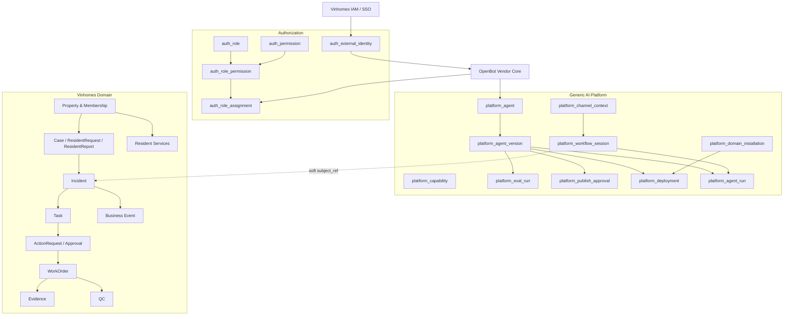
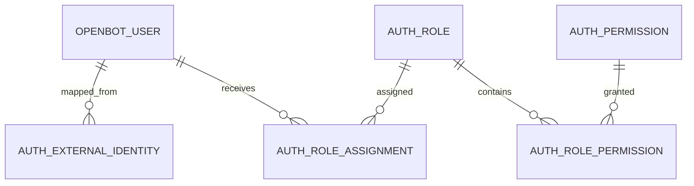
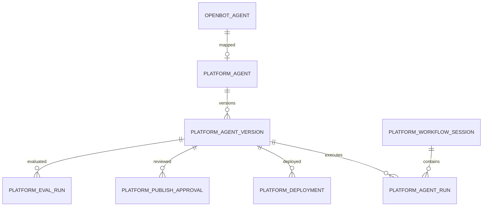
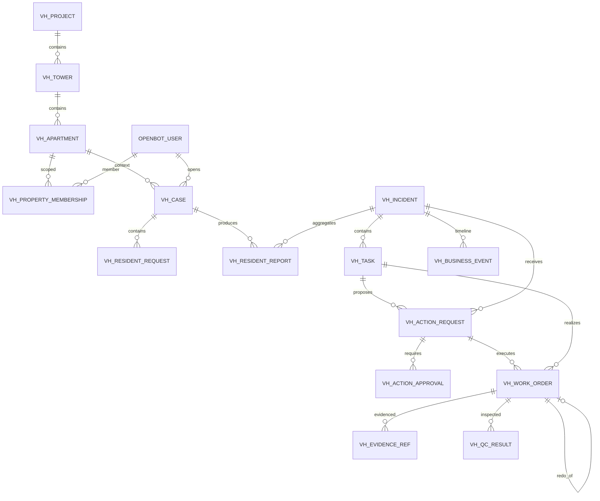
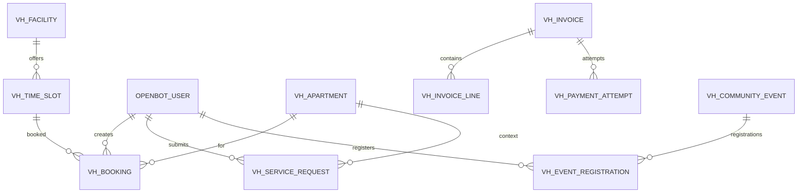
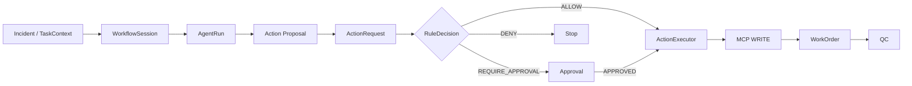

# AI Workforce Platform + Vinhomes
# Database & ERD Implementation Specification

**Version:** v1.0  
**Scope:** P0/Pilot implementation baseline  
**Purpose:** Thiết kế database và ERD đủ đầy để FE/BE/AI Runtime triển khai, nhưng vẫn tránh over-engineering.

---

## 1. Nguyên tắc kiến trúc dữ liệu

Hệ thống được chia thành 4 vùng dữ liệu:

```text
PostgreSQL
├── public / OpenBot vendor core
│   ├── users / accounts / sessions
│   ├── agents / agent_profiles / preferences
│   ├── channels / memberships
│   ├── credentials
│   ├── plugins / MCP grants / skills / components
│   └── vendor audit / documents...
│
├── auth
│   ├── external_identity
│   ├── role
│   ├── permission
│   ├── role_permission
│   └── role_assignment
│
├── platform
│   ├── agent
│   ├── agent_version
│   ├── capability
│   ├── eval_run
│   ├── publish_approval
│   ├── deployment
│   ├── workflow_session
│   ├── agent_run
│   ├── channel_context
│   └── domain_installation
│
└── vh
    ├── property & membership
    ├── intake & incident
    ├── action / approval / work order / QC
    └── resident-service modules
```

Ngoài PostgreSQL:

```text
Qdrant
└── semantic vectors / approved memory vectors

Object Storage
└── images / evidence / documents / attachments
```

### Quy tắc cốt lõi

1. PostgreSQL là **source of truth**.
2. Qdrant **không lưu business state**.
3. OpenBot là vendor/product foundation; schema dự án được mở rộng bằng module riêng.
4. Vinhomes tables không hard-FK sang Agent Runtime.
5. Agent chỉ tạo proposal; Vinhomes quyết định và thực thi side effect.
6. Production login đến từ **Vinhomes IAM/SSO**.
7. `Incident` là **Ticket canonical**.
8. `vh_task` là business task; runtime dùng session/run metadata, không dùng cùng một khái niệm Task.

---

# 2. ERD tổng thể



---

# 3. Authentication & RBAC

## 3.1 ERD



## 3.2 `auth_external_identity`

**Chức năng:** Map identity từ Vinhomes IAM/SSO về local OpenBot user.

**Fields chính**
- `id`
- `local_user_id`
- `provider`
- `issuer`
- `external_subject`
- `tenant_id`
- `status`
- `last_login_at`

**Constraint:** unique `(issuer, external_subject)`.

---

## 3.3 `auth_role`

**Chức năng:** Danh mục role dùng chung.

Ví dụ:

```text
VH_RESIDENT
VH_BQL_MANAGER
VH_BQL_OPERATOR
VH_TECHNICIAN
VH_CLEANING_STAFF
VH_SECURITY_STAFF
VH_FINANCE_STAFF

AGENT_BUILDER
AGENT_MANAGER
AGENT_PUBLISHER
EVALUATION_REVIEWER
SECURITY_REVIEWER
PLATFORM_ADMIN
```

**Fields**
- `id`
- `tenant_id nullable`
- `domain_namespace`
- `code`
- `name`
- `role_type`
- `status`

---

## 3.4 `auth_permission`

**Chức năng:** Primitive authorization thật sự.

Ví dụ:

```text
vh.incident.read
vh.incident.assign
vh.task.create
vh.approval.decide
vh.workorder.execute
vh.qc.review

platform.agent.create
platform.agent.evaluate
platform.agent.publish
platform.agent.deploy
platform.capability.manage
```

**Fields**
- `id`
- `domain_namespace`
- `code`
- `resource`
- `action`
- `risk_level`
- `description`

---

## 3.5 `auth_role_permission`

N:N Role ↔ Permission.

```text
role_id
permission_id
```

Composite unique `(role_id, permission_id)`.

---

## 3.6 `auth_role_assignment`

**Chức năng:** Gán role theo scope.

**Fields**
- `id`
- `user_id`
- `role_id`
- `tenant_id`
- `domain_namespace`
- `scope_type`
- `scope_ref`
- `valid_from`
- `valid_until`
- `status`

Ví dụ:

```text
User A
  role = VH_BQL_MANAGER
  scope_type = PROJECT
  scope_ref = OCEAN_PARK

User A
  role = AGENT_MANAGER
  scope_type = DOMAIN
  scope_ref = VINHOMES
```

---

# 4. Platform ERD P0



## 4.1 `platform_agent`

Canonical Agent identity.

**Fields**
- `id`
- `tenant_id`
- `slug`
- `name`
- `description`
- `owner_id`
- `domain_namespace nullable`
- `openbot_agent_id nullable`
- `status`
- timestamps

**Quan hệ:** `1:N platform_agent_version`.

---

## 4.2 `platform_agent_version`

Version immutable của Agent.

**Fields**
- `id`
- `agent_id`
- `version_no`
- `status`
- `spec_json`
- `spec_hash`
- `created_by`
- `created_at`
- `published_at`
- `suspended_at`
- `retired_at`

Unique `(agent_id, version_no)`.

`spec_json` chứa model, capabilities, knowledge, policies và runtime config.

Lifecycle:

```text
DRAFT
→ NEEDS_INPUT
→ READY_FOR_EVAL
→ EVALUATING
→ READY_FOR_REVIEW
→ READY_FOR_PUBLISH
→ PUBLISHED
→ SUSPENDED
→ RETIRED
```

---

## 4.3 `platform_capability`

Catalog hợp nhất P0.

**Type**
- `MODEL`
- `MCP_TOOL`
- `SKILL`
- `KNOWLEDGE`
- `POLICY`
- `CONNECTOR`

**Fields**
- `id`
- `tenant_id`
- `type`
- `code`
- `version`
- `name`
- `description`
- `source_type`
- `source_ref`
- `risk_level`
- `config_json`
- `status`

AgentVersion reference capability trong `spec_json`.

---

## 4.4 `platform_eval_run`

Một lần evaluation của AgentVersion.

**Fields**
- `id`
- `agent_version_id`
- `status`
- `result`
- `tests_json`
- `results_json`
- `evidence_json`
- `evaluated_by`
- `started_at`
- `completed_at`

Result:

```text
PASS
REVISE
BLOCK
INCONCLUSIVE
```

---

## 4.5 `platform_publish_approval`

**Fields**
- `id`
- `agent_version_id`
- `approval_type`
- `reviewer_id`
- `status`
- `reason`
- `created_at`
- `decided_at`

`approval_type`: DOMAIN / EVALUATION / SECURITY / PLATFORM.

---

## 4.6 `platform_deployment`

Version nào đang active tại đâu.

**Fields**
- `id`
- `agent_version_id`
- `environment`
- `domain_namespace`
- `scope_type`
- `scope_ref`
- `openbot_agent_id nullable`
- `status`
- `deployed_at`
- `retired_at`

---

## 4.7 `platform_workflow_session`

Một phiên runtime xử lý một business subject.

**Fields**
- `id`
- `tenant_id`
- `domain_namespace`
- `subject_type`
- `subject_ref`
- `subject_version`
- `status`
- `runtime_provider`
- `plan_json`
- `context_snapshot_json`
- `trace_id`
- `started_at`
- `completed_at`

Không FK trực tiếp sang `vh_incident`.

---

## 4.8 `platform_agent_run`

Một AgentVersion execution.

**Fields**
- `id`
- `workflow_session_id`
- `agent_id`
- `agent_version_id`
- `role`
- `status`
- `input_json`
- `output_json`
- `error_type`
- `error_json`
- `trace_id`
- `started_at`
- `completed_at`

---

## 4.9 `platform_channel_context`

Map OpenBot channel sang domain subject.

**Fields**
- `id`
- `channel_id`
- `domain_namespace`
- `subject_type`
- `subject_ref`
- `context_json`
- `created_at`

---

## 4.10 `platform_domain_installation`

Tenant đang bật domain nào.

**Fields**
- `id`
- `tenant_id`
- `domain_namespace`
- `domain_version`
- `config_json`
- `status`
- `installed_at`

---

# 5. Vinhomes Core ERD



---

# 6. Property & Account tables

## `vh_project`

Project/khu đô thị.

**Fields**
- `id`
- `tenant_id`
- `code`
- `name`
- `status`
- `metadata_json`

Quan hệ `1:N tower`, `1:N incidents/services`.

---

## `vh_tower`

- `id`
- `project_id`
- `code`
- `name`
- `status`
- `metadata_json`

---

## `vh_apartment`

- `id`
- `tower_id`
- `code`
- `floor`
- `status`
- `metadata_json`

---

## `vh_property_membership`

Quan hệ business user ↔ property.

- `id`
- `user_id`
- `project_id`
- `tower_id nullable`
- `apartment_id nullable`
- `membership_type`
- `valid_from`
- `valid_until`
- `status`

Khác `auth_role_assignment`: membership nói **quan hệ business**, role assignment nói **quyền hệ thống**.

---

## `vh_handover`

- `id`
- `apartment_id`
- `handover_date`
- `status`
- `document_refs_json`
- `accepted_by`
- `metadata_json`

---

## `vh_access_card`

- `id`
- `user_id`
- `apartment_id`
- `card_ref`
- `card_type`
- `status`
- `issued_at`
- `expires_at`
- `provider_ref nullable`

---

# 7. Intake & Incident

## `vh_case`

Hồ sơ intake.

- `id`
- `resident_user_id`
- `apartment_id nullable`
- `status`
- `summary`
- `intake_state_json`
- `version`
- `opened_at`
- `closed_at`
- timestamps

P0 lưu `IssueCandidate[]` trong `intake_state_json`.

---

## `vh_resident_request`

Một input/bổ sung.

- `id`
- `case_id`
- `channel`
- `request_type`
- `content`
- `attachment_refs_json`
- `idempotency_key`
- `created_at`

---

## `vh_resident_report`

Phản ánh chính thức.

- `id`
- `case_id`
- `incident_id nullable`
- `reporter_id`
- `apartment_id nullable`
- `category`
- `description`
- `evidence_refs_json`
- `created_at`

Nhiều report có thể cùng Incident.

---

## `vh_incident`

**Ticket canonical.**

- `id`
- `project_id`
- `tower_id nullable`
- `category`
- `title`
- `severity`
- `status`
- `stage`
- `owner_id`
- `sla_due_at`
- `version`
- timestamps

Status:

```text
NEW
OPEN
RESOLVED
CLOSED
```

Stage:

```text
INTAKE
TRIAGE
PLANNING
EXECUTION
QC
RESIDENT_CONFIRMATION
```

---

## `vh_task`

Business Task.

- `id`
- `incident_id`
- `title`
- `domain_type`
- `domain_data JSONB`
- `assignee_id`
- `status`
- `priority`
- `due_at`
- `depends_on_json`
- `version`
- timestamps

A5/Sanitation dùng `domain_data` để giữ CleaningPlan ở P0.

---

# 8. Action / Approval / WorkOrder / QC

## `vh_action_request`

Boundary duy nhất cho side effect.

- `id`
- `incident_id`
- `task_id`
- `source_type`
- `source_id`
- `source_version`
- `action_type`
- `target_json`
- `payload_json`
- `payload_hash`
- `rule_decision`
- `rule_reason_code`
- `rule_version`
- `rule_evaluated_at`
- `status`
- `version`
- `correlation_id`
- `created_at`

`source_type`:

```text
HUMAN
SYSTEM
AUTOMATION
AGENT
EXTERNAL_SERVICE
```

RuleDecision P0 nằm ngay trên ActionRequest:

```text
ALLOW
REQUIRE_APPROVAL
DENY
```

---

## `vh_action_approval`

- `id`
- `action_request_id`
- `action_payload_hash`
- `status`
- `requested_by`
- `reviewer_id`
- `expires_at`
- `decided_at`
- `reason`

Payload đổi → approval cũ không hợp lệ.

---

## `vh_work_order`

- `id`
- `incident_id`
- `task_id`
- `action_request_id`
- `executor_type`
- `executor_id`
- `status`
- `attempt_no`
- `redo_of_work_order_id nullable`
- `checklist_id`
- `checklist_version`
- `checklist_snapshot_json`
- `result_json`
- `version`
- execution timestamps

QC FAIL tạo WorkOrder attempt mới.

---

## `vh_evidence_ref`

- `id`
- `incident_id`
- `task_id nullable`
- `work_order_id nullable`
- `kind`
- `capture_phase`
- `file_ref`
- `metadata_json`
- `uploaded_by`
- `created_at`

Binary nằm Object Storage.

---

## `vh_qc_result`

Immutable.

- `id`
- `work_order_id`
- `outcome`
- `criteria_json`
- `failed_criteria_json`
- `redo_required`
- `evidence_refs_json`
- `note`
- `checked_by`
- `checked_at`

Outcome:

```text
PASS
FAIL
INCONCLUSIVE
```

---

## `vh_business_event`

Append-only timeline/audit.

- `id`
- `incident_id nullable`
- `subject_type`
- `subject_id`
- `event_type`
- `actor_type`
- `actor_id`
- `actor_version`
- `data_json`
- `correlation_id`
- `occurred_at`

---

# 9. Resident Services ERD



---

# 10. Resident Services tables

## Tiện ích & dịch vụ

### `vh_facility`
- `id`
- `project_id`
- `code`
- `name`
- `category`
- `booking_policy_json`
- `status`

### `vh_time_slot`
- `id`
- `facility_id`
- `start_at`
- `end_at`
- `capacity`
- `status`
- `metadata_json`

### `vh_booking`
- `id`
- `facility_id`
- `time_slot_id`
- `user_id`
- `apartment_id`
- `status`
- `participant_count`
- `note`
- timestamps

### `vh_service_request`
- `id`
- `user_id`
- `apartment_id`
- `service_type`
- `payload_json`
- `status`
- `provider_ref nullable`
- timestamps

### `vh_visitor_pass`
- `id`
- `user_id`
- `apartment_id`
- `visitor_json`
- `valid_from`
- `valid_until`
- `status`
- `provider_ref`

### `vh_charging_session`
- `id`
- `user_id`
- `vehicle_ref`
- `station_ref`
- `started_at`
- `ended_at`
- `energy_kwh`
- `amount`
- `status`
- `provider_ref`

### `vh_pet_profile`
- `id`
- `user_id`
- `apartment_id`
- `name`
- `species`
- `breed`
- `registration_ref`
- `status`
- `metadata_json`

---

## Tài chính

### `vh_fee_schedule`
- `id`
- `project_id`
- `fee_type`
- `effective_from`
- `effective_to`
- `config_json`
- `status`

### `vh_invoice`
- `id`
- `user_id`
- `apartment_id`
- `billing_period`
- `currency`
- `subtotal`
- `total_amount`
- `status`
- `due_at`
- `issued_at`

### `vh_invoice_line`
- `id`
- `invoice_id`
- `fee_type`
- `description`
- `quantity`
- `unit_price`
- `amount`
- `metadata_json`

### `vh_payment_attempt`
- `id`
- `invoice_id`
- `provider_ref`
- `amount`
- `status`
- `requested_at`
- `completed_at`
- `failure_code`

### `vh_loyalty_balance`
- `id`
- `user_id`
- `program`
- `balance`
- `tier`
- `updated_at`
- `provider_ref`

---

## Smart City

### `vh_face_enrollment`
- `id`
- `user_id`
- `apartment_id`
- `provider_ref`
- `status`
- `enrolled_at`
- `revoked_at`

Không lưu raw biometric template.

### `vh_intercom_event`
- `id`
- `apartment_id`
- `direction`
- `actor_ref`
- `occurred_at`
- `metadata_json`
- `provider_ref`

### `vh_parking_permit`
- `id`
- `user_id`
- `apartment_id`
- `vehicle_json`
- `valid_from`
- `valid_until`
- `status`
- `provider_ref`

### `vh_sensor_reading`
- `id`
- `project_id`
- `sensor_ref`
- `sensor_type`
- `value_json`
- `recorded_at`

### `vh_camera_request`
- `id`
- `user_id`
- `project_id`
- `purpose`
- `time_range_json`
- `status`
- `reviewer_id`
- `provider_ref`
- `created_at`

---

## Cộng đồng / Nội dung / Khám phá

### `vh_construction_permit`
- `id`
- `user_id`
- `apartment_id`
- `scope_json`
- `valid_from`
- `valid_until`
- `status`
- `reviewer_id`
- `document_refs_json`

### `vh_feedback`
- `id`
- `user_id`
- `subject_type`
- `subject_ref`
- `rating`
- `content`
- `status`
- `created_at`

### `vh_content_item`
- `id`
- `project_id`
- `content_type`
- `title`
- `body_ref`
- `publish_from`
- `publish_to`
- `status`
- `tags_json`

### `vh_community_event`
- `id`
- `project_id`
- `title`
- `description_ref`
- `start_at`
- `end_at`
- `capacity`
- `status`

### `vh_event_registration`
- `id`
- `event_id`
- `user_id`
- `status`
- `registered_at`
- `cancelled_at`

### `vh_offer`
- `id`
- `project_id`
- `title`
- `merchant_ref`
- `terms_ref`
- `valid_from`
- `valid_until`
- `status`

### `vh_transit_route`
- `id`
- `project_id`
- `code`
- `name`
- `stops_json`
- `schedule_json`
- `status`

### `vh_map_place`
- `id`
- `project_id`
- `category`
- `name`
- `geo_json`
- `metadata_json`
- `status`

### `vh_miniapp_catalog`
- `id`
- `code`
- `name`
- `route_url`
- `icon_ref`
- `visibility_json`
- `status`

---

# 11. Platform ↔ Vinhomes integration

Không tạo hard FK:

```text
vh_incident.agent_run_id
vh_task.agent_version_id
vh_work_order.workflow_session_id
```

Platform lưu soft reference:

```text
domain_namespace = VINHOMES
subject_type = INCIDENT
subject_ref = INC-001
```

Vinhomes lưu provenance:

```text
source_type = AGENT
source_id = <platform_agent_id>
source_version = <version_no>
correlation_id = ...
```

---

# 12. Runtime side-effect flow



---

# 13. State machine

## Case
```text
OPEN → CLARIFYING → READY → MATERIALIZED → CLOSED
or CANCELLED
```

## Incident
```text
NEW → OPEN → RESOLVED → CLOSED
```

## Task
```text
OPEN → ASSIGNED → IN_PROGRESS → DONE
BLOCKED / CANCELLED
```

## ActionRequest
```text
PROPOSED
├─ ALLOWED
├─ WAITING_APPROVAL
│  ├─ APPROVED
│  ├─ REJECTED
│  └─ EXPIRED
└─ DENIED

ALLOWED/APPROVED → CONSUMED
```

## WorkOrder
```text
OPEN → ASSIGNED → IN_PROGRESS → COMPLETED
FAILED / CANCELLED
```

## AgentVersion
```text
DRAFT
→ NEEDS_INPUT
→ READY_FOR_EVAL
→ EVALUATING
→ READY_FOR_REVIEW
→ READY_FOR_PUBLISH
→ PUBLISHED
→ SUSPENDED
→ RETIRED
```

---

# 14. Constraints & indexes

## Auth
```text
auth_external_identity(issuer, external_subject) UNIQUE
auth_role(domain_namespace, code) UNIQUE
auth_permission(domain_namespace, code) UNIQUE
```

## Platform
```text
platform_agent(tenant_id, slug) UNIQUE
platform_agent_version(agent_id, version_no) UNIQUE
platform_capability(tenant_id, type, code, version) UNIQUE
platform_workflow_session(domain_namespace, subject_type, subject_ref)
```

## Vinhomes
```text
vh_project(tenant_id, code) UNIQUE
vh_tower(project_id, code) UNIQUE
vh_apartment(tower_id, code) UNIQUE

vh_incident(project_id, status, severity)
vh_incident(tower_id, status)
vh_task(incident_id, status)

vh_action_approval(status, expires_at)
vh_work_order(task_id, attempt_no) UNIQUE

vh_business_event(incident_id, occurred_at DESC)

vh_booking(user_id, status, created_at)
vh_invoice(user_id, status, due_at)
```

---

# 15. Optimistic concurrency

Các aggregate mutable cần `version BIGINT`:

```text
vh_case
vh_incident
vh_task
vh_action_request
vh_work_order
platform_workflow_session
```

API dùng `expectedVersion`. Mismatch trả `409 CONFLICT`.

---

# 16. Idempotency

Bắt buộc cho:

- Create ResidentRequest
- ResidentReport
- Incident
- ActionRequest
- WorkOrder
- Payment intent
- MCP WRITE retry

Nếu OpenBot chưa có infrastructure phù hợp, thêm `infra_idempotency_record`.

---

# 17. Outbox

Business mutation + event publish nên dùng transaction/outbox.

Nếu chưa có generic outbox phù hợp, thêm:

```text
infra_outbox_event
```

---

# 18. Migration order

```text
M001 auth extension
M002 platform agent/version/capability
M003 platform eval/deployment/runtime
M004 Vinhomes property
M005 Vinhomes intake/incident/task
M006 action/approval/workorder/evidence/qc/event
M007 resident services
M008 indexes/constraints/backfill
M009+ provider-specific extensions
```

---

# 19. Không normalize quá sớm

| Concept | P0 |
|---|---|
| IssueCandidate | `vh_case.intake_state_json` |
| TaskDependency | `vh_task.depends_on_json` |
| RuleDecision | columns trên `vh_action_request` |
| ChecklistVersion | WorkOrder snapshot |
| AgentSpec | `platform_agent_version.spec_json` |
| Tool/Skill/Knowledge/Policy versions | `platform_capability` |
| EvalSuite/Case/Assertion | JSON trong EvalRun |
| Runtime RunStep | `workflow_session.plan_json` |
| Notification | OpenBot/event infrastructure |
| Chat/Message | OpenBot channels |

Tách table khi entity có lifecycle, permission, version/audit riêng hoặc JSON không còn đủ.

---

# 20. Database implementation checklist

- [ ] Chốt Vinhomes SSO claims.
- [ ] Tạo identity mapping.
- [ ] Seed roles/permissions.
- [ ] Implement `/me/context`.
- [ ] Enforce BE permission + scope.
- [ ] Tạo Platform Agent/Version/Capability.
- [ ] Tạo Vinhomes property schema.
- [ ] Tạo Case → Incident.
- [ ] Tạo ActionRequest → Approval → WorkOrder.
- [ ] Evidence/QC/redo.
- [ ] WorkflowSession/AgentRun soft refs.
- [ ] Idempotency.
- [ ] Outbox.
- [ ] Correlation/trace ID.
- [ ] Indexes + optimistic concurrency.
- [ ] Seed Resident Services.
