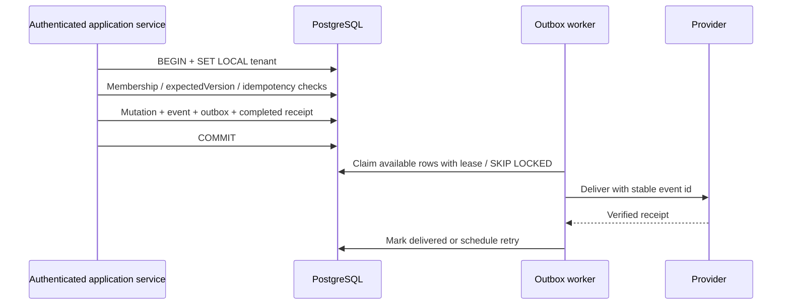

# Thiết kế database chi tiết

Trạng thái: schema/migration đã triển khai; API/UI tích hợp ở đợt sau. Nguồn là bốn
tài liệu trong `docx/`, bao gồm phần 19–24 bổ sung của Vinhomes.

## 1. Ranh giới và ánh xạ tên

| Khái niệm logic | Physical model | Quyết định |
|---|---|---|
| USER | `public.users` | Dùng ID text Better Auth/OpenBot; không có credential store mới. |
| TENANT | `platform_tenant` | UUID của đơn vị quản lý dữ liệu, khác người thuê căn hộ. |
| Membership/role | `platform_tenant_membership`, `platform_role`, `platform_membership_role` | Quyền tổ chức/scope; không thay `user_roles` của shell. |
| DOMAIN_PACKAGE | `platform_domain_package` | Unique namespace/package_version; tách package_version và optimistic version. |
| TENANT_DOMAIN / DOMAIN_INSTALLATION | `platform_domain_installation` | Hợp nhất hai thuật ngữ nguồn thành installation theo tenant/package/environment. |
| Agent shell | `agents`, `agent_profiles`, … | Giữ nguyên schema/lifecycle đang chạy. |
| Agent quản trị | `platform_agent`, `platform_agent_version`, … | Registry/version/governance riêng; nối shell qua adapter ở đợt API. |
| Ticket | `vh_incident` | Không tạo bảng ticket song song. |
| Runtime task | `platform_run_step` | `vh_task` chỉ dành cho nghiệp vụ. |
| Approval | `vh_action_approval` / `platform_publish_approval` | Phê duyệt thao tác nghiệp vụ khác phê duyệt publish agent. |
| Execution grant | `vh_execution_grant` / `platform_execution_grant_ref` | Domain giữ token hash; platform giữ soft reference. |

Các bảng mới đặt trong `public` với prefix `platform_` / `vh_`, ownership chia theo
module TypeScript. Cách tổ chức một database này được nguồn 03 cho phép và tương thích
runner/snapshot hiện có. Không di chuyển bảng shell.

Catalog capability/model/tool/skill/policy có **tenant_id bắt buộc**. Mẫu dùng chung
được provision thành resource riêng từng tenant; không có tenant NULL ngầm mở quyền.
Đây là lựa chọn thu hẹp so với catalog toàn cục tùy chọn trong nguồn. Domain package
là catalog toàn cục; runtime chỉ đọc, quản trị mới có quyền ghi.

Bổ sung coordination/field và nguồn tiến độ cư dân: [SYSTEM_FLOW](SYSTEM_FLOW.md),
[review](COMPLETENESS_REVIEW.md). Hiện có 190 bảng: [nhiệm vụ từng bảng](physical/TABLE_CATALOG.md).

## 2. Module và ERD

| Nhóm | Nội dung | Physical ERD |
|---|---|---|
| Shared Kernel | Tenant, identity bridge, memberships, roles, packages/installations | [identity](physical/platform-identity.md), [domains](physical/platform-domains.md) |
| Property | Project/tower/apartment, membership có hiệu lực, hồ sơ xin quyền | [property](physical/vinhomes-property.md) |
| Intake | Case/request/candidate/report, confirmation, feedback | [intake](physical/vinhomes-intake.md) |
| Operations | Incident/task/action/rule/approval/grant/work order/checklist | [operations](physical/vinhomes-operations.md) |
| Evidence | Files, attachments, evidence, QC, root cause | [files](physical/vinhomes-files.md), [attachments](physical/vinhomes-attachments.md), [evidence](physical/vinhomes-evidence.md) |
| Communication | Messages/events/notifications | [communication](physical/vinhomes-communication.md) |
| Resident services | Handover/cards/visitors/permits/pets/face/intercom/charging/camera | [services](physical/vinhomes-services.md) |
| Booking | Facility/slot/reservation | [booking](physical/vinhomes-booking.md) |
| Billing | Fee revisions/invoices/payment attempts/allocations/loyalty | [billing](physical/vinhomes-billing.md) |
| Content/discovery | News/community/offers/sensors/maps/transit/miniapps | [content](physical/vinhomes-content.md) |
| Delivery | Command receipts/outbox | [delivery](physical/vinhomes-delivery.md) |
| Agent definition | Agent/version/spec/change request/bindings | [agents](physical/platform-agents.md), [bindings](physical/platform-bindings.md) |
| Catalog | Capability/model/MCP/tool/skill/knowledge/policy | [capabilities](physical/platform-capabilities.md), [knowledge](physical/platform-knowledge.md), [policies](physical/platform-policies.md) |
| Governance | Evaluation/baselines/publish gates/approvals | [evaluation](physical/platform-evaluation.md) |
| Execution | Deployments/session/step/run/tool/artifact/decision/proposal | [deployments](physical/platform-deployments.md), [runtime](physical/platform-runtime.md) |
| Memory/operations | Revision/review/vector metadata/audit/idempotency/outbox | [memory](physical/platform-memory.md), [audit](physical/platform-audit.md) |

## 3. Khóa, scope và authorization

Entity có UUID PK và `UNIQUE(tenant_id,id)`; link table có composite PK. Tất cả bảng
theo tenant có `tenant_id NOT NULL`. FK trong domain mang tenant; bảng theo project
kiểm tra project; apartment/tower, task/incident, work order/task/action và run/session/
version có composite FK tương ứng. Reference tồn tại nhưng sai aggregate vẫn bị từ chối.

Membership cư dân gắn đúng user và apartment; user phải có tenant membership trước khi
được cấp property membership. User FK dùng text; actor đa hình dùng type + ID/version
snapshot. Không ép agent thành tài khoản người dùng. Runtime subject/provenance/grant
là stable references, không có FK từ Vinhomes tới AgentVersion/AgentRun/WorkflowSession.

RLS dùng USING + WITH CHECK và FORCE RLS. Thiếu tenant context thì không thấy hàng;
ghi tenant khác bị chặn. Đây là bảo vệ **tenant**, chưa phải authorization cư dân.
Backend phải xác thực user, membership ACTIVE/in-date, người sở hữu report/notification,
visibility của file/message ở mỗi request. Context lấy từ server sau kiểm chứng scope,
không lấy tenant từ form làm bằng chứng. API không dùng superuser/BYPASSRLS.

Đăng nhập trước khi chọn tenant cần identity resolver với quyền đọc tối thiểu membership
theo authenticated user. Không mở RLS toàn domain chỉ để làm apartment selector.
Resolver và authorization service là phần tích hợp API tiếp theo.

## 4. Kiểu dữ liệu và concurrency

- `timestamptz` lưu thời điểm tuyệt đối; UI hiển thị Asia/Ho_Chi_Minh. Khoảng hiệu lực
  `[from,until)`; until NULL là không có ngày kết thúc. Kỳ hóa đơn/ngày thi công dùng date.
- Mutable aggregate có `version bigint DEFAULT 1`, created_at/updated_at. Trigger tăng
  version mỗi UPDATE và cấm đổi ID/tenant/project/created_at. Service phải dùng
  `WHERE tenant_id=… AND id=… AND version=expectedVersion`; 0 hàng là conflict.
- Bigint giữ kiểu bigint trong TS; DTO cần serialize thành chuỗi khi chuyển JSON.
- JSON dành cho payload/config/criteria/snapshot và CleaningPlan có schema version.
  Ownership/status/money/FK là cột rõ ràng. Dùng custom JSONB sẵn có, tránh serialize hai lần.
- Tiền dùng bigint minor unit + currency uppercase ba ký tự. VND exponent 0. Dòng hóa
  đơn tính `round(quantity * unit_price_minor)` bằng numeric; làm tròn từng dòng rồi cộng.
  Không dùng float; invoice total phải bằng tổng dòng khi issue.

## 5. Transaction và workflow

**Intake:** Case/ResidentRequest/attachments tồn tại trước Incident. Candidate materialize
tối đa một report. Report incident NULL đến triage; gắn incident và chuyển LINKED atomic.
Nhiều report có thể cùng incident nhưng quyền riêng tư vẫn theo reporter.

**Action:** immutable payload/hash + policy version, RuleEvaluation append-only, approval/
grant trỏ đúng hash/policy. Service kiểm tra actor/scope/state/expiry/rule hiện hành khi
tạo và tiêu thụ grant. Chỉ lưu token hash. Không gọi MCP WRITE khi giữ transaction lâu;
outbox + provider idempotency xử lý external I/O.

**Work/QC:** pin task/action/checklist revision. QC append-only. Redo là attempt mới,
cùng task, predecessor có attempt thấp hơn và QC FAIL mới nhất; một successor trực tiếp.
Work order COMPLETED/FAILED/CANCELLED không reset lại.

**Resolve/close:** service khóa incident, kiểm tra required tasks/work orders, approvals,
evidence theo checklist và QC mới nhất. Resolve ghi resolution_version. Confirmation
phải thuộc reporter/report và đúng resolution round hiện tại. Không tự timeout-close;
close cần actor/lý do. Chính sách all-reporters/manual/timeout phải chốt ở bước API.

**Booking:** khóa slot rồi tính CONFIRMED + HELD chưa hết hạn theo party_size. Hủy là
đổi status; không tăng counter dễ bị retry hai lần. Các slot cùng facility không chồng
thời gian; tài nguyên chia sẻ dùng capacity N. Job cần chuyển hold hết hạn sang EXPIRED
trước khi cùng membership đặt lại slot; partial unique không phụ thuộc `now()`.

**Payment:** adapter xác minh chữ ký callback và dedupe provider event. Chỉ adapter tin
cậy ghi SUCCEEDED; redirect/SIMULATED không tạo allocation. Khóa invoice rồi payment,
giới hạn allocation theo payment/dư nợ/currency; invoice status cập nhật cùng transaction.
Refund/credit note chưa được nguồn chốt; không dùng payment âm để giả lập refund.

**Community:** khóa event, kiểm tra PUBLISHED/hạn đăng ký, tính cả người đăng ký + khách.
Hủy/đăng ký lại dùng row duy nhất event/member và kiểm tra lại capacity. Attendance phải
từ registration đã có; không dùng ATTENDED để vượt capacity.

**Agent:** DRAFT/NEEDS_INPUT được sửa spec/binding; READY_FOR_EVAL đóng băng. Publish cần
PASSED eval, gate PASSED có CONTRACT/QUALITY/SAFETY/REGRESSION PASS, bốn approval DOMAIN/
EVALUATION/SECURITY/PLATFORM từ người khác tác giả. Service kiểm tra role reviewer và
quyền chuyển bước. Production run cần PUBLISHED version + ACTIVE deployment cùng tenant/
environment. Runtime vẫn kiểm tra suspension/revocation trước mỗi external side effect.

**Memory:** content revision không sửa; review append-only với reviewed_at tăng dần.
Vector chỉ sync revision CLEAN có review APPROVED mới nhất. Revoke/redact đưa vector
sang DELETE_PENDING; worker xóa Qdrant rồi DELETED. Retrieval luôn re-check PostgreSQL,
kể cả khi Qdrant chưa xóa xong; memory không thay state nghiệp vụ.

## Integrity matrix

| Invariant | Database thực thi | Service/provider phải thực thi |
|---|---|---|
| Tenant/project/parent consistency | Composite FK + RLS + FORCE RLS | Authenticated scope, runtime role không bypass |
| Membership overlap | GiST exclusion user/scope/type/range | Grant/revoke permission, hiệu lực mỗi request |
| Status/money/ranges | CHECK + numeric/bigint | Các business transitions không liệt kê bên dưới |
| Optimistic concurrency | Positive version + auto increment, immutable ownership | expectedVersion predicate + conflict response |
| Approval payload/policy | Composite FK, pinned ActionRequest | Canonical hash, actor policy, expiry, grant consumption |
| Dependency cycles | Recursive trigger, khóa incident/session | Readiness và dependency semantics |
| QC/event/audit/history | Cấm UPDATE/DELETE/TRUNCATE với append-only records | Retention/export/anonymization |
| Work order redo | Same task/earlier attempt/QC FAIL/unique successor | Re-authorize redo, event/outbox |
| File attachments | AVAILABLE; membership proof PRIVATE | Scanning, download ACL, cleanup object storage |
| Confirmation | Reporter/report/incident FK, current round, unique response | Reopen/closure policy |
| Booking | Locked live-capacity count, price/scope pinned | Eligibility, fees, cancellation policy, expire hold job |
| Event registration | Locked participant count + capacity floor | Eligibility, attendance permission |
| Invoice/payment | Rounded line sum, issued lines pinned, allocation bounds, atomic settlement | Billing policy, signature verification, webhook dedupe/refunds |
| Agent revision/publish | Frozen spec/bindings, lifecycle, gate/eval/independent approvals | Reviewer roles, gate validity, actor permissions |
| Deployment/runtime | Eligible version/installation/production deployment | Deployment scope and ongoing revocation checks |
| Evaluation | Immutable assertions/evidence/results, suite cases frozen after first run, terminal run pinned | Execute evaluation and compute result correctly |
| Catalog revision | MCP fingerprint pinned; published tool/policy/checklist/fee frozen | Endpoint credentials, permissions |
| Memory | Approval/content/review constraints, deletion tombstone | Qdrant sync, namespace/item access and retention |
| Receipt/outbox | Scoped unique keys, completed receipt pinned, lease/retry metadata | Atomic mutation/event/outbox/receipt; worker delivery |

## 6. Index, retention và vận hành

Catalog liệt kê mọi index: incident/project/status/severity, task/incident/status,
approval/expires_at, membership/user/validity, reports/reporter, booking/slot/status,
invoice/apartment/status/due_at, notification/recipient/read_at và FK parents.
Outbox có partial index `available_at WHERE delivered_at IS NULL`; worker xử lý dưới
tenant context riêng. Unique keys tenant-scoped; provider resource key được giữ global
khi nhà cung cấp bảo đảm uniqueness.

Không cascade từ user/apartment xuống financial/evidence/history. Retire master data
bằng status; policy retention/PII có workflow quản trị riêng, không xóa tùy tiện audit.
Chưa partition audit/events/sensors khi chưa có workload đo được. Không lưu binary file
hoặc vector embedding trong PostgreSQL; chỉ metadata và external reference.

Outbox là at-least-once; consumer dedupe event ID, worker có lease/retry/backoff/error code.
BusinessEvent immutable, delivery bookkeeping nằm riêng. Receipt không thay state store.

## 7. Giới hạn triển khai

Chưa có endpoint mới, production resident login, scheduler/outbox worker, Qdrant worker,
payment webhook verifier hoặc device integration. UI hiện vẫn là preview. Các trách
nhiệm service trong ma trận là hợp đồng cho bước tiếp theo, không được xem là đã chạy
chỉ vì database có bảng.
