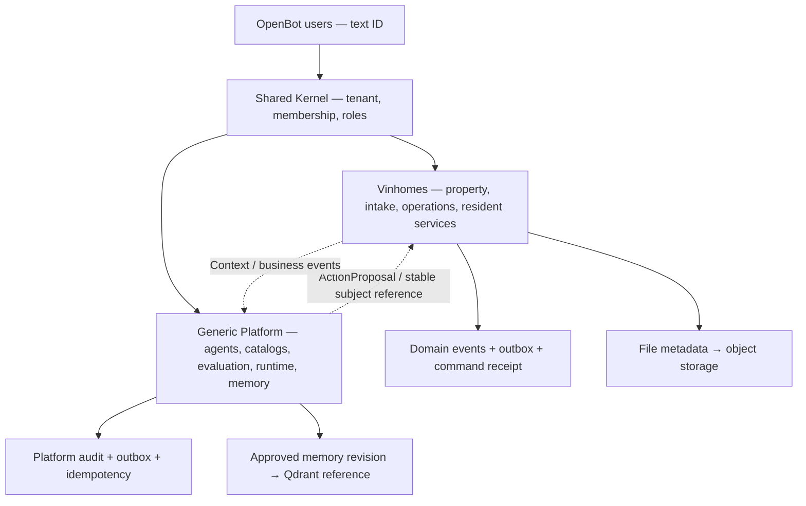

# Database ERD — Shared Kernel, Vinhomes, AI Platform

Bộ database đã triển khai **152 bảng workforce**, bên cạnh 38 bảng OpenBot hiện có.
Identity dùng lại `public.users`; tổng schema là **190 bảng, 2.078 cột, 558 FK**.
Migration `0046`–`0050` nằm trong ledger Drizzle hiện có; 25 bảng coordination/field mới ở `0048`.
Đợt này hoàn thiện persistence; API nghiệp vụ và nối UI nằm ở bước tiếp theo.

| Cần đọc | Tài liệu |
|---|---|
| Điểm bắt đầu cho thành viên review và phân công trách nhiệm | [REVIEW_GUIDE.md](REVIEW_GUIDE.md) |
| Journal/snapshot trong Drizzle meta dùng để làm gì | [meta/README.md](../../server/drizzle/meta/README.md) |
| Luồng lễ tân → điều phối → group chat → kỹ thuật → cư dân | [SYSTEM_FLOW.md](SYSTEM_FLOW.md) |
| Nhiệm vụ từng bảng trong toàn bộ 190 bảng | [TABLE_CATALOG.md](physical/TABLE_CATALOG.md) |
| ERD quan hệ mọi bảng của dự án | [PROJECT_RELATIONSHIPS.md](physical/PROJECT_RELATIONSHIPS.md) |
| Đã đầy đủ phần nào, giới hạn và trách nhiệm service | [COMPLETENESS_REVIEW.md](COMPLETENESS_REVIEW.md) |
| Thiết kế tổng thể, quyết định, transaction, trách nhiệm DB/API | [DATABASE_DESIGN.md](DATABASE_DESIGN.md) |
| ERD vật lý, mọi cột, FK, unique, index, CHECK | [Physical catalog — 40 module](physical/README.md) |
| Cài đặt, nâng cấp, RLS và kiểm thử | [MIGRATION_RUNBOOK.md](MIGRATION_RUNBOOK.md) |
| Phạm vi nguồn → schema → kiểm chứng | [COVERAGE.md](COVERAGE.md) |



Thiết kế logic gốc: [System](../../docx/01_SYSTEM_ERD_COMPLETE.md),
[Vinhomes](../../docx/02_VINHOMES_DOMAIN_ERD.md),
[Platform](../../docx/03_PLATFORM_ERD.md),
[Architecture](../../docx/04_SYSTEM_DESIGN_STRUCTURE_ARCHITECTURE.md).
Ghi chú preview/proposed trong nguồn phản ánh giai đoạn trước; coverage ở đây xác định
chính xác phần database đã triển khai. Không sửa nội dung frontend preview trong nguồn.

ERD vật lý sinh từ schema thực thi, có thể xem bằng Markdown hỗ trợ Mermaid:

```sh
bun run --filter server db:erd
bun run --filter server db:erd:check
```

Các cạnh nhiều cột là FK ghép để giữ đúng tenant/phạm vi. Trigger và exclusion
constraint được mô tả trong integrity matrix vì Drizzle không snapshot chúng.
