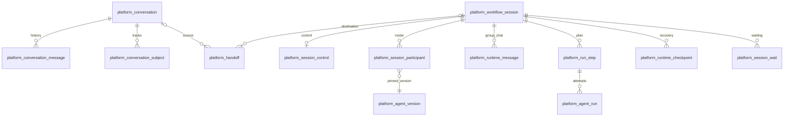
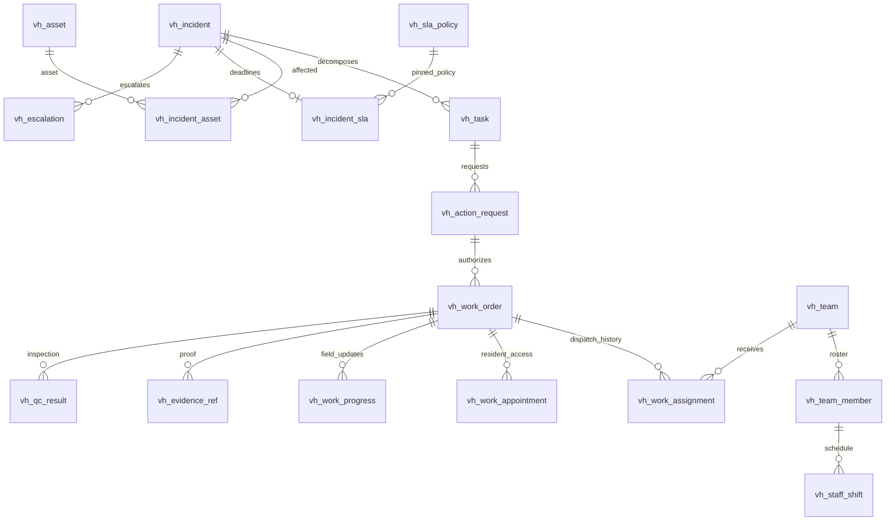
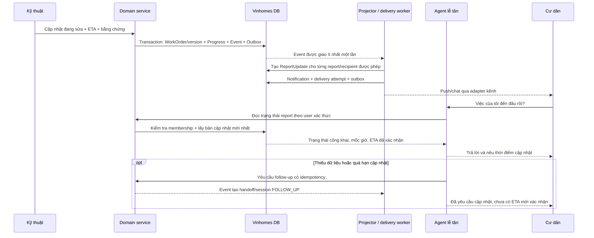

# Luồng dữ liệu và ERD toàn hệ thống

Tài liệu này mô tả **hợp đồng lưu trữ để triển khai luồng**, không khẳng định các worker/API bên dưới đã chạy. Schema gồm 190 bảng; [danh mục từng bảng](physical/TABLE_CATALOG.md) có nhiệm vụ và liên kết tới toàn bộ trường, khóa, index, CHECK. [ERD mọi FK](physical/PROJECT_RELATIONSHIPS.md) phục vụ tra cứu; các sơ đồ nhỏ bên dưới phục vụ đọc nghiệp vụ.

## 1. Ba loại dữ liệu cần phân biệt

| Loại | Chủ sở hữu | Nơi lưu | Ý nghĩa |
|---|---|---|---|
| Hội thoại cư dân | Platform conversation | `platform_conversation`, `platform_conversation_message` | Cư dân nói gì và lễ tân đã trả lời gì; một cuộc hội thoại có thể liên quan nhiều yêu cầu |
| Hồ sơ công việc | Vinhomes | `vh_case`, `vh_resident_report`, `vh_incident`, `vh_task`, `vh_work_order` | Nguồn trạng thái nghiệp vụ; tồn tại kể cả khi agent dừng hoặc thay runtime |
| Hội thoại và thực thi nội bộ | Platform runtime | `platform_workflow_session`, `platform_session_participant`, `platform_runtime_message`, `platform_agent_run` | Agent nào được gọi, phiên bản nào, đã đề xuất gì và chạy tới đâu |

“Ticket” trên UI tương ứng hồ sơ/Incident, **không phải WorkflowSession**. Nhiều cư dân có thể báo cùng một Incident nhưng mỗi người có `vh_resident_report` riêng. Một Incident có nhiều session: phân loại, lập kế hoạch, tái lập kế hoạch, QC. Một session có nhiều participant, step và run.

`agents/channels/channel_agents` là dữ liệu shell OpenBot cũ; `platform_agent/platform_agent_version` là registry có quản trị phiên bản. Không coi hai bộ là cùng một danh tính. Adapter shell gắn `external_provider/external_thread_ref` với conversation; không tạo FK từ hồ sơ Vinhomes sang channel của shell.

## 2. Sơ đồ trách nhiệm

```mermaid
flowchart LR
  R[Cư dân] --> UI[App / kênh tiếp nhận]
  UI --> C[Conversation + tin nhắn cư dân]
  C --> L[Agent lễ tân]
  L --> D[DomainAdapter: xác thực và ghi hồ sơ]
  D --> I[Case / Report / Incident]
  I --> E[Business event + domain outbox]
  E --> H[Handoff bền vững tới điều phối]
  H --> S[WorkflowSession + roster]
  S --> G[Group chat: điều phối và chuyên gia]
  G --> A[ActionProposal]
  A --> V[Domain: policy / approval / execution grant]
  V --> W[WorkOrder + assignment + appointment]
  W --> T[Kỹ thuật thực địa]
  T --> P[Progress + evidence + business event]
  P --> Q[QC / redo / xác nhận cư dân]
  P --> U[ReportUpdate riêng cho từng cư dân]
  Q --> U
  U --> N[Notification + delivery attempts]
  U --> L
  N --> R
  L --> C
```

Mũi tên là luồng xử lý cần được application service/worker thực hiện. SQL không tự gọi agent, gửi SMS hay chạy LLM.

## 3. Từ tiếp nhận đến session điều phối

1. API lấy `user_id`, tenant và membership từ phiên xác thực. `vh_property_membership` xác định cư dân được thao tác căn hộ/dự án nào; lựa chọn căn hộ trên UI không cấp quyền.
2. Lưu conversation và message với `sequence_no`, `idempotency_key`. `platform_conversation_subject` nối mềm conversation với `(domain_namespace, subject_type, subject_ref)` của Case/Incident. Bảng này cho phép một hội thoại theo dõi nhiều việc.
3. Lễ tân gọi domain để tạo `vh_resident_request` → `vh_case` → `vh_issue_candidate` → `vh_resident_report`. Domain quyết định tạo Incident mới hay ghép vào Incident hiện có. File chưa đủ thông tin nghiệp vụ nằm trong metadata/attachment tương ứng, không ép tạo Incident trước.
4. Domain ghi trạng thái + `vh_business_event` + `vh_outbox_event` trong **cùng transaction**. Event ra ngoài domain dùng envelope đã lọc dữ liệu, có ID, subject/version và correlation ID.
5. Consumer nhận event qua `platform_event_receipt` để chống xử lý trùng; tạo `platform_handoff` trạng thái `OFFERED`. Lưu context snapshot, request hash, agent version đích, hạn nhận, số lần thử, thời điểm thử lại. “Ping” là một công việc có lưu DB và retry, không chỉ một lời nhắn trong RAM.
6. Worker tạo `platform_workflow_session`, `platform_session_control`, participant roster rồi xác nhận handoff `ACCEPTED` với `target_workflow_session_id` trong một transaction platform. `initiation_key` ngăn mở lại cùng session khi nhận trùng; idempotency key phải do service tính ổn định từ event/consumer/mục đích.
7. `subject_ref` ở platform là **tham chiếu mềm**, không có FK sang Vinhomes. DomainAdapter chịu trách nhiệm xác minh subject tồn tại và người gọi có quyền. Không bao transaction DB xuyên hai domain owner; dùng outbox/inbox.

## 4. Trong group chat

| Bảng | Trách nhiệm trong một lần xử lý |
|---|---|
| `platform_session_participant` | Chốt agent version và vai trò `COORDINATOR/SPECIALIST/REVIEWER`; một coordinator đang hoạt động hoặc được mời mỗi session |
| `platform_session_control` | Mục đích session, parent session, chống mở trùng, lease, fencing token, heartbeat, deadline và giới hạn lượt/tool call |
| `platform_runtime_message` | Lời yêu cầu, phát hiện, đề xuất, quyết định; sender/recipient phải cùng session; thứ tự tăng và lịch sử bất biến |
| `platform_run_step`, `platform_run_step_dependency` | Các bước và quan hệ trước/sau; DB chặn vòng phụ thuộc |
| `platform_agent_run`, `platform_tool_invocation` | Các lần gọi agent/tool, input/output snapshot, trạng thái và lỗi |
| `platform_runtime_artifact`, `platform_runtime_decision` | Kết quả và quyết định có thể truy vết; không thay trạng thái Incident |
| `platform_runtime_checkpoint` | Con trỏ message đã xử lý, phiên bản runtime/state, hash và storage ref; kiểm tra lease/token còn hiệu lực trước khi lưu |
| `platform_session_wait` | Chờ agent, người duyệt, domain event hoặc timer; có wait key, deadline và event thỏa mãn |

Worker giữ lease bằng compare-and-set, tăng fencing token khi tiếp quản; checkpoint với token cũ bị từ chối. Service phải kiểm tra lease/token trước **mọi tác vụ có side effect** và dùng command idempotency khi retry. Checkpoint không tự cung cấp exactly-once cho tool ngoài hệ thống. Không ghi chain-of-thought riêng của model vào group chat; lưu yêu cầu, kết luận, bằng chứng và quyết định phục vụ vận hành.

Agent sản xuất phải có version `PUBLISHED` và deployment `ACTIVE`. Agent đề xuất hành động; domain mới kiểm tra version, quyền, quy tắc, phê duyệt và execution grant trước khi tạo/thực thi WorkOrder.

## 5. Điều phối kỹ thuật và QC

- `vh_team/member/skill/shift` mô tả tổ đội, nhân sự hợp lệ, kỹ năng/chứng nhận và ca làm. Không sử dụng agent AI như một người thợ. Một nhân sự không có hai ca trùng nhau trong cùng tenant, kể cả ở hai đội khác nhau.
- `vh_work_assignment` lưu từng lần giao/nhận/từ chối/thu hồi. Chỉ một assignment `OFFERED/ACCEPTED` mỗi WorkOrder; chuyển đội kết thúc bản ghi cũ rồi tạo bản ghi mới. Skill matching và kiểm tra giờ làm tại thời điểm phân công thuộc dispatcher service.
- `vh_work_appointment` lưu lịch hẹn vào căn hộ. Hẹn trùng trên cùng WorkOrder bị chặn; đổi lịch hủy lần trước và tạo lần mới. Không nhầm lịch hẹn với ca làm.
- `vh_work_progress` lưu sự kiện thực địa: đã nhận, đang tới, có mặt, chẩn đoán, chờ vật tư/quyền vào, sửa, chờ QC, hoàn thành. Có actor thật, note, thời gian, event, ETA và người xác nhận ETA. Trạng thái này không tự đồng nghĩa Incident đã đóng.
- `vh_asset/incident_asset` định danh tài sản ảnh hưởng và vị trí; đây là danh mục tài sản vận hành, chưa phải hệ thống kho phụ tùng/mua sắm/khấu hao.
- `vh_evidence_ref`, checklist và `vh_qc_result` lưu bằng chứng/kiểm định. QC fail dẫn đến WorkOrder attempt mới có `redo_of_work_order_id`; không sửa kết quả QC cũ. QC pass → Incident `RESOLVED` theo state machine → xác nhận cư dân theo resolution version → `CLOSED`.
- `vh_incident_sla` chốt policy và deadline tại lúc áp dụng; `vh_escalation` lưu việc vượt hạn hoặc cần can thiệp. Migration hiện hỗ trợ SLA theo **phút liên tục (`ELAPSED`)**, chưa hỗ trợ lịch ngày nghỉ/giờ hành chính. Worker cần đánh thức/escalate đúng hạn.

## 6. Lễ tân lấy tiến độ từ đâu?

**Nguồn chuẩn là Vinhomes, đọc qua DomainAdapter/API được phân quyền. Không cần hỏi lại điều phối cho mỗi lần cư dân hỏi.**

`vh_report_update` là bản tiến độ **an toàn cho từng cư dân**: FK gắn đúng report/incident/reporter, có `sequence_no`, `incident_version`, source event/time, public summary/status. ETA phải khớp field progress được tham chiếu; không có xác nhận thì để trống. DB chặn bản cập nhật quay về version/thời điểm cũ; worker nhận event sai thứ tự phải bỏ qua, không phát lại trạng thái lùi.

`vh_notification` là thông báo logic. `vh_notification_delivery` là từng lần gửi theo kênh, provider message ID, lỗi và lịch retry. Delivered không đồng nghĩa cư dân đã đọc hoặc đồng ý nghiệm thu. Notification cũ `delivery_status` là trạng thái tổng hợp do service đồng bộ; nguồn chi tiết từng lần gửi nằm trong bảng delivery.

`platform_conversation_message` lưu câu trả lời đã gửi; `source_event_ref/source_subject_version` cho phép audit nguồn. Không dùng lịch sử chat làm trạng thái công việc. Quyền xem nội dung/evidence và việc che thông tin nội bộ do projection service chịu trách nhiệm; RLS tenant chưa đủ để phân quyền cư dân trong cùng tenant.

## 7. Các luồng khác trong cùng dự án

| Luồng | Dữ liệu chính | Điểm kết nối |
|---|---|---|
| Tài khoản và phân quyền | users/auth shell, tenant/membership/role, property membership/application | Xác thực chung; scope tenant/project kiểm tra mỗi request |
| Khách, chuyển nhà, thi công, thẻ xe/thẻ cư dân, thú nuôi, camera, face, bàn giao | `vh_service_request` và các bảng chi tiết của [services](physical/vinhomes-services.md) | Duyệt yêu cầu, lịch sử trạng thái, xác minh provider |
| Tiện ích và đặt chỗ | [booking](physical/vinhomes-booking.md) | Slot/capacity, reservation và snapshot giá |
| Phí và thanh toán | [billing](physical/vinhomes-billing.md) | Khoản thu → payment → allocation; webhook cần xác minh và chống trùng |
| Tin tức, sự kiện, khảo sát, ưu đãi | [content](physical/vinhomes-content.md) | Phân phối theo audience, đăng ký/điểm danh/phản hồi có lineage |
| Agent lifecycle | agents/spec/bindings, catalogs, eval/gates/approval/deployment | Chỉ version đạt kiểm định/duyệt mới triển khai sản xuất |
| Tri thức và memory | knowledge/source, memory item/revision/review/vector index | PostgreSQL giữ metadata/quyền/duyệt; object/vector store giữ payload/chỉ mục |
| Audit và tích hợp | domain business events, platform audit, outbox, command receipt, event receipt, provider event | At-least-once + idempotency; không giả định exactly-once qua mạng |

## 8. Thứ tự triển khai service của bạn

1. Context/authorization và command transaction: actor, scope, expected version, receipt.
2. Intake/Incident/Report và outbox → platform inbox/handoff.
3. Session roster/lease/message/checkpoint/wait và runtime adapter.
4. Policy/approval/grant → WorkOrder/assignment/appointment.
5. Field progress/evidence/QC → report projection → notification delivery.
6. Retry, timeout, stale-event handling, escalation, audit và kiểm thử end-to-end.

Các bước trên là việc tích hợp luồng còn phải thực hiện; database và ERD không tự hoàn thành chúng. [Review độ đầy đủ](COMPLETENESS_REVIEW.md) liệt kê ràng buộc DB và trách nhiệm service để tránh hiểu nhầm.
