# ERD quan hệ toàn dự án

Tất cả bảng và FK thực tế; chia sơ đồ chi tiết theo module tại [catalog](README.md). Cạnh này là FK, không phải luồng gọi API. Tham chiếu mềm domain/runtime được giải thích tại [system flow](../02_BUSINESS_ANALYSIS_IMPLEMENTATION.md).

## authorization

Fields and constraints: [authorization](authorization.md).

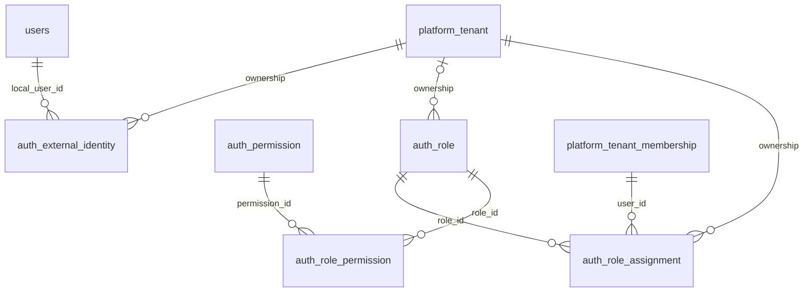

## foundation-core

Fields and constraints: [foundation-core](foundation-core.md).

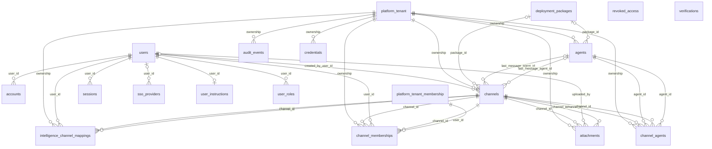

## foundation-computer

Fields and constraints: [foundation-computer](foundation-computer.md).

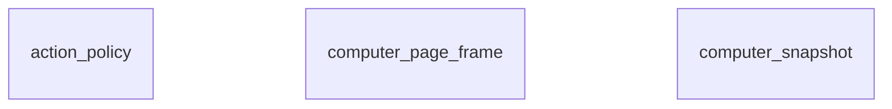

## foundation-coworker

Fields and constraints: [foundation-coworker](foundation-coworker.md).

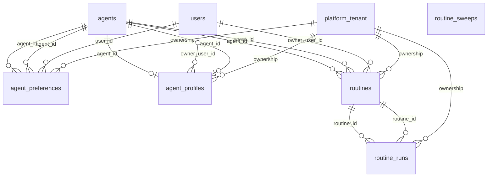

## foundation-components

Fields and constraints: [foundation-components](foundation-components.md).

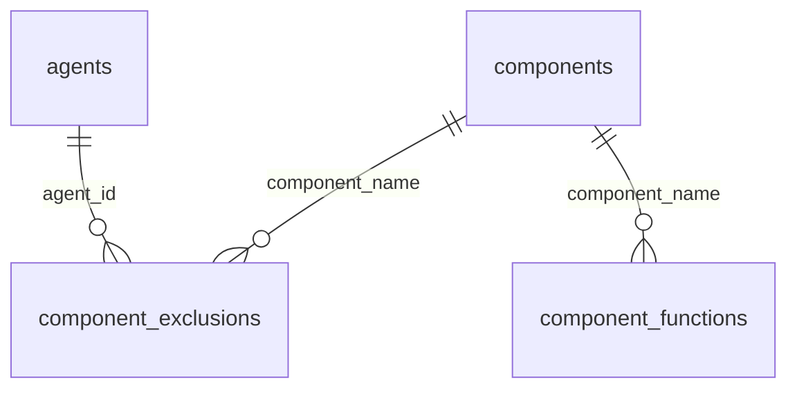

## foundation-plugins

Fields and constraints: [foundation-plugins](foundation-plugins.md).

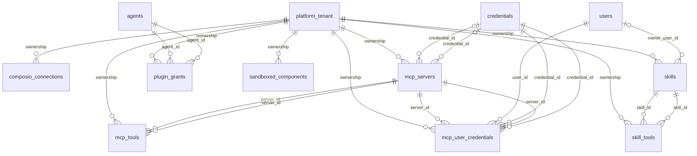

## foundation-work

Fields and constraints: [foundation-work](foundation-work.md).

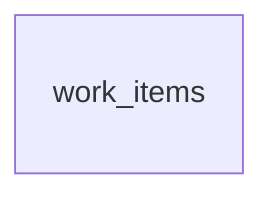

## foundation-voice

Fields and constraints: [foundation-voice](foundation-voice.md).

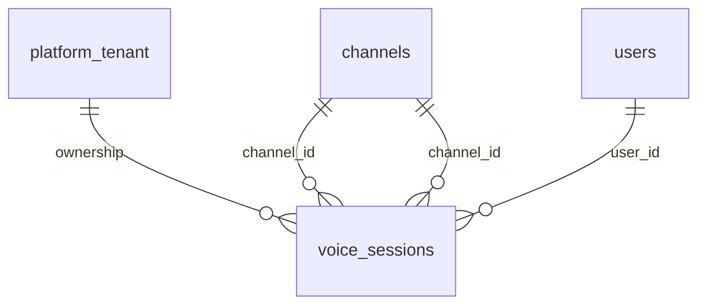

## platform-identity

Fields and constraints: [platform-identity](platform-identity.md).

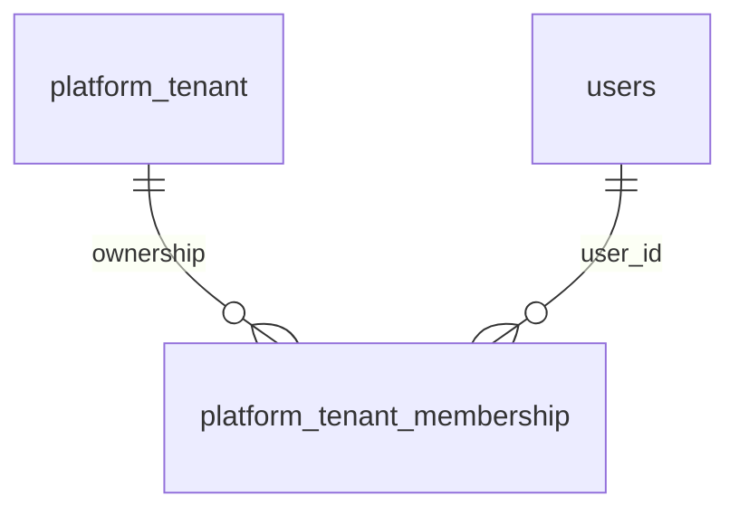

## platform-domains

Fields and constraints: [platform-domains](platform-domains.md).

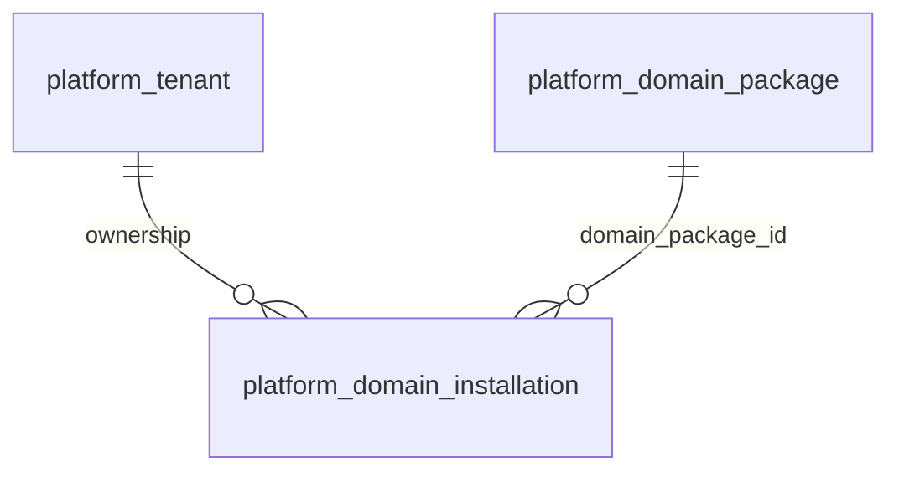

## platform-agents

Fields and constraints: [platform-agents](platform-agents.md).

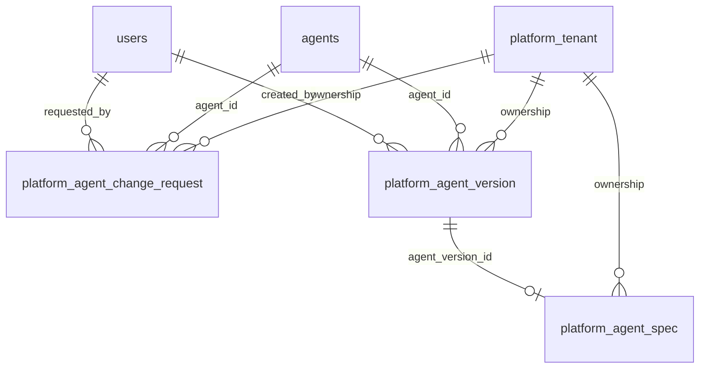

## platform-capabilities

Fields and constraints: [platform-capabilities](platform-capabilities.md).

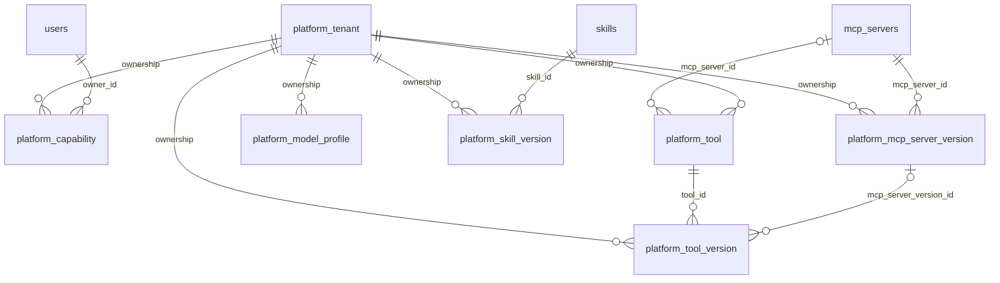

## platform-bindings

Fields and constraints: [platform-bindings](platform-bindings.md).

```mermaid
erDiagram
  platform_agent_capability_binding
  platform_tenant ||--o{ platform_agent_capability_binding : "ownership"
  platform_agent_version ||--o{ platform_agent_capability_binding : "agent_version_id"
  platform_capability ||--o{ platform_agent_capability_binding : "capability_id"
  platform_agent_knowledge_binding
  platform_tenant ||--o{ platform_agent_knowledge_binding : "ownership"
  platform_agent_version ||--o{ platform_agent_knowledge_binding : "agent_version_id"
  platform_knowledge_base ||--o{ platform_agent_knowledge_binding : "knowledge_base_id"
  platform_agent_model_binding
  platform_tenant ||--o{ platform_agent_model_binding : "ownership"
  platform_agent_version ||--o| platform_agent_model_binding : "agent_version_id"
  platform_model_profile ||--o{ platform_agent_model_binding : "model_profile_id"
  platform_agent_policy_binding
  platform_tenant ||--o{ platform_agent_policy_binding : "ownership"
  platform_agent_version ||--o{ platform_agent_policy_binding : "agent_version_id"
  platform_policy_version ||--o{ platform_agent_policy_binding : "policy_version_id"
  platform_agent_skill_binding
  platform_tenant ||--o{ platform_agent_skill_binding : "ownership"
  platform_agent_version ||--o{ platform_agent_skill_binding : "agent_version_id"
  platform_skill_version ||--o{ platform_agent_skill_binding : "skill_version_id"
  platform_agent_tool_binding
  platform_tenant ||--o{ platform_agent_tool_binding : "ownership"
  platform_agent_version ||--o{ platform_agent_tool_binding : "agent_version_id"
  platform_tool_version ||--o{ platform_agent_tool_binding : "tool_version_id"
```

## platform-knowledge

Fields and constraints: [platform-knowledge](platform-knowledge.md).

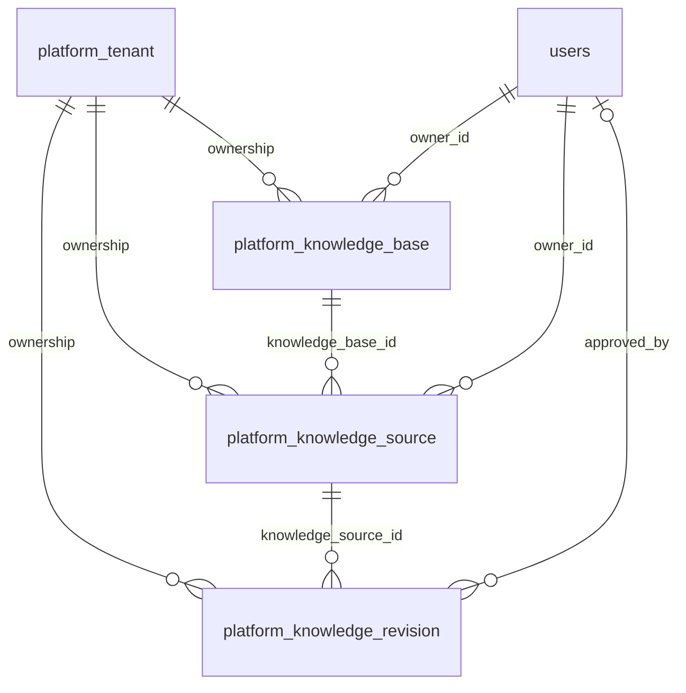

## platform-policies

Fields and constraints: [platform-policies](platform-policies.md).

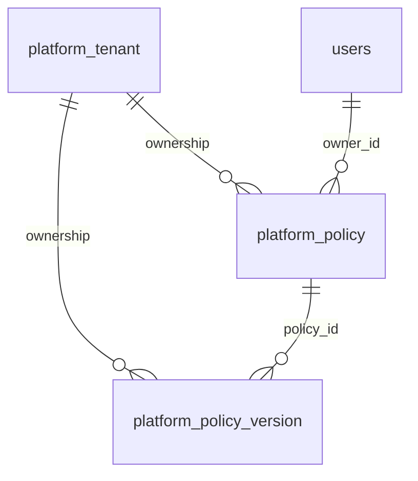

## platform-evaluation

Fields and constraints: [platform-evaluation](platform-evaluation.md).

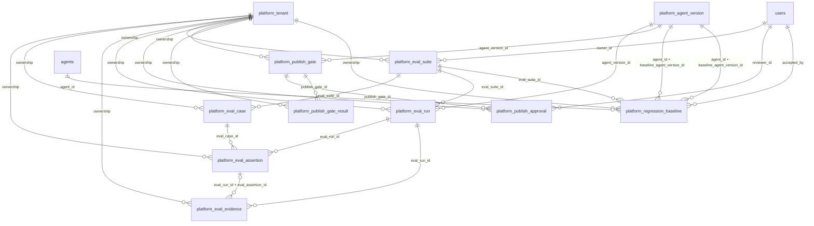

## platform-deployments

Fields and constraints: [platform-deployments](platform-deployments.md).

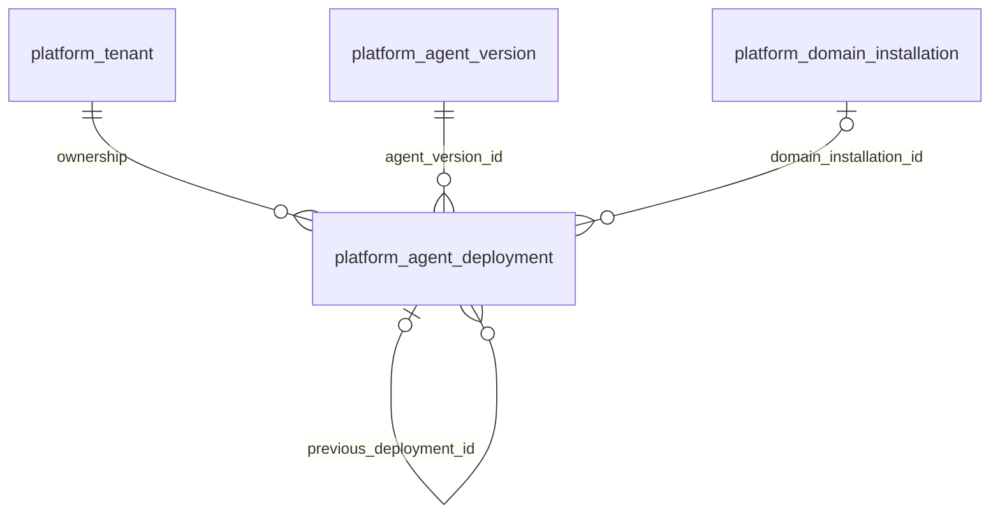

## platform-runtime

Fields and constraints: [platform-runtime](platform-runtime.md).

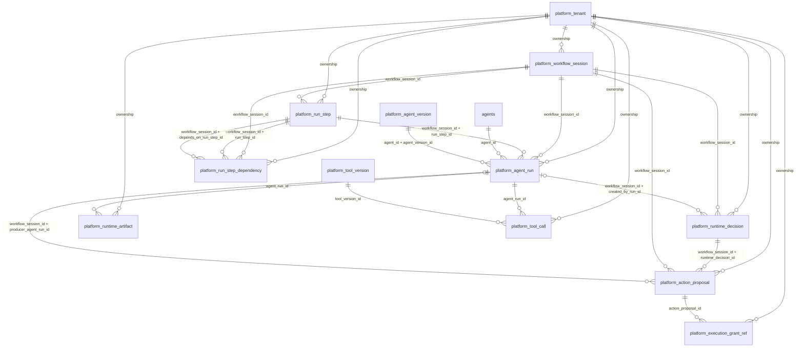

## platform-memory

Fields and constraints: [platform-memory](platform-memory.md).

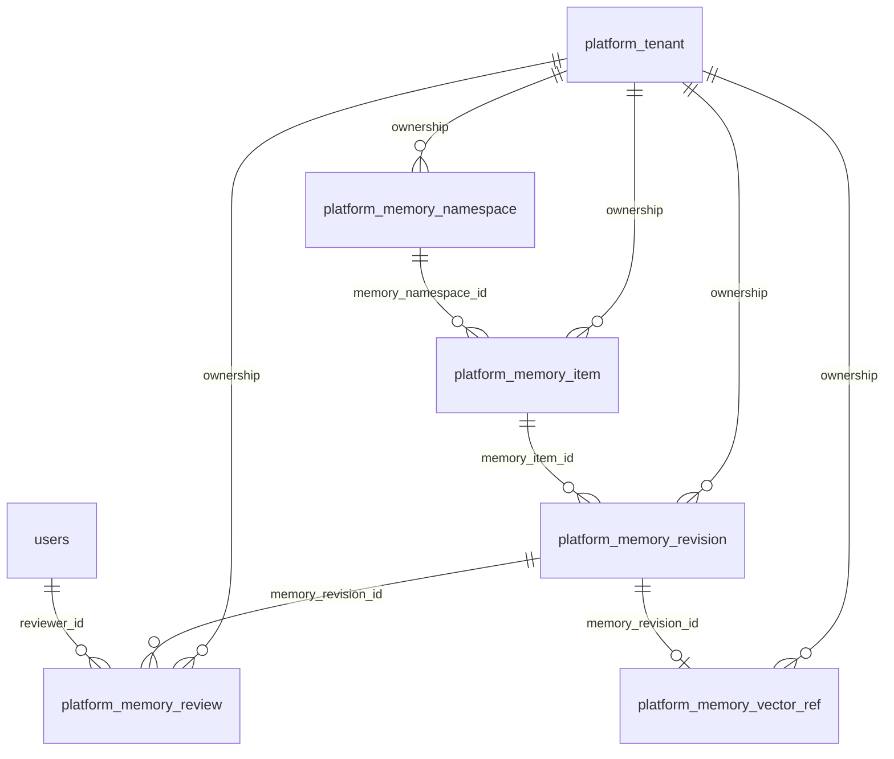

## platform-audit

Fields and constraints: [platform-audit](platform-audit.md).

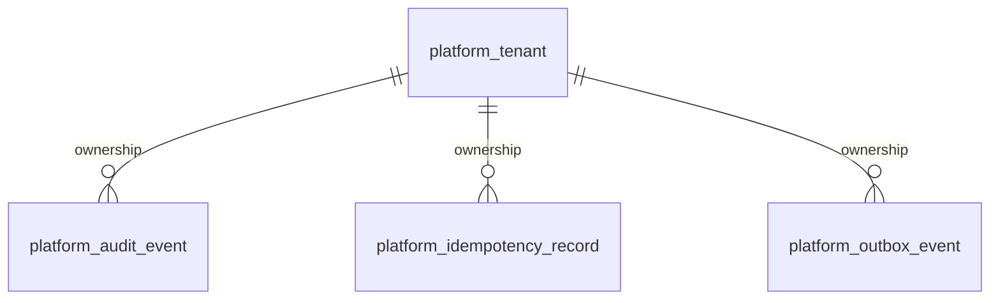

## vinhomes-property

Fields and constraints: [vinhomes-property](vinhomes-property.md).

```mermaid
erDiagram
  vh_apartment
  platform_tenant ||--o{ vh_apartment : "ownership"
  vh_project ||--o{ vh_apartment : "ownership"
  vh_tower ||--o{ vh_apartment : "tower_id"
  vh_membership_application
  platform_tenant ||--o{ vh_membership_application : "ownership"
  vh_project ||--o{ vh_membership_application : "ownership"
  vh_apartment ||--o{ vh_membership_application : "requested_apartment_id"
  users ||--o{ vh_membership_application : "applicant_user_id"
  users |o--o{ vh_membership_application : "reviewed_by"
  vh_project
  platform_tenant ||--o{ vh_project : "ownership"
  vh_property_membership
  platform_tenant ||--o{ vh_property_membership : "ownership"
  vh_project ||--o{ vh_property_membership : "ownership"
  users ||--o{ vh_property_membership : "user_id"
  vh_tower |o--o{ vh_property_membership : "tower_id"
  vh_apartment |o--o{ vh_property_membership : "tower_id + apartment_id"
  users ||--o{ vh_property_membership : "granted_by_user_id"
  platform_tenant_membership ||--o{ vh_property_membership : "user_id"
  vh_tower
  platform_tenant ||--o{ vh_tower : "ownership"
  vh_project ||--o{ vh_tower : "ownership"
```

## vinhomes-intake

Fields and constraints: [vinhomes-intake](vinhomes-intake.md).

```mermaid
erDiagram
  vh_case
  platform_tenant ||--o{ vh_case : "ownership"
  vh_project ||--o{ vh_case : "ownership"
  users ||--o{ vh_case : "resident_user_id"
  vh_apartment |o--o{ vh_case : "apartment_id"
  vh_property_membership ||--o{ vh_case : "opened_by_membership_id"
  vh_property_membership ||--o{ vh_case : "resident_user_id + opened_by_membership_id"
  vh_property_membership |o--o{ vh_case : "apartment_id + opened_by_membership_id"
  vh_feedback
  platform_tenant ||--o{ vh_feedback : "ownership"
  vh_project ||--o{ vh_feedback : "ownership"
  vh_resident_report ||--o{ vh_feedback : "report_id"
  users ||--o{ vh_feedback : "author_user_id"
  vh_resident_report ||--o| vh_feedback : "author_user_id + report_id"
  vh_resident_confirmation
  platform_tenant ||--o{ vh_resident_confirmation : "ownership"
  vh_project ||--o{ vh_resident_confirmation : "ownership"
  vh_resident_report ||--o{ vh_resident_confirmation : "report_id"
  vh_incident ||--o{ vh_resident_confirmation : "incident_id"
  users ||--o{ vh_resident_confirmation : "confirmed_by_user_id"
  vh_resident_report ||--o{ vh_resident_confirmation : "incident_id + confirmed_by_user_id + report_id"
  vh_resident_report
  platform_tenant ||--o{ vh_resident_report : "ownership"
  vh_project ||--o{ vh_resident_report : "ownership"
  vh_case ||--o{ vh_resident_report : "case_id"
  vh_incident |o--o{ vh_resident_report : "incident_id"
  users ||--o{ vh_resident_report : "reporter_id"
  vh_property_membership ||--o{ vh_resident_report : "reporter_membership_id"
  vh_apartment |o--o{ vh_resident_report : "apartment_id"
  vh_property_membership ||--o{ vh_resident_report : "reporter_id + reporter_membership_id"
  vh_property_membership |o--o{ vh_resident_report : "apartment_id + reporter_membership_id"
  vh_resident_request
  platform_tenant ||--o{ vh_resident_request : "ownership"
  vh_project ||--o{ vh_resident_request : "ownership"
  vh_case ||--o{ vh_resident_request : "case_id"
  users ||--o{ vh_resident_request : "submitted_by"
```

## vinhomes-operations

Fields and constraints: [vinhomes-operations](vinhomes-operations.md).

```mermaid
erDiagram
  vh_action_approval
  platform_tenant ||--o{ vh_action_approval : "ownership"
  vh_project ||--o{ vh_action_approval : "ownership"
  vh_action_request ||--o{ vh_action_approval : "action_request_id"
  users |o--o{ vh_action_approval : "reviewer_id"
  vh_action_request ||--o{ vh_action_approval : "action_request_id + action_payload_hash"
  vh_action_request ||--o{ vh_action_approval : "action_request_id + policy_version"
  vh_action_request
  platform_tenant ||--o{ vh_action_request : "ownership"
  vh_project ||--o{ vh_action_request : "ownership"
  vh_incident ||--o{ vh_action_request : "incident_id"
  vh_task ||--o{ vh_action_request : "incident_id + task_id"
  vh_checklist
  platform_tenant ||--o{ vh_checklist : "ownership"
  vh_checklist_version
  platform_tenant ||--o{ vh_checklist_version : "ownership"
  vh_checklist ||--o{ vh_checklist_version : "checklist_id"
  users ||--o{ vh_checklist_version : "created_by"
  vh_execution_grant
  platform_tenant ||--o{ vh_execution_grant : "ownership"
  vh_project ||--o{ vh_execution_grant : "ownership"
  vh_action_request ||--o{ vh_execution_grant : "action_request_id"
  vh_action_request ||--o{ vh_execution_grant : "action_request_id + action_payload_hash"
  vh_action_request ||--o{ vh_execution_grant : "action_request_id + policy_version"
  vh_incident
  platform_tenant ||--o{ vh_incident : "ownership"
  vh_project ||--o{ vh_incident : "ownership"
  vh_tower |o--o{ vh_incident : "tower_id"
  users |o--o{ vh_incident : "owner_user_id"
  users |o--o{ vh_incident : "closed_by_user_id"
  vh_incident_relation
  platform_tenant ||--o{ vh_incident_relation : "ownership"
  vh_project ||--o{ vh_incident_relation : "ownership"
  vh_incident ||--o{ vh_incident_relation : "source_incident_id"
  vh_incident ||--o{ vh_incident_relation : "target_incident_id"
  users ||--o{ vh_incident_relation : "created_by"
  vh_rule_evaluation
  platform_tenant ||--o{ vh_rule_evaluation : "ownership"
  vh_project ||--o{ vh_rule_evaluation : "ownership"
  vh_action_request ||--o{ vh_rule_evaluation : "action_request_id"
  vh_action_request ||--o{ vh_rule_evaluation : "action_request_id + action_payload_hash"
  vh_task
  platform_tenant ||--o{ vh_task : "ownership"
  vh_project ||--o{ vh_task : "ownership"
  vh_incident ||--o{ vh_task : "incident_id"
  vh_work_order
  platform_tenant ||--o{ vh_work_order : "ownership"
  vh_project ||--o{ vh_work_order : "ownership"
  vh_incident ||--o{ vh_work_order : "incident_id"
  vh_task ||--o{ vh_work_order : "incident_id + task_id"
  vh_action_request ||--o{ vh_work_order : "incident_id + task_id + action_request_id"
  vh_work_order |o--o{ vh_work_order : "incident_id + task_id + redo_of_work_order_id"
  vh_checklist_version |o--o{ vh_work_order : "checklist_version_id"
```

## vinhomes-files

Fields and constraints: [vinhomes-files](vinhomes-files.md).

```mermaid
erDiagram
  vh_file_object
  platform_tenant ||--o{ vh_file_object : "ownership"
  users ||--o{ vh_file_object : "uploaded_by_user_id"
```

## vinhomes-evidence

Fields and constraints: [vinhomes-evidence](vinhomes-evidence.md).

```mermaid
erDiagram
  vh_evidence_ref
  platform_tenant ||--o{ vh_evidence_ref : "ownership"
  vh_project ||--o{ vh_evidence_ref : "ownership"
  vh_incident ||--o{ vh_evidence_ref : "incident_id"
  vh_task |o--o{ vh_evidence_ref : "incident_id + task_id"
  vh_work_order |o--o{ vh_evidence_ref : "incident_id + task_id + work_order_id"
  vh_file_object ||--o{ vh_evidence_ref : "file_id"
  users ||--o{ vh_evidence_ref : "uploaded_by"
  vh_qc_result
  platform_tenant ||--o{ vh_qc_result : "ownership"
  vh_project ||--o{ vh_qc_result : "ownership"
  vh_incident ||--o{ vh_qc_result : "incident_id"
  vh_task ||--o{ vh_qc_result : "incident_id + task_id"
  vh_work_order ||--o{ vh_qc_result : "incident_id + task_id + work_order_id"
  users ||--o{ vh_qc_result : "checked_by"
  vh_qc_result_evidence
  platform_tenant ||--o{ vh_qc_result_evidence : "ownership"
  vh_project ||--o{ vh_qc_result_evidence : "ownership"
  vh_incident ||--o{ vh_qc_result_evidence : "incident_id"
  vh_qc_result ||--o{ vh_qc_result_evidence : "incident_id + qc_result_id"
  vh_evidence_ref ||--o{ vh_qc_result_evidence : "incident_id + evidence_ref_id"
  vh_root_cause_evidence
  platform_tenant ||--o{ vh_root_cause_evidence : "ownership"
  vh_project ||--o{ vh_root_cause_evidence : "ownership"
  vh_root_cause_finding ||--o{ vh_root_cause_evidence : "root_cause_finding_id"
  vh_evidence_ref ||--o{ vh_root_cause_evidence : "evidence_ref_id"
  vh_root_cause_finding
  platform_tenant ||--o{ vh_root_cause_finding : "ownership"
  vh_project ||--o{ vh_root_cause_finding : "ownership"
  vh_incident ||--o{ vh_root_cause_finding : "incident_id"
  vh_root_cause_incident
  platform_tenant ||--o{ vh_root_cause_incident : "ownership"
  vh_project ||--o{ vh_root_cause_incident : "ownership"
  vh_root_cause_finding ||--o{ vh_root_cause_incident : "root_cause_finding_id"
  vh_incident ||--o{ vh_root_cause_incident : "related_incident_id"
```

## vinhomes-attachments

Fields and constraints: [vinhomes-attachments](vinhomes-attachments.md).

```mermaid
erDiagram
  vh_membership_application_file
  platform_tenant ||--o{ vh_membership_application_file : "ownership"
  vh_project ||--o{ vh_membership_application_file : "ownership"
  vh_membership_application ||--o{ vh_membership_application_file : "application_id"
  vh_file_object ||--o{ vh_membership_application_file : "file_id"
  vh_pet_document
  platform_tenant ||--o{ vh_pet_document : "ownership"
  vh_project ||--o{ vh_pet_document : "ownership"
  vh_pet_profile ||--o{ vh_pet_document : "pet_id"
  vh_file_object ||--o{ vh_pet_document : "file_id"
  vh_report_attachment
  platform_tenant ||--o{ vh_report_attachment : "ownership"
  vh_project ||--o{ vh_report_attachment : "ownership"
  vh_resident_report ||--o{ vh_report_attachment : "report_id"
  vh_file_object ||--o{ vh_report_attachment : "file_id"
  vh_request_attachment
  platform_tenant ||--o{ vh_request_attachment : "ownership"
  vh_project ||--o{ vh_request_attachment : "ownership"
  vh_resident_request ||--o{ vh_request_attachment : "request_id"
  vh_file_object ||--o{ vh_request_attachment : "file_id"
  vh_service_request_file
  platform_tenant ||--o{ vh_service_request_file : "ownership"
  vh_project ||--o{ vh_service_request_file : "ownership"
  vh_service_request ||--o{ vh_service_request_file : "request_id"
  vh_file_object ||--o{ vh_service_request_file : "file_id"
```

## vinhomes-communication

Fields and constraints: [vinhomes-communication](vinhomes-communication.md).

```mermaid
erDiagram
  vh_business_event
  platform_tenant ||--o{ vh_business_event : "ownership"
  vh_project ||--o{ vh_business_event : "ownership"
  vh_incident |o--o{ vh_business_event : "incident_id"
  vh_message
  platform_tenant ||--o{ vh_message : "ownership"
  vh_project ||--o{ vh_message : "ownership"
  vh_incident ||--o{ vh_message : "incident_id"
  vh_resident_report |o--o{ vh_message : "resident_report_id"
  vh_resident_report |o--o{ vh_message : "incident_id + resident_report_id"
  vh_notification
  platform_tenant ||--o{ vh_notification : "ownership"
  vh_project ||--o{ vh_notification : "ownership"
  vh_business_event |o--o{ vh_notification : "business_event_id"
  users ||--o{ vh_notification : "recipient_id"
```

## vinhomes-services

Fields and constraints: [vinhomes-services](vinhomes-services.md).

```mermaid
erDiagram
  vh_access_card
  platform_tenant ||--o{ vh_access_card : "ownership"
  vh_project ||--o{ vh_access_card : "ownership"
  vh_property_membership ||--o{ vh_access_card : "membership_id"
  vh_camera_request
  platform_tenant ||--o{ vh_camera_request : "ownership"
  vh_project ||--o{ vh_camera_request : "ownership"
  vh_apartment ||--o{ vh_camera_request : "apartment_id"
  vh_property_membership ||--o{ vh_camera_request : "requester_membership_id"
  vh_map_place ||--o{ vh_camera_request : "location_place_id"
  users |o--o{ vh_camera_request : "reviewed_by"
  vh_property_membership ||--o{ vh_camera_request : "apartment_id + requester_membership_id"
  vh_charging_session
  platform_tenant ||--o{ vh_charging_session : "ownership"
  vh_project ||--o{ vh_charging_session : "ownership"
  vh_apartment ||--o{ vh_charging_session : "apartment_id"
  vh_property_membership ||--o{ vh_charging_session : "requested_by_membership_id"
  vh_map_place ||--o{ vh_charging_session : "station_place_id"
  vh_property_membership ||--o{ vh_charging_session : "apartment_id + requested_by_membership_id"
  vh_construction_permit
  platform_tenant ||--o{ vh_construction_permit : "ownership"
  vh_project ||--o{ vh_construction_permit : "ownership"
  vh_service_request ||--o{ vh_construction_permit : "service_request_id"
  vh_face_enrollment
  platform_tenant ||--o{ vh_face_enrollment : "ownership"
  vh_project ||--o{ vh_face_enrollment : "ownership"
  vh_property_membership ||--o{ vh_face_enrollment : "membership_id"
  vh_handover
  platform_tenant ||--o{ vh_handover : "ownership"
  vh_project ||--o{ vh_handover : "ownership"
  vh_apartment ||--o{ vh_handover : "apartment_id"
  vh_property_membership ||--o{ vh_handover : "resident_membership_id"
  vh_checklist_version |o--o{ vh_handover : "checklist_version_id"
  vh_property_membership ||--o{ vh_handover : "apartment_id + resident_membership_id"
  vh_intercom_event
  platform_tenant ||--o{ vh_intercom_event : "ownership"
  vh_project ||--o{ vh_intercom_event : "ownership"
  vh_apartment ||--o{ vh_intercom_event : "apartment_id"
  vh_visitor_pass |o--o{ vh_intercom_event : "visitor_pass_id"
  vh_parking_permit
  platform_tenant ||--o{ vh_parking_permit : "ownership"
  vh_project ||--o{ vh_parking_permit : "ownership"
  vh_apartment ||--o{ vh_parking_permit : "apartment_id"
  vh_property_membership ||--o{ vh_parking_permit : "membership_id"
  vh_property_membership ||--o{ vh_parking_permit : "apartment_id + membership_id"
  vh_pet_profile
  platform_tenant ||--o{ vh_pet_profile : "ownership"
  vh_project ||--o{ vh_pet_profile : "ownership"
  vh_apartment ||--o{ vh_pet_profile : "apartment_id"
  vh_property_membership ||--o{ vh_pet_profile : "owner_membership_id"
  vh_property_membership ||--o{ vh_pet_profile : "apartment_id + owner_membership_id"
  vh_service_request
  platform_tenant ||--o{ vh_service_request : "ownership"
  vh_project ||--o{ vh_service_request : "ownership"
  vh_apartment ||--o{ vh_service_request : "apartment_id"
  vh_property_membership ||--o{ vh_service_request : "requester_membership_id"
  vh_property_membership ||--o{ vh_service_request : "apartment_id + requester_membership_id"
  vh_visitor_pass
  platform_tenant ||--o{ vh_visitor_pass : "ownership"
  vh_project ||--o{ vh_visitor_pass : "ownership"
  vh_service_request ||--o{ vh_visitor_pass : "service_request_id"
```

## vinhomes-booking

Fields and constraints: [vinhomes-booking](vinhomes-booking.md).

```mermaid
erDiagram
  vh_booking
  platform_tenant ||--o{ vh_booking : "ownership"
  vh_project ||--o{ vh_booking : "ownership"
  vh_time_slot ||--o{ vh_booking : "slot_id"
  vh_apartment ||--o{ vh_booking : "apartment_id"
  vh_property_membership ||--o{ vh_booking : "booked_by_membership_id"
  vh_property_membership ||--o{ vh_booking : "apartment_id + booked_by_membership_id"
  vh_facility
  platform_tenant ||--o{ vh_facility : "ownership"
  vh_project ||--o{ vh_facility : "ownership"
  vh_map_place |o--o{ vh_facility : "place_id"
  vh_time_slot
  platform_tenant ||--o{ vh_time_slot : "ownership"
  vh_project ||--o{ vh_time_slot : "ownership"
  vh_facility ||--o{ vh_time_slot : "facility_id"
```

## vinhomes-billing

Fields and constraints: [vinhomes-billing](vinhomes-billing.md).

```mermaid
erDiagram
  vh_fee_schedule
  platform_tenant ||--o{ vh_fee_schedule : "ownership"
  vh_project ||--o{ vh_fee_schedule : "ownership"
  vh_invoice
  platform_tenant ||--o{ vh_invoice : "ownership"
  vh_project ||--o{ vh_invoice : "ownership"
  vh_apartment ||--o{ vh_invoice : "apartment_id"
  users ||--o{ vh_invoice : "billed_to_user_id"
  vh_invoice_line
  platform_tenant ||--o{ vh_invoice_line : "ownership"
  vh_project ||--o{ vh_invoice_line : "ownership"
  vh_invoice ||--o{ vh_invoice_line : "invoice_id"
  vh_fee_schedule |o--o{ vh_invoice_line : "fee_schedule_id"
  vh_loyalty_balance
  platform_tenant ||--o{ vh_loyalty_balance : "ownership"
  users ||--o{ vh_loyalty_balance : "user_id"
  vh_payment_allocation
  platform_tenant ||--o{ vh_payment_allocation : "ownership"
  vh_project ||--o{ vh_payment_allocation : "ownership"
  vh_payment_attempt ||--o{ vh_payment_allocation : "invoice_id + payment_attempt_id"
  vh_invoice ||--o{ vh_payment_allocation : "invoice_id"
  vh_payment_attempt
  platform_tenant ||--o{ vh_payment_attempt : "ownership"
  vh_project ||--o{ vh_payment_attempt : "ownership"
  vh_invoice ||--o{ vh_payment_attempt : "invoice_id"
  users ||--o{ vh_payment_attempt : "initiated_by_user_id"
```

## vinhomes-content

Fields and constraints: [vinhomes-content](vinhomes-content.md).

```mermaid
erDiagram
  vh_community_event
  platform_tenant ||--o{ vh_community_event : "ownership"
  vh_project ||--o{ vh_community_event : "ownership"
  vh_map_place |o--o{ vh_community_event : "place_id"
  vh_content_item
  platform_tenant ||--o{ vh_content_item : "ownership"
  vh_project ||--o{ vh_content_item : "ownership"
  vh_event_registration
  platform_tenant ||--o{ vh_event_registration : "ownership"
  vh_project ||--o{ vh_event_registration : "ownership"
  vh_community_event ||--o{ vh_event_registration : "event_id"
  vh_property_membership ||--o{ vh_event_registration : "membership_id"
  vh_map_place
  platform_tenant ||--o{ vh_map_place : "ownership"
  vh_project ||--o{ vh_map_place : "ownership"
  vh_tower |o--o{ vh_map_place : "tower_id"
  vh_miniapp_catalog
  platform_tenant ||--o{ vh_miniapp_catalog : "ownership"
  vh_project ||--o{ vh_miniapp_catalog : "ownership"
  vh_offer
  platform_tenant ||--o{ vh_offer : "ownership"
  vh_project ||--o{ vh_offer : "ownership"
  vh_sensor_reading
  platform_tenant ||--o{ vh_sensor_reading : "ownership"
  vh_project ||--o{ vh_sensor_reading : "ownership"
  vh_map_place ||--o{ vh_sensor_reading : "place_id"
  vh_transit_route
  platform_tenant ||--o{ vh_transit_route : "ownership"
  vh_project ||--o{ vh_transit_route : "ownership"
  vh_transit_route_stop
  platform_tenant ||--o{ vh_transit_route_stop : "ownership"
  vh_project ||--o{ vh_transit_route_stop : "ownership"
  vh_transit_route ||--o{ vh_transit_route_stop : "route_id"
  vh_transit_stop ||--o{ vh_transit_route_stop : "stop_id"
  vh_transit_stop
  platform_tenant ||--o{ vh_transit_stop : "ownership"
  vh_project ||--o{ vh_transit_stop : "ownership"
```

## vinhomes-delivery

Fields and constraints: [vinhomes-delivery](vinhomes-delivery.md).

```mermaid
erDiagram
  vh_command_receipt
  platform_tenant ||--o{ vh_command_receipt : "ownership"
  users ||--o{ vh_command_receipt : "actor_user_id"
  vh_outbox
  platform_tenant ||--o{ vh_outbox : "ownership"
  vh_project ||--o{ vh_outbox : "ownership"
  vh_business_event ||--o{ vh_outbox : "business_event_id"
```

## platform-conversations

Fields and constraints: [platform-conversations](platform-conversations.md).

```mermaid
erDiagram
  channel_messages
  agents |o--o{ channel_messages : "author_agent_id"
  platform_agent_version |o--o{ channel_messages : "author_agent_id + agent_version_id"
  platform_tenant ||--o{ channel_messages : "ownership"
  channels ||--o{ channel_messages : "channel_id"
  users |o--o{ channel_messages : "author_user_id"
  platform_agent_version |o--o{ channel_messages : "agent_version_id"
  channel_messages |o--o{ channel_messages : "channel_id + reply_to_message_id"
  channel_subjects
  platform_tenant ||--o{ channel_subjects : "ownership"
  channels ||--o{ channel_subjects : "channel_id"
```

## platform-collaboration

Fields and constraints: [platform-collaboration](platform-collaboration.md).

```mermaid
erDiagram
  platform_handoff
  platform_tenant ||--o{ platform_handoff : "ownership"
  channels |o--o{ platform_handoff : "source_channel_id"
  platform_workflow_session |o--o{ platform_handoff : "source_workflow_session_id"
  platform_agent_version ||--o{ platform_handoff : "target_agent_version_id"
  platform_workflow_session |o--o{ platform_handoff : "target_workflow_session_id"
  platform_runtime_checkpoint
  platform_tenant ||--o{ platform_runtime_checkpoint : "ownership"
  platform_workflow_session ||--o{ platform_runtime_checkpoint : "workflow_session_id"
  platform_agent_run |o--o{ platform_runtime_checkpoint : "workflow_session_id + created_by_run_id"
  platform_runtime_message
  platform_tenant ||--o{ platform_runtime_message : "ownership"
  platform_workflow_session ||--o{ platform_runtime_message : "workflow_session_id"
  platform_session_participant |o--o{ platform_runtime_message : "workflow_session_id + sender_participant_id"
  platform_session_participant |o--o{ platform_runtime_message : "workflow_session_id + recipient_participant_id"
  platform_agent_run |o--o{ platform_runtime_message : "workflow_session_id + agent_run_id"
  platform_runtime_message |o--o{ platform_runtime_message : "workflow_session_id + reply_to_message_id"
  platform_session_control
  platform_tenant ||--o{ platform_session_control : "ownership"
  platform_workflow_session ||--o| platform_session_control : "workflow_session_id"
  platform_workflow_session |o--o{ platform_session_control : "parent_workflow_session_id"
  platform_session_participant |o--o{ platform_session_control : "workflow_session_id + coordinator_participant_id"
  platform_session_participant
  platform_tenant ||--o{ platform_session_participant : "ownership"
  platform_workflow_session ||--o{ platform_session_participant : "workflow_session_id"
  platform_agent_version ||--o{ platform_session_participant : "agent_version_id"
  platform_session_wait
  platform_tenant ||--o{ platform_session_wait : "ownership"
  platform_workflow_session ||--o{ platform_session_wait : "workflow_session_id"
  platform_run_step |o--o{ platform_session_wait : "workflow_session_id + run_step_id"
  platform_session_participant |o--o{ platform_session_wait : "workflow_session_id + participant_id"
```

## platform-event-delivery

Fields and constraints: [platform-event-delivery](platform-event-delivery.md).

```mermaid
erDiagram
  platform_event_receipt
  platform_tenant ||--o{ platform_event_receipt : "ownership"
```

## vinhomes-workforce

Fields and constraints: [vinhomes-workforce](vinhomes-workforce.md).

```mermaid
erDiagram
  vh_staff_shift
  platform_tenant ||--o{ vh_staff_shift : "ownership"
  vh_project ||--o{ vh_staff_shift : "ownership"
  vh_team_member ||--o{ vh_staff_shift : "team_member_id"
  vh_staff_skill
  platform_tenant ||--o{ vh_staff_skill : "ownership"
  vh_project ||--o{ vh_staff_skill : "ownership"
  vh_property_membership ||--o{ vh_staff_skill : "property_membership_id"
  users ||--o{ vh_staff_skill : "verified_by_user_id"
  vh_team
  platform_tenant ||--o{ vh_team : "ownership"
  vh_project ||--o{ vh_team : "ownership"
  vh_team_member
  platform_tenant ||--o{ vh_team_member : "ownership"
  vh_project ||--o{ vh_team_member : "ownership"
  vh_team ||--o{ vh_team_member : "team_id"
  vh_property_membership ||--o{ vh_team_member : "property_membership_id"
```

## vinhomes-assets

Fields and constraints: [vinhomes-assets](vinhomes-assets.md).

```mermaid
erDiagram
  vh_asset
  platform_tenant ||--o{ vh_asset : "ownership"
  vh_project ||--o{ vh_asset : "ownership"
  vh_tower |o--o{ vh_asset : "tower_id"
  vh_apartment |o--o{ vh_asset : "apartment_id"
  vh_incident_asset
  platform_tenant ||--o{ vh_incident_asset : "ownership"
  vh_project ||--o{ vh_incident_asset : "ownership"
  vh_incident ||--o{ vh_incident_asset : "incident_id"
  vh_asset ||--o{ vh_incident_asset : "asset_id"
```

## vinhomes-dispatch

Fields and constraints: [vinhomes-dispatch](vinhomes-dispatch.md).

```mermaid
erDiagram
  vh_work_appointment
  platform_tenant ||--o{ vh_work_appointment : "ownership"
  vh_project ||--o{ vh_work_appointment : "ownership"
  vh_incident ||--o{ vh_work_appointment : "incident_id"
  vh_task ||--o{ vh_work_appointment : "incident_id + task_id"
  vh_work_order ||--o{ vh_work_appointment : "incident_id + task_id + work_order_id"
  vh_resident_report |o--o{ vh_work_appointment : "resident_report_id"
  users ||--o{ vh_work_appointment : "requested_by_user_id"
  users |o--o{ vh_work_appointment : "confirmed_by_user_id"
  vh_work_assignment
  platform_tenant ||--o{ vh_work_assignment : "ownership"
  vh_project ||--o{ vh_work_assignment : "ownership"
  vh_incident ||--o{ vh_work_assignment : "incident_id"
  vh_task ||--o{ vh_work_assignment : "incident_id + task_id"
  vh_work_order ||--o{ vh_work_assignment : "incident_id + task_id + work_order_id"
  vh_team ||--o{ vh_work_assignment : "team_id"
  vh_team_member |o--o{ vh_work_assignment : "team_id + team_member_id"
  users ||--o{ vh_work_assignment : "assigned_by_user_id"
  vh_work_progress
  platform_tenant ||--o{ vh_work_progress : "ownership"
  vh_project ||--o{ vh_work_progress : "ownership"
  vh_incident ||--o{ vh_work_progress : "incident_id"
  vh_task ||--o{ vh_work_progress : "incident_id + task_id"
  vh_work_order ||--o{ vh_work_progress : "incident_id + task_id + work_order_id"
  vh_work_assignment |o--o{ vh_work_progress : "incident_id + task_id + work_order_id + assignment_id"
  vh_business_event ||--o{ vh_work_progress : "business_event_id"
  users ||--o{ vh_work_progress : "actor_user_id"
  users |o--o{ vh_work_progress : "estimated_by_user_id"
```

## vinhomes-resident-updates

Fields and constraints: [vinhomes-resident-updates](vinhomes-resident-updates.md).

```mermaid
erDiagram
  vh_notification_delivery
  platform_tenant ||--o{ vh_notification_delivery : "ownership"
  vh_project ||--o{ vh_notification_delivery : "ownership"
  vh_notification ||--o{ vh_notification_delivery : "notification_id"
  vh_report_update |o--o{ vh_notification_delivery : "report_update_id"
  vh_report_update
  platform_tenant ||--o{ vh_report_update : "ownership"
  vh_project ||--o{ vh_report_update : "ownership"
  vh_incident ||--o{ vh_report_update : "incident_id"
  vh_resident_report ||--o{ vh_report_update : "report_id"
  users ||--o{ vh_report_update : "recipient_user_id"
  vh_business_event ||--o{ vh_report_update : "business_event_id"
  vh_work_progress |o--o{ vh_report_update : "incident_id + work_progress_id"
  vh_resident_report ||--o{ vh_report_update : "incident_id + recipient_user_id + report_id"
```

## vinhomes-provider-events

Fields and constraints: [vinhomes-provider-events](vinhomes-provider-events.md).

```mermaid
erDiagram
  vh_provider_event
  platform_tenant ||--o{ vh_provider_event : "ownership"
```

## vinhomes-sla

Fields and constraints: [vinhomes-sla](vinhomes-sla.md).

```mermaid
erDiagram
  vh_escalation
  platform_tenant ||--o{ vh_escalation : "ownership"
  vh_project ||--o{ vh_escalation : "ownership"
  vh_incident ||--o{ vh_escalation : "incident_id"
  vh_incident_sla |o--o{ vh_escalation : "incident_id + incident_sla_id"
  vh_team |o--o{ vh_escalation : "assigned_team_id"
  users |o--o{ vh_escalation : "acknowledged_by_user_id"
  vh_incident_sla
  platform_tenant ||--o{ vh_incident_sla : "ownership"
  vh_project ||--o{ vh_incident_sla : "ownership"
  vh_incident ||--o{ vh_incident_sla : "incident_id"
  vh_sla_policy ||--o{ vh_incident_sla : "policy_id"
  vh_sla_policy
  platform_tenant ||--o{ vh_sla_policy : "ownership"
  vh_project ||--o{ vh_sla_policy : "ownership"
```
