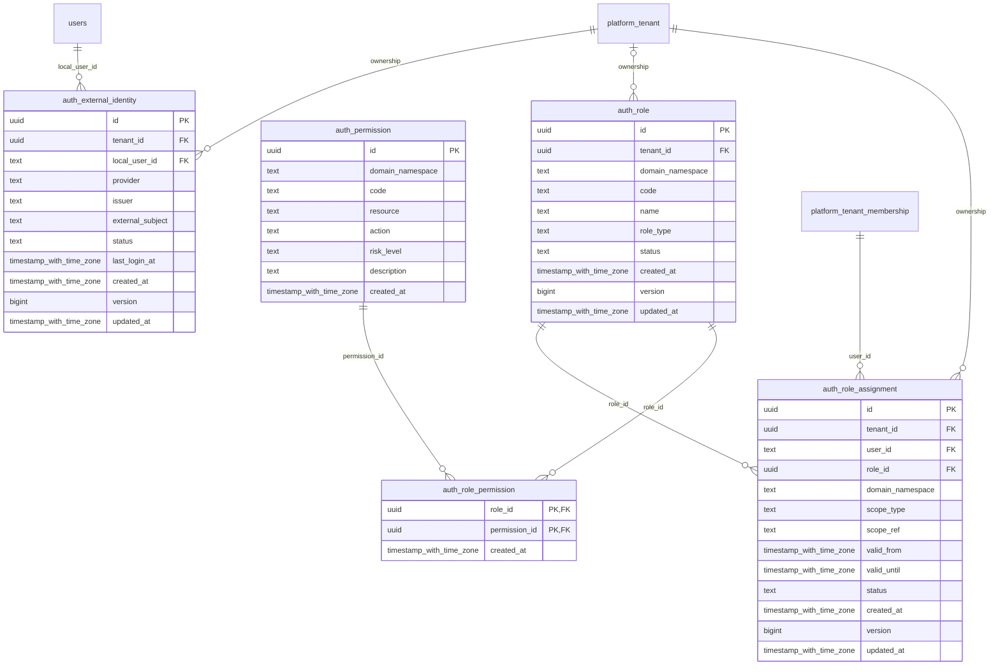

# authorization

Generated from Drizzle. External entities in the diagram are foreign-key targets owned by another module.

## auth_external_identity

Ánh xạ issuer và subject từ IAM/SSO tới user local; không lưu mật khẩu cư dân.

Tenant RLS: **enabled + forced by integrity migrations 0047/0049/0052**.

| Column | PostgreSQL type | Required | Default | Declared values |
|---|---|---|---|---|
| `id` | `uuid` | yes | `gen_random_uuid()` | — |
| `tenant_id` | `uuid` | yes | `nullif(current_setting('app.tenant_id', true), '')::uuid` | — |
| `local_user_id` | `text` | yes | `—` | — |
| `provider` | `text` | yes | `—` | — |
| `issuer` | `text` | yes | `—` | — |
| `external_subject` | `text` | yes | `—` | — |
| `status` | `text` | yes | `ACTIVE` | — |
| `last_login_at` | `timestamp with time zone` | no | `—` | — |
| `created_at` | `timestamp with time zone` | yes | `now()` | — |
| `version` | `bigint` | yes | `1` | — |
| `updated_at` | `timestamp with time zone` | yes | `now()` | — |

Primary key: `id`.

Unique keys:

- `auth_external_identity_issuer_subject_uq`: (`issuer`, `external_subject`).

Foreign keys:

- (`tenant_id`) → `platform_tenant` (`id`); ON DELETE `restrict`.
- (`local_user_id`) → `users` (`id`); ON DELETE `restrict`.

Indexes:

- `auth_external_identity_user_ix`: (`tenant_id`, `local_user_id`).

Checks:

- `auth_external_identity_status_ck`: `"auth_external_identity"."status" in ('ACTIVE', 'SUSPENDED', 'REVOKED')`.
- `auth_external_identity_subject_ck`: `length(trim("auth_external_identity"."issuer")) > 0 AND length(trim("auth_external_identity"."external_subject")) > 0`.
- `auth_external_identity_version_ck`: `"auth_external_identity"."version" > 0`.

Cross-row rules and application responsibilities: [database design](../01_DATABASE_ERD_IMPLEMENTATION_COMPLETE.md) and [system flow](../02_BUSINESS_ANALYSIS_IMPLEMENTATION.md).

## auth_permission

Danh mục quyền nguyên tử theo domain, tài nguyên, thao tác và mức rủi ro.

Tenant RLS: **enabled + forced by integrity migrations 0047/0049/0052**.

| Column | PostgreSQL type | Required | Default | Declared values |
|---|---|---|---|---|
| `id` | `uuid` | yes | `gen_random_uuid()` | — |
| `domain_namespace` | `text` | yes | `—` | — |
| `code` | `text` | yes | `—` | — |
| `resource` | `text` | yes | `—` | — |
| `action` | `text` | yes | `—` | — |
| `risk_level` | `text` | yes | `—` | — |
| `description` | `text` | yes | `—` | — |
| `created_at` | `timestamp with time zone` | yes | `now()` | — |

Primary key: `id`.

Unique keys:

- `auth_permission_code_uq`: (`domain_namespace`, `code`).

Checks:

- `auth_permission_risk_ck`: `"auth_permission"."risk_level" in ('LOW', 'MEDIUM', 'HIGH', 'CRITICAL')`.

Cross-row rules and application responsibilities: [database design](../01_DATABASE_ERD_IMPLEMENTATION_COMPLETE.md) and [system flow](../02_BUSINESS_ANALYSIS_IMPLEMENTATION.md).

## auth_role

Vai trò hệ thống hoặc vai trò tùy chỉnh theo tenant; độc lập vai trò BQL và quản trị agent.

Tenant RLS: **enabled + forced by integrity migrations 0047/0049/0052**.

| Column | PostgreSQL type | Required | Default | Declared values |
|---|---|---|---|---|
| `id` | `uuid` | yes | `gen_random_uuid()` | — |
| `tenant_id` | `uuid` | no | `—` | — |
| `domain_namespace` | `text` | yes | `—` | — |
| `code` | `text` | yes | `—` | — |
| `name` | `text` | yes | `—` | — |
| `role_type` | `text` | yes | `—` | — |
| `status` | `text` | yes | `ACTIVE` | — |
| `created_at` | `timestamp with time zone` | yes | `now()` | — |
| `version` | `bigint` | yes | `1` | — |
| `updated_at` | `timestamp with time zone` | yes | `now()` | — |

Primary key: `id`.

Foreign keys:

- (`tenant_id`) → `platform_tenant` (`id`); ON DELETE `restrict`.

Indexes:

- `auth_role_global_code_uq` UNIQUE: (`domain_namespace`, `code`) WHERE `"auth_role"."tenant_id" IS NULL`.
- `auth_role_tenant_code_uq` UNIQUE: (`tenant_id`, `domain_namespace`, `code`) WHERE `"auth_role"."tenant_id" IS NOT NULL`.

Checks:

- `auth_role_type_ck`: `"auth_role"."role_type" in ('SYSTEM', 'CUSTOM')`.
- `auth_role_status_ck`: `"auth_role"."status" in ('ACTIVE', 'SUSPENDED', 'RETIRED')`.
- `auth_role_ownership_ck`: `("auth_role"."role_type" = 'SYSTEM' AND "auth_role"."tenant_id" IS NULL) OR ("auth_role"."role_type" = 'CUSTOM' AND "auth_role"."tenant_id" IS NOT NULL)`.
- `auth_role_version_ck`: `"auth_role"."version" > 0`.

Cross-row rules and application responsibilities: [database design](../01_DATABASE_ERD_IMPLEMENTATION_COMPLETE.md) and [system flow](../02_BUSINESS_ANALYSIS_IMPLEMENTATION.md).

## auth_role_assignment

Gán role cho thành viên tenant theo scope và thời hạn; thu hồi không sửa lịch sử định danh.

Tenant RLS: **enabled + forced by integrity migrations 0047/0049/0052**.

| Column | PostgreSQL type | Required | Default | Declared values |
|---|---|---|---|---|
| `id` | `uuid` | yes | `gen_random_uuid()` | — |
| `tenant_id` | `uuid` | yes | `nullif(current_setting('app.tenant_id', true), '')::uuid` | — |
| `user_id` | `text` | yes | `—` | — |
| `role_id` | `uuid` | yes | `—` | — |
| `domain_namespace` | `text` | yes | `—` | — |
| `scope_type` | `text` | yes | `—` | — |
| `scope_ref` | `text` | yes | `—` | — |
| `valid_from` | `timestamp with time zone` | yes | `—` | — |
| `valid_until` | `timestamp with time zone` | no | `—` | — |
| `status` | `text` | yes | `ACTIVE` | — |
| `created_at` | `timestamp with time zone` | yes | `now()` | — |
| `version` | `bigint` | yes | `1` | — |
| `updated_at` | `timestamp with time zone` | yes | `now()` | — |

Primary key: `id`.

Unique keys:

- `auth_role_assignment_period_uq`: (`tenant_id`, `user_id`, `role_id`, `domain_namespace`, `scope_type`, `scope_ref`, `valid_from`).

Foreign keys:

- (`tenant_id`) → `platform_tenant` (`id`); ON DELETE `restrict`.
- (`role_id`) → `auth_role` (`id`); ON DELETE `restrict`.
- (`tenant_id`, `user_id`) → `platform_tenant_membership` (`tenant_id`, `user_id`); ON DELETE `restrict`.

Indexes:

- `auth_role_assignment_context_ix`: (`tenant_id`, `user_id`, `status`, `valid_until`).
- `auth_role_assignment_role_ix`: (`role_id`).

Checks:

- `auth_role_assignment_status_ck`: `"auth_role_assignment"."status" in ('ACTIVE', 'SUSPENDED', 'REVOKED')`.
- `auth_role_assignment_scope_ck`: `"auth_role_assignment"."scope_type" in ('TENANT', 'DOMAIN', 'PROJECT', 'TOWER', 'APARTMENT', 'RESOURCE')`.
- `auth_role_assignment_period_ck`: `"auth_role_assignment"."valid_until" IS NULL OR "auth_role_assignment"."valid_until" > "auth_role_assignment"."valid_from"`.
- `auth_role_assignment_ref_ck`: `length(trim("auth_role_assignment"."scope_ref")) > 0`.
- `auth_role_assignment_version_ck`: `"auth_role_assignment"."version" > 0`.

Cross-row rules and application responsibilities: [database design](../01_DATABASE_ERD_IMPLEMENTATION_COMPLETE.md) and [system flow](../02_BUSINESS_ANALYSIS_IMPLEMENTATION.md).

## auth_role_permission

Các permission thuộc một role; role hệ thống do deployment quản lý.

Tenant RLS: **enabled + forced by integrity migrations 0047/0049/0052**.

| Column | PostgreSQL type | Required | Default | Declared values |
|---|---|---|---|---|
| `role_id` | `uuid` | yes | `—` | — |
| `permission_id` | `uuid` | yes | `—` | — |
| `created_at` | `timestamp with time zone` | yes | `now()` | — |

Primary key: `role_id`, `permission_id`.

Foreign keys:

- (`role_id`) → `auth_role` (`id`); ON DELETE `restrict`.
- (`permission_id`) → `auth_permission` (`id`); ON DELETE `restrict`.

Indexes:

- `auth_role_permission_permission_ix`: (`permission_id`).

Cross-row rules and application responsibilities: [database design](../01_DATABASE_ERD_IMPLEMENTATION_COMPLETE.md) and [system flow](../02_BUSINESS_ANALYSIS_IMPLEMENTATION.md).
