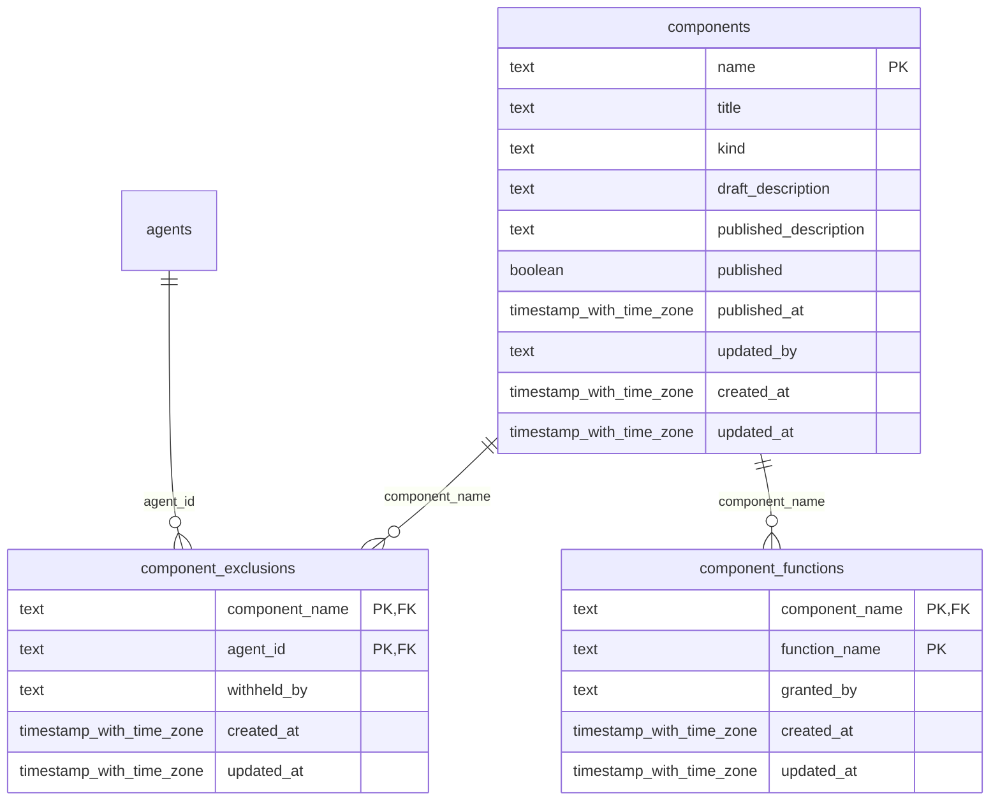

# foundation-components

Generated from Drizzle. External entities in the diagram are foreign-key targets owned by another module.

## component_exclusions

Cấu hình loại trừ component theo scope của nền sản phẩm.

Tenant RLS: **global identity or deployment infrastructure; application/operator authorization required**.

| Column | PostgreSQL type | Required | Default | Declared values |
|---|---|---|---|---|
| `component_name` | `text` | yes | `—` | — |
| `agent_id` | `text` | yes | `—` | — |
| `withheld_by` | `text` | no | `—` | — |
| `created_at` | `timestamp with time zone` | yes | `now()` | — |
| `updated_at` | `timestamp with time zone` | yes | `now()` | — |

Primary key: `component_name`, `agent_id`.

Foreign keys:

- (`component_name`) → `components` (`name`); ON DELETE `cascade`.
- (`agent_id`) → `agents` (`id`); ON DELETE `cascade`.

Cross-row rules and application responsibilities: [database design](../01_DATABASE_ERD_IMPLEMENTATION_COMPLETE.md) and [system flow](../02_BUSINESS_ANALYSIS_IMPLEMENTATION.md).

## component_functions

Các function được khai báo cho component để phục vụ gọi và kiểm soát chức năng.

Tenant RLS: **global identity or deployment infrastructure; application/operator authorization required**.

| Column | PostgreSQL type | Required | Default | Declared values |
|---|---|---|---|---|
| `component_name` | `text` | yes | `—` | — |
| `function_name` | `text` | yes | `—` | — |
| `granted_by` | `text` | no | `—` | — |
| `created_at` | `timestamp with time zone` | yes | `now()` | — |
| `updated_at` | `timestamp with time zone` | yes | `now()` | — |

Primary key: `component_name`, `function_name`.

Foreign keys:

- (`component_name`) → `components` (`name`); ON DELETE `cascade`.

Cross-row rules and application responsibilities: [database design](../01_DATABASE_ERD_IMPLEMENTATION_COMPLETE.md) and [system flow](../02_BUSINESS_ANALYSIS_IMPLEMENTATION.md).

## components

Metadata component được quản lý bởi shell/plugin infrastructure.

Tenant RLS: **global identity or deployment infrastructure; application/operator authorization required**.

| Column | PostgreSQL type | Required | Default | Declared values |
|---|---|---|---|---|
| `name` | `text` | yes | `—` | — |
| `title` | `text` | yes | `—` | — |
| `kind` | `text` | yes | `—` | — |
| `draft_description` | `text` | yes | `—` | — |
| `published_description` | `text` | no | `—` | — |
| `published` | `boolean` | yes | `false` | — |
| `published_at` | `timestamp with time zone` | no | `—` | — |
| `updated_by` | `text` | no | `—` | — |
| `created_at` | `timestamp with time zone` | yes | `now()` | — |
| `updated_at` | `timestamp with time zone` | yes | `now()` | — |

Primary key: `name`.

Cross-row rules and application responsibilities: [database design](../01_DATABASE_ERD_IMPLEMENTATION_COMPLETE.md) and [system flow](../02_BUSINESS_ANALYSIS_IMPLEMENTATION.md).
