# foundation-core

Generated from Drizzle. External entities in the diagram are foreign-key targets owned by another module.

```mermaid
erDiagram
  accounts {
    text id PK
    text account_id
    text provider_id
    text issuer
    text user_id FK
    text access_token
    text refresh_token
    text id_token
    timestamp_with_time_zone access_token_expires_at
    timestamp_with_time_zone refresh_token_expires_at
    text scope
    text password
    timestamp_with_time_zone created_at
    timestamp_with_time_zone updated_at
  }
  users ||--o{ accounts : "user_id"
  agents {
    text description
    text domain_namespace
    text status
    bigint revision
    uuid tenant_id FK
    text id PK
    text name
    agent_type type
    jsonb configuration
    uuid package_id FK
    jsonb override
    timestamp_with_time_zone created_at
    timestamp_with_time_zone updated_at
  }
  platform_tenant ||--o{ agents : "ownership"
  deployment_packages |o--o{ agents : "package_id"
  attachments {
    uuid tenant_id FK
    uuid id PK
    text channel_id FK
    text uploaded_by FK
    text name
    text mime_type
    integer size_bytes
    bytea bytes
    timestamp_with_time_zone created_at
    timestamp_with_time_zone attached_at
    text upload_group
  }
  platform_tenant ||--o{ attachments : "ownership"
  channels ||--o{ attachments : "channel_id"
  users ||--o{ attachments : "uploaded_by"
  channels ||--o{ attachments : "channel_id"
  audit_events {
    uuid tenant_id FK
    uuid id PK
    text actor_user_id
    text initiator_kind
    text initiator_id
    text event_type
    text target_type
    text target_id
    jsonb payload
    timestamp_with_time_zone created_at
  }
  platform_tenant ||--o{ audit_events : "ownership"
  channel_agents {
    uuid tenant_id FK
    text channel_id PK, FK
    text agent_id PK, FK
    timestamp_with_time_zone created_at
  }
  platform_tenant ||--o{ channel_agents : "ownership"
  channels ||--o{ channel_agents : "channel_id"
  agents ||--o{ channel_agents : "agent_id"
  channels ||--o{ channel_agents : "channel_id"
  agents ||--o{ channel_agents : "agent_id"
  channel_memberships {
    uuid tenant_id FK
    text channel_id PK, FK
    text user_id PK, FK
    timestamp_with_time_zone pinned_at
    timestamp_with_time_zone last_read_at
    timestamp_with_time_zone created_at
  }
  platform_tenant ||--o{ channel_memberships : "ownership"
  channels ||--o{ channel_memberships : "channel_id"
  users ||--o{ channel_memberships : "user_id"
  channels ||--o{ channel_memberships : "channel_id"
  platform_tenant_membership ||--o{ channel_memberships : "user_id"
  channels {
    text channel_kind
    text locale
    text created_by_user_id FK
    text status
    bigint revision
    uuid tenant_id FK
    text id PK
    text name
    text description
    text__ suggested_prompts
    text__ allowed_groups
    uuid package_id FK
    jsonb override
    text summary
    timestamp_with_time_zone summary_at
    text last_message
    text last_message_source_id
    timestamp_with_time_zone last_message_at
    text last_message_agent_id FK
    timestamp_with_time_zone deleted_at
    timestamp_with_time_zone created_at
    timestamp_with_time_zone updated_at
  }
  users |o--o{ channels : "created_by_user_id"
  platform_tenant ||--o{ channels : "ownership"
  deployment_packages |o--o{ channels : "package_id"
  agents |o--o{ channels : "last_message_agent_id"
  agents |o--o{ channels : "last_message_agent_id"
  credentials {
    uuid tenant_id FK
    uuid id PK
    credential_kind kind
    text provider
    text encrypted_value
    text key_id
    jsonb metadata
    timestamp_with_time_zone revoked_at
    timestamp_with_time_zone created_at
    timestamp_with_time_zone updated_at
  }
  platform_tenant ||--o{ credentials : "ownership"
  deployment_packages {
    uuid id PK
    text tenant_id
    text source_path
    text checksum
    timestamp_with_time_zone loaded_at
  }
  intelligence_channel_mappings {
    uuid tenant_id FK
    text user_id PK, FK
    text channel_id PK, FK
    text thread_id
    timestamp_with_time_zone created_at
    timestamp_with_time_zone updated_at
  }
  platform_tenant ||--o{ intelligence_channel_mappings : "ownership"
  users ||--o{ intelligence_channel_mappings : "user_id"
  channels ||--o{ intelligence_channel_mappings : "channel_id"
  channels ||--o{ intelligence_channel_mappings : "channel_id"
  revoked_access {
    text email PK
    timestamp_with_time_zone revoked_at
    text revoked_by
  }
  sessions {
    text id PK
    text user_id FK
    text token
    timestamp_with_time_zone expires_at
    text ip_address
    text user_agent
    timestamp_with_time_zone created_at
    timestamp_with_time_zone updated_at
  }
  users ||--o{ sessions : "user_id"
  sso_providers {
    text id PK
    text issuer
    text oidc_config
    text saml_config
    text user_id FK
    text provider_id
    text organization_id
    text domain
  }
  users |o--o{ sso_providers : "user_id"
  user_instructions {
    text user_id PK, FK
    text instructions
    timestamp_with_time_zone created_at
    timestamp_with_time_zone updated_at
  }
  users ||--o| user_instructions : "user_id"
  user_roles {
    text user_id PK, FK
    role role PK
    timestamp_with_time_zone created_at
  }
  users ||--o{ user_roles : "user_id"
  users {
    text id PK
    text email
    text name
    text image
    boolean email_verified
    jsonb preferences
    text__ groups
    integer onboarding_step
    timestamp_with_time_zone onboarding_completed_at
    timestamp_with_time_zone last_signed_in_at
    timestamp_with_time_zone created_at
    timestamp_with_time_zone updated_at
  }
  verifications {
    text id PK
    text identifier
    text value
    timestamp_with_time_zone expires_at
    timestamp_with_time_zone created_at
    timestamp_with_time_zone updated_at
  }
```

## accounts

Liên kết người dùng với tài khoản nhà cung cấp đăng nhập, issuer và thông tin xác thực do Better Auth quản lý.

Tenant RLS: **global identity or deployment infrastructure; application/operator authorization required**.

| Column | PostgreSQL type | Required | Default | Declared values |
|---|---|---|---|---|
| `id` | `text` | yes | `—` | — |
| `account_id` | `text` | yes | `—` | — |
| `provider_id` | `text` | yes | `—` | — |
| `issuer` | `text` | no | `—` | — |
| `user_id` | `text` | yes | `—` | — |
| `access_token` | `text` | no | `—` | — |
| `refresh_token` | `text` | no | `—` | — |
| `id_token` | `text` | no | `—` | — |
| `access_token_expires_at` | `timestamp with time zone` | no | `—` | — |
| `refresh_token_expires_at` | `timestamp with time zone` | no | `—` | — |
| `scope` | `text` | no | `—` | — |
| `password` | `text` | no | `—` | — |
| `created_at` | `timestamp with time zone` | yes | `now()` | — |
| `updated_at` | `timestamp with time zone` | yes | `now()` | — |

Primary key: `id`.

Foreign keys:

- (`user_id`) → `users` (`id`); ON DELETE `cascade`.

Indexes:

- `accounts_provider_account_idx` UNIQUE: (`provider_id`, `account_id`).

Cross-row rules and application responsibilities: [database design](../01_DATABASE_ERD_IMPLEMENTATION_COMPLETE.md) and [system flow](../02_BUSINESS_ANALYSIS_IMPLEMENTATION.md).

## agents

Danh tính agent duy nhất của sản phẩm; lễ tân, điều phối, kỹ thuật dùng chung registry này. Cấu hình transport tách khỏi phiên bản được phát hành.

Tenant RLS: **enabled + forced by integrity migrations 0047/0049/0052**.

| Column | PostgreSQL type | Required | Default | Declared values |
|---|---|---|---|---|
| `description` | `text` | no | `—` | — |
| `domain_namespace` | `text` | no | `—` | — |
| `status` | `text` | yes | `ACTIVE` | — |
| `revision` | `bigint` | yes | `1` | — |
| `tenant_id` | `uuid` | yes | `nullif(current_setting('app.tenant_id', true), '')::uuid` | — |
| `id` | `text` | yes | `—` | — |
| `name` | `text` | yes | `—` | — |
| `type` | `agent_type` | yes | `—` | `built_in`, `remote_ag_ui`, `remote_mastra` |
| `configuration` | `jsonb` | yes | `—` | — |
| `package_id` | `uuid` | no | `—` | — |
| `override` | `jsonb` | no | `—` | — |
| `created_at` | `timestamp with time zone` | yes | `now()` | — |
| `updated_at` | `timestamp with time zone` | yes | `now()` | — |

Primary key: `id`.

Unique keys:

- `agents_tenant_id_key`: (`tenant_id`, `id`).

Foreign keys:

- (`tenant_id`) → `platform_tenant` (`id`); ON DELETE `restrict`.
- (`package_id`) → `deployment_packages` (`id`); ON DELETE `set null`.

Checks:

- `agents_status_ck`: `status IN ('ACTIVE','SUSPENDED','RETIRED')`.
- `agents_revision_ck`: `revision > 0`.

Cross-row rules and application responsibilities: [database design](../01_DATABASE_ERD_IMPLEMENTATION_COMPLETE.md) and [system flow](../02_BUSINESS_ANALYSIS_IMPLEMENTATION.md).

## attachments

File đính kèm trong hội thoại với vòng đời staged/sent; không thay evidence nghiệp vụ Vinhomes.

Tenant RLS: **enabled + forced by integrity migrations 0047/0049/0052**.

| Column | PostgreSQL type | Required | Default | Declared values |
|---|---|---|---|---|
| `tenant_id` | `uuid` | yes | `nullif(current_setting('app.tenant_id', true), '')::uuid` | — |
| `id` | `uuid` | yes | `gen_random_uuid()` | — |
| `channel_id` | `text` | yes | `—` | — |
| `uploaded_by` | `text` | yes | `—` | — |
| `name` | `text` | yes | `—` | — |
| `mime_type` | `text` | yes | `—` | — |
| `size_bytes` | `integer` | yes | `—` | — |
| `bytes` | `bytea` | yes | `—` | — |
| `created_at` | `timestamp with time zone` | yes | `now()` | — |
| `attached_at` | `timestamp with time zone` | no | `—` | — |
| `upload_group` | `text` | no | `—` | — |

Primary key: `id`.

Unique keys:

- `attachments_tenant_pk`: (`tenant_id`, `id`).

Foreign keys:

- (`tenant_id`) → `platform_tenant` (`id`); ON DELETE `restrict`.
- (`channel_id`) → `channels` (`id`); ON DELETE `cascade`.
- (`uploaded_by`) → `users` (`id`); ON DELETE `cascade`.
- (`tenant_id`, `channel_id`) → `channels` (`tenant_id`, `id`); ON DELETE `restrict`.

Indexes:

- `attachments_channel_idx`: (`channel_id`).
- `attachments_uploaded_by_idx`: (`uploaded_by`).
- `attachments_upload_group_idx`: (`channel_id`, `uploaded_by`, `upload_group`) WHERE `"attachments"."attached_at" is null`.
- `attachments_staged_idx`: (`created_at`) WHERE `"attachments"."attached_at" is null`.

Cross-row rules and application responsibilities: [database design](../01_DATABASE_ERD_IMPLEMENTATION_COMPLETE.md) and [system flow](../02_BUSINESS_ANALYSIS_IMPLEMENTATION.md).

## audit_events

Audit append-only của nền OpenBot; tách với audit quản trị platform và business events Vinhomes.

Tenant RLS: **enabled + forced by integrity migrations 0047/0049/0052**.

| Column | PostgreSQL type | Required | Default | Declared values |
|---|---|---|---|---|
| `tenant_id` | `uuid` | yes | `nullif(current_setting('app.tenant_id', true), '')::uuid` | — |
| `id` | `uuid` | yes | `gen_random_uuid()` | — |
| `actor_user_id` | `text` | no | `—` | — |
| `initiator_kind` | `text` | yes | `person` | — |
| `initiator_id` | `text` | no | `—` | — |
| `event_type` | `text` | yes | `—` | — |
| `target_type` | `text` | yes | `—` | — |
| `target_id` | `text` | no | `—` | — |
| `payload` | `jsonb` | yes | `—` | — |
| `created_at` | `timestamp with time zone` | yes | `now()` | — |

Primary key: `id`.

Unique keys:

- `audit_events_tenant_pk`: (`tenant_id`, `id`).

Foreign keys:

- (`tenant_id`) → `platform_tenant` (`id`); ON DELETE `restrict`.

Indexes:

- `audit_events_created_at_idx`: (`created_at`).
- `audit_events_type_time_idx`: (`event_type`, `created_at`, `id`).
- `audit_events_actor_time_idx`: (`actor_user_id`, `created_at`, `id`).
- `audit_events_target_time_idx`: (`target_type`, `target_id`, `created_at`, `id`).
- `audit_events_initiator_time_idx`: (`initiator_kind`, `created_at`, `id`).

Cross-row rules and application responsibilities: [database design](../01_DATABASE_ERD_IMPLEMENTATION_COMPLETE.md) and [system flow](../02_BUSINESS_ANALYSIS_IMPLEMENTATION.md).

## channel_agents

Danh sách agent được gắn vào một kênh; không thay roster có phiên bản của workflow.

Tenant RLS: **enabled + forced by integrity migrations 0047/0049/0052**.

| Column | PostgreSQL type | Required | Default | Declared values |
|---|---|---|---|---|
| `tenant_id` | `uuid` | yes | `nullif(current_setting('app.tenant_id', true), '')::uuid` | — |
| `channel_id` | `text` | yes | `—` | — |
| `agent_id` | `text` | yes | `—` | — |
| `created_at` | `timestamp with time zone` | yes | `now()` | — |

Primary key: `channel_id`, `agent_id`.

Foreign keys:

- (`tenant_id`) → `platform_tenant` (`id`); ON DELETE `restrict`.
- (`channel_id`) → `channels` (`id`); ON DELETE `cascade`.
- (`agent_id`) → `agents` (`id`); ON DELETE `cascade`.
- (`tenant_id`, `channel_id`) → `channels` (`tenant_id`, `id`); ON DELETE `restrict`.
- (`tenant_id`, `agent_id`) → `agents` (`tenant_id`, `id`); ON DELETE `restrict`.

Cross-row rules and application responsibilities: [database design](../01_DATABASE_ERD_IMPLEMENTATION_COMPLETE.md) and [system flow](../02_BUSINESS_ANALYSIS_IMPLEMENTATION.md).

## channel_memberships

Quyền thành viên và dấu đã đọc của người dùng trên từng kênh OpenBot.

Tenant RLS: **enabled + forced by integrity migrations 0047/0049/0052**.

| Column | PostgreSQL type | Required | Default | Declared values |
|---|---|---|---|---|
| `tenant_id` | `uuid` | yes | `nullif(current_setting('app.tenant_id', true), '')::uuid` | — |
| `channel_id` | `text` | yes | `—` | — |
| `user_id` | `text` | yes | `—` | — |
| `pinned_at` | `timestamp with time zone` | no | `—` | — |
| `last_read_at` | `timestamp with time zone` | no | `—` | — |
| `created_at` | `timestamp with time zone` | yes | `now()` | — |

Primary key: `channel_id`, `user_id`.

Foreign keys:

- (`tenant_id`) → `platform_tenant` (`id`); ON DELETE `restrict`.
- (`channel_id`) → `channels` (`id`); ON DELETE `cascade`.
- (`user_id`) → `users` (`id`); ON DELETE `cascade`.
- (`tenant_id`, `channel_id`) → `channels` (`tenant_id`, `id`); ON DELETE `restrict`.
- (`tenant_id`, `user_id`) → `platform_tenant_membership` (`tenant_id`, `user_id`); ON DELETE `restrict`.

Cross-row rules and application responsibilities: [database design](../01_DATABASE_ERD_IMPLEMENTATION_COMPLETE.md) and [system flow](../02_BUSINESS_ANALYSIS_IMPLEMENTATION.md).

## channels

Hội thoại chuẩn của sản phẩm: cư dân, nhân viên hoặc nội bộ; membership quyết định quyền tham gia.

Tenant RLS: **enabled + forced by integrity migrations 0047/0049/0052**.

| Column | PostgreSQL type | Required | Default | Declared values |
|---|---|---|---|---|
| `channel_kind` | `text` | yes | `RESIDENT` | — |
| `locale` | `text` | yes | `vi-VN` | — |
| `created_by_user_id` | `text` | no | `—` | — |
| `status` | `text` | yes | `ACTIVE` | — |
| `revision` | `bigint` | yes | `1` | — |
| `tenant_id` | `uuid` | yes | `nullif(current_setting('app.tenant_id', true), '')::uuid` | — |
| `id` | `text` | yes | `—` | — |
| `name` | `text` | yes | `—` | — |
| `description` | `text` | yes | `—` | — |
| `suggested_prompts` | `text[]` | yes | `[]` | — |
| `allowed_groups` | `text[]` | yes | `[]` | — |
| `package_id` | `uuid` | no | `—` | — |
| `override` | `jsonb` | no | `—` | — |
| `summary` | `text` | no | `—` | — |
| `summary_at` | `timestamp with time zone` | no | `—` | — |
| `last_message` | `text` | no | `—` | — |
| `last_message_source_id` | `text` | no | `—` | — |
| `last_message_at` | `timestamp with time zone` | no | `—` | — |
| `last_message_agent_id` | `text` | no | `—` | — |
| `deleted_at` | `timestamp with time zone` | no | `—` | — |
| `created_at` | `timestamp with time zone` | yes | `now()` | — |
| `updated_at` | `timestamp with time zone` | yes | `now()` | — |

Primary key: `id`.

Unique keys:

- `channels_tenant_id_key`: (`tenant_id`, `id`).

Foreign keys:

- (`created_by_user_id`) → `users` (`id`); ON DELETE `restrict`.
- (`tenant_id`) → `platform_tenant` (`id`); ON DELETE `restrict`.
- (`package_id`) → `deployment_packages` (`id`); ON DELETE `set null`.
- (`last_message_agent_id`) → `agents` (`id`); ON DELETE `set null`.
- (`tenant_id`, `last_message_agent_id`) → `agents` (`tenant_id`, `id`); ON DELETE `restrict`.

Indexes:

- `channels_recent_activity_idx`: (`COALESCE("channels"."last_message_at", "channels"."created_at") DESC`).
- `channels_awaiting_summary_idx`: (`id`) WHERE `"channels"."summary" is null and "channels"."deleted_at" is null`.

Checks:

- `channels_status_ck`: `status IN ('ACTIVE','CLOSED','ARCHIVED')`.
- `channels_revision_ck`: `revision > 0`.
- `channels_kind_ck`: `channel_kind IN ('RESIDENT','STAFF','INTERNAL')`.

Cross-row rules and application responsibilities: [database design](../01_DATABASE_ERD_IMPLEMENTATION_COMPLETE.md) and [system flow](../02_BUSINESS_ANALYSIS_IMPLEMENTATION.md).

## credentials

Hạ tầng credential của nền sản phẩm cho model, connector, agent và MCP; không đưa secret vào AgentSpec hoặc message.

Tenant RLS: **enabled + forced by integrity migrations 0047/0049/0052**.

| Column | PostgreSQL type | Required | Default | Declared values |
|---|---|---|---|---|
| `tenant_id` | `uuid` | yes | `nullif(current_setting('app.tenant_id', true), '')::uuid` | — |
| `id` | `uuid` | yes | `gen_random_uuid()` | — |
| `kind` | `credential_kind` | yes | `—` | `model`, `connector`, `agent`, `mcp`, `mcp_oauth_client`, `mcp_user_token` |
| `provider` | `text` | yes | `—` | — |
| `encrypted_value` | `text` | yes | `—` | — |
| `key_id` | `text` | yes | `—` | — |
| `metadata` | `jsonb` | yes | `—` | — |
| `revoked_at` | `timestamp with time zone` | no | `—` | — |
| `created_at` | `timestamp with time zone` | yes | `now()` | — |
| `updated_at` | `timestamp with time zone` | yes | `now()` | — |

Primary key: `id`.

Unique keys:

- `credentials_tenant_id_key`: (`tenant_id`, `id`).

Foreign keys:

- (`tenant_id`) → `platform_tenant` (`id`); ON DELETE `restrict`.

Indexes:

- `credentials_active_key_idx` UNIQUE: (`kind`, `provider`, `key_id`) WHERE `"credentials"."revoked_at" IS NULL`.

Cross-row rules and application responsibilities: [database design](../01_DATABASE_ERD_IMPLEMENTATION_COMPLETE.md) and [system flow](../02_BUSINESS_ANALYSIS_IMPLEMENTATION.md).

## deployment_packages

Metadata gói cấu hình tenant mà OpenBot đã nạp, kèm đường dẫn/checksum; tenant_id text cũ không mặc nhiên là workforce tenant UUID.

Tenant RLS: **global identity or deployment infrastructure; application/operator authorization required**.

| Column | PostgreSQL type | Required | Default | Declared values |
|---|---|---|---|---|
| `id` | `uuid` | yes | `gen_random_uuid()` | — |
| `tenant_id` | `text` | yes | `—` | — |
| `source_path` | `text` | yes | `—` | — |
| `checksum` | `text` | yes | `—` | — |
| `loaded_at` | `timestamp with time zone` | yes | `now()` | — |

Primary key: `id`.

Unique keys:

- `deployment_packages_tenant_id_unique`: (`tenant_id`).

Cross-row rules and application responsibilities: [database design](../01_DATABASE_ERD_IMPLEMENTATION_COMPLETE.md) and [system flow](../02_BUSINESS_ANALYSIS_IMPLEMENTATION.md).

## intelligence_channel_mappings

Ánh xạ channel sang tài nguyên hội thoại của integration intelligence.

Tenant RLS: **enabled + forced by integrity migrations 0047/0049/0052**.

| Column | PostgreSQL type | Required | Default | Declared values |
|---|---|---|---|---|
| `tenant_id` | `uuid` | yes | `nullif(current_setting('app.tenant_id', true), '')::uuid` | — |
| `user_id` | `text` | yes | `—` | — |
| `channel_id` | `text` | yes | `—` | — |
| `thread_id` | `text` | yes | `—` | — |
| `created_at` | `timestamp with time zone` | yes | `now()` | — |
| `updated_at` | `timestamp with time zone` | yes | `now()` | — |

Primary key: `user_id`, `channel_id`.

Unique keys:

- `intelligence_channel_mappings_tenant_pk`: (`tenant_id`, `user_id`, `channel_id`).

Foreign keys:

- (`tenant_id`) → `platform_tenant` (`id`); ON DELETE `restrict`.
- (`user_id`) → `users` (`id`); ON DELETE `cascade`.
- (`channel_id`) → `channels` (`id`); ON DELETE `cascade`.
- (`tenant_id`, `channel_id`) → `channels` (`tenant_id`, `id`); ON DELETE `restrict`.

Indexes:

- `intelligence_channel_mappings_thread_idx` UNIQUE: (`thread_id`).

Cross-row rules and application responsibilities: [database design](../01_DATABASE_ERD_IMPLEMENTATION_COMPLETE.md) and [system flow](../02_BUSINESS_ANALYSIS_IMPLEMENTATION.md).

## revoked_access

Ghi nhận quyền truy cập đã thu hồi để hệ thống từ chối các phiên hoặc chủ thể tương ứng.

Tenant RLS: **global identity or deployment infrastructure; application/operator authorization required**.

| Column | PostgreSQL type | Required | Default | Declared values |
|---|---|---|---|---|
| `email` | `text` | yes | `—` | — |
| `revoked_at` | `timestamp with time zone` | yes | `now()` | — |
| `revoked_by` | `text` | yes | `—` | — |

Primary key: `email`.

Cross-row rules and application responsibilities: [database design](../01_DATABASE_ERD_IMPLEMENTATION_COMPLETE.md) and [system flow](../02_BUSINESS_ANALYSIS_IMPLEMENTATION.md).

## sessions

Phiên đăng nhập của người dùng; khác workflow session xử lý nghiệp vụ của agent.

Tenant RLS: **global identity or deployment infrastructure; application/operator authorization required**.

| Column | PostgreSQL type | Required | Default | Declared values |
|---|---|---|---|---|
| `id` | `text` | yes | `—` | — |
| `user_id` | `text` | yes | `—` | — |
| `token` | `text` | yes | `—` | — |
| `expires_at` | `timestamp with time zone` | yes | `—` | — |
| `ip_address` | `text` | no | `—` | — |
| `user_agent` | `text` | no | `—` | — |
| `created_at` | `timestamp with time zone` | yes | `now()` | — |
| `updated_at` | `timestamp with time zone` | yes | `now()` | — |

Primary key: `id`.

Unique keys:

- `sessions_token_unique`: (`token`).

Foreign keys:

- (`user_id`) → `users` (`id`); ON DELETE `cascade`.

Cross-row rules and application responsibilities: [database design](../01_DATABASE_ERD_IMPLEMENTATION_COMPLETE.md) and [system flow](../02_BUSINESS_ANALYSIS_IMPLEMENTATION.md).

## sso_providers

Cấu hình nhà cung cấp SSO và miền tổ chức; thuộc hạ tầng đăng nhập.

Tenant RLS: **global identity or deployment infrastructure; application/operator authorization required**.

| Column | PostgreSQL type | Required | Default | Declared values |
|---|---|---|---|---|
| `id` | `text` | yes | `—` | — |
| `issuer` | `text` | yes | `—` | — |
| `oidc_config` | `text` | no | `—` | — |
| `saml_config` | `text` | no | `—` | — |
| `user_id` | `text` | no | `—` | — |
| `provider_id` | `text` | yes | `—` | — |
| `organization_id` | `text` | no | `—` | — |
| `domain` | `text` | yes | `—` | — |

Primary key: `id`.

Unique keys:

- `sso_providers_provider_id_unique`: (`provider_id`).

Foreign keys:

- (`user_id`) → `users` (`id`); ON DELETE `set null`.

Cross-row rules and application responsibilities: [database design](../01_DATABASE_ERD_IMPLEMENTATION_COMPLETE.md) and [system flow](../02_BUSINESS_ANALYSIS_IMPLEMENTATION.md).

## user_instructions

Hướng dẫn cá nhân do người dùng cấu hình cho trợ lý trong ứng dụng.

Tenant RLS: **global identity or deployment infrastructure; application/operator authorization required**.

| Column | PostgreSQL type | Required | Default | Declared values |
|---|---|---|---|---|
| `user_id` | `text` | yes | `—` | — |
| `instructions` | `text` | yes | `—` | — |
| `created_at` | `timestamp with time zone` | yes | `now()` | — |
| `updated_at` | `timestamp with time zone` | yes | `now()` | — |

Primary key: `user_id`.

Foreign keys:

- (`user_id`) → `users` (`id`); ON DELETE `cascade`.

Cross-row rules and application responsibilities: [database design](../01_DATABASE_ERD_IMPLEMENTATION_COMPLETE.md) and [system flow](../02_BUSINESS_ANALYSIS_IMPLEMENTATION.md).

## user_roles

Vai trò quản trị/người dùng của nền OpenBot; không thay quyền tenant/property của workforce.

Tenant RLS: **global identity or deployment infrastructure; application/operator authorization required**.

| Column | PostgreSQL type | Required | Default | Declared values |
|---|---|---|---|---|
| `user_id` | `text` | yes | `—` | — |
| `role` | `role` | yes | `—` | `admin`, `user` |
| `created_at` | `timestamp with time zone` | yes | `now()` | — |

Primary key: `user_id`, `role`.

Foreign keys:

- (`user_id`) → `users` (`id`); ON DELETE `cascade`.

Cross-row rules and application responsibilities: [database design](../01_DATABASE_ERD_IMPLEMENTATION_COMPLETE.md) and [system flow](../02_BUSINESS_ANALYSIS_IMPLEMENTATION.md).

## users

Danh tính người dùng dùng chung của OpenBot/Better Auth; Vinhomes và platform tham chiếu ID text này, không tạo tài khoản song song.

Tenant RLS: **global identity or deployment infrastructure; application/operator authorization required**.

| Column | PostgreSQL type | Required | Default | Declared values |
|---|---|---|---|---|
| `id` | `text` | yes | `—` | — |
| `email` | `text` | yes | `—` | — |
| `name` | `text` | no | `—` | — |
| `image` | `text` | no | `—` | — |
| `email_verified` | `boolean` | yes | `false` | — |
| `preferences` | `jsonb` | yes | `{}` | — |
| `groups` | `text[]` | yes | `[]` | — |
| `onboarding_step` | `integer` | yes | `0` | — |
| `onboarding_completed_at` | `timestamp with time zone` | no | `—` | — |
| `last_signed_in_at` | `timestamp with time zone` | no | `—` | — |
| `created_at` | `timestamp with time zone` | yes | `now()` | — |
| `updated_at` | `timestamp with time zone` | yes | `now()` | — |

Primary key: `id`.

Unique keys:

- `users_email_unique`: (`email`).

Cross-row rules and application responsibilities: [database design](../01_DATABASE_ERD_IMPLEMENTATION_COMPLETE.md) and [system flow](../02_BUSINESS_ANALYSIS_IMPLEMENTATION.md).

## verifications

Dữ liệu xác minh có thời hạn phục vụ các luồng xác thực.

Tenant RLS: **global identity or deployment infrastructure; application/operator authorization required**.

| Column | PostgreSQL type | Required | Default | Declared values |
|---|---|---|---|---|
| `id` | `text` | yes | `—` | — |
| `identifier` | `text` | yes | `—` | — |
| `value` | `text` | yes | `—` | — |
| `expires_at` | `timestamp with time zone` | yes | `—` | — |
| `created_at` | `timestamp with time zone` | yes | `now()` | — |
| `updated_at` | `timestamp with time zone` | yes | `now()` | — |

Primary key: `id`.

Cross-row rules and application responsibilities: [database design](../01_DATABASE_ERD_IMPLEMENTATION_COMPLETE.md) and [system flow](../02_BUSINESS_ANALYSIS_IMPLEMENTATION.md).
