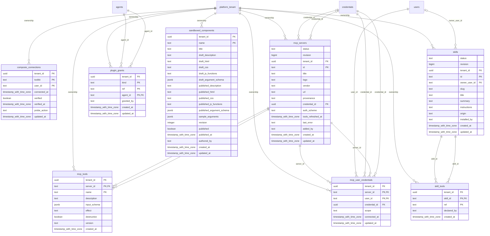

# foundation-plugins

Generated from Drizzle. External entities in the diagram are foreign-key targets owned by another module.

## composio_connections

Kết nối Composio đã thiết lập, trạng thái và tham chiếu tài khoản/credential liên quan.

Tenant RLS: **enabled + forced by integrity migrations 0047/0049/0052**.

| Column | PostgreSQL type | Required | Default | Declared values |
|---|---|---|---|---|
| `tenant_id` | `uuid` | yes | `nullif(current_setting('app.tenant_id', true), '')::uuid` | — |
| `toolkit` | `text` | yes | `—` | — |
| `user_id` | `text` | yes | `—` | — |
| `connected_at` | `timestamp with time zone` | yes | `now()` | — |
| `verified` | `boolean` | yes | `false` | — |
| `verified_at` | `timestamp with time zone` | no | `—` | — |
| `probe_action` | `text` | no | `—` | — |
| `updated_at` | `timestamp with time zone` | yes | `now()` | — |

Primary key: `toolkit`, `user_id`.

Unique keys:

- `composio_connections_tenant_pk`: (`tenant_id`, `toolkit`, `user_id`).

Foreign keys:

- (`tenant_id`) → `platform_tenant` (`id`); ON DELETE `restrict`.

Indexes:

- `composio_connections_user_idx`: (`user_id`).

Cross-row rules and application responsibilities: [database design](../01_DATABASE_ERD_IMPLEMENTATION_COMPLETE.md) and [system flow](../02_BUSINESS_ANALYSIS_IMPLEMENTATION.md).

## mcp_servers

Kết nối MCP duy nhất theo tenant; giữ endpoint, provider và tham chiếu credential.

Tenant RLS: **enabled + forced by integrity migrations 0047/0049/0052**.

| Column | PostgreSQL type | Required | Default | Declared values |
|---|---|---|---|---|
| `status` | `text` | yes | `ACTIVE` | — |
| `revision` | `bigint` | yes | `1` | — |
| `tenant_id` | `uuid` | yes | `nullif(current_setting('app.tenant_id', true), '')::uuid` | — |
| `id` | `text` | yes | `—` | — |
| `title` | `text` | yes | `—` | — |
| `logo` | `text` | no | `—` | — |
| `vendor` | `text` | yes | `—` | — |
| `url` | `text` | yes | `—` | — |
| `provenance` | `text` | yes | `first-party` | — |
| `credential_id` | `uuid` | no | `—` | — |
| `auth_scheme` | `text` | no | `—` | — |
| `tools_refreshed_at` | `timestamp with time zone` | no | `—` | — |
| `last_error` | `text` | no | `—` | — |
| `added_by` | `text` | no | `—` | — |
| `created_at` | `timestamp with time zone` | yes | `now()` | — |
| `updated_at` | `timestamp with time zone` | yes | `now()` | — |

Primary key: `id`.

Unique keys:

- `mcp_servers_tenant_id_key`: (`tenant_id`, `id`).

Foreign keys:

- (`tenant_id`) → `platform_tenant` (`id`); ON DELETE `restrict`.
- (`credential_id`) → `credentials` (`id`); ON DELETE `restrict`.
- (`tenant_id`, `credential_id`) → `credentials` (`tenant_id`, `id`); ON DELETE `restrict`.

Checks:

- `mcp_servers_status_ck`: `status IN ('ACTIVE','SUSPENDED','RETIRED')`.
- `mcp_servers_revision_ck`: `revision > 0`.

Cross-row rules and application responsibilities: [database design](../01_DATABASE_ERD_IMPLEMENTATION_COMPLETE.md) and [system flow](../02_BUSINESS_ANALYSIS_IMPLEMENTATION.md).

## mcp_tools

Cache công cụ do MCP server quảng bá; có thể làm mới. Không phải lịch sử phiên bản hoặc bằng chứng được phép gọi.

Tenant RLS: **enabled + forced by integrity migrations 0047/0049/0052**.

| Column | PostgreSQL type | Required | Default | Declared values |
|---|---|---|---|---|
| `tenant_id` | `uuid` | yes | `nullif(current_setting('app.tenant_id', true), '')::uuid` | — |
| `server_id` | `text` | yes | `—` | — |
| `name` | `text` | yes | `—` | — |
| `description` | `text` | yes | `` | — |
| `input_schema` | `jsonb` | yes | `{}` | — |
| `effect` | `text` | no | `—` | — |
| `destructive` | `boolean` | yes | `false` | — |
| `version` | `text` | no | `—` | — |
| `created_at` | `timestamp with time zone` | yes | `now()` | — |

Primary key: `server_id`, `name`.

Unique keys:

- `mcp_tools_tenant_pk`: (`tenant_id`, `server_id`, `name`).

Foreign keys:

- (`tenant_id`) → `platform_tenant` (`id`); ON DELETE `restrict`.
- (`server_id`) → `mcp_servers` (`id`); ON DELETE `cascade`.
- (`tenant_id`, `server_id`) → `mcp_servers` (`tenant_id`, `id`); ON DELETE `restrict`.

Cross-row rules and application responsibilities: [database design](../01_DATABASE_ERD_IMPLEMENTATION_COMPLETE.md) and [system flow](../02_BUSINESS_ANALYSIS_IMPLEMENTATION.md).

## mcp_user_credentials

Liên kết người dùng/MCP server/credential cho truy cập thay mặt từng người.

Tenant RLS: **enabled + forced by integrity migrations 0047/0049/0052**.

| Column | PostgreSQL type | Required | Default | Declared values |
|---|---|---|---|---|
| `tenant_id` | `uuid` | yes | `nullif(current_setting('app.tenant_id', true), '')::uuid` | — |
| `server_id` | `text` | yes | `—` | — |
| `user_id` | `text` | yes | `—` | — |
| `credential_id` | `uuid` | yes | `—` | — |
| `scope` | `text` | yes | `—` | — |
| `connected_at` | `timestamp with time zone` | yes | `now()` | — |
| `updated_at` | `timestamp with time zone` | yes | `now()` | — |

Primary key: `server_id`, `user_id`.

Unique keys:

- `mcp_user_credentials_tenant_pk`: (`tenant_id`, `server_id`, `user_id`).

Foreign keys:

- (`tenant_id`) → `platform_tenant` (`id`); ON DELETE `restrict`.
- (`server_id`) → `mcp_servers` (`id`); ON DELETE `cascade`.
- (`user_id`) → `users` (`id`); ON DELETE `cascade`.
- (`credential_id`) → `credentials` (`id`); ON DELETE `no action`.
- (`tenant_id`, `server_id`) → `mcp_servers` (`tenant_id`, `id`); ON DELETE `restrict`.
- (`tenant_id`, `credential_id`) → `credentials` (`tenant_id`, `id`); ON DELETE `restrict`.

Indexes:

- `mcp_user_credentials_user_idx`: (`user_id`).

Cross-row rules and application responsibilities: [database design](../01_DATABASE_ERD_IMPLEMENTATION_COMPLETE.md) and [system flow](../02_BUSINESS_ANALYSIS_IMPLEMENTATION.md).

## plugin_grants

Các grant sử dụng plugin/resource trong ứng dụng theo ownership upstream.

Tenant RLS: **enabled + forced by integrity migrations 0047/0049/0052**.

| Column | PostgreSQL type | Required | Default | Declared values |
|---|---|---|---|---|
| `tenant_id` | `uuid` | yes | `nullif(current_setting('app.tenant_id', true), '')::uuid` | — |
| `kind` | `text` | yes | `—` | — |
| `ref` | `text` | yes | `—` | — |
| `agent_id` | `text` | yes | `—` | — |
| `granted_by` | `text` | no | `—` | — |
| `created_at` | `timestamp with time zone` | yes | `now()` | — |
| `updated_at` | `timestamp with time zone` | yes | `now()` | — |

Primary key: `kind`, `ref`, `agent_id`.

Unique keys:

- `plugin_grants_tenant_pk`: (`tenant_id`, `kind`, `ref`, `agent_id`).

Foreign keys:

- (`tenant_id`) → `platform_tenant` (`id`); ON DELETE `restrict`.
- (`agent_id`) → `agents` (`id`); ON DELETE `cascade`.
- (`tenant_id`, `agent_id`) → `agents` (`tenant_id`, `id`); ON DELETE `restrict`.

Indexes:

- `plugin_grants_agent_idx`: (`agent_id`).

Cross-row rules and application responsibilities: [database design](../01_DATABASE_ERD_IMPLEMENTATION_COMPLETE.md) and [system flow](../02_BUSINESS_ANALYSIS_IMPLEMENTATION.md).

## sandboxed_components

Component thực thi trong sandbox cùng cấu hình và metadata an toàn.

Tenant RLS: **enabled + forced by integrity migrations 0047/0049/0052**.

| Column | PostgreSQL type | Required | Default | Declared values |
|---|---|---|---|---|
| `tenant_id` | `uuid` | yes | `nullif(current_setting('app.tenant_id', true), '')::uuid` | — |
| `name` | `text` | yes | `—` | — |
| `title` | `text` | yes | `—` | — |
| `draft_description` | `text` | yes | `` | — |
| `draft_html` | `text` | yes | `` | — |
| `draft_css` | `text` | yes | `` | — |
| `draft_js_functions` | `text` | yes | `` | — |
| `draft_argument_schema` | `jsonb` | yes | `{}` | — |
| `published_description` | `text` | no | `—` | — |
| `published_html` | `text` | no | `—` | — |
| `published_css` | `text` | no | `—` | — |
| `published_js_functions` | `text` | no | `—` | — |
| `published_argument_schema` | `jsonb` | no | `—` | — |
| `sample_arguments` | `jsonb` | yes | `{}` | — |
| `revision` | `integer` | yes | `0` | — |
| `published` | `boolean` | yes | `false` | — |
| `published_at` | `timestamp with time zone` | no | `—` | — |
| `authored_by` | `text` | no | `—` | — |
| `created_at` | `timestamp with time zone` | yes | `now()` | — |
| `updated_at` | `timestamp with time zone` | yes | `now()` | — |

Primary key: `name`.

Unique keys:

- `sandboxed_components_tenant_pk`: (`tenant_id`, `name`).

Foreign keys:

- (`tenant_id`) → `platform_tenant` (`id`); ON DELETE `restrict`.

Cross-row rules and application responsibilities: [database design](../01_DATABASE_ERD_IMPLEMENTATION_COMPLETE.md) and [system flow](../02_BUSINESS_ANALYSIS_IMPLEMENTATION.md).

## skill_tools

Ánh xạ skill của nền sản phẩm sang tool mà skill cung cấp.

Tenant RLS: **enabled + forced by integrity migrations 0047/0049/0052**.

| Column | PostgreSQL type | Required | Default | Declared values |
|---|---|---|---|---|
| `tenant_id` | `uuid` | yes | `nullif(current_setting('app.tenant_id', true), '')::uuid` | — |
| `skill_id` | `text` | yes | `—` | — |
| `ref` | `text` | yes | `—` | — |
| `declared_by` | `text` | no | `—` | — |
| `created_at` | `timestamp with time zone` | yes | `now()` | — |

Primary key: `skill_id`, `ref`.

Unique keys:

- `skill_tools_tenant_pk`: (`tenant_id`, `skill_id`, `ref`).

Foreign keys:

- (`tenant_id`) → `platform_tenant` (`id`); ON DELETE `restrict`.
- (`skill_id`) → `skills` (`id`); ON DELETE `cascade`.
- (`tenant_id`, `skill_id`) → `skills` (`tenant_id`, `id`); ON DELETE `restrict`.

Indexes:

- `skill_tools_ref_idx`: (`ref`).

Cross-row rules and application responsibilities: [database design](../01_DATABASE_ERD_IMPLEMENTATION_COMPLETE.md) and [system flow](../02_BUSINESS_ANALYSIS_IMPLEMENTATION.md).

## skills

Skill chuẩn của sản phẩm: chủ sở hữu, nội dung nháp và tên lệnh; lịch sử bất biến ở platform_skill_version.

Tenant RLS: **enabled + forced by integrity migrations 0047/0049/0052**.

| Column | PostgreSQL type | Required | Default | Declared values |
|---|---|---|---|---|
| `status` | `text` | yes | `ACTIVE` | — |
| `revision` | `bigint` | yes | `1` | — |
| `tenant_id` | `uuid` | yes | `nullif(current_setting('app.tenant_id', true), '')::uuid` | — |
| `id` | `text` | yes | `—` | — |
| `owner_user_id` | `text` | no | `—` | — |
| `slug` | `text` | yes | `—` | — |
| `title` | `text` | yes | `—` | — |
| `summary` | `text` | yes | `—` | — |
| `instructions` | `text` | yes | `—` | — |
| `origin` | `text` | yes | `yours` | — |
| `installed_by` | `text` | no | `—` | — |
| `created_at` | `timestamp with time zone` | yes | `now()` | — |
| `updated_at` | `timestamp with time zone` | yes | `now()` | — |

Primary key: `id`.

Unique keys:

- `skills_tenant_id_key`: (`tenant_id`, `id`).

Foreign keys:

- (`tenant_id`) → `platform_tenant` (`id`); ON DELETE `restrict`.
- (`owner_user_id`) → `users` (`id`); ON DELETE `cascade`.

Indexes:

- `skills_slug_key` UNIQUE: (`tenant_id`, `slug`).
- `skills_owner_idx`: (`owner_user_id`).

Checks:

- `skills_status_ck`: `status IN ('ACTIVE','SUSPENDED','RETIRED')`.
- `skills_revision_ck`: `revision > 0`.

Cross-row rules and application responsibilities: [database design](../01_DATABASE_ERD_IMPLEMENTATION_COMPLETE.md) and [system flow](../02_BUSINESS_ANALYSIS_IMPLEMENTATION.md).
