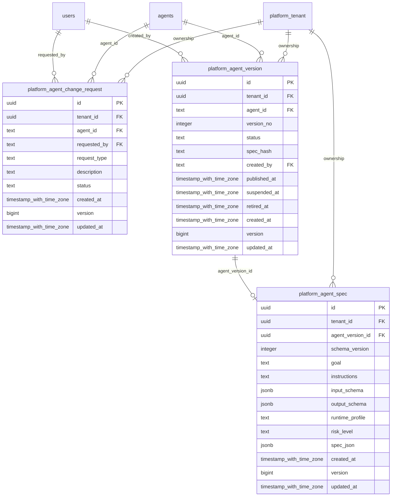

# platform-agents

Generated from Drizzle. External entities in the diagram are foreign-key targets owned by another module.

## platform_agent_change_request

Yêu cầu thay đổi agent để theo dõi đề nghị, người yêu cầu và kết quả xử lý.

Tenant RLS: **enabled + forced by integrity migrations 0047/0049/0052**.

| Column | PostgreSQL type | Required | Default | Declared values |
|---|---|---|---|---|
| `id` | `uuid` | yes | `gen_random_uuid()` | — |
| `tenant_id` | `uuid` | yes | `—` | — |
| `agent_id` | `text` | yes | `—` | — |
| `requested_by` | `text` | yes | `—` | — |
| `request_type` | `text` | yes | `—` | — |
| `description` | `text` | yes | `—` | — |
| `status` | `text` | yes | `—` | `OPEN`, `ACCEPTED`, `REJECTED`, `IMPLEMENTED` |
| `created_at` | `timestamp with time zone` | yes | `now()` | — |
| `version` | `bigint` | yes | `1` | — |
| `updated_at` | `timestamp with time zone` | yes | `now()` | — |

Primary key: `id`.

Unique keys:

- `platform_agent_change_request_uq_0`: (`tenant_id`, `id`).

Foreign keys:

- (`tenant_id`) → `platform_tenant` (`id`); ON DELETE `restrict`.
- (`tenant_id`, `agent_id`) → `agents` (`tenant_id`, `id`); ON DELETE `restrict`.
- (`requested_by`) → `users` (`id`); ON DELETE `restrict`.

Indexes:

- `platform_agent_change_request_ix_0`: (`tenant_id`, `agent_id`).
- `platform_agent_change_request_ix_1`: (`requested_by`).

Checks:

- `platform_agent_change_request_status_ck`: `"platform_agent_change_request"."status" in ('OPEN', 'ACCEPTED', 'REJECTED', 'IMPLEMENTED')`.
- `platform_agent_change_request_ck_0`: `version > 0`.

Cross-row rules and application responsibilities: [database design](../01_DATABASE_ERD_IMPLEMENTATION_COMPLETE.md) and [system flow](../02_BUSINESS_ANALYSIS_IMPLEMENTATION.md).

## platform_agent_spec

Mục tiêu, hướng dẫn, input/output schema và cấu hình hành vi của đúng một AgentVersion.

Tenant RLS: **enabled + forced by integrity migrations 0047/0049/0052**.

| Column | PostgreSQL type | Required | Default | Declared values |
|---|---|---|---|---|
| `id` | `uuid` | yes | `gen_random_uuid()` | — |
| `tenant_id` | `uuid` | yes | `—` | — |
| `agent_version_id` | `uuid` | yes | `—` | — |
| `schema_version` | `integer` | yes | `—` | — |
| `goal` | `text` | yes | `—` | — |
| `instructions` | `text` | yes | `—` | — |
| `input_schema` | `jsonb` | yes | `—` | — |
| `output_schema` | `jsonb` | yes | `—` | — |
| `runtime_profile` | `text` | yes | `—` | — |
| `risk_level` | `text` | yes | `—` | `LOW`, `MEDIUM`, `HIGH`, `CRITICAL` |
| `spec_json` | `jsonb` | yes | `—` | — |
| `created_at` | `timestamp with time zone` | yes | `now()` | — |
| `version` | `bigint` | yes | `1` | — |
| `updated_at` | `timestamp with time zone` | yes | `now()` | — |

Primary key: `id`.

Unique keys:

- `platform_agent_spec_uq_0`: (`tenant_id`, `agent_version_id`).
- `platform_agent_spec_uq_1`: (`tenant_id`, `id`).

Foreign keys:

- (`tenant_id`) → `platform_tenant` (`id`); ON DELETE `restrict`.
- (`tenant_id`, `agent_version_id`) → `platform_agent_version` (`tenant_id`, `id`); ON DELETE `restrict`.

Checks:

- `platform_agent_spec_risk_level_ck`: `"platform_agent_spec"."risk_level" in ('LOW', 'MEDIUM', 'HIGH', 'CRITICAL')`.
- `platform_agent_spec_ck_0`: `schema_version > 0`.
- `platform_agent_spec_ck_1`: `version > 0`.

Cross-row rules and application responsibilities: [database design](../01_DATABASE_ERD_IMPLEMENTATION_COMPLETE.md) and [system flow](../02_BUSINESS_ANALYSIS_IMPLEMENTATION.md).

## platform_agent_version

Một phiên bản agent có spec hash và lifecycle đánh giá/publish/suspend/retire.

Tenant RLS: **enabled + forced by integrity migrations 0047/0049/0052**.

| Column | PostgreSQL type | Required | Default | Declared values |
|---|---|---|---|---|
| `id` | `uuid` | yes | `gen_random_uuid()` | — |
| `tenant_id` | `uuid` | yes | `—` | — |
| `agent_id` | `text` | yes | `—` | — |
| `version_no` | `integer` | yes | `—` | — |
| `status` | `text` | yes | `—` | `DRAFT`, `NEEDS_INPUT`, `READY_FOR_EVAL`, `EVALUATING`, `READY_FOR_REVIEW`, `READY_FOR_PUBLISH`, `PUBLISHED`, `SUSPENDED`, `RETIRED` |
| `spec_hash` | `text` | yes | `—` | — |
| `created_by` | `text` | yes | `—` | — |
| `published_at` | `timestamp with time zone` | no | `—` | — |
| `suspended_at` | `timestamp with time zone` | no | `—` | — |
| `retired_at` | `timestamp with time zone` | no | `—` | — |
| `created_at` | `timestamp with time zone` | yes | `now()` | — |
| `version` | `bigint` | yes | `1` | — |
| `updated_at` | `timestamp with time zone` | yes | `now()` | — |

Primary key: `id`.

Unique keys:

- `platform_agent_version_uq_0`: (`tenant_id`, `agent_id`, `version_no`).
- `platform_agent_version_uq_1`: (`tenant_id`, `id`).
- `platform_agent_version_uq_2`: (`tenant_id`, `agent_id`, `id`).

Foreign keys:

- (`tenant_id`) → `platform_tenant` (`id`); ON DELETE `restrict`.
- (`tenant_id`, `agent_id`) → `agents` (`tenant_id`, `id`); ON DELETE `restrict`.
- (`created_by`) → `users` (`id`); ON DELETE `restrict`.

Indexes:

- `platform_agent_version_ix_0`: (`created_by`).
- `platform_agent_version_ix_1`: (`tenant_id`, `agent_id`).

Checks:

- `platform_agent_version_status_ck`: `"platform_agent_version"."status" in ('DRAFT', 'NEEDS_INPUT', 'READY_FOR_EVAL', 'EVALUATING', 'READY_FOR_REVIEW', 'READY_FOR_PUBLISH', 'PUBLISHED', 'SUSPENDED', 'RETIRED')`.
- `platform_agent_version_ck_0`: `version_no > 0`.
- `platform_agent_version_ck_1`: `version > 0`.

Cross-row rules and application responsibilities: [database design](../01_DATABASE_ERD_IMPLEMENTATION_COMPLETE.md) and [system flow](../02_BUSINESS_ANALYSIS_IMPLEMENTATION.md).
