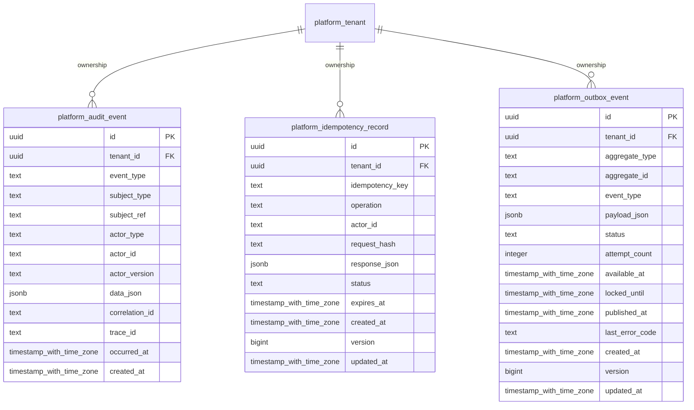

# platform-audit

Generated from Drizzle. External entities in the diagram are foreign-key targets owned by another module.

## platform_audit_event

Audit append-only của quản trị/runtime platform, có actor/correlation/trace.

Tenant RLS: **enabled + forced by integrity migrations 0047/0049**.

| Column | PostgreSQL type | Required | Default | Declared values |
|---|---|---|---|---|
| `id` | `uuid` | yes | `gen_random_uuid()` | — |
| `tenant_id` | `uuid` | yes | `—` | — |
| `event_type` | `text` | yes | `—` | — |
| `subject_type` | `text` | yes | `—` | — |
| `subject_ref` | `text` | yes | `—` | — |
| `actor_type` | `text` | yes | `—` | `HUMAN`, `SYSTEM`, `AUTOMATION`, `AGENT`, `EXTERNAL_SERVICE` |
| `actor_id` | `text` | yes | `—` | — |
| `actor_version` | `text` | no | `—` | — |
| `data_json` | `jsonb` | yes | `—` | — |
| `correlation_id` | `text` | yes | `—` | — |
| `trace_id` | `text` | yes | `—` | — |
| `occurred_at` | `timestamp with time zone` | yes | `—` | — |
| `created_at` | `timestamp with time zone` | yes | `now()` | — |

Primary key: `id`.

Unique keys:

- `platform_audit_event_uq_0`: (`tenant_id`, `id`).

Foreign keys:

- (`tenant_id`) → `platform_tenant` (`id`); ON DELETE `restrict`.

Indexes:

- `platform_audit_event_ix_0`: (`tenant_id`, `subject_type`, `subject_ref`, `occurred_at`).

Checks:

- `platform_audit_event_actor_type_ck`: `"platform_audit_event"."actor_type" in ('HUMAN', 'SYSTEM', 'AUTOMATION', 'AGENT', 'EXTERNAL_SERVICE')`.

Additional cross-row/temporal rules: [integrity matrix](../DATABASE_DESIGN.md#integrity-matrix) and [coordination review](../COMPLETENESS_REVIEW.md).

## platform_idempotency_record

Chống lặp command platform bằng tenant/key/request hash và response đã lưu.

Tenant RLS: **enabled + forced by integrity migrations 0047/0049**.

| Column | PostgreSQL type | Required | Default | Declared values |
|---|---|---|---|---|
| `id` | `uuid` | yes | `gen_random_uuid()` | — |
| `tenant_id` | `uuid` | yes | `—` | — |
| `idempotency_key` | `text` | yes | `—` | — |
| `operation` | `text` | yes | `—` | — |
| `actor_id` | `text` | yes | `—` | — |
| `request_hash` | `text` | yes | `—` | — |
| `response_json` | `jsonb` | no | `—` | — |
| `status` | `text` | yes | `—` | `IN_PROGRESS`, `SUCCEEDED`, `FAILED` |
| `expires_at` | `timestamp with time zone` | yes | `—` | — |
| `created_at` | `timestamp with time zone` | yes | `now()` | — |
| `version` | `bigint` | yes | `1` | — |
| `updated_at` | `timestamp with time zone` | yes | `now()` | — |

Primary key: `id`.

Unique keys:

- `platform_idempotency_record_uq_0`: (`tenant_id`, `idempotency_key`).
- `platform_idempotency_record_uq_1`: (`tenant_id`, `id`).

Foreign keys:

- (`tenant_id`) → `platform_tenant` (`id`); ON DELETE `restrict`.

Checks:

- `platform_idempotency_record_status_ck`: `"platform_idempotency_record"."status" in ('IN_PROGRESS', 'SUCCEEDED', 'FAILED')`.
- `platform_idempotency_record_ck_0`: `version > 0`.

Additional cross-row/temporal rules: [integrity matrix](../DATABASE_DESIGN.md#integrity-matrix) and [coordination review](../COMPLETENESS_REVIEW.md).

## platform_outbox_event

Sự kiện platform chờ phát ra ngoài transaction, kèm retry và lease metadata.

Tenant RLS: **enabled + forced by integrity migrations 0047/0049**.

| Column | PostgreSQL type | Required | Default | Declared values |
|---|---|---|---|---|
| `id` | `uuid` | yes | `gen_random_uuid()` | — |
| `tenant_id` | `uuid` | yes | `—` | — |
| `aggregate_type` | `text` | yes | `—` | — |
| `aggregate_id` | `text` | yes | `—` | — |
| `event_type` | `text` | yes | `—` | — |
| `payload_json` | `jsonb` | yes | `—` | — |
| `status` | `text` | yes | `—` | `PENDING`, `PROCESSING`, `PUBLISHED`, `FAILED` |
| `attempt_count` | `integer` | yes | `—` | — |
| `available_at` | `timestamp with time zone` | yes | `—` | — |
| `locked_until` | `timestamp with time zone` | no | `—` | — |
| `published_at` | `timestamp with time zone` | no | `—` | — |
| `last_error_code` | `text` | no | `—` | — |
| `created_at` | `timestamp with time zone` | yes | `now()` | — |
| `version` | `bigint` | yes | `1` | — |
| `updated_at` | `timestamp with time zone` | yes | `now()` | — |

Primary key: `id`.

Unique keys:

- `platform_outbox_event_uq_0`: (`tenant_id`, `id`).

Foreign keys:

- (`tenant_id`) → `platform_tenant` (`id`); ON DELETE `restrict`.

Indexes:

- `platform_outbox_event_ix_0`: (`tenant_id`, `status`, `available_at`).

Checks:

- `platform_outbox_event_status_ck`: `"platform_outbox_event"."status" in ('PENDING', 'PROCESSING', 'PUBLISHED', 'FAILED')`.
- `platform_outbox_event_ck_0`: `attempt_count >= 0`.
- `platform_outbox_event_ck_1`: `version > 0`.

Additional cross-row/temporal rules: [integrity matrix](../DATABASE_DESIGN.md#integrity-matrix) and [coordination review](../COMPLETENESS_REVIEW.md).
