# platform-bindings

Generated from Drizzle. External entities in the diagram are foreign-key targets owned by another module.

```mermaid
erDiagram
  platform_agent_capability_binding {
    uuid tenant_id PK, FK
    uuid agent_version_id PK, FK
    uuid capability_id PK, FK
    jsonb scope_json
    jsonb constraints_json
    timestamp_with_time_zone created_at
  }
  platform_tenant ||--o{ platform_agent_capability_binding : "ownership"
  platform_agent_version ||--o{ platform_agent_capability_binding : "agent_version_id"
  platform_capability ||--o{ platform_agent_capability_binding : "capability_id"
  platform_agent_knowledge_binding {
    uuid tenant_id PK, FK
    uuid agent_version_id PK, FK
    uuid knowledge_base_id PK, FK
    jsonb scope_json
    jsonb retrieval_policy_json
    timestamp_with_time_zone created_at
  }
  platform_tenant ||--o{ platform_agent_knowledge_binding : "ownership"
  platform_agent_version ||--o{ platform_agent_knowledge_binding : "agent_version_id"
  platform_knowledge_base ||--o{ platform_agent_knowledge_binding : "knowledge_base_id"
  platform_agent_model_binding {
    uuid tenant_id PK, FK
    uuid agent_version_id PK, FK
    uuid model_profile_id FK
    jsonb constraints_json
    timestamp_with_time_zone created_at
  }
  platform_tenant ||--o{ platform_agent_model_binding : "ownership"
  platform_agent_version ||--o| platform_agent_model_binding : "agent_version_id"
  platform_model_profile ||--o{ platform_agent_model_binding : "model_profile_id"
  platform_agent_policy_binding {
    uuid tenant_id PK, FK
    uuid agent_version_id PK, FK
    uuid policy_version_id PK, FK
    text phase PK
    jsonb config_json
    timestamp_with_time_zone created_at
  }
  platform_tenant ||--o{ platform_agent_policy_binding : "ownership"
  platform_agent_version ||--o{ platform_agent_policy_binding : "agent_version_id"
  platform_policy_version ||--o{ platform_agent_policy_binding : "policy_version_id"
  platform_agent_skill_binding {
    uuid tenant_id PK, FK
    uuid agent_version_id PK, FK
    uuid skill_version_id PK, FK
    jsonb config_json
    timestamp_with_time_zone created_at
  }
  platform_tenant ||--o{ platform_agent_skill_binding : "ownership"
  platform_agent_version ||--o{ platform_agent_skill_binding : "agent_version_id"
  platform_skill_version ||--o{ platform_agent_skill_binding : "skill_version_id"
  platform_agent_tool_binding {
    uuid tenant_id PK, FK
    uuid agent_version_id PK, FK
    uuid tool_version_id PK, FK
    jsonb allowed_scope
    jsonb constraints_json
    text approval_policy_ref
    timestamp_with_time_zone created_at
  }
  platform_tenant ||--o{ platform_agent_tool_binding : "ownership"
  platform_agent_version ||--o{ platform_agent_tool_binding : "agent_version_id"
  platform_tool_version ||--o{ platform_agent_tool_binding : "tool_version_id"
```

## platform_agent_capability_binding

Năng lực và giới hạn scope được cấp cho một AgentVersion.

Tenant RLS: **enabled + forced by integrity migrations 0047/0049**.

| Column | PostgreSQL type | Required | Default | Declared values |
|---|---|---|---|---|
| `tenant_id` | `uuid` | yes | `—` | — |
| `agent_version_id` | `uuid` | yes | `—` | — |
| `capability_id` | `uuid` | yes | `—` | — |
| `scope_json` | `jsonb` | yes | `—` | — |
| `constraints_json` | `jsonb` | yes | `—` | — |
| `created_at` | `timestamp with time zone` | yes | `now()` | — |

Primary key: `tenant_id`, `agent_version_id`, `capability_id`.

Foreign keys:

- (`tenant_id`) → `platform_tenant` (`id`); ON DELETE `restrict`.
- (`tenant_id`, `agent_version_id`) → `platform_agent_version` (`tenant_id`, `id`); ON DELETE `restrict`.
- (`tenant_id`, `capability_id`) → `platform_capability` (`tenant_id`, `id`); ON DELETE `restrict`.

Indexes:

- `platform_agent_capability_binding_ix_0`: (`tenant_id`, `agent_version_id`).
- `platform_agent_capability_binding_ix_1`: (`tenant_id`, `capability_id`).

Additional cross-row/temporal rules: [integrity matrix](../DATABASE_DESIGN.md#integrity-matrix) and [coordination review](../COMPLETENESS_REVIEW.md).

## platform_agent_knowledge_binding

Knowledge base và retrieval policy mà AgentVersion được truy cập.

Tenant RLS: **enabled + forced by integrity migrations 0047/0049**.

| Column | PostgreSQL type | Required | Default | Declared values |
|---|---|---|---|---|
| `tenant_id` | `uuid` | yes | `—` | — |
| `agent_version_id` | `uuid` | yes | `—` | — |
| `knowledge_base_id` | `uuid` | yes | `—` | — |
| `scope_json` | `jsonb` | yes | `—` | — |
| `retrieval_policy_json` | `jsonb` | yes | `—` | — |
| `created_at` | `timestamp with time zone` | yes | `now()` | — |

Primary key: `tenant_id`, `agent_version_id`, `knowledge_base_id`.

Foreign keys:

- (`tenant_id`) → `platform_tenant` (`id`); ON DELETE `restrict`.
- (`tenant_id`, `agent_version_id`) → `platform_agent_version` (`tenant_id`, `id`); ON DELETE `restrict`.
- (`tenant_id`, `knowledge_base_id`) → `platform_knowledge_base` (`tenant_id`, `id`); ON DELETE `restrict`.

Indexes:

- `platform_agent_knowledge_binding_ix_0`: (`tenant_id`, `agent_version_id`).
- `platform_agent_knowledge_binding_ix_1`: (`tenant_id`, `knowledge_base_id`).

Additional cross-row/temporal rules: [integrity matrix](../DATABASE_DESIGN.md#integrity-matrix) and [coordination review](../COMPLETENESS_REVIEW.md).

## platform_agent_model_binding

Model profile và constraints mà AgentVersion dùng để thực thi.

Tenant RLS: **enabled + forced by integrity migrations 0047/0049**.

| Column | PostgreSQL type | Required | Default | Declared values |
|---|---|---|---|---|
| `tenant_id` | `uuid` | yes | `—` | — |
| `agent_version_id` | `uuid` | yes | `—` | — |
| `model_profile_id` | `uuid` | yes | `—` | — |
| `constraints_json` | `jsonb` | yes | `—` | — |
| `created_at` | `timestamp with time zone` | yes | `now()` | — |

Primary key: `tenant_id`, `agent_version_id`.

Foreign keys:

- (`tenant_id`) → `platform_tenant` (`id`); ON DELETE `restrict`.
- (`tenant_id`, `agent_version_id`) → `platform_agent_version` (`tenant_id`, `id`); ON DELETE `restrict`.
- (`tenant_id`, `model_profile_id`) → `platform_model_profile` (`tenant_id`, `id`); ON DELETE `restrict`.

Indexes:

- `platform_agent_model_binding_ix_0`: (`tenant_id`, `model_profile_id`).

Additional cross-row/temporal rules: [integrity matrix](../DATABASE_DESIGN.md#integrity-matrix) and [coordination review](../COMPLETENESS_REVIEW.md).

## platform_agent_policy_binding

PolicyVersion áp dụng cho AgentVersion ở các pha trước/sau chạy tool hoặc đầu ra.

Tenant RLS: **enabled + forced by integrity migrations 0047/0049**.

| Column | PostgreSQL type | Required | Default | Declared values |
|---|---|---|---|---|
| `tenant_id` | `uuid` | yes | `—` | — |
| `agent_version_id` | `uuid` | yes | `—` | — |
| `policy_version_id` | `uuid` | yes | `—` | — |
| `phase` | `text` | yes | `—` | `PRE_RUN`, `PRE_TOOL`, `POST_TOOL`, `OUTPUT` |
| `config_json` | `jsonb` | yes | `—` | — |
| `created_at` | `timestamp with time zone` | yes | `now()` | — |

Primary key: `tenant_id`, `agent_version_id`, `policy_version_id`, `phase`.

Foreign keys:

- (`tenant_id`) → `platform_tenant` (`id`); ON DELETE `restrict`.
- (`tenant_id`, `agent_version_id`) → `platform_agent_version` (`tenant_id`, `id`); ON DELETE `restrict`.
- (`tenant_id`, `policy_version_id`) → `platform_policy_version` (`tenant_id`, `id`); ON DELETE `restrict`.

Indexes:

- `platform_agent_policy_binding_ix_0`: (`tenant_id`, `agent_version_id`).
- `platform_agent_policy_binding_ix_1`: (`tenant_id`, `policy_version_id`).

Checks:

- `platform_agent_policy_binding_phase_ck`: `"platform_agent_policy_binding"."phase" in ('PRE_RUN', 'PRE_TOOL', 'POST_TOOL', 'OUTPUT')`.

Additional cross-row/temporal rules: [integrity matrix](../DATABASE_DESIGN.md#integrity-matrix) and [coordination review](../COMPLETENESS_REVIEW.md).

## platform_agent_skill_binding

SkillVersion cụ thể và cấu hình được ghim trong AgentVersion.

Tenant RLS: **enabled + forced by integrity migrations 0047/0049**.

| Column | PostgreSQL type | Required | Default | Declared values |
|---|---|---|---|---|
| `tenant_id` | `uuid` | yes | `—` | — |
| `agent_version_id` | `uuid` | yes | `—` | — |
| `skill_version_id` | `uuid` | yes | `—` | — |
| `config_json` | `jsonb` | yes | `—` | — |
| `created_at` | `timestamp with time zone` | yes | `now()` | — |

Primary key: `tenant_id`, `agent_version_id`, `skill_version_id`.

Foreign keys:

- (`tenant_id`) → `platform_tenant` (`id`); ON DELETE `restrict`.
- (`tenant_id`, `agent_version_id`) → `platform_agent_version` (`tenant_id`, `id`); ON DELETE `restrict`.
- (`tenant_id`, `skill_version_id`) → `platform_skill_version` (`tenant_id`, `id`); ON DELETE `restrict`.

Indexes:

- `platform_agent_skill_binding_ix_0`: (`tenant_id`, `agent_version_id`).
- `platform_agent_skill_binding_ix_1`: (`tenant_id`, `skill_version_id`).

Additional cross-row/temporal rules: [integrity matrix](../DATABASE_DESIGN.md#integrity-matrix) and [coordination review](../COMPLETENESS_REVIEW.md).

## platform_agent_tool_binding

ToolVersion cụ thể được AgentVersion gọi, cùng phạm vi và chính sách approval.

Tenant RLS: **enabled + forced by integrity migrations 0047/0049**.

| Column | PostgreSQL type | Required | Default | Declared values |
|---|---|---|---|---|
| `tenant_id` | `uuid` | yes | `—` | — |
| `agent_version_id` | `uuid` | yes | `—` | — |
| `tool_version_id` | `uuid` | yes | `—` | — |
| `allowed_scope` | `jsonb` | yes | `—` | — |
| `constraints_json` | `jsonb` | yes | `—` | — |
| `approval_policy_ref` | `text` | no | `—` | — |
| `created_at` | `timestamp with time zone` | yes | `now()` | — |

Primary key: `tenant_id`, `agent_version_id`, `tool_version_id`.

Foreign keys:

- (`tenant_id`) → `platform_tenant` (`id`); ON DELETE `restrict`.
- (`tenant_id`, `agent_version_id`) → `platform_agent_version` (`tenant_id`, `id`); ON DELETE `restrict`.
- (`tenant_id`, `tool_version_id`) → `platform_tool_version` (`tenant_id`, `id`); ON DELETE `restrict`.

Indexes:

- `platform_agent_tool_binding_ix_0`: (`tenant_id`, `agent_version_id`).
- `platform_agent_tool_binding_ix_1`: (`tenant_id`, `tool_version_id`).

Additional cross-row/temporal rules: [integrity matrix](../DATABASE_DESIGN.md#integrity-matrix) and [coordination review](../COMPLETENESS_REVIEW.md).
