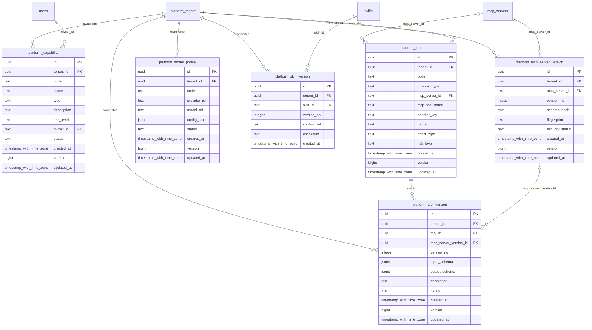

# platform-capabilities

Generated from Drizzle. External entities in the diagram are foreign-key targets owned by another module.

## platform_capability

Danh mục năng lực được quản trị trong tenant, kèm loại và mức rủi ro.

Tenant RLS: **enabled + forced by integrity migrations 0047/0049/0052**.

| Column | PostgreSQL type | Required | Default | Declared values |
|---|---|---|---|---|
| `id` | `uuid` | yes | `gen_random_uuid()` | — |
| `tenant_id` | `uuid` | yes | `—` | — |
| `code` | `text` | yes | `—` | — |
| `name` | `text` | yes | `—` | — |
| `type` | `text` | yes | `—` | — |
| `description` | `text` | no | `—` | — |
| `risk_level` | `text` | yes | `—` | `LOW`, `MEDIUM`, `HIGH`, `CRITICAL` |
| `owner_id` | `text` | yes | `—` | — |
| `status` | `text` | yes | `—` | `ACTIVE`, `SUSPENDED`, `RETIRED` |
| `created_at` | `timestamp with time zone` | yes | `now()` | — |
| `version` | `bigint` | yes | `1` | — |
| `updated_at` | `timestamp with time zone` | yes | `now()` | — |

Primary key: `id`.

Unique keys:

- `platform_capability_uq_0`: (`tenant_id`, `code`).
- `platform_capability_uq_1`: (`tenant_id`, `id`).

Foreign keys:

- (`tenant_id`) → `platform_tenant` (`id`); ON DELETE `restrict`.
- (`owner_id`) → `users` (`id`); ON DELETE `restrict`.

Indexes:

- `platform_capability_ix_0`: (`owner_id`).

Checks:

- `platform_capability_risk_level_ck`: `"platform_capability"."risk_level" in ('LOW', 'MEDIUM', 'HIGH', 'CRITICAL')`.
- `platform_capability_status_ck`: `"platform_capability"."status" in ('ACTIVE', 'SUSPENDED', 'RETIRED')`.
- `platform_capability_ck_0`: `version > 0`.

Cross-row rules and application responsibilities: [database design](../01_DATABASE_ERD_IMPLEMENTATION_COMPLETE.md) and [system flow](../02_BUSINESS_ANALYSIS_IMPLEMENTATION.md).

## platform_mcp_server_version

Snapshot schema/fingerprint của MCP server và trạng thái kiểm duyệt bảo mật.

Tenant RLS: **enabled + forced by integrity migrations 0047/0049/0052**.

| Column | PostgreSQL type | Required | Default | Declared values |
|---|---|---|---|---|
| `id` | `uuid` | yes | `gen_random_uuid()` | — |
| `tenant_id` | `uuid` | yes | `—` | — |
| `mcp_server_id` | `text` | yes | `—` | — |
| `version_no` | `integer` | yes | `—` | — |
| `schema_hash` | `text` | yes | `—` | — |
| `fingerprint` | `text` | yes | `—` | — |
| `security_status` | `text` | yes | `—` | `PENDING`, `APPROVED`, `REJECTED`, `REVOKED` |
| `created_at` | `timestamp with time zone` | yes | `now()` | — |
| `version` | `bigint` | yes | `1` | — |
| `updated_at` | `timestamp with time zone` | yes | `now()` | — |

Primary key: `id`.

Unique keys:

- `platform_mcp_server_version_uq_0`: (`tenant_id`, `mcp_server_id`, `version_no`).
- `platform_mcp_server_version_uq_1`: (`tenant_id`, `id`).

Foreign keys:

- (`tenant_id`) → `platform_tenant` (`id`); ON DELETE `restrict`.
- (`tenant_id`, `mcp_server_id`) → `mcp_servers` (`tenant_id`, `id`); ON DELETE `restrict`.

Indexes:

- `platform_mcp_server_version_ix_0`: (`tenant_id`, `mcp_server_id`).

Checks:

- `platform_mcp_server_version_security_status_ck`: `"platform_mcp_server_version"."security_status" in ('PENDING', 'APPROVED', 'REJECTED', 'REVOKED')`.
- `platform_mcp_server_version_ck_0`: `version_no > 0`.
- `platform_mcp_server_version_ck_1`: `version > 0`.

Cross-row rules and application responsibilities: [database design](../01_DATABASE_ERD_IMPLEMENTATION_COMPLETE.md) and [system flow](../02_BUSINESS_ANALYSIS_IMPLEMENTATION.md).

## platform_model_profile

Cấu hình model/provider được phép dùng, không chứa API key.

Tenant RLS: **enabled + forced by integrity migrations 0047/0049/0052**.

| Column | PostgreSQL type | Required | Default | Declared values |
|---|---|---|---|---|
| `id` | `uuid` | yes | `gen_random_uuid()` | — |
| `tenant_id` | `uuid` | yes | `—` | — |
| `code` | `text` | yes | `—` | — |
| `provider_ref` | `text` | yes | `—` | — |
| `model_ref` | `text` | yes | `—` | — |
| `config_json` | `jsonb` | yes | `—` | — |
| `status` | `text` | yes | `—` | `ACTIVE`, `SUSPENDED`, `RETIRED` |
| `created_at` | `timestamp with time zone` | yes | `now()` | — |
| `version` | `bigint` | yes | `1` | — |
| `updated_at` | `timestamp with time zone` | yes | `now()` | — |

Primary key: `id`.

Unique keys:

- `platform_model_profile_uq_0`: (`tenant_id`, `code`).
- `platform_model_profile_uq_1`: (`tenant_id`, `id`).

Foreign keys:

- (`tenant_id`) → `platform_tenant` (`id`); ON DELETE `restrict`.

Checks:

- `platform_model_profile_status_ck`: `"platform_model_profile"."status" in ('ACTIVE', 'SUSPENDED', 'RETIRED')`.
- `platform_model_profile_ck_0`: `version > 0`.

Cross-row rules and application responsibilities: [database design](../01_DATABASE_ERD_IMPLEMENTATION_COMPLETE.md) and [system flow](../02_BUSINESS_ANALYSIS_IMPLEMENTATION.md).

## platform_skill_version

Nội dung skill bất biến qua content reference và checksum.

Tenant RLS: **enabled + forced by integrity migrations 0047/0049/0052**.

| Column | PostgreSQL type | Required | Default | Declared values |
|---|---|---|---|---|
| `id` | `uuid` | yes | `gen_random_uuid()` | — |
| `tenant_id` | `uuid` | yes | `—` | — |
| `skill_id` | `text` | yes | `—` | — |
| `version_no` | `integer` | yes | `—` | — |
| `content_ref` | `text` | yes | `—` | — |
| `checksum` | `text` | yes | `—` | — |
| `created_at` | `timestamp with time zone` | yes | `now()` | — |

Primary key: `id`.

Unique keys:

- `platform_skill_version_uq_0`: (`tenant_id`, `skill_id`, `version_no`).
- `platform_skill_version_uq_1`: (`tenant_id`, `id`).

Foreign keys:

- (`tenant_id`) → `platform_tenant` (`id`); ON DELETE `restrict`.
- (`tenant_id`, `skill_id`) → `skills` (`tenant_id`, `id`); ON DELETE `restrict`.

Indexes:

- `platform_skill_version_ix_0`: (`tenant_id`, `skill_id`).

Checks:

- `platform_skill_version_ck_0`: `version_no > 0`.

Cross-row rules and application responsibilities: [database design](../01_DATABASE_ERD_IMPLEMENTATION_COMPLETE.md) and [system flow](../02_BUSINESS_ANALYSIS_IMPLEMENTATION.md).

## platform_tool

Định danh thao tác được quản trị: MCP gắn server+tên tool; DOMAIN/BUILTIN gắn handler. Một danh tính cho mỗi đích thực thi.

Tenant RLS: **enabled + forced by integrity migrations 0047/0049/0052**.

| Column | PostgreSQL type | Required | Default | Declared values |
|---|---|---|---|---|
| `id` | `uuid` | yes | `gen_random_uuid()` | — |
| `tenant_id` | `uuid` | yes | `—` | — |
| `code` | `text` | yes | `—` | — |
| `provider_type` | `text` | yes | `—` | `MCP`, `DOMAIN`, `BUILTIN` |
| `mcp_server_id` | `text` | no | `—` | — |
| `mcp_tool_name` | `text` | no | `—` | — |
| `handler_key` | `text` | no | `—` | — |
| `name` | `text` | yes | `—` | — |
| `effect_type` | `text` | yes | `—` | `READ`, `WRITE`, `EXTERNAL_SIDE_EFFECT` |
| `risk_level` | `text` | yes | `—` | `LOW`, `MEDIUM`, `HIGH`, `CRITICAL` |
| `created_at` | `timestamp with time zone` | yes | `now()` | — |
| `version` | `bigint` | yes | `1` | — |
| `updated_at` | `timestamp with time zone` | yes | `now()` | — |

Primary key: `id`.

Unique keys:

- `platform_tool_mcp_identity_key`: (`tenant_id`, `mcp_server_id`, `mcp_tool_name`).
- `platform_tool_handler_key`: (`tenant_id`, `provider_type`, `handler_key`).
- `platform_tool_uq_0`: (`tenant_id`, `code`).
- `platform_tool_uq_1`: (`tenant_id`, `id`).

Foreign keys:

- (`tenant_id`, `mcp_server_id`) → `mcp_servers` (`tenant_id`, `id`); ON DELETE `restrict`.
- (`tenant_id`) → `platform_tenant` (`id`); ON DELETE `restrict`.

Checks:

- `platform_tool_provider_ck`: `(provider_type = 'MCP' AND mcp_server_id IS NOT NULL AND mcp_tool_name IS NOT NULL AND handler_key IS NULL) OR (provider_type IN ('DOMAIN','BUILTIN') AND mcp_server_id IS NULL AND mcp_tool_name IS NULL AND handler_key IS NOT NULL)`.
- `platform_tool_effect_type_ck`: `"platform_tool"."effect_type" in ('READ', 'WRITE', 'EXTERNAL_SIDE_EFFECT')`.
- `platform_tool_risk_level_ck`: `"platform_tool"."risk_level" in ('LOW', 'MEDIUM', 'HIGH', 'CRITICAL')`.
- `platform_tool_ck_0`: `version > 0`.

Cross-row rules and application responsibilities: [database design](../01_DATABASE_ERD_IMPLEMENTATION_COMPLETE.md) and [system flow](../02_BUSINESS_ANALYSIS_IMPLEMENTATION.md).

## platform_tool_version

Phiên bản tool với input/output schema và fingerprint để agent ghim chính xác.

Tenant RLS: **enabled + forced by integrity migrations 0047/0049/0052**.

| Column | PostgreSQL type | Required | Default | Declared values |
|---|---|---|---|---|
| `id` | `uuid` | yes | `gen_random_uuid()` | — |
| `tenant_id` | `uuid` | yes | `—` | — |
| `tool_id` | `uuid` | yes | `—` | — |
| `mcp_server_version_id` | `uuid` | no | `—` | — |
| `version_no` | `integer` | yes | `—` | — |
| `input_schema` | `jsonb` | yes | `—` | — |
| `output_schema` | `jsonb` | yes | `—` | — |
| `fingerprint` | `text` | yes | `—` | — |
| `status` | `text` | yes | `—` | `DRAFT`, `APPROVED`, `REVOKED` |
| `created_at` | `timestamp with time zone` | yes | `now()` | — |
| `version` | `bigint` | yes | `1` | — |
| `updated_at` | `timestamp with time zone` | yes | `now()` | — |

Primary key: `id`.

Unique keys:

- `platform_tool_version_uq_0`: (`tenant_id`, `tool_id`, `version_no`).
- `platform_tool_version_uq_1`: (`tenant_id`, `id`).

Foreign keys:

- (`tenant_id`) → `platform_tenant` (`id`); ON DELETE `restrict`.
- (`tenant_id`, `tool_id`) → `platform_tool` (`tenant_id`, `id`); ON DELETE `restrict`.
- (`tenant_id`, `mcp_server_version_id`) → `platform_mcp_server_version` (`tenant_id`, `id`); ON DELETE `restrict`.

Indexes:

- `platform_tool_version_ix_0`: (`tenant_id`, `mcp_server_version_id`).
- `platform_tool_version_ix_1`: (`tenant_id`, `tool_id`).

Checks:

- `platform_tool_version_status_ck`: `"platform_tool_version"."status" in ('DRAFT', 'APPROVED', 'REVOKED')`.
- `platform_tool_version_ck_0`: `version_no > 0`.
- `platform_tool_version_ck_1`: `version > 0`.

Cross-row rules and application responsibilities: [database design](../01_DATABASE_ERD_IMPLEMENTATION_COMPLETE.md) and [system flow](../02_BUSINESS_ANALYSIS_IMPLEMENTATION.md).
