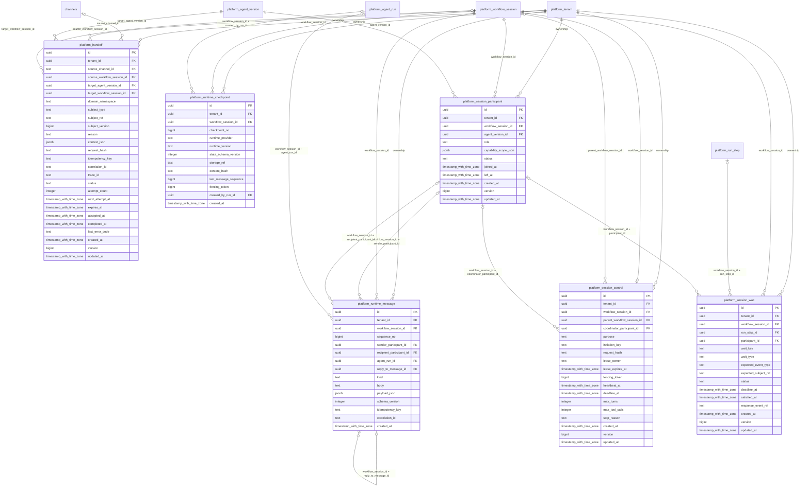

# platform-collaboration

Generated from Drizzle. External entities in the diagram are foreign-key targets owned by another module.

## platform_handoff

Bàn giao bền vững từ conversation/session tới agent đích và session nhận, có idempotency/hash/ack/retry/expiry.

Tenant RLS: **enabled + forced by integrity migrations 0047/0049/0052**.

| Column | PostgreSQL type | Required | Default | Declared values |
|---|---|---|---|---|
| `id` | `uuid` | yes | `gen_random_uuid()` | — |
| `tenant_id` | `uuid` | yes | `—` | — |
| `source_channel_id` | `text` | no | `—` | — |
| `source_workflow_session_id` | `uuid` | no | `—` | — |
| `target_agent_version_id` | `uuid` | yes | `—` | — |
| `target_workflow_session_id` | `uuid` | no | `—` | — |
| `domain_namespace` | `text` | yes | `—` | — |
| `subject_type` | `text` | yes | `—` | — |
| `subject_ref` | `text` | yes | `—` | — |
| `subject_version` | `bigint` | no | `—` | — |
| `reason` | `text` | yes | `—` | — |
| `context_json` | `jsonb` | yes | `—` | — |
| `request_hash` | `text` | yes | `—` | — |
| `idempotency_key` | `text` | yes | `—` | — |
| `correlation_id` | `text` | yes | `—` | — |
| `trace_id` | `text` | yes | `—` | — |
| `status` | `text` | yes | `—` | `OFFERED`, `ACCEPTED`, `COMPLETED`, `FAILED`, `EXPIRED`, `CANCELLED` |
| `attempt_count` | `integer` | yes | `—` | — |
| `next_attempt_at` | `timestamp with time zone` | yes | `—` | — |
| `expires_at` | `timestamp with time zone` | yes | `—` | — |
| `accepted_at` | `timestamp with time zone` | no | `—` | — |
| `completed_at` | `timestamp with time zone` | no | `—` | — |
| `last_error_code` | `text` | no | `—` | — |
| `created_at` | `timestamp with time zone` | yes | `now()` | — |
| `version` | `bigint` | yes | `1` | — |
| `updated_at` | `timestamp with time zone` | yes | `now()` | — |

Primary key: `id`.

Unique keys:

- `platform_handoff_uq_0`: (`tenant_id`, `idempotency_key`).
- `platform_handoff_uq_1`: (`tenant_id`, `id`).

Foreign keys:

- (`tenant_id`) → `platform_tenant` (`id`); ON DELETE `restrict`.
- (`tenant_id`, `source_channel_id`) → `channels` (`tenant_id`, `id`); ON DELETE `restrict`.
- (`tenant_id`, `source_workflow_session_id`) → `platform_workflow_session` (`tenant_id`, `id`); ON DELETE `restrict`.
- (`tenant_id`, `target_agent_version_id`) → `platform_agent_version` (`tenant_id`, `id`); ON DELETE `restrict`.
- (`tenant_id`, `target_workflow_session_id`) → `platform_workflow_session` (`tenant_id`, `id`); ON DELETE `restrict`.

Indexes:

- `platform_handoff_ix_1`: (`tenant_id`, `source_channel_id`).
- `platform_handoff_ready_ix`: (`tenant_id`, `status`, `next_attempt_at`).
- `platform_handoff_ix_2`: (`tenant_id`, `source_workflow_session_id`).
- `platform_handoff_ix_3`: (`tenant_id`, `target_agent_version_id`).
- `platform_handoff_ix_4`: (`tenant_id`, `target_workflow_session_id`).

Checks:

- `platform_handoff_status_ck`: `"platform_handoff"."status" in ('OFFERED', 'ACCEPTED', 'COMPLETED', 'FAILED', 'EXPIRED', 'CANCELLED')`.
- `platform_handoff_ck_0`: `num_nonnulls(source_channel_id, source_workflow_session_id) = 1`.
- `platform_handoff_ck_1`: `attempt_count >= 0`.
- `platform_handoff_ck_2`: `expires_at > created_at`.
- `platform_handoff_ck_3`: `status NOT IN ('ACCEPTED','COMPLETED') OR (target_workflow_session_id IS NOT NULL AND accepted_at IS NOT NULL)`.
- `platform_handoff_ck_4`: `status<>'COMPLETED' OR completed_at IS NOT NULL`.
- `platform_handoff_ck_5`: `version > 0`.

Cross-row rules and application responsibilities: [database design](../01_DATABASE_ERD_IMPLEMENTATION_COMPLETE.md) and [system flow](../02_BUSINESS_ANALYSIS_IMPLEMENTATION.md).

## platform_runtime_checkpoint

Mốc khôi phục bất biến của session gồm provider/version/schema/hash/object reference, cursor tin nhắn và fencing token.

Tenant RLS: **enabled + forced by integrity migrations 0047/0049/0052**.

| Column | PostgreSQL type | Required | Default | Declared values |
|---|---|---|---|---|
| `id` | `uuid` | yes | `gen_random_uuid()` | — |
| `tenant_id` | `uuid` | yes | `—` | — |
| `workflow_session_id` | `uuid` | yes | `—` | — |
| `checkpoint_no` | `bigint` | yes | `—` | — |
| `runtime_provider` | `text` | yes | `—` | — |
| `runtime_version` | `text` | yes | `—` | — |
| `state_schema_version` | `integer` | yes | `—` | — |
| `storage_ref` | `text` | yes | `—` | — |
| `content_hash` | `text` | yes | `—` | — |
| `last_message_sequence` | `bigint` | yes | `—` | — |
| `fencing_token` | `bigint` | yes | `—` | — |
| `created_by_run_id` | `uuid` | no | `—` | — |
| `created_at` | `timestamp with time zone` | yes | `now()` | — |

Primary key: `id`.

Unique keys:

- `platform_runtime_checkpoint_uq_0`: (`tenant_id`, `workflow_session_id`, `checkpoint_no`).
- `platform_runtime_checkpoint_uq_1`: (`tenant_id`, `id`).

Foreign keys:

- (`tenant_id`) → `platform_tenant` (`id`); ON DELETE `restrict`.
- (`tenant_id`, `workflow_session_id`) → `platform_workflow_session` (`tenant_id`, `id`); ON DELETE `restrict`.
- (`tenant_id`, `workflow_session_id`, `created_by_run_id`) → `platform_agent_run` (`tenant_id`, `workflow_session_id`, `id`); ON DELETE `restrict`.

Indexes:

- `platform_runtime_checkpoint_ix_1`: (`tenant_id`, `workflow_session_id`).
- `platform_runtime_checkpoint_ix_2`: (`tenant_id`, `workflow_session_id`, `created_by_run_id`).

Checks:

- `platform_runtime_checkpoint_ck_0`: `checkpoint_no > 0`.
- `platform_runtime_checkpoint_ck_1`: `state_schema_version > 0`.
- `platform_runtime_checkpoint_ck_2`: `last_message_sequence >= 0`.
- `platform_runtime_checkpoint_ck_3`: `fencing_token >= 0`.

Cross-row rules and application responsibilities: [database design](../01_DATABASE_ERD_IMPLEMENTATION_COMPLETE.md) and [system flow](../02_BUSINESS_ANALYSIS_IMPLEMENTATION.md).

## platform_runtime_message

Trao đổi tác nghiệp nội bộ giữa các participant có thứ tự/reply/run provenance; không phải dữ liệu cư dân được xem hoặc chain-of-thought.

Tenant RLS: **enabled + forced by integrity migrations 0047/0049/0052**.

| Column | PostgreSQL type | Required | Default | Declared values |
|---|---|---|---|---|
| `id` | `uuid` | yes | `gen_random_uuid()` | — |
| `tenant_id` | `uuid` | yes | `—` | — |
| `workflow_session_id` | `uuid` | yes | `—` | — |
| `sequence_no` | `bigint` | yes | `—` | — |
| `sender_participant_id` | `uuid` | no | `—` | — |
| `recipient_participant_id` | `uuid` | no | `—` | — |
| `agent_run_id` | `uuid` | no | `—` | — |
| `reply_to_message_id` | `uuid` | no | `—` | — |
| `kind` | `text` | yes | `—` | `REQUEST`, `FINDING`, `PROPOSAL`, `DECISION`, `SYSTEM` |
| `body` | `text` | yes | `—` | — |
| `payload_json` | `jsonb` | yes | `—` | — |
| `schema_version` | `integer` | yes | `—` | — |
| `idempotency_key` | `text` | yes | `—` | — |
| `correlation_id` | `text` | yes | `—` | — |
| `created_at` | `timestamp with time zone` | yes | `now()` | — |

Primary key: `id`.

Unique keys:

- `platform_runtime_message_uq_0`: (`tenant_id`, `workflow_session_id`, `sequence_no`).
- `platform_runtime_message_uq_1`: (`tenant_id`, `workflow_session_id`, `idempotency_key`).
- `platform_runtime_message_uq_2`: (`tenant_id`, `id`).
- `platform_runtime_message_uq_3`: (`tenant_id`, `workflow_session_id`, `id`).

Foreign keys:

- (`tenant_id`) → `platform_tenant` (`id`); ON DELETE `restrict`.
- (`tenant_id`, `workflow_session_id`) → `platform_workflow_session` (`tenant_id`, `id`); ON DELETE `restrict`.
- (`tenant_id`, `workflow_session_id`, `sender_participant_id`) → `platform_session_participant` (`tenant_id`, `workflow_session_id`, `id`); ON DELETE `restrict`.
- (`tenant_id`, `workflow_session_id`, `recipient_participant_id`) → `platform_session_participant` (`tenant_id`, `workflow_session_id`, `id`); ON DELETE `restrict`.
- (`tenant_id`, `workflow_session_id`, `agent_run_id`) → `platform_agent_run` (`tenant_id`, `workflow_session_id`, `id`); ON DELETE `restrict`.
- (`tenant_id`, `workflow_session_id`, `reply_to_message_id`) → `platform_runtime_message` (`tenant_id`, `workflow_session_id`, `id`); ON DELETE `restrict`.

Indexes:

- `platform_runtime_message_ix_1`: (`tenant_id`, `workflow_session_id`).
- `platform_runtime_message_ix_2`: (`tenant_id`, `workflow_session_id`, `agent_run_id`).
- `platform_runtime_message_ix_3`: (`tenant_id`, `workflow_session_id`, `recipient_participant_id`).
- `platform_runtime_message_ix_4`: (`tenant_id`, `workflow_session_id`, `reply_to_message_id`).
- `platform_runtime_message_ix_5`: (`tenant_id`, `workflow_session_id`, `sender_participant_id`).

Checks:

- `platform_runtime_message_kind_ck`: `"platform_runtime_message"."kind" in ('REQUEST', 'FINDING', 'PROPOSAL', 'DECISION', 'SYSTEM')`.
- `platform_runtime_message_ck_0`: `sequence_no > 0`.
- `platform_runtime_message_ck_1`: `schema_version > 0`.
- `platform_runtime_message_ck_2`: `(kind='SYSTEM' AND sender_participant_id IS NULL AND agent_run_id IS NULL) OR (kind<>'SYSTEM' AND sender_participant_id IS NOT NULL)`.

Cross-row rules and application responsibilities: [database design](../01_DATABASE_ERD_IMPLEMENTATION_COMPLETE.md) and [system flow](../02_BUSINESS_ANALYSIS_IMPLEMENTATION.md).

## platform_session_control

Thông tin điều khiển session: mục đích, phiên cha, coordinator, initiation key, lease/fencing, budget số lượt/tool và deadline.

Tenant RLS: **enabled + forced by integrity migrations 0047/0049/0052**.

| Column | PostgreSQL type | Required | Default | Declared values |
|---|---|---|---|---|
| `id` | `uuid` | yes | `gen_random_uuid()` | — |
| `tenant_id` | `uuid` | yes | `—` | — |
| `workflow_session_id` | `uuid` | yes | `—` | — |
| `parent_workflow_session_id` | `uuid` | no | `—` | — |
| `coordinator_participant_id` | `uuid` | no | `—` | — |
| `purpose` | `text` | yes | `—` | `TRIAGE`, `PLAN`, `FOLLOW_UP`, `QC`, `REPLAN` |
| `initiation_key` | `text` | yes | `—` | — |
| `request_hash` | `text` | yes | `—` | — |
| `lease_owner` | `text` | no | `—` | — |
| `lease_expires_at` | `timestamp with time zone` | no | `—` | — |
| `fencing_token` | `bigint` | yes | `—` | — |
| `heartbeat_at` | `timestamp with time zone` | no | `—` | — |
| `deadline_at` | `timestamp with time zone` | no | `—` | — |
| `max_turns` | `integer` | yes | `—` | — |
| `max_tool_calls` | `integer` | yes | `—` | — |
| `stop_reason` | `text` | no | `—` | — |
| `created_at` | `timestamp with time zone` | yes | `now()` | — |
| `version` | `bigint` | yes | `1` | — |
| `updated_at` | `timestamp with time zone` | yes | `now()` | — |

Primary key: `id`.

Unique keys:

- `platform_session_control_uq_0`: (`tenant_id`, `workflow_session_id`).
- `platform_session_control_uq_1`: (`tenant_id`, `initiation_key`).
- `platform_session_control_uq_2`: (`tenant_id`, `id`).

Foreign keys:

- (`tenant_id`) → `platform_tenant` (`id`); ON DELETE `restrict`.
- (`tenant_id`, `workflow_session_id`) → `platform_workflow_session` (`tenant_id`, `id`); ON DELETE `restrict`.
- (`tenant_id`, `parent_workflow_session_id`) → `platform_workflow_session` (`tenant_id`, `id`); ON DELETE `restrict`.
- (`tenant_id`, `workflow_session_id`, `coordinator_participant_id`) → `platform_session_participant` (`tenant_id`, `workflow_session_id`, `id`); ON DELETE `restrict`.

Indexes:

- `platform_session_control_ix_1`: (`tenant_id`, `parent_workflow_session_id`).
- `platform_session_control_ix_2`: (`tenant_id`, `workflow_session_id`).
- `platform_session_control_lease_ix`: (`tenant_id`, `lease_expires_at`).
- `platform_session_control_ix_3`: (`tenant_id`, `workflow_session_id`, `coordinator_participant_id`).

Checks:

- `platform_session_control_purpose_ck`: `"platform_session_control"."purpose" in ('TRIAGE', 'PLAN', 'FOLLOW_UP', 'QC', 'REPLAN')`.
- `platform_session_control_ck_0`: `fencing_token >= 0`.
- `platform_session_control_ck_1`: `max_turns > 0`.
- `platform_session_control_ck_2`: `max_tool_calls >= 0`.
- `platform_session_control_ck_3`: `(lease_owner IS NULL) = (lease_expires_at IS NULL)`.
- `platform_session_control_ck_4`: `parent_workflow_session_id IS NULL OR parent_workflow_session_id <> workflow_session_id`.
- `platform_session_control_ck_5`: `version > 0`.

Cross-row rules and application responsibilities: [database design](../01_DATABASE_ERD_IMPLEMENTATION_COMPLETE.md) and [system flow](../02_BUSINESS_ANALYSIS_IMPLEMENTATION.md).

## platform_session_participant

Roster group chat trong một workflow, ghim AgentVersion, vai trò điều phối/chuyên gia/reviewer và snapshot quyền.

Tenant RLS: **enabled + forced by integrity migrations 0047/0049/0052**.

| Column | PostgreSQL type | Required | Default | Declared values |
|---|---|---|---|---|
| `id` | `uuid` | yes | `gen_random_uuid()` | — |
| `tenant_id` | `uuid` | yes | `—` | — |
| `workflow_session_id` | `uuid` | yes | `—` | — |
| `agent_version_id` | `uuid` | yes | `—` | — |
| `role` | `text` | yes | `—` | `COORDINATOR`, `SPECIALIST`, `REVIEWER` |
| `capability_scope_json` | `jsonb` | yes | `—` | — |
| `status` | `text` | yes | `—` | `INVITED`, `ACTIVE`, `LEFT`, `FAILED` |
| `joined_at` | `timestamp with time zone` | no | `—` | — |
| `left_at` | `timestamp with time zone` | no | `—` | — |
| `created_at` | `timestamp with time zone` | yes | `now()` | — |
| `version` | `bigint` | yes | `1` | — |
| `updated_at` | `timestamp with time zone` | yes | `now()` | — |

Primary key: `id`.

Unique keys:

- `platform_session_participant_uq_0`: (`tenant_id`, `workflow_session_id`, `agent_version_id`).
- `platform_session_participant_uq_1`: (`tenant_id`, `id`).
- `platform_session_participant_uq_2`: (`tenant_id`, `workflow_session_id`, `id`).

Foreign keys:

- (`tenant_id`) → `platform_tenant` (`id`); ON DELETE `restrict`.
- (`tenant_id`, `workflow_session_id`) → `platform_workflow_session` (`tenant_id`, `id`); ON DELETE `restrict`.
- (`tenant_id`, `agent_version_id`) → `platform_agent_version` (`tenant_id`, `id`); ON DELETE `restrict`.

Indexes:

- `platform_session_participant_ix_1`: (`tenant_id`, `agent_version_id`).
- `platform_session_participant_ix_2`: (`tenant_id`, `workflow_session_id`).
- `platform_session_participant_live_0` UNIQUE: (`tenant_id`, `workflow_session_id`) WHERE `role='COORDINATOR' AND status IN ('INVITED','ACTIVE')`.

Checks:

- `platform_session_participant_role_ck`: `"platform_session_participant"."role" in ('COORDINATOR', 'SPECIALIST', 'REVIEWER')`.
- `platform_session_participant_status_ck`: `"platform_session_participant"."status" in ('INVITED', 'ACTIVE', 'LEFT', 'FAILED')`.
- `platform_session_participant_ck_0`: `left_at IS NULL OR (joined_at IS NOT NULL AND left_at >= joined_at)`.
- `platform_session_participant_ck_1`: `version > 0`.

Cross-row rules and application responsibilities: [database design](../01_DATABASE_ERD_IMPLEMENTATION_COMPLETE.md) and [system flow](../02_BUSINESS_ANALYSIS_IMPLEMENTATION.md).

## platform_session_wait

Điểm chờ agent/con người/domain event/timer, có deadline và receipt đánh thức; tránh coi chờ là lỗi runtime.

Tenant RLS: **enabled + forced by integrity migrations 0047/0049/0052**.

| Column | PostgreSQL type | Required | Default | Declared values |
|---|---|---|---|---|
| `id` | `uuid` | yes | `gen_random_uuid()` | — |
| `tenant_id` | `uuid` | yes | `—` | — |
| `workflow_session_id` | `uuid` | yes | `—` | — |
| `run_step_id` | `uuid` | no | `—` | — |
| `participant_id` | `uuid` | no | `—` | — |
| `wait_key` | `text` | yes | `—` | — |
| `wait_type` | `text` | yes | `—` | `AGENT`, `HUMAN`, `DOMAIN_EVENT`, `TIMER` |
| `expected_event_type` | `text` | no | `—` | — |
| `expected_subject_ref` | `text` | no | `—` | — |
| `status` | `text` | yes | `—` | `WAITING`, `SATISFIED`, `TIMED_OUT`, `CANCELLED` |
| `deadline_at` | `timestamp with time zone` | no | `—` | — |
| `satisfied_at` | `timestamp with time zone` | no | `—` | — |
| `response_event_ref` | `text` | no | `—` | — |
| `created_at` | `timestamp with time zone` | yes | `now()` | — |
| `version` | `bigint` | yes | `1` | — |
| `updated_at` | `timestamp with time zone` | yes | `now()` | — |

Primary key: `id`.

Unique keys:

- `platform_session_wait_uq_0`: (`tenant_id`, `workflow_session_id`, `wait_key`).
- `platform_session_wait_uq_1`: (`tenant_id`, `id`).

Foreign keys:

- (`tenant_id`) → `platform_tenant` (`id`); ON DELETE `restrict`.
- (`tenant_id`, `workflow_session_id`) → `platform_workflow_session` (`tenant_id`, `id`); ON DELETE `restrict`.
- (`tenant_id`, `workflow_session_id`, `run_step_id`) → `platform_run_step` (`tenant_id`, `workflow_session_id`, `id`); ON DELETE `restrict`.
- (`tenant_id`, `workflow_session_id`, `participant_id`) → `platform_session_participant` (`tenant_id`, `workflow_session_id`, `id`); ON DELETE `restrict`.

Indexes:

- `platform_session_wait_ix_1`: (`tenant_id`, `workflow_session_id`).
- `platform_session_wait_deadline_ix`: (`tenant_id`, `status`, `deadline_at`).
- `platform_session_wait_ix_2`: (`tenant_id`, `workflow_session_id`, `participant_id`).
- `platform_session_wait_ix_3`: (`tenant_id`, `workflow_session_id`, `run_step_id`).

Checks:

- `platform_session_wait_wait_type_ck`: `"platform_session_wait"."wait_type" in ('AGENT', 'HUMAN', 'DOMAIN_EVENT', 'TIMER')`.
- `platform_session_wait_status_ck`: `"platform_session_wait"."status" in ('WAITING', 'SATISFIED', 'TIMED_OUT', 'CANCELLED')`.
- `platform_session_wait_ck_0`: `status<>'SATISFIED' OR satisfied_at IS NOT NULL`.
- `platform_session_wait_ck_1`: `version > 0`.

Cross-row rules and application responsibilities: [database design](../01_DATABASE_ERD_IMPLEMENTATION_COMPLETE.md) and [system flow](../02_BUSINESS_ANALYSIS_IMPLEMENTATION.md).
