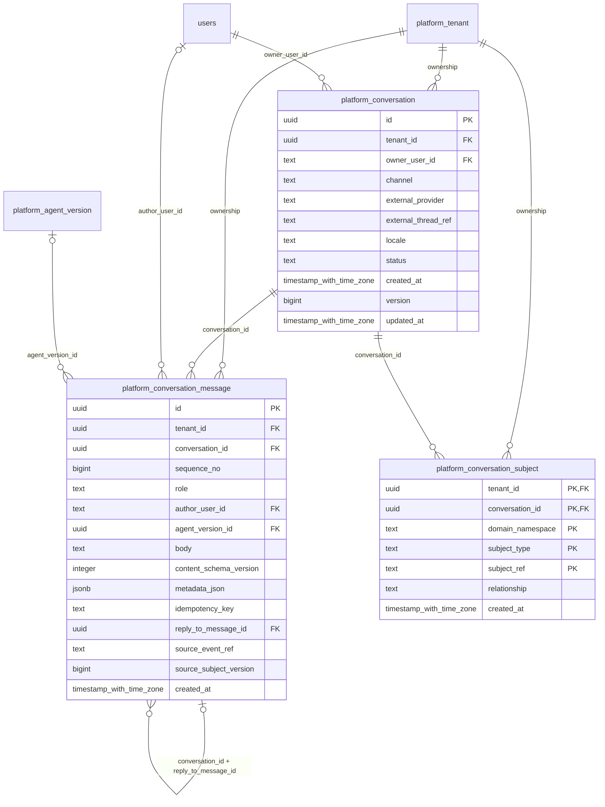

# platform-conversations

Generated from Drizzle. External entities in the diagram are foreign-key targets owned by another module.

## platform_conversation

Hội thoại đối ngoại của một user với lễ tân; có thể ánh xạ channel OpenBot qua provider/thread ref mà không tạo FK vào shell.

Tenant RLS: **enabled + forced by integrity migrations 0047/0049**.

| Column | PostgreSQL type | Required | Default | Declared values |
|---|---|---|---|---|
| `id` | `uuid` | yes | `gen_random_uuid()` | — |
| `tenant_id` | `uuid` | yes | `—` | — |
| `owner_user_id` | `text` | yes | `—` | — |
| `channel` | `text` | yes | `—` | `WEB`, `MOBILE`, `EMAIL`, `VOICE`, `EXTERNAL` |
| `external_provider` | `text` | no | `—` | — |
| `external_thread_ref` | `text` | no | `—` | — |
| `locale` | `text` | yes | `—` | — |
| `status` | `text` | yes | `—` | `OPEN`, `CLOSED`, `ARCHIVED` |
| `created_at` | `timestamp with time zone` | yes | `now()` | — |
| `version` | `bigint` | yes | `1` | — |
| `updated_at` | `timestamp with time zone` | yes | `now()` | — |

Primary key: `id`.

Unique keys:

- `platform_conversation_uq_0`: (`tenant_id`, `external_provider`, `external_thread_ref`).
- `platform_conversation_uq_1`: (`tenant_id`, `id`).

Foreign keys:

- (`tenant_id`) → `platform_tenant` (`id`); ON DELETE `restrict`.
- (`owner_user_id`) → `users` (`id`); ON DELETE `restrict`.

Indexes:

- `platform_conversation_ix_0`: (`owner_user_id`).

Checks:

- `platform_conversation_channel_ck`: `"platform_conversation"."channel" in ('WEB', 'MOBILE', 'EMAIL', 'VOICE', 'EXTERNAL')`.
- `platform_conversation_status_ck`: `"platform_conversation"."status" in ('OPEN', 'CLOSED', 'ARCHIVED')`.
- `platform_conversation_ck_0`: `(external_provider IS NULL) = (external_thread_ref IS NULL)`.
- `platform_conversation_ck_1`: `version > 0`.

Additional cross-row/temporal rules: [integrity matrix](../DATABASE_DESIGN.md#integrity-matrix) and [coordination review](../COMPLETENESS_REVIEW.md).

## platform_conversation_message

Lịch sử tin nhắn đối ngoại có thứ tự, tác giả, agent version, reply và idempotency; không lưu nội dung group chat nội bộ.

Tenant RLS: **enabled + forced by integrity migrations 0047/0049**.

| Column | PostgreSQL type | Required | Default | Declared values |
|---|---|---|---|---|
| `id` | `uuid` | yes | `gen_random_uuid()` | — |
| `tenant_id` | `uuid` | yes | `—` | — |
| `conversation_id` | `uuid` | yes | `—` | — |
| `sequence_no` | `bigint` | yes | `—` | — |
| `role` | `text` | yes | `—` | `USER`, `ASSISTANT`, `SYSTEM` |
| `author_user_id` | `text` | no | `—` | — |
| `agent_version_id` | `uuid` | no | `—` | — |
| `body` | `text` | yes | `—` | — |
| `content_schema_version` | `integer` | yes | `—` | — |
| `metadata_json` | `jsonb` | yes | `—` | — |
| `idempotency_key` | `text` | yes | `—` | — |
| `reply_to_message_id` | `uuid` | no | `—` | — |
| `source_event_ref` | `text` | no | `—` | — |
| `source_subject_version` | `bigint` | no | `—` | — |
| `created_at` | `timestamp with time zone` | yes | `now()` | — |

Primary key: `id`.

Unique keys:

- `platform_conversation_message_uq_0`: (`tenant_id`, `conversation_id`, `sequence_no`).
- `platform_conversation_message_uq_1`: (`tenant_id`, `conversation_id`, `idempotency_key`).
- `platform_conversation_message_uq_2`: (`tenant_id`, `id`).
- `platform_conversation_message_uq_3`: (`tenant_id`, `conversation_id`, `id`).

Foreign keys:

- (`tenant_id`) → `platform_tenant` (`id`); ON DELETE `restrict`.
- (`tenant_id`, `conversation_id`) → `platform_conversation` (`tenant_id`, `id`); ON DELETE `restrict`.
- (`author_user_id`) → `users` (`id`); ON DELETE `restrict`.
- (`tenant_id`, `agent_version_id`) → `platform_agent_version` (`tenant_id`, `id`); ON DELETE `restrict`.
- (`tenant_id`, `conversation_id`, `reply_to_message_id`) → `platform_conversation_message` (`tenant_id`, `conversation_id`, `id`); ON DELETE `restrict`.

Indexes:

- `platform_conversation_message_ix_0`: (`author_user_id`).
- `platform_conversation_message_ix_2`: (`tenant_id`, `agent_version_id`).
- `platform_conversation_message_ix_3`: (`tenant_id`, `conversation_id`).
- `platform_conversation_message_ix_4`: (`tenant_id`, `conversation_id`, `reply_to_message_id`).

Checks:

- `platform_conversation_message_role_ck`: `"platform_conversation_message"."role" in ('USER', 'ASSISTANT', 'SYSTEM')`.
- `platform_conversation_message_ck_0`: `sequence_no > 0`.
- `platform_conversation_message_ck_1`: `content_schema_version > 0`.
- `platform_conversation_message_ck_2`: `(role='USER' AND author_user_id IS NOT NULL AND agent_version_id IS NULL) OR (role='ASSISTANT' AND agent_version_id IS NOT NULL AND author_user_id IS NULL) OR (role='SYSTEM' AND agent_version_id IS NULL AND author_user_id IS NULL)`.

Additional cross-row/temporal rules: [integrity matrix](../DATABASE_DESIGN.md#integrity-matrix) and [coordination review](../COMPLETENESS_REVIEW.md).

## platform_conversation_subject

Ánh xạ một hội thoại tới nhiều Case/Report/Incident bằng soft reference, không gộp conversation với ticket.

Tenant RLS: **enabled + forced by integrity migrations 0047/0049**.

| Column | PostgreSQL type | Required | Default | Declared values |
|---|---|---|---|---|
| `tenant_id` | `uuid` | yes | `—` | — |
| `conversation_id` | `uuid` | yes | `—` | — |
| `domain_namespace` | `text` | yes | `—` | — |
| `subject_type` | `text` | yes | `—` | — |
| `subject_ref` | `text` | yes | `—` | — |
| `relationship` | `text` | yes | `—` | `INTAKE`, `TRACKING`, `FOLLOW_UP` |
| `created_at` | `timestamp with time zone` | yes | `now()` | — |

Primary key: `tenant_id`, `conversation_id`, `domain_namespace`, `subject_type`, `subject_ref`.

Foreign keys:

- (`tenant_id`) → `platform_tenant` (`id`); ON DELETE `restrict`.
- (`tenant_id`, `conversation_id`) → `platform_conversation` (`tenant_id`, `id`); ON DELETE `restrict`.

Indexes:

- `platform_conversation_subject_ix_1`: (`tenant_id`, `conversation_id`).

Checks:

- `platform_conversation_subject_relationship_ck`: `"platform_conversation_subject"."relationship" in ('INTAKE', 'TRACKING', 'FOLLOW_UP')`.

Additional cross-row/temporal rules: [integrity matrix](../DATABASE_DESIGN.md#integrity-matrix) and [coordination review](../COMPLETENESS_REVIEW.md).
