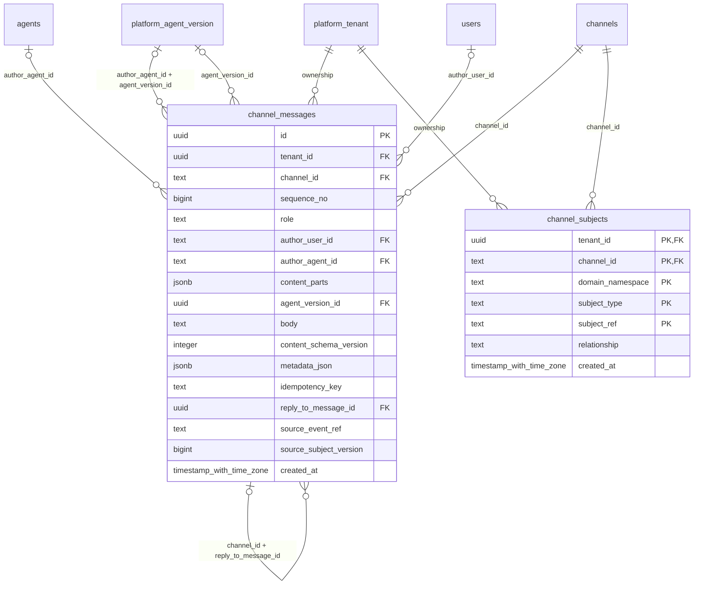

# platform-conversations

Generated from Drizzle. External entities in the diagram are foreign-key targets owned by another module.

## channel_messages

Lịch sử chat chính trong PostgreSQL: người/agent gửi, nội dung, thứ tự, phiên bản và nguồn; ghi nối tiếp, chống trùng và phát outbox.

Tenant RLS: **enabled + forced by integrity migrations 0047/0049/0052**.

| Column | PostgreSQL type | Required | Default | Declared values |
|---|---|---|---|---|
| `id` | `uuid` | yes | `gen_random_uuid()` | — |
| `tenant_id` | `uuid` | yes | `—` | — |
| `channel_id` | `text` | yes | `—` | — |
| `sequence_no` | `bigint` | yes | `—` | — |
| `role` | `text` | yes | `—` | `USER`, `ASSISTANT`, `SYSTEM` |
| `author_user_id` | `text` | no | `—` | — |
| `author_agent_id` | `text` | no | `—` | — |
| `content_parts` | `jsonb` | yes | `'[]'::jsonb` | — |
| `agent_version_id` | `uuid` | no | `—` | — |
| `body` | `text` | yes | `—` | — |
| `content_schema_version` | `integer` | yes | `—` | — |
| `metadata_json` | `jsonb` | yes | `—` | — |
| `idempotency_key` | `text` | yes | `—` | — |
| `reply_to_message_id` | `uuid` | no | `—` | — |
| `source_event_ref` | `text` | no | `—` | — |
| `source_subject_version` | `bigint` | no | `—` | — |
| `created_at` | `timestamp with time zone` | yes | `now()` | — |

Primary key: `id`.

Unique keys:

- `channel_messages_uq_0`: (`tenant_id`, `channel_id`, `sequence_no`).
- `channel_messages_uq_1`: (`tenant_id`, `channel_id`, `idempotency_key`).
- `channel_messages_uq_2`: (`tenant_id`, `id`).
- `channel_messages_uq_3`: (`tenant_id`, `channel_id`, `id`).

Foreign keys:

- (`tenant_id`, `author_agent_id`) → `agents` (`tenant_id`, `id`); ON DELETE `restrict`.
- (`tenant_id`, `author_agent_id`, `agent_version_id`) → `platform_agent_version` (`tenant_id`, `agent_id`, `id`); ON DELETE `restrict`.
- (`tenant_id`) → `platform_tenant` (`id`); ON DELETE `restrict`.
- (`tenant_id`, `channel_id`) → `channels` (`tenant_id`, `id`); ON DELETE `restrict`.
- (`author_user_id`) → `users` (`id`); ON DELETE `restrict`.
- (`tenant_id`, `agent_version_id`) → `platform_agent_version` (`tenant_id`, `id`); ON DELETE `restrict`.
- (`tenant_id`, `channel_id`, `reply_to_message_id`) → `channel_messages` (`tenant_id`, `channel_id`, `id`); ON DELETE `restrict`.

Indexes:

- `channel_messages_ix_0`: (`author_user_id`).
- `channel_messages_ix_2`: (`tenant_id`, `agent_version_id`).
- `channel_messages_ix_3`: (`tenant_id`, `channel_id`).
- `channel_messages_ix_4`: (`tenant_id`, `channel_id`, `reply_to_message_id`).

Checks:

- `channel_messages_parts_ck`: `jsonb_typeof(content_parts) = 'array'`.
- `channel_messages_role_ck`: `"channel_messages"."role" in ('USER', 'ASSISTANT', 'SYSTEM')`.
- `channel_messages_ck_0`: `sequence_no > 0`.
- `channel_messages_ck_1`: `content_schema_version > 0`.
- `channel_messages_ck_2`: `(role='USER' AND author_user_id IS NOT NULL AND author_agent_id IS NULL AND agent_version_id IS NULL) OR (role='ASSISTANT' AND author_agent_id IS NOT NULL AND author_user_id IS NULL) OR (role='SYSTEM' AND author_user_id IS NULL AND author_agent_id IS NULL AND agent_version_id IS NULL)`.

Cross-row rules and application responsibilities: [database design](../01_DATABASE_ERD_IMPLEMENTATION_COMPLETE.md) and [system flow](../02_BUSINESS_ANALYSIS_IMPLEMENTATION.md).

## channel_subjects

Liên kết hội thoại với hồ sơ nghiệp vụ để lễ tân tìm đúng phản ánh/sự cố; tham chiếu mềm được service xác thực.

Tenant RLS: **enabled + forced by integrity migrations 0047/0049/0052**.

| Column | PostgreSQL type | Required | Default | Declared values |
|---|---|---|---|---|
| `tenant_id` | `uuid` | yes | `—` | — |
| `channel_id` | `text` | yes | `—` | — |
| `domain_namespace` | `text` | yes | `—` | — |
| `subject_type` | `text` | yes | `—` | — |
| `subject_ref` | `text` | yes | `—` | — |
| `relationship` | `text` | yes | `—` | `INTAKE`, `TRACKING`, `FOLLOW_UP` |
| `created_at` | `timestamp with time zone` | yes | `now()` | — |

Primary key: `tenant_id`, `channel_id`, `domain_namespace`, `subject_type`, `subject_ref`.

Foreign keys:

- (`tenant_id`) → `platform_tenant` (`id`); ON DELETE `restrict`.
- (`tenant_id`, `channel_id`) → `channels` (`tenant_id`, `id`); ON DELETE `restrict`.

Indexes:

- `channel_subjects_ix_1`: (`tenant_id`, `channel_id`).

Checks:

- `channel_subjects_relationship_ck`: `"channel_subjects"."relationship" in ('INTAKE', 'TRACKING', 'FOLLOW_UP')`.

Cross-row rules and application responsibilities: [database design](../01_DATABASE_ERD_IMPLEMENTATION_COMPLETE.md) and [system flow](../02_BUSINESS_ANALYSIS_IMPLEMENTATION.md).
