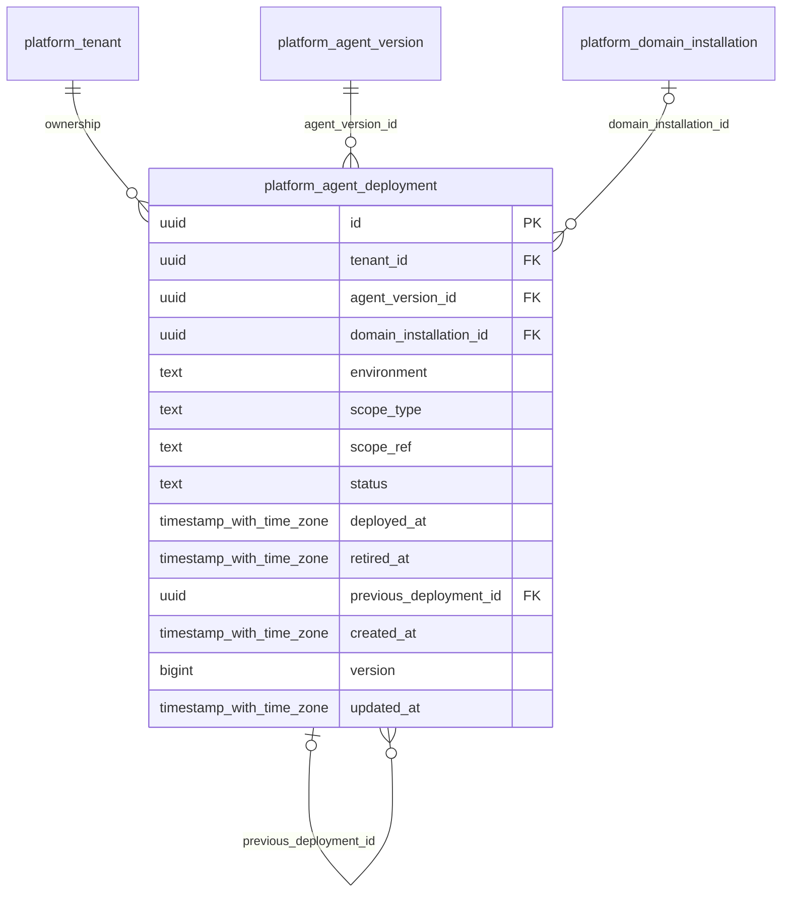

# platform-deployments

Generated from Drizzle. External entities in the diagram are foreign-key targets owned by another module.

## platform_agent_deployment

Triển khai AgentVersion vào environment/scope; rollback dùng deployment/version cũ, không sửa lịch sử spec.

Tenant RLS: **enabled + forced by integrity migrations 0047/0049**.

| Column | PostgreSQL type | Required | Default | Declared values |
|---|---|---|---|---|
| `id` | `uuid` | yes | `gen_random_uuid()` | — |
| `tenant_id` | `uuid` | yes | `—` | — |
| `agent_version_id` | `uuid` | yes | `—` | — |
| `domain_installation_id` | `uuid` | no | `—` | — |
| `environment` | `text` | yes | `—` | — |
| `scope_type` | `text` | yes | `—` | — |
| `scope_ref` | `text` | yes | `—` | — |
| `status` | `text` | yes | `—` | `ACTIVE`, `SUSPENDED`, `RETIRED` |
| `deployed_at` | `timestamp with time zone` | yes | `—` | — |
| `retired_at` | `timestamp with time zone` | no | `—` | — |
| `previous_deployment_id` | `uuid` | no | `—` | — |
| `created_at` | `timestamp with time zone` | yes | `now()` | — |
| `version` | `bigint` | yes | `1` | — |
| `updated_at` | `timestamp with time zone` | yes | `now()` | — |

Primary key: `id`.

Unique keys:

- `platform_agent_deployment_uq_0`: (`tenant_id`, `id`).

Foreign keys:

- (`tenant_id`) → `platform_tenant` (`id`); ON DELETE `restrict`.
- (`tenant_id`, `agent_version_id`) → `platform_agent_version` (`tenant_id`, `id`); ON DELETE `restrict`.
- (`tenant_id`, `domain_installation_id`) → `platform_domain_installation` (`tenant_id`, `id`); ON DELETE `restrict`.
- (`tenant_id`, `previous_deployment_id`) → `platform_agent_deployment` (`tenant_id`, `id`); ON DELETE `restrict`.

Indexes:

- `platform_agent_deployment_ix_0`: (`tenant_id`, `agent_version_id`).
- `platform_agent_deployment_ix_1`: (`tenant_id`, `domain_installation_id`).
- `platform_agent_deployment_ix_2`: (`tenant_id`, `previous_deployment_id`).

Checks:

- `platform_agent_deployment_status_ck`: `"platform_agent_deployment"."status" in ('ACTIVE', 'SUSPENDED', 'RETIRED')`.
- `platform_agent_deployment_ck_0`: `version > 0`.

Additional cross-row/temporal rules: [integrity matrix](../DATABASE_DESIGN.md#integrity-matrix) and [coordination review](../COMPLETENESS_REVIEW.md).
