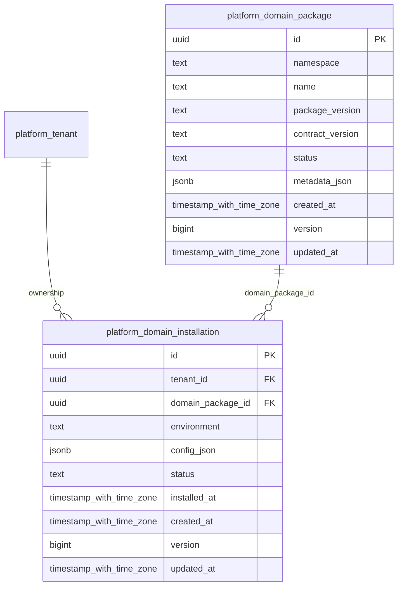

# platform-domains

Generated from Drizzle. External entities in the diagram are foreign-key targets owned by another module.

## platform_domain_installation

Cài đặt một domain package vào tenant/environment với cấu hình và trạng thái bật/tắt.

Tenant RLS: **enabled + forced by integrity migrations 0047/0049/0052**.

| Column | PostgreSQL type | Required | Default | Declared values |
|---|---|---|---|---|
| `id` | `uuid` | yes | `gen_random_uuid()` | — |
| `tenant_id` | `uuid` | yes | `—` | — |
| `domain_package_id` | `uuid` | yes | `—` | — |
| `environment` | `text` | yes | `—` | — |
| `config_json` | `jsonb` | yes | `—` | — |
| `status` | `text` | yes | `—` | `ENABLED`, `DISABLED` |
| `installed_at` | `timestamp with time zone` | yes | `—` | — |
| `created_at` | `timestamp with time zone` | yes | `now()` | — |
| `version` | `bigint` | yes | `1` | — |
| `updated_at` | `timestamp with time zone` | yes | `now()` | — |

Primary key: `id`.

Unique keys:

- `platform_domain_installation_uq_0`: (`tenant_id`, `domain_package_id`, `environment`).
- `platform_domain_installation_uq_1`: (`tenant_id`, `id`).

Foreign keys:

- (`tenant_id`) → `platform_tenant` (`id`); ON DELETE `restrict`.
- (`domain_package_id`) → `platform_domain_package` (`id`); ON DELETE `restrict`.

Indexes:

- `platform_domain_installation_ix_0`: (`domain_package_id`).

Checks:

- `platform_domain_installation_status_ck`: `"platform_domain_installation"."status" in ('ENABLED', 'DISABLED')`.
- `platform_domain_installation_ck_0`: `version > 0`.

Cross-row rules and application responsibilities: [database design](../01_DATABASE_ERD_IMPLEMENTATION_COMPLETE.md) and [system flow](../02_BUSINESS_ANALYSIS_IMPLEMENTATION.md).

## platform_domain_package

Danh mục toàn cục các phiên bản package nghiệp vụ và phiên bản contract hỗ trợ.

Tenant RLS: **global identity or deployment infrastructure; application/operator authorization required**.

| Column | PostgreSQL type | Required | Default | Declared values |
|---|---|---|---|---|
| `id` | `uuid` | yes | `gen_random_uuid()` | — |
| `namespace` | `text` | yes | `—` | — |
| `name` | `text` | yes | `—` | — |
| `package_version` | `text` | yes | `—` | — |
| `contract_version` | `text` | yes | `—` | — |
| `status` | `text` | yes | `—` | `ACTIVE`, `DEPRECATED`, `RETIRED` |
| `metadata_json` | `jsonb` | yes | `—` | — |
| `created_at` | `timestamp with time zone` | yes | `now()` | — |
| `version` | `bigint` | yes | `1` | — |
| `updated_at` | `timestamp with time zone` | yes | `now()` | — |

Primary key: `id`.

Unique keys:

- `platform_domain_package_uq_0`: (`namespace`, `package_version`).

Checks:

- `platform_domain_package_status_ck`: `"platform_domain_package"."status" in ('ACTIVE', 'DEPRECATED', 'RETIRED')`.
- `platform_domain_package_ck_0`: `version > 0`.

Cross-row rules and application responsibilities: [database design](../01_DATABASE_ERD_IMPLEMENTATION_COMPLETE.md) and [system flow](../02_BUSINESS_ANALYSIS_IMPLEMENTATION.md).
