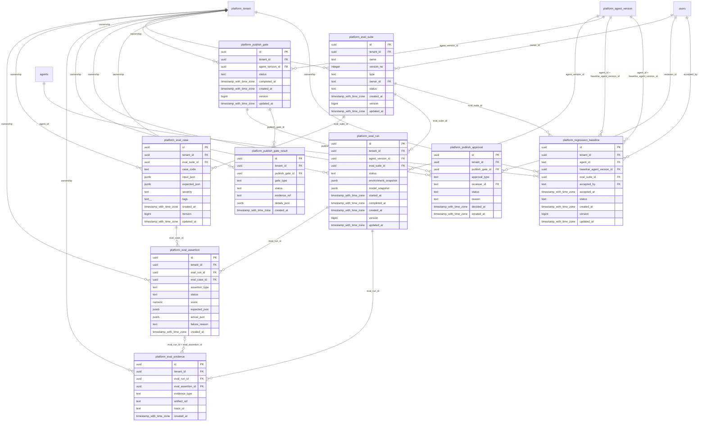

# platform-evaluation

Generated from Drizzle. External entities in the diagram are foreign-key targets owned by another module.

## platform_eval_assertion

Kết quả bất biến của một tiêu chí kiểm tra trên eval case/run.

Tenant RLS: **enabled + forced by integrity migrations 0047/0049/0052**.

| Column | PostgreSQL type | Required | Default | Declared values |
|---|---|---|---|---|
| `id` | `uuid` | yes | `gen_random_uuid()` | — |
| `tenant_id` | `uuid` | yes | `—` | — |
| `eval_run_id` | `uuid` | yes | `—` | — |
| `eval_case_id` | `uuid` | yes | `—` | — |
| `assertion_type` | `text` | yes | `—` | — |
| `status` | `text` | yes | `—` | `PASS`, `FAIL`, `ERROR`, `SKIPPED` |
| `score` | `numeric` | no | `—` | — |
| `expected_json` | `jsonb` | yes | `—` | — |
| `actual_json` | `jsonb` | yes | `—` | — |
| `failure_reason` | `text` | no | `—` | — |
| `created_at` | `timestamp with time zone` | yes | `now()` | — |

Primary key: `id`.

Unique keys:

- `platform_eval_assertion_uq_0`: (`tenant_id`, `id`).
- `platform_eval_assertion_uq_1`: (`tenant_id`, `eval_run_id`, `id`).

Foreign keys:

- (`tenant_id`) → `platform_tenant` (`id`); ON DELETE `restrict`.
- (`tenant_id`, `eval_run_id`) → `platform_eval_run` (`tenant_id`, `id`); ON DELETE `restrict`.
- (`tenant_id`, `eval_case_id`) → `platform_eval_case` (`tenant_id`, `id`); ON DELETE `restrict`.

Indexes:

- `platform_eval_assertion_ix_0`: (`tenant_id`, `eval_case_id`).
- `platform_eval_assertion_ix_1`: (`tenant_id`, `eval_run_id`).

Checks:

- `platform_eval_assertion_status_ck`: `"platform_eval_assertion"."status" in ('PASS', 'FAIL', 'ERROR', 'SKIPPED')`.

Cross-row rules and application responsibilities: [database design](../01_DATABASE_ERD_IMPLEMENTATION_COMPLETE.md) and [system flow](../02_BUSINESS_ANALYSIS_IMPLEMENTATION.md).

## platform_eval_case

Một tình huống đánh giá gồm input, expected output, severity và tags.

Tenant RLS: **enabled + forced by integrity migrations 0047/0049/0052**.

| Column | PostgreSQL type | Required | Default | Declared values |
|---|---|---|---|---|
| `id` | `uuid` | yes | `gen_random_uuid()` | — |
| `tenant_id` | `uuid` | yes | `—` | — |
| `eval_suite_id` | `uuid` | yes | `—` | — |
| `case_code` | `text` | yes | `—` | — |
| `input_json` | `jsonb` | yes | `—` | — |
| `expected_json` | `jsonb` | yes | `—` | — |
| `severity` | `text` | yes | `—` | `LOW`, `MEDIUM`, `HIGH`, `CRITICAL` |
| `tags` | `text[]` | yes | `—` | — |
| `created_at` | `timestamp with time zone` | yes | `now()` | — |
| `version` | `bigint` | yes | `1` | — |
| `updated_at` | `timestamp with time zone` | yes | `now()` | — |

Primary key: `id`.

Unique keys:

- `platform_eval_case_uq_0`: (`tenant_id`, `eval_suite_id`, `case_code`).
- `platform_eval_case_uq_1`: (`tenant_id`, `id`).

Foreign keys:

- (`tenant_id`) → `platform_tenant` (`id`); ON DELETE `restrict`.
- (`tenant_id`, `eval_suite_id`) → `platform_eval_suite` (`tenant_id`, `id`); ON DELETE `restrict`.

Indexes:

- `platform_eval_case_ix_0`: (`tenant_id`, `eval_suite_id`).

Checks:

- `platform_eval_case_severity_ck`: `"platform_eval_case"."severity" in ('LOW', 'MEDIUM', 'HIGH', 'CRITICAL')`.
- `platform_eval_case_ck_0`: `version > 0`.

Cross-row rules and application responsibilities: [database design](../01_DATABASE_ERD_IMPLEMENTATION_COMPLETE.md) and [system flow](../02_BUSINESS_ANALYSIS_IMPLEMENTATION.md).

## platform_eval_evidence

Tham chiếu bằng chứng/artifact/trace hỗ trợ một kết quả đánh giá.

Tenant RLS: **enabled + forced by integrity migrations 0047/0049/0052**.

| Column | PostgreSQL type | Required | Default | Declared values |
|---|---|---|---|---|
| `id` | `uuid` | yes | `gen_random_uuid()` | — |
| `tenant_id` | `uuid` | yes | `—` | — |
| `eval_run_id` | `uuid` | yes | `—` | — |
| `eval_assertion_id` | `uuid` | no | `—` | — |
| `evidence_type` | `text` | yes | `—` | — |
| `artifact_ref` | `text` | yes | `—` | — |
| `trace_id` | `text` | yes | `—` | — |
| `created_at` | `timestamp with time zone` | yes | `now()` | — |

Primary key: `id`.

Unique keys:

- `platform_eval_evidence_uq_0`: (`tenant_id`, `id`).

Foreign keys:

- (`tenant_id`) → `platform_tenant` (`id`); ON DELETE `restrict`.
- (`tenant_id`, `eval_run_id`) → `platform_eval_run` (`tenant_id`, `id`); ON DELETE `restrict`.
- (`tenant_id`, `eval_run_id`, `eval_assertion_id`) → `platform_eval_assertion` (`tenant_id`, `eval_run_id`, `id`); ON DELETE `restrict`.

Indexes:

- `platform_eval_evidence_ix_0`: (`tenant_id`, `eval_run_id`).
- `platform_eval_evidence_ix_1`: (`tenant_id`, `eval_run_id`, `eval_assertion_id`).

Cross-row rules and application responsibilities: [database design](../01_DATABASE_ERD_IMPLEMENTATION_COMPLETE.md) and [system flow](../02_BUSINESS_ANALYSIS_IMPLEMENTATION.md).

## platform_eval_run

Lần đánh giá AgentVersion bằng suite được ghim, lưu môi trường/model và kết quả.

Tenant RLS: **enabled + forced by integrity migrations 0047/0049/0052**.

| Column | PostgreSQL type | Required | Default | Declared values |
|---|---|---|---|---|
| `id` | `uuid` | yes | `gen_random_uuid()` | — |
| `tenant_id` | `uuid` | yes | `—` | — |
| `agent_version_id` | `uuid` | yes | `—` | — |
| `eval_suite_id` | `uuid` | yes | `—` | — |
| `status` | `text` | yes | `—` | `PENDING`, `RUNNING`, `PASSED`, `FAILED`, `CANCELLED` |
| `environment_snapshot` | `jsonb` | yes | `—` | — |
| `model_snapshot` | `jsonb` | yes | `—` | — |
| `started_at` | `timestamp with time zone` | no | `—` | — |
| `completed_at` | `timestamp with time zone` | no | `—` | — |
| `created_at` | `timestamp with time zone` | yes | `now()` | — |
| `version` | `bigint` | yes | `1` | — |
| `updated_at` | `timestamp with time zone` | yes | `now()` | — |

Primary key: `id`.

Unique keys:

- `platform_eval_run_uq_0`: (`tenant_id`, `id`).

Foreign keys:

- (`tenant_id`) → `platform_tenant` (`id`); ON DELETE `restrict`.
- (`tenant_id`, `agent_version_id`) → `platform_agent_version` (`tenant_id`, `id`); ON DELETE `restrict`.
- (`tenant_id`, `eval_suite_id`) → `platform_eval_suite` (`tenant_id`, `id`); ON DELETE `restrict`.

Indexes:

- `platform_eval_run_ix_0`: (`tenant_id`, `agent_version_id`).
- `platform_eval_run_ix_1`: (`tenant_id`, `eval_suite_id`).

Checks:

- `platform_eval_run_status_ck`: `"platform_eval_run"."status" in ('PENDING', 'RUNNING', 'PASSED', 'FAILED', 'CANCELLED')`.
- `platform_eval_run_ck_0`: `completed_at IS NULL OR completed_at >= started_at`.
- `platform_eval_run_ck_1`: `version > 0`.

Cross-row rules and application responsibilities: [database design](../01_DATABASE_ERD_IMPLEMENTATION_COMPLETE.md) and [system flow](../02_BUSINESS_ANALYSIS_IMPLEMENTATION.md).

## platform_eval_suite

Bộ kiểm thử đánh giá có version, loại và owner; các case đóng băng khi suite đã được chạy.

Tenant RLS: **enabled + forced by integrity migrations 0047/0049/0052**.

| Column | PostgreSQL type | Required | Default | Declared values |
|---|---|---|---|---|
| `id` | `uuid` | yes | `gen_random_uuid()` | — |
| `tenant_id` | `uuid` | yes | `—` | — |
| `name` | `text` | yes | `—` | — |
| `version_no` | `integer` | yes | `—` | — |
| `type` | `text` | yes | `—` | — |
| `owner_id` | `text` | yes | `—` | — |
| `status` | `text` | yes | `—` | `DRAFT`, `ACTIVE`, `RETIRED` |
| `created_at` | `timestamp with time zone` | yes | `now()` | — |
| `version` | `bigint` | yes | `1` | — |
| `updated_at` | `timestamp with time zone` | yes | `now()` | — |

Primary key: `id`.

Unique keys:

- `platform_eval_suite_uq_0`: (`tenant_id`, `name`, `version_no`).
- `platform_eval_suite_uq_1`: (`tenant_id`, `id`).

Foreign keys:

- (`tenant_id`) → `platform_tenant` (`id`); ON DELETE `restrict`.
- (`owner_id`) → `users` (`id`); ON DELETE `restrict`.

Indexes:

- `platform_eval_suite_ix_0`: (`owner_id`).

Checks:

- `platform_eval_suite_status_ck`: `"platform_eval_suite"."status" in ('DRAFT', 'ACTIVE', 'RETIRED')`.
- `platform_eval_suite_ck_0`: `version_no > 0`.
- `platform_eval_suite_ck_1`: `version > 0`.

Cross-row rules and application responsibilities: [database design](../01_DATABASE_ERD_IMPLEMENTATION_COMPLETE.md) and [system flow](../02_BUSINESS_ANALYSIS_IMPLEMENTATION.md).

## platform_publish_approval

Quyết định reviewer theo vai trò DOMAIN/EVALUATION/SECURITY/PLATFORM, độc lập với tác giả.

Tenant RLS: **enabled + forced by integrity migrations 0047/0049/0052**.

| Column | PostgreSQL type | Required | Default | Declared values |
|---|---|---|---|---|
| `id` | `uuid` | yes | `gen_random_uuid()` | — |
| `tenant_id` | `uuid` | yes | `—` | — |
| `publish_gate_id` | `uuid` | yes | `—` | — |
| `approval_type` | `text` | yes | `—` | `DOMAIN`, `EVALUATION`, `SECURITY`, `PLATFORM` |
| `reviewer_id` | `text` | yes | `—` | — |
| `status` | `text` | yes | `—` | `APPROVED`, `REJECTED` |
| `reason` | `text` | no | `—` | — |
| `decided_at` | `timestamp with time zone` | yes | `—` | — |
| `created_at` | `timestamp with time zone` | yes | `now()` | — |

Primary key: `id`.

Unique keys:

- `platform_publish_approval_uq_0`: (`tenant_id`, `publish_gate_id`, `approval_type`).
- `platform_publish_approval_uq_1`: (`tenant_id`, `id`).

Foreign keys:

- (`tenant_id`) → `platform_tenant` (`id`); ON DELETE `restrict`.
- (`tenant_id`, `publish_gate_id`) → `platform_publish_gate` (`tenant_id`, `id`); ON DELETE `restrict`.
- (`reviewer_id`) → `users` (`id`); ON DELETE `restrict`.

Indexes:

- `platform_publish_approval_ix_0`: (`tenant_id`, `publish_gate_id`).
- `platform_publish_approval_ix_1`: (`reviewer_id`).

Checks:

- `platform_publish_approval_approval_type_ck`: `"platform_publish_approval"."approval_type" in ('DOMAIN', 'EVALUATION', 'SECURITY', 'PLATFORM')`.
- `platform_publish_approval_status_ck`: `"platform_publish_approval"."status" in ('APPROVED', 'REJECTED')`.

Cross-row rules and application responsibilities: [database design](../01_DATABASE_ERD_IMPLEMENTATION_COMPLETE.md) and [system flow](../02_BUSINESS_ANALYSIS_IMPLEMENTATION.md).

## platform_publish_gate

Một đợt xét điều kiện publish AgentVersion, tập hợp kết quả gate và approvals.

Tenant RLS: **enabled + forced by integrity migrations 0047/0049/0052**.

| Column | PostgreSQL type | Required | Default | Declared values |
|---|---|---|---|---|
| `id` | `uuid` | yes | `gen_random_uuid()` | — |
| `tenant_id` | `uuid` | yes | `—` | — |
| `agent_version_id` | `uuid` | yes | `—` | — |
| `status` | `text` | yes | `—` | `PENDING`, `PASSED`, `FAILED` |
| `completed_at` | `timestamp with time zone` | no | `—` | — |
| `created_at` | `timestamp with time zone` | yes | `now()` | — |
| `version` | `bigint` | yes | `1` | — |
| `updated_at` | `timestamp with time zone` | yes | `now()` | — |

Primary key: `id`.

Unique keys:

- `platform_publish_gate_uq_0`: (`tenant_id`, `id`).

Foreign keys:

- (`tenant_id`) → `platform_tenant` (`id`); ON DELETE `restrict`.
- (`tenant_id`, `agent_version_id`) → `platform_agent_version` (`tenant_id`, `id`); ON DELETE `restrict`.

Indexes:

- `platform_publish_gate_ix_0`: (`tenant_id`, `agent_version_id`).

Checks:

- `platform_publish_gate_status_ck`: `"platform_publish_gate"."status" in ('PENDING', 'PASSED', 'FAILED')`.
- `platform_publish_gate_ck_0`: `version > 0`.

Cross-row rules and application responsibilities: [database design](../01_DATABASE_ERD_IMPLEMENTATION_COMPLETE.md) and [system flow](../02_BUSINESS_ANALYSIS_IMPLEMENTATION.md).

## platform_publish_gate_result

Kết quả CONTRACT/QUALITY/SAFETY/REGRESSION của một đợt xét publish.

Tenant RLS: **enabled + forced by integrity migrations 0047/0049/0052**.

| Column | PostgreSQL type | Required | Default | Declared values |
|---|---|---|---|---|
| `id` | `uuid` | yes | `gen_random_uuid()` | — |
| `tenant_id` | `uuid` | yes | `—` | — |
| `publish_gate_id` | `uuid` | yes | `—` | — |
| `gate_type` | `text` | yes | `—` | `CONTRACT`, `QUALITY`, `SAFETY`, `REGRESSION` |
| `status` | `text` | yes | `—` | `PASS`, `FAIL` |
| `evidence_ref` | `text` | yes | `—` | — |
| `details_json` | `jsonb` | yes | `—` | — |
| `created_at` | `timestamp with time zone` | yes | `now()` | — |

Primary key: `id`.

Unique keys:

- `platform_publish_gate_result_uq_0`: (`tenant_id`, `publish_gate_id`, `gate_type`).
- `platform_publish_gate_result_uq_1`: (`tenant_id`, `id`).

Foreign keys:

- (`tenant_id`) → `platform_tenant` (`id`); ON DELETE `restrict`.
- (`tenant_id`, `publish_gate_id`) → `platform_publish_gate` (`tenant_id`, `id`); ON DELETE `restrict`.

Indexes:

- `platform_publish_gate_result_ix_0`: (`tenant_id`, `publish_gate_id`).

Checks:

- `platform_publish_gate_result_gate_type_ck`: `"platform_publish_gate_result"."gate_type" in ('CONTRACT', 'QUALITY', 'SAFETY', 'REGRESSION')`.
- `platform_publish_gate_result_status_ck`: `"platform_publish_gate_result"."status" in ('PASS', 'FAIL')`.

Cross-row rules and application responsibilities: [database design](../01_DATABASE_ERD_IMPLEMENTATION_COMPLETE.md) and [system flow](../02_BUSINESS_ANALYSIS_IMPLEMENTATION.md).

## platform_regression_baseline

Phiên bản agent được chấp thuận làm mốc so sánh regression cho suite.

Tenant RLS: **enabled + forced by integrity migrations 0047/0049/0052**.

| Column | PostgreSQL type | Required | Default | Declared values |
|---|---|---|---|---|
| `id` | `uuid` | yes | `gen_random_uuid()` | — |
| `tenant_id` | `uuid` | yes | `—` | — |
| `agent_id` | `text` | yes | `—` | — |
| `baseline_agent_version_id` | `uuid` | yes | `—` | — |
| `eval_suite_id` | `uuid` | yes | `—` | — |
| `accepted_by` | `text` | yes | `—` | — |
| `accepted_at` | `timestamp with time zone` | yes | `—` | — |
| `status` | `text` | yes | `—` | `ACTIVE`, `RETIRED` |
| `created_at` | `timestamp with time zone` | yes | `now()` | — |
| `version` | `bigint` | yes | `1` | — |
| `updated_at` | `timestamp with time zone` | yes | `now()` | — |

Primary key: `id`.

Unique keys:

- `platform_regression_baseline_uq_0`: (`tenant_id`, `id`).

Foreign keys:

- (`tenant_id`) → `platform_tenant` (`id`); ON DELETE `restrict`.
- (`tenant_id`, `agent_id`) → `agents` (`tenant_id`, `id`); ON DELETE `restrict`.
- (`tenant_id`, `agent_id`, `baseline_agent_version_id`) → `platform_agent_version` (`tenant_id`, `agent_id`, `id`); ON DELETE `restrict`.
- (`tenant_id`, `eval_suite_id`) → `platform_eval_suite` (`tenant_id`, `id`); ON DELETE `restrict`.
- (`accepted_by`) → `users` (`id`); ON DELETE `restrict`.
- (`tenant_id`, `agent_id`, `baseline_agent_version_id`) → `platform_agent_version` (`tenant_id`, `agent_id`, `id`); ON DELETE `restrict`.

Indexes:

- `platform_regression_baseline_ix_0`: (`accepted_by`).
- `platform_regression_baseline_ix_1`: (`tenant_id`, `agent_id`, `baseline_agent_version_id`).
- `platform_regression_baseline_ix_2`: (`tenant_id`, `eval_suite_id`).
- `platform_regression_baseline_ix_3`: (`tenant_id`, `agent_id`).

Checks:

- `platform_regression_baseline_status_ck`: `"platform_regression_baseline"."status" in ('ACTIVE', 'RETIRED')`.
- `platform_regression_baseline_ck_0`: `version > 0`.

Cross-row rules and application responsibilities: [database design](../01_DATABASE_ERD_IMPLEMENTATION_COMPLETE.md) and [system flow](../02_BUSINESS_ANALYSIS_IMPLEMENTATION.md).
