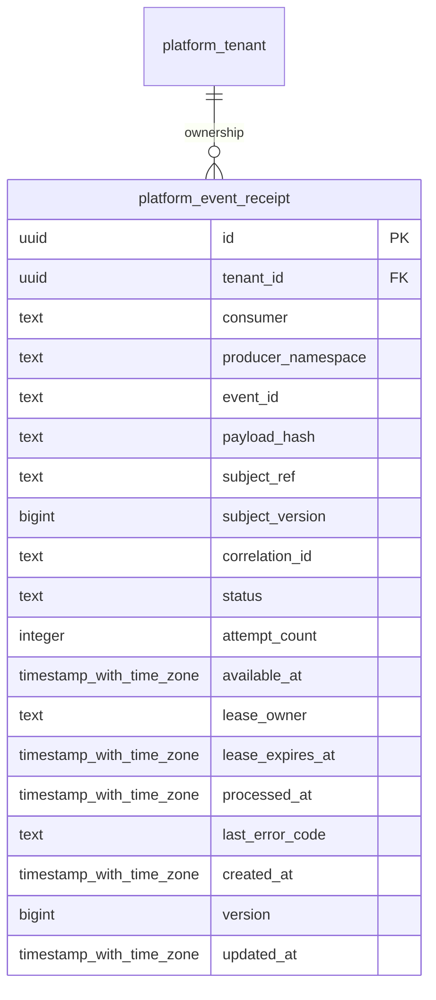

# platform-event-delivery

Generated from Drizzle. External entities in the diagram are foreign-key targets owned by another module.

## platform_event_receipt

Inbox dedupe từng event/consumer, lưu trạng thái xử lý, lease/retry và hash chống nhận cùng ID khác nội dung.

Tenant RLS: **enabled + forced by integrity migrations 0047/0049**.

| Column | PostgreSQL type | Required | Default | Declared values |
|---|---|---|---|---|
| `id` | `uuid` | yes | `gen_random_uuid()` | — |
| `tenant_id` | `uuid` | yes | `—` | — |
| `consumer` | `text` | yes | `—` | — |
| `producer_namespace` | `text` | yes | `—` | — |
| `event_id` | `text` | yes | `—` | — |
| `payload_hash` | `text` | yes | `—` | — |
| `subject_ref` | `text` | no | `—` | — |
| `subject_version` | `bigint` | no | `—` | — |
| `correlation_id` | `text` | yes | `—` | — |
| `status` | `text` | yes | `—` | `RECEIVED`, `PROCESSING`, `PROCESSED`, `FAILED`, `DEAD_LETTER` |
| `attempt_count` | `integer` | yes | `—` | — |
| `available_at` | `timestamp with time zone` | yes | `—` | — |
| `lease_owner` | `text` | no | `—` | — |
| `lease_expires_at` | `timestamp with time zone` | no | `—` | — |
| `processed_at` | `timestamp with time zone` | no | `—` | — |
| `last_error_code` | `text` | no | `—` | — |
| `created_at` | `timestamp with time zone` | yes | `now()` | — |
| `version` | `bigint` | yes | `1` | — |
| `updated_at` | `timestamp with time zone` | yes | `now()` | — |

Primary key: `id`.

Unique keys:

- `platform_event_receipt_uq_0`: (`tenant_id`, `consumer`, `producer_namespace`, `event_id`).
- `platform_event_receipt_uq_1`: (`tenant_id`, `id`).

Foreign keys:

- (`tenant_id`) → `platform_tenant` (`id`); ON DELETE `restrict`.

Indexes:

- `platform_event_receipt_ready_ix`: (`tenant_id`, `status`, `available_at`).

Checks:

- `platform_event_receipt_status_ck`: `"platform_event_receipt"."status" in ('RECEIVED', 'PROCESSING', 'PROCESSED', 'FAILED', 'DEAD_LETTER')`.
- `platform_event_receipt_ck_0`: `attempt_count >= 0`.
- `platform_event_receipt_ck_1`: `(lease_owner IS NULL) = (lease_expires_at IS NULL)`.
- `platform_event_receipt_ck_2`: `status<>'PROCESSED' OR processed_at IS NOT NULL`.
- `platform_event_receipt_ck_3`: `version > 0`.

Additional cross-row/temporal rules: [integrity matrix](../DATABASE_DESIGN.md#integrity-matrix) and [coordination review](../COMPLETENESS_REVIEW.md).
