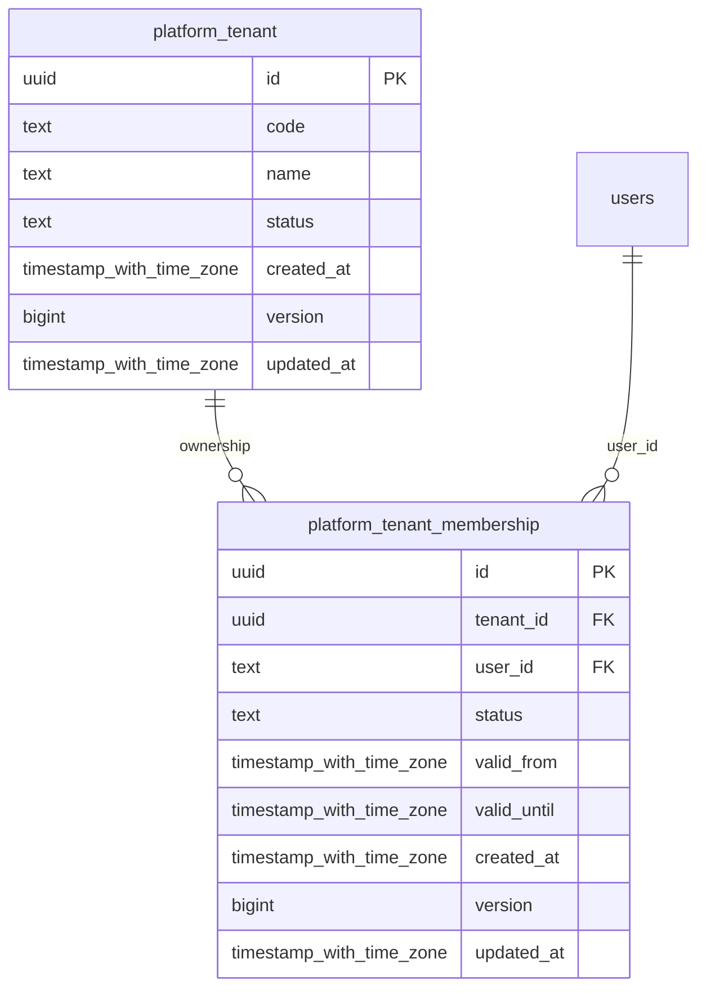

# platform-identity

Generated from Drizzle. External entities in the diagram are foreign-key targets owned by another module.

## platform_tenant

Đơn vị sở hữu và cô lập dữ liệu workforce; một tenant có thể quản lý nhiều dự án.

Tenant RLS: **enabled + forced by integrity migrations 0047/0049/0052**.

| Column | PostgreSQL type | Required | Default | Declared values |
|---|---|---|---|---|
| `id` | `uuid` | yes | `gen_random_uuid()` | — |
| `code` | `text` | yes | `—` | — |
| `name` | `text` | yes | `—` | — |
| `status` | `text` | yes | `—` | `ACTIVE`, `SUSPENDED`, `RETIRED` |
| `created_at` | `timestamp with time zone` | yes | `now()` | — |
| `version` | `bigint` | yes | `1` | — |
| `updated_at` | `timestamp with time zone` | yes | `now()` | — |

Primary key: `id`.

Unique keys:

- `platform_tenant_uq_0`: (`code`).

Checks:

- `platform_tenant_status_ck`: `"platform_tenant"."status" in ('ACTIVE', 'SUSPENDED', 'RETIRED')`.
- `platform_tenant_ck_0`: `version > 0`.

Cross-row rules and application responsibilities: [database design](../01_DATABASE_ERD_IMPLEMENTATION_COMPLETE.md) and [system flow](../02_BUSINESS_ANALYSIS_IMPLEMENTATION.md).

## platform_tenant_membership

Quan hệ có thời hạn giữa user và tenant, là điều kiện nền trước khi cấp scope nghiệp vụ.

Tenant RLS: **enabled + forced by integrity migrations 0047/0049/0052**.

| Column | PostgreSQL type | Required | Default | Declared values |
|---|---|---|---|---|
| `id` | `uuid` | yes | `gen_random_uuid()` | — |
| `tenant_id` | `uuid` | yes | `—` | — |
| `user_id` | `text` | yes | `—` | — |
| `status` | `text` | yes | `—` | `ACTIVE`, `SUSPENDED`, `REVOKED` |
| `valid_from` | `timestamp with time zone` | yes | `—` | — |
| `valid_until` | `timestamp with time zone` | no | `—` | — |
| `created_at` | `timestamp with time zone` | yes | `now()` | — |
| `version` | `bigint` | yes | `1` | — |
| `updated_at` | `timestamp with time zone` | yes | `now()` | — |

Primary key: `id`.

Unique keys:

- `platform_tenant_membership_uq_0`: (`tenant_id`, `user_id`).
- `platform_tenant_membership_uq_1`: (`tenant_id`, `id`).

Foreign keys:

- (`tenant_id`) → `platform_tenant` (`id`); ON DELETE `restrict`.
- (`user_id`) → `users` (`id`); ON DELETE `restrict`.

Indexes:

- `platform_tenant_membership_ix_0`: (`user_id`).

Checks:

- `platform_tenant_membership_status_ck`: `"platform_tenant_membership"."status" in ('ACTIVE', 'SUSPENDED', 'REVOKED')`.
- `platform_tenant_membership_ck_0`: `valid_until IS NULL OR valid_until > valid_from`.
- `platform_tenant_membership_ck_1`: `version > 0`.

Cross-row rules and application responsibilities: [database design](../01_DATABASE_ERD_IMPLEMENTATION_COMPLETE.md) and [system flow](../02_BUSINESS_ANALYSIS_IMPLEMENTATION.md).
