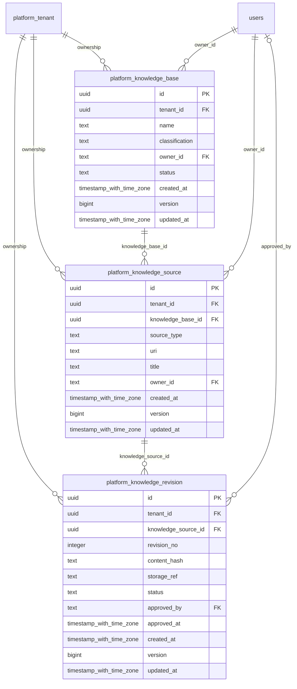

# platform-knowledge

Generated from Drizzle. External entities in the diagram are foreign-key targets owned by another module.

## platform_knowledge_base

Kho tri thức có chủ sở hữu, phân loại bảo mật và trạng thái truy cập.

Tenant RLS: **enabled + forced by integrity migrations 0047/0049/0052**.

| Column | PostgreSQL type | Required | Default | Declared values |
|---|---|---|---|---|
| `id` | `uuid` | yes | `gen_random_uuid()` | — |
| `tenant_id` | `uuid` | yes | `—` | — |
| `name` | `text` | yes | `—` | — |
| `classification` | `text` | yes | `—` | `PUBLIC`, `INTERNAL`, `CONFIDENTIAL`, `RESTRICTED` |
| `owner_id` | `text` | yes | `—` | — |
| `status` | `text` | yes | `—` | `ACTIVE`, `SUSPENDED`, `RETIRED` |
| `created_at` | `timestamp with time zone` | yes | `now()` | — |
| `version` | `bigint` | yes | `1` | — |
| `updated_at` | `timestamp with time zone` | yes | `now()` | — |

Primary key: `id`.

Unique keys:

- `platform_knowledge_base_uq_0`: (`tenant_id`, `id`).

Foreign keys:

- (`tenant_id`) → `platform_tenant` (`id`); ON DELETE `restrict`.
- (`owner_id`) → `users` (`id`); ON DELETE `restrict`.

Indexes:

- `platform_knowledge_base_ix_0`: (`owner_id`).

Checks:

- `platform_knowledge_base_classification_ck`: `"platform_knowledge_base"."classification" in ('PUBLIC', 'INTERNAL', 'CONFIDENTIAL', 'RESTRICTED')`.
- `platform_knowledge_base_status_ck`: `"platform_knowledge_base"."status" in ('ACTIVE', 'SUSPENDED', 'RETIRED')`.
- `platform_knowledge_base_ck_0`: `version > 0`.

Cross-row rules and application responsibilities: [database design](../01_DATABASE_ERD_IMPLEMENTATION_COMPLETE.md) and [system flow](../02_BUSINESS_ANALYSIS_IMPLEMENTATION.md).

## platform_knowledge_revision

Bản nội dung tài liệu có hash, storage reference và quyết định phê duyệt.

Tenant RLS: **enabled + forced by integrity migrations 0047/0049/0052**.

| Column | PostgreSQL type | Required | Default | Declared values |
|---|---|---|---|---|
| `id` | `uuid` | yes | `gen_random_uuid()` | — |
| `tenant_id` | `uuid` | yes | `—` | — |
| `knowledge_source_id` | `uuid` | yes | `—` | — |
| `revision_no` | `integer` | yes | `—` | — |
| `content_hash` | `text` | yes | `—` | — |
| `storage_ref` | `text` | yes | `—` | — |
| `status` | `text` | yes | `—` | `DRAFT`, `APPROVED`, `REJECTED`, `REVOKED` |
| `approved_by` | `text` | no | `—` | — |
| `approved_at` | `timestamp with time zone` | no | `—` | — |
| `created_at` | `timestamp with time zone` | yes | `now()` | — |
| `version` | `bigint` | yes | `1` | — |
| `updated_at` | `timestamp with time zone` | yes | `now()` | — |

Primary key: `id`.

Unique keys:

- `platform_knowledge_revision_uq_0`: (`tenant_id`, `knowledge_source_id`, `revision_no`).
- `platform_knowledge_revision_uq_1`: (`tenant_id`, `id`).

Foreign keys:

- (`tenant_id`) → `platform_tenant` (`id`); ON DELETE `restrict`.
- (`tenant_id`, `knowledge_source_id`) → `platform_knowledge_source` (`tenant_id`, `id`); ON DELETE `restrict`.
- (`approved_by`) → `users` (`id`); ON DELETE `restrict`.

Indexes:

- `platform_knowledge_revision_ix_0`: (`tenant_id`, `knowledge_source_id`).
- `platform_knowledge_revision_ix_1`: (`approved_by`).

Checks:

- `platform_knowledge_revision_status_ck`: `"platform_knowledge_revision"."status" in ('DRAFT', 'APPROVED', 'REJECTED', 'REVOKED')`.
- `platform_knowledge_revision_ck_0`: `revision_no > 0`.
- `platform_knowledge_revision_ck_1`: `status <> 'APPROVED' OR (approved_by IS NOT NULL AND approved_at IS NOT NULL)`.
- `platform_knowledge_revision_ck_2`: `version > 0`.

Cross-row rules and application responsibilities: [database design](../01_DATABASE_ERD_IMPLEMENTATION_COMPLETE.md) and [system flow](../02_BUSINESS_ANALYSIS_IMPLEMENTATION.md).

## platform_knowledge_source

Nguồn tài liệu/URI thuộc một knowledge base, chưa phải một bản revision cụ thể.

Tenant RLS: **enabled + forced by integrity migrations 0047/0049/0052**.

| Column | PostgreSQL type | Required | Default | Declared values |
|---|---|---|---|---|
| `id` | `uuid` | yes | `gen_random_uuid()` | — |
| `tenant_id` | `uuid` | yes | `—` | — |
| `knowledge_base_id` | `uuid` | yes | `—` | — |
| `source_type` | `text` | yes | `—` | — |
| `uri` | `text` | yes | `—` | — |
| `title` | `text` | yes | `—` | — |
| `owner_id` | `text` | yes | `—` | — |
| `created_at` | `timestamp with time zone` | yes | `now()` | — |
| `version` | `bigint` | yes | `1` | — |
| `updated_at` | `timestamp with time zone` | yes | `now()` | — |

Primary key: `id`.

Unique keys:

- `platform_knowledge_source_uq_0`: (`tenant_id`, `id`).

Foreign keys:

- (`tenant_id`) → `platform_tenant` (`id`); ON DELETE `restrict`.
- (`tenant_id`, `knowledge_base_id`) → `platform_knowledge_base` (`tenant_id`, `id`); ON DELETE `restrict`.
- (`owner_id`) → `users` (`id`); ON DELETE `restrict`.

Indexes:

- `platform_knowledge_source_ix_0`: (`owner_id`).
- `platform_knowledge_source_ix_1`: (`tenant_id`, `knowledge_base_id`).

Checks:

- `platform_knowledge_source_ck_0`: `version > 0`.

Cross-row rules and application responsibilities: [database design](../01_DATABASE_ERD_IMPLEMENTATION_COMPLETE.md) and [system flow](../02_BUSINESS_ANALYSIS_IMPLEMENTATION.md).
