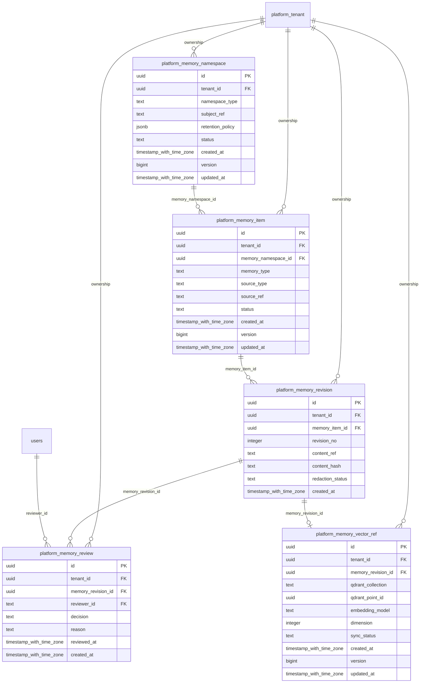

# platform-memory

Generated from Drizzle. External entities in the diagram are foreign-key targets owned by another module.

## platform_memory_item

Danh tính một mục memory với loại, nguồn và trạng thái.

Tenant RLS: **enabled + forced by integrity migrations 0047/0049/0052**.

| Column | PostgreSQL type | Required | Default | Declared values |
|---|---|---|---|---|
| `id` | `uuid` | yes | `gen_random_uuid()` | — |
| `tenant_id` | `uuid` | yes | `—` | — |
| `memory_namespace_id` | `uuid` | yes | `—` | — |
| `memory_type` | `text` | yes | `—` | — |
| `source_type` | `text` | yes | `—` | — |
| `source_ref` | `text` | yes | `—` | — |
| `status` | `text` | yes | `—` | `DRAFT`, `ACTIVE`, `REDACTED`, `RETIRED` |
| `created_at` | `timestamp with time zone` | yes | `now()` | — |
| `version` | `bigint` | yes | `1` | — |
| `updated_at` | `timestamp with time zone` | yes | `now()` | — |

Primary key: `id`.

Unique keys:

- `platform_memory_item_uq_0`: (`tenant_id`, `id`).

Foreign keys:

- (`tenant_id`) → `platform_tenant` (`id`); ON DELETE `restrict`.
- (`tenant_id`, `memory_namespace_id`) → `platform_memory_namespace` (`tenant_id`, `id`); ON DELETE `restrict`.

Indexes:

- `platform_memory_item_ix_0`: (`tenant_id`, `memory_namespace_id`).

Checks:

- `platform_memory_item_status_ck`: `"platform_memory_item"."status" in ('DRAFT', 'ACTIVE', 'REDACTED', 'RETIRED')`.
- `platform_memory_item_ck_0`: `version > 0`.

Cross-row rules and application responsibilities: [database design](../01_DATABASE_ERD_IMPLEMENTATION_COMPLETE.md) and [system flow](../02_BUSINESS_ANALYSIS_IMPLEMENTATION.md).

## platform_memory_namespace

Phạm vi semantic memory theo tenant/domain/user/agent và retention policy.

Tenant RLS: **enabled + forced by integrity migrations 0047/0049/0052**.

| Column | PostgreSQL type | Required | Default | Declared values |
|---|---|---|---|---|
| `id` | `uuid` | yes | `gen_random_uuid()` | — |
| `tenant_id` | `uuid` | yes | `—` | — |
| `namespace_type` | `text` | yes | `—` | `TENANT`, `DOMAIN`, `USER`, `AGENT` |
| `subject_ref` | `text` | yes | `—` | — |
| `retention_policy` | `jsonb` | yes | `—` | — |
| `status` | `text` | yes | `—` | `ACTIVE`, `SUSPENDED`, `RETIRED` |
| `created_at` | `timestamp with time zone` | yes | `now()` | — |
| `version` | `bigint` | yes | `1` | — |
| `updated_at` | `timestamp with time zone` | yes | `now()` | — |

Primary key: `id`.

Unique keys:

- `platform_memory_namespace_uq_0`: (`tenant_id`, `namespace_type`, `subject_ref`).
- `platform_memory_namespace_uq_1`: (`tenant_id`, `id`).

Foreign keys:

- (`tenant_id`) → `platform_tenant` (`id`); ON DELETE `restrict`.

Checks:

- `platform_memory_namespace_namespace_type_ck`: `"platform_memory_namespace"."namespace_type" in ('TENANT', 'DOMAIN', 'USER', 'AGENT')`.
- `platform_memory_namespace_status_ck`: `"platform_memory_namespace"."status" in ('ACTIVE', 'SUSPENDED', 'RETIRED')`.
- `platform_memory_namespace_ck_0`: `version > 0`.

Cross-row rules and application responsibilities: [database design](../01_DATABASE_ERD_IMPLEMENTATION_COMPLETE.md) and [system flow](../02_BUSINESS_ANALYSIS_IMPLEMENTATION.md).

## platform_memory_review

Lịch sử phê duyệt/từ chối/thu hồi memory revision; append-only.

Tenant RLS: **enabled + forced by integrity migrations 0047/0049/0052**.

| Column | PostgreSQL type | Required | Default | Declared values |
|---|---|---|---|---|
| `id` | `uuid` | yes | `gen_random_uuid()` | — |
| `tenant_id` | `uuid` | yes | `—` | — |
| `memory_revision_id` | `uuid` | yes | `—` | — |
| `reviewer_id` | `text` | yes | `—` | — |
| `decision` | `text` | yes | `—` | `APPROVED`, `REJECTED`, `REVOKED` |
| `reason` | `text` | yes | `—` | — |
| `reviewed_at` | `timestamp with time zone` | yes | `—` | — |
| `created_at` | `timestamp with time zone` | yes | `now()` | — |

Primary key: `id`.

Unique keys:

- `platform_memory_review_uq_0`: (`tenant_id`, `id`).

Foreign keys:

- (`tenant_id`) → `platform_tenant` (`id`); ON DELETE `restrict`.
- (`tenant_id`, `memory_revision_id`) → `platform_memory_revision` (`tenant_id`, `id`); ON DELETE `restrict`.
- (`reviewer_id`) → `users` (`id`); ON DELETE `restrict`.

Indexes:

- `platform_memory_review_ix_0`: (`reviewer_id`).
- `platform_memory_review_ix_1`: (`tenant_id`, `memory_revision_id`).

Checks:

- `platform_memory_review_decision_ck`: `"platform_memory_review"."decision" in ('APPROVED', 'REJECTED', 'REVOKED')`.

Cross-row rules and application responsibilities: [database design](../01_DATABASE_ERD_IMPLEMENTATION_COMPLETE.md) and [system flow](../02_BUSINESS_ANALYSIS_IMPLEMENTATION.md).

## platform_memory_revision

Revision nội dung memory có hash/storage reference và trạng thái redaction.

Tenant RLS: **enabled + forced by integrity migrations 0047/0049/0052**.

| Column | PostgreSQL type | Required | Default | Declared values |
|---|---|---|---|---|
| `id` | `uuid` | yes | `gen_random_uuid()` | — |
| `tenant_id` | `uuid` | yes | `—` | — |
| `memory_item_id` | `uuid` | yes | `—` | — |
| `revision_no` | `integer` | yes | `—` | — |
| `content_ref` | `text` | yes | `—` | — |
| `content_hash` | `text` | yes | `—` | — |
| `redaction_status` | `text` | yes | `—` | `CLEAN`, `REDACTED`, `BLOCKED` |
| `created_at` | `timestamp with time zone` | yes | `now()` | — |

Primary key: `id`.

Unique keys:

- `platform_memory_revision_uq_0`: (`tenant_id`, `memory_item_id`, `revision_no`).
- `platform_memory_revision_uq_1`: (`tenant_id`, `id`).

Foreign keys:

- (`tenant_id`) → `platform_tenant` (`id`); ON DELETE `restrict`.
- (`tenant_id`, `memory_item_id`) → `platform_memory_item` (`tenant_id`, `id`); ON DELETE `restrict`.

Indexes:

- `platform_memory_revision_ix_0`: (`tenant_id`, `memory_item_id`).

Checks:

- `platform_memory_revision_redaction_status_ck`: `"platform_memory_revision"."redaction_status" in ('CLEAN', 'REDACTED', 'BLOCKED')`.
- `platform_memory_revision_ck_0`: `revision_no > 0`.

Cross-row rules and application responsibilities: [database design](../01_DATABASE_ERD_IMPLEMENTATION_COMPLETE.md) and [system flow](../02_BUSINESS_ANALYSIS_IMPLEMENTATION.md).

## platform_memory_vector_ref

Metadata liên kết revision đã được duyệt với điểm Qdrant và trạng thái đồng bộ/xóa.

Tenant RLS: **enabled + forced by integrity migrations 0047/0049/0052**.

| Column | PostgreSQL type | Required | Default | Declared values |
|---|---|---|---|---|
| `id` | `uuid` | yes | `gen_random_uuid()` | — |
| `tenant_id` | `uuid` | yes | `—` | — |
| `memory_revision_id` | `uuid` | yes | `—` | — |
| `qdrant_collection` | `text` | yes | `—` | — |
| `qdrant_point_id` | `uuid` | yes | `—` | — |
| `embedding_model` | `text` | yes | `—` | — |
| `dimension` | `integer` | yes | `—` | — |
| `sync_status` | `text` | yes | `—` | `PENDING`, `SYNCED`, `DELETE_PENDING`, `DELETED`, `FAILED` |
| `created_at` | `timestamp with time zone` | yes | `now()` | — |
| `version` | `bigint` | yes | `1` | — |
| `updated_at` | `timestamp with time zone` | yes | `now()` | — |

Primary key: `id`.

Unique keys:

- `platform_memory_vector_ref_uq_0`: (`tenant_id`, `memory_revision_id`).
- `platform_memory_vector_ref_uq_1`: (`qdrant_collection`, `qdrant_point_id`).
- `platform_memory_vector_ref_uq_2`: (`tenant_id`, `id`).

Foreign keys:

- (`tenant_id`) → `platform_tenant` (`id`); ON DELETE `restrict`.
- (`tenant_id`, `memory_revision_id`) → `platform_memory_revision` (`tenant_id`, `id`); ON DELETE `restrict`.

Checks:

- `platform_memory_vector_ref_sync_status_ck`: `"platform_memory_vector_ref"."sync_status" in ('PENDING', 'SYNCED', 'DELETE_PENDING', 'DELETED', 'FAILED')`.
- `platform_memory_vector_ref_ck_0`: `dimension > 0`.
- `platform_memory_vector_ref_ck_1`: `version > 0`.

Cross-row rules and application responsibilities: [database design](../01_DATABASE_ERD_IMPLEMENTATION_COMPLETE.md) and [system flow](../02_BUSINESS_ANALYSIS_IMPLEMENTATION.md).
