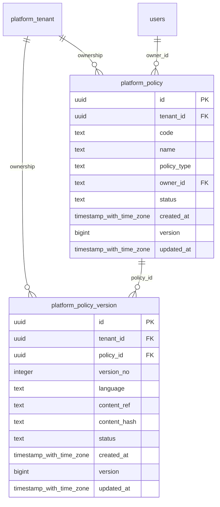

# platform-policies

Generated from Drizzle. External entities in the diagram are foreign-key targets owned by another module.

## platform_policy

Danh tính chính sách quản trị theo tenant và loại policy.

Tenant RLS: **enabled + forced by integrity migrations 0047/0049/0052**.

| Column | PostgreSQL type | Required | Default | Declared values |
|---|---|---|---|---|
| `id` | `uuid` | yes | `gen_random_uuid()` | — |
| `tenant_id` | `uuid` | yes | `—` | — |
| `code` | `text` | yes | `—` | — |
| `name` | `text` | yes | `—` | — |
| `policy_type` | `text` | yes | `—` | — |
| `owner_id` | `text` | yes | `—` | — |
| `status` | `text` | yes | `—` | `ACTIVE`, `SUSPENDED`, `RETIRED` |
| `created_at` | `timestamp with time zone` | yes | `now()` | — |
| `version` | `bigint` | yes | `1` | — |
| `updated_at` | `timestamp with time zone` | yes | `now()` | — |

Primary key: `id`.

Unique keys:

- `platform_policy_uq_0`: (`tenant_id`, `code`).
- `platform_policy_uq_1`: (`tenant_id`, `id`).

Foreign keys:

- (`tenant_id`) → `platform_tenant` (`id`); ON DELETE `restrict`.
- (`owner_id`) → `users` (`id`); ON DELETE `restrict`.

Indexes:

- `platform_policy_ix_0`: (`owner_id`).

Checks:

- `platform_policy_status_ck`: `"platform_policy"."status" in ('ACTIVE', 'SUSPENDED', 'RETIRED')`.
- `platform_policy_ck_0`: `version > 0`.

Cross-row rules and application responsibilities: [database design](../01_DATABASE_ERD_IMPLEMENTATION_COMPLETE.md) and [system flow](../02_BUSINESS_ANALYSIS_IMPLEMENTATION.md).

## platform_policy_version

Phiên bản nội dung policy có ngôn ngữ biểu diễn, hash và lifecycle publish.

Tenant RLS: **enabled + forced by integrity migrations 0047/0049/0052**.

| Column | PostgreSQL type | Required | Default | Declared values |
|---|---|---|---|---|
| `id` | `uuid` | yes | `gen_random_uuid()` | — |
| `tenant_id` | `uuid` | yes | `—` | — |
| `policy_id` | `uuid` | yes | `—` | — |
| `version_no` | `integer` | yes | `—` | — |
| `language` | `text` | yes | `—` | — |
| `content_ref` | `text` | yes | `—` | — |
| `content_hash` | `text` | yes | `—` | — |
| `status` | `text` | yes | `—` | `DRAFT`, `PUBLISHED`, `RETIRED` |
| `created_at` | `timestamp with time zone` | yes | `now()` | — |
| `version` | `bigint` | yes | `1` | — |
| `updated_at` | `timestamp with time zone` | yes | `now()` | — |

Primary key: `id`.

Unique keys:

- `platform_policy_version_uq_0`: (`tenant_id`, `policy_id`, `version_no`).
- `platform_policy_version_uq_1`: (`tenant_id`, `id`).

Foreign keys:

- (`tenant_id`) → `platform_tenant` (`id`); ON DELETE `restrict`.
- (`tenant_id`, `policy_id`) → `platform_policy` (`tenant_id`, `id`); ON DELETE `restrict`.

Indexes:

- `platform_policy_version_ix_0`: (`tenant_id`, `policy_id`).

Checks:

- `platform_policy_version_status_ck`: `"platform_policy_version"."status" in ('DRAFT', 'PUBLISHED', 'RETIRED')`.
- `platform_policy_version_ck_0`: `version_no > 0`.
- `platform_policy_version_ck_1`: `version > 0`.

Cross-row rules and application responsibilities: [database design](../01_DATABASE_ERD_IMPLEMENTATION_COMPLETE.md) and [system flow](../02_BUSINESS_ANALYSIS_IMPLEMENTATION.md).
