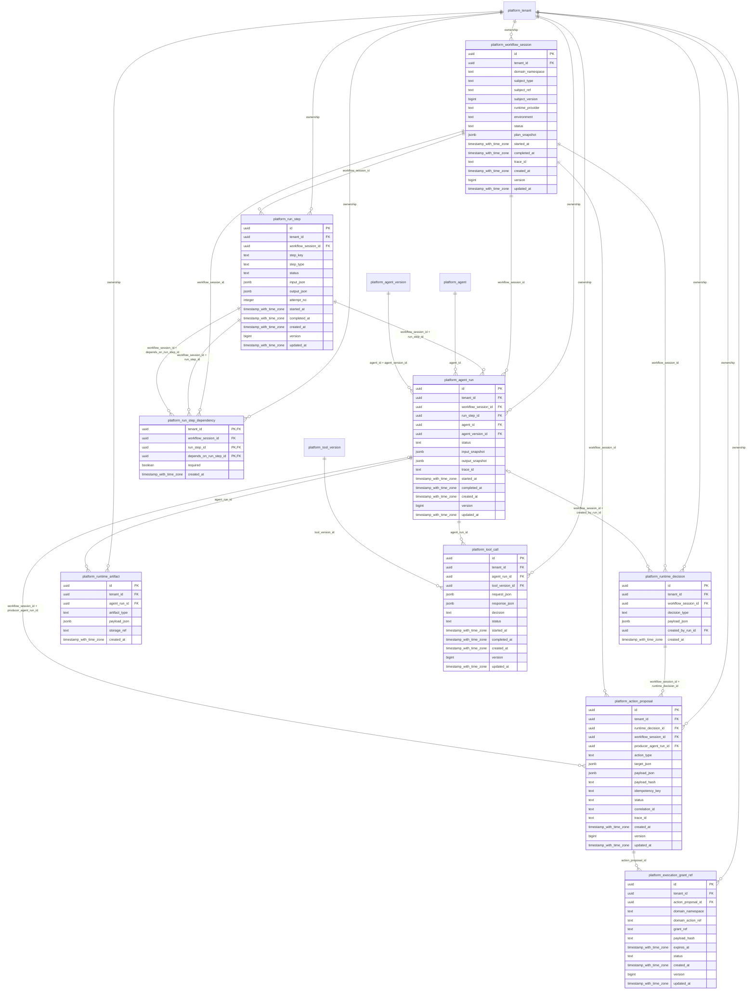

# platform-runtime

Generated from Drizzle. External entities in the diagram are foreign-key targets owned by another module.

## platform_action_proposal

Đề xuất hành động từ runtime gửi tới domain; không tự cấp quyền thực thi nghiệp vụ.

Tenant RLS: **enabled + forced by integrity migrations 0047/0049**.

| Column | PostgreSQL type | Required | Default | Declared values |
|---|---|---|---|---|
| `id` | `uuid` | yes | `gen_random_uuid()` | — |
| `tenant_id` | `uuid` | yes | `—` | — |
| `runtime_decision_id` | `uuid` | yes | `—` | — |
| `workflow_session_id` | `uuid` | yes | `—` | — |
| `producer_agent_run_id` | `uuid` | no | `—` | — |
| `action_type` | `text` | yes | `—` | — |
| `target_json` | `jsonb` | yes | `—` | — |
| `payload_json` | `jsonb` | yes | `—` | — |
| `payload_hash` | `text` | yes | `—` | — |
| `idempotency_key` | `text` | yes | `—` | — |
| `status` | `text` | yes | `—` | `PROPOSED`, `ACCEPTED`, `REJECTED` |
| `correlation_id` | `text` | yes | `—` | — |
| `trace_id` | `text` | yes | `—` | — |
| `created_at` | `timestamp with time zone` | yes | `now()` | — |
| `version` | `bigint` | yes | `1` | — |
| `updated_at` | `timestamp with time zone` | yes | `now()` | — |

Primary key: `id`.

Unique keys:

- `platform_action_proposal_uq_0`: (`tenant_id`, `idempotency_key`).
- `platform_action_proposal_uq_1`: (`tenant_id`, `id`).

Foreign keys:

- (`tenant_id`) → `platform_tenant` (`id`); ON DELETE `restrict`.
- (`tenant_id`, `workflow_session_id`, `runtime_decision_id`) → `platform_runtime_decision` (`tenant_id`, `workflow_session_id`, `id`); ON DELETE `restrict`.
- (`tenant_id`, `workflow_session_id`) → `platform_workflow_session` (`tenant_id`, `id`); ON DELETE `restrict`.
- (`tenant_id`, `workflow_session_id`, `producer_agent_run_id`) → `platform_agent_run` (`tenant_id`, `workflow_session_id`, `id`); ON DELETE `restrict`.

Indexes:

- `platform_action_proposal_ix_0`: (`tenant_id`, `workflow_session_id`, `runtime_decision_id`).
- `platform_action_proposal_ix_1`: (`tenant_id`, `workflow_session_id`, `producer_agent_run_id`).
- `platform_action_proposal_ix_2`: (`tenant_id`, `workflow_session_id`).

Checks:

- `platform_action_proposal_status_ck`: `"platform_action_proposal"."status" in ('PROPOSED', 'ACCEPTED', 'REJECTED')`.
- `platform_action_proposal_ck_0`: `version > 0`.

Additional cross-row/temporal rules: [integrity matrix](../DATABASE_DESIGN.md#integrity-matrix) and [coordination review](../COMPLETENESS_REVIEW.md).

## platform_agent_run

Một lần gọi AgentVersion trong step/session, lưu input/output snapshot và trace.

Tenant RLS: **enabled + forced by integrity migrations 0047/0049**.

| Column | PostgreSQL type | Required | Default | Declared values |
|---|---|---|---|---|
| `id` | `uuid` | yes | `gen_random_uuid()` | — |
| `tenant_id` | `uuid` | yes | `—` | — |
| `workflow_session_id` | `uuid` | yes | `—` | — |
| `run_step_id` | `uuid` | yes | `—` | — |
| `agent_id` | `uuid` | yes | `—` | — |
| `agent_version_id` | `uuid` | yes | `—` | — |
| `status` | `text` | yes | `—` | `PENDING`, `RUNNING`, `COMPLETED`, `FAILED`, `CANCELLED` |
| `input_snapshot` | `jsonb` | yes | `—` | — |
| `output_snapshot` | `jsonb` | yes | `—` | — |
| `trace_id` | `text` | yes | `—` | — |
| `started_at` | `timestamp with time zone` | no | `—` | — |
| `completed_at` | `timestamp with time zone` | no | `—` | — |
| `created_at` | `timestamp with time zone` | yes | `now()` | — |
| `version` | `bigint` | yes | `1` | — |
| `updated_at` | `timestamp with time zone` | yes | `now()` | — |

Primary key: `id`.

Unique keys:

- `platform_agent_run_uq_0`: (`tenant_id`, `id`).
- `platform_agent_run_uq_1`: (`tenant_id`, `workflow_session_id`, `id`).

Foreign keys:

- (`tenant_id`) → `platform_tenant` (`id`); ON DELETE `restrict`.
- (`tenant_id`, `workflow_session_id`) → `platform_workflow_session` (`tenant_id`, `id`); ON DELETE `restrict`.
- (`tenant_id`, `workflow_session_id`, `run_step_id`) → `platform_run_step` (`tenant_id`, `workflow_session_id`, `id`); ON DELETE `restrict`.
- (`tenant_id`, `agent_id`) → `platform_agent` (`tenant_id`, `id`); ON DELETE `restrict`.
- (`tenant_id`, `agent_id`, `agent_version_id`) → `platform_agent_version` (`tenant_id`, `agent_id`, `id`); ON DELETE `restrict`.

Indexes:

- `platform_agent_run_ix_0`: (`tenant_id`, `agent_id`, `agent_version_id`).
- `platform_agent_run_ix_1`: (`tenant_id`, `workflow_session_id`).
- `platform_agent_run_ix_2`: (`tenant_id`, `workflow_session_id`, `run_step_id`).
- `platform_agent_run_ix_3`: (`tenant_id`, `agent_id`).

Checks:

- `platform_agent_run_status_ck`: `"platform_agent_run"."status" in ('PENDING', 'RUNNING', 'COMPLETED', 'FAILED', 'CANCELLED')`.
- `platform_agent_run_ck_0`: `version > 0`.

Additional cross-row/temporal rules: [integrity matrix](../DATABASE_DESIGN.md#integrity-matrix) and [coordination review](../COMPLETENESS_REVIEW.md).

## platform_execution_grant_ref

Soft reference tới grant của domain, với payload hash và hạn hiệu lực; không chứa secret thực thi.

Tenant RLS: **enabled + forced by integrity migrations 0047/0049**.

| Column | PostgreSQL type | Required | Default | Declared values |
|---|---|---|---|---|
| `id` | `uuid` | yes | `gen_random_uuid()` | — |
| `tenant_id` | `uuid` | yes | `—` | — |
| `action_proposal_id` | `uuid` | yes | `—` | — |
| `domain_namespace` | `text` | yes | `—` | — |
| `domain_action_ref` | `text` | yes | `—` | — |
| `grant_ref` | `text` | yes | `—` | — |
| `payload_hash` | `text` | yes | `—` | — |
| `expires_at` | `timestamp with time zone` | yes | `—` | — |
| `status` | `text` | yes | `—` | `ACTIVE`, `CONSUMED`, `REVOKED`, `EXPIRED` |
| `created_at` | `timestamp with time zone` | yes | `now()` | — |
| `version` | `bigint` | yes | `1` | — |
| `updated_at` | `timestamp with time zone` | yes | `now()` | — |

Primary key: `id`.

Unique keys:

- `platform_execution_grant_ref_uq_0`: (`tenant_id`, `domain_namespace`, `grant_ref`).
- `platform_execution_grant_ref_uq_1`: (`tenant_id`, `id`).

Foreign keys:

- (`tenant_id`) → `platform_tenant` (`id`); ON DELETE `restrict`.
- (`tenant_id`, `action_proposal_id`) → `platform_action_proposal` (`tenant_id`, `id`); ON DELETE `restrict`.

Indexes:

- `platform_execution_grant_ref_ix_0`: (`tenant_id`, `action_proposal_id`).

Checks:

- `platform_execution_grant_ref_status_ck`: `"platform_execution_grant_ref"."status" in ('ACTIVE', 'CONSUMED', 'REVOKED', 'EXPIRED')`.
- `platform_execution_grant_ref_ck_0`: `version > 0`.

Additional cross-row/temporal rules: [integrity matrix](../DATABASE_DESIGN.md#integrity-matrix) and [coordination review](../COMPLETENESS_REVIEW.md).

## platform_run_step

Bước thực thi trong workflow, kèm input/output, lần thử và trạng thái.

Tenant RLS: **enabled + forced by integrity migrations 0047/0049**.

| Column | PostgreSQL type | Required | Default | Declared values |
|---|---|---|---|---|
| `id` | `uuid` | yes | `gen_random_uuid()` | — |
| `tenant_id` | `uuid` | yes | `—` | — |
| `workflow_session_id` | `uuid` | yes | `—` | — |
| `step_key` | `text` | yes | `—` | — |
| `step_type` | `text` | yes | `—` | — |
| `status` | `text` | yes | `—` | `PENDING`, `READY`, `RUNNING`, `WAITING`, `COMPLETED`, `FAILED`, `CANCELLED` |
| `input_json` | `jsonb` | yes | `—` | — |
| `output_json` | `jsonb` | yes | `—` | — |
| `attempt_no` | `integer` | yes | `—` | — |
| `started_at` | `timestamp with time zone` | no | `—` | — |
| `completed_at` | `timestamp with time zone` | no | `—` | — |
| `created_at` | `timestamp with time zone` | yes | `now()` | — |
| `version` | `bigint` | yes | `1` | — |
| `updated_at` | `timestamp with time zone` | yes | `now()` | — |

Primary key: `id`.

Unique keys:

- `platform_run_step_uq_0`: (`tenant_id`, `workflow_session_id`, `step_key`, `attempt_no`).
- `platform_run_step_uq_1`: (`tenant_id`, `id`).
- `platform_run_step_uq_2`: (`tenant_id`, `workflow_session_id`, `id`).

Foreign keys:

- (`tenant_id`) → `platform_tenant` (`id`); ON DELETE `restrict`.
- (`tenant_id`, `workflow_session_id`) → `platform_workflow_session` (`tenant_id`, `id`); ON DELETE `restrict`.

Indexes:

- `platform_run_step_ix_0`: (`tenant_id`, `workflow_session_id`).

Checks:

- `platform_run_step_status_ck`: `"platform_run_step"."status" in ('PENDING', 'READY', 'RUNNING', 'WAITING', 'COMPLETED', 'FAILED', 'CANCELLED')`.
- `platform_run_step_ck_0`: `attempt_no > 0`.
- `platform_run_step_ck_1`: `version > 0`.

Additional cross-row/temporal rules: [integrity matrix](../DATABASE_DESIGN.md#integrity-matrix) and [coordination review](../COMPLETENESS_REVIEW.md).

## platform_run_step_dependency

Quan hệ tiền nhiệm giữa các bước trong cùng session; graph không được có chu trình.

Tenant RLS: **enabled + forced by integrity migrations 0047/0049**.

| Column | PostgreSQL type | Required | Default | Declared values |
|---|---|---|---|---|
| `tenant_id` | `uuid` | yes | `—` | — |
| `workflow_session_id` | `uuid` | yes | `—` | — |
| `run_step_id` | `uuid` | yes | `—` | — |
| `depends_on_run_step_id` | `uuid` | yes | `—` | — |
| `required` | `boolean` | yes | `—` | — |
| `created_at` | `timestamp with time zone` | yes | `now()` | — |

Primary key: `tenant_id`, `run_step_id`, `depends_on_run_step_id`.

Foreign keys:

- (`tenant_id`) → `platform_tenant` (`id`); ON DELETE `restrict`.
- (`tenant_id`, `workflow_session_id`) → `platform_workflow_session` (`tenant_id`, `id`); ON DELETE `restrict`.
- (`tenant_id`, `workflow_session_id`, `run_step_id`) → `platform_run_step` (`tenant_id`, `workflow_session_id`, `id`); ON DELETE `restrict`.
- (`tenant_id`, `workflow_session_id`, `depends_on_run_step_id`) → `platform_run_step` (`tenant_id`, `workflow_session_id`, `id`); ON DELETE `restrict`.

Indexes:

- `platform_run_step_dependency_ix_0`: (`tenant_id`, `workflow_session_id`, `depends_on_run_step_id`).
- `platform_run_step_dependency_ix_1`: (`tenant_id`, `workflow_session_id`).
- `platform_run_step_dependency_ix_2`: (`tenant_id`, `workflow_session_id`, `run_step_id`).

Checks:

- `platform_run_step_dependency_ck_0`: `run_step_id <> depends_on_run_step_id`.

Additional cross-row/temporal rules: [integrity matrix](../DATABASE_DESIGN.md#integrity-matrix) and [coordination review](../COMPLETENESS_REVIEW.md).

## platform_runtime_artifact

Artifact có cấu trúc hoặc external storage reference do agent run tạo ra.

Tenant RLS: **enabled + forced by integrity migrations 0047/0049**.

| Column | PostgreSQL type | Required | Default | Declared values |
|---|---|---|---|---|
| `id` | `uuid` | yes | `gen_random_uuid()` | — |
| `tenant_id` | `uuid` | yes | `—` | — |
| `agent_run_id` | `uuid` | yes | `—` | — |
| `artifact_type` | `text` | yes | `—` | — |
| `payload_json` | `jsonb` | yes | `—` | — |
| `storage_ref` | `text` | no | `—` | — |
| `created_at` | `timestamp with time zone` | yes | `now()` | — |

Primary key: `id`.

Unique keys:

- `platform_runtime_artifact_uq_0`: (`tenant_id`, `id`).

Foreign keys:

- (`tenant_id`) → `platform_tenant` (`id`); ON DELETE `restrict`.
- (`tenant_id`, `agent_run_id`) → `platform_agent_run` (`tenant_id`, `id`); ON DELETE `restrict`.

Indexes:

- `platform_runtime_artifact_ix_0`: (`tenant_id`, `agent_run_id`).

Additional cross-row/temporal rules: [integrity matrix](../DATABASE_DESIGN.md#integrity-matrix) and [coordination review](../COMPLETENESS_REVIEW.md).

## platform_runtime_decision

Quyết định vận hành được công bố trong workflow và run đã tạo quyết định đó.

Tenant RLS: **enabled + forced by integrity migrations 0047/0049**.

| Column | PostgreSQL type | Required | Default | Declared values |
|---|---|---|---|---|
| `id` | `uuid` | yes | `gen_random_uuid()` | — |
| `tenant_id` | `uuid` | yes | `—` | — |
| `workflow_session_id` | `uuid` | yes | `—` | — |
| `decision_type` | `text` | yes | `—` | — |
| `payload_json` | `jsonb` | yes | `—` | — |
| `created_by_run_id` | `uuid` | no | `—` | — |
| `created_at` | `timestamp with time zone` | yes | `now()` | — |

Primary key: `id`.

Unique keys:

- `platform_runtime_decision_uq_0`: (`tenant_id`, `id`).
- `platform_runtime_decision_uq_1`: (`tenant_id`, `workflow_session_id`, `id`).

Foreign keys:

- (`tenant_id`) → `platform_tenant` (`id`); ON DELETE `restrict`.
- (`tenant_id`, `workflow_session_id`) → `platform_workflow_session` (`tenant_id`, `id`); ON DELETE `restrict`.
- (`tenant_id`, `workflow_session_id`, `created_by_run_id`) → `platform_agent_run` (`tenant_id`, `workflow_session_id`, `id`); ON DELETE `restrict`.

Indexes:

- `platform_runtime_decision_ix_0`: (`tenant_id`, `workflow_session_id`, `created_by_run_id`).
- `platform_runtime_decision_ix_1`: (`tenant_id`, `workflow_session_id`).

Additional cross-row/temporal rules: [integrity matrix](../DATABASE_DESIGN.md#integrity-matrix) and [coordination review](../COMPLETENESS_REVIEW.md).

## platform_tool_call

Lần gọi ToolVersion của agent run, kết quả policy, request/response và trạng thái.

Tenant RLS: **enabled + forced by integrity migrations 0047/0049**.

| Column | PostgreSQL type | Required | Default | Declared values |
|---|---|---|---|---|
| `id` | `uuid` | yes | `gen_random_uuid()` | — |
| `tenant_id` | `uuid` | yes | `—` | — |
| `agent_run_id` | `uuid` | yes | `—` | — |
| `tool_version_id` | `uuid` | yes | `—` | — |
| `request_json` | `jsonb` | yes | `—` | — |
| `response_json` | `jsonb` | yes | `—` | — |
| `decision` | `text` | yes | `—` | `ALLOW`, `DENY`, `REQUIRE_APPROVAL` |
| `status` | `text` | yes | `—` | `PENDING`, `RUNNING`, `SUCCEEDED`, `FAILED`, `DENIED` |
| `started_at` | `timestamp with time zone` | no | `—` | — |
| `completed_at` | `timestamp with time zone` | no | `—` | — |
| `created_at` | `timestamp with time zone` | yes | `now()` | — |
| `version` | `bigint` | yes | `1` | — |
| `updated_at` | `timestamp with time zone` | yes | `now()` | — |

Primary key: `id`.

Unique keys:

- `platform_tool_call_uq_0`: (`tenant_id`, `id`).

Foreign keys:

- (`tenant_id`) → `platform_tenant` (`id`); ON DELETE `restrict`.
- (`tenant_id`, `agent_run_id`) → `platform_agent_run` (`tenant_id`, `id`); ON DELETE `restrict`.
- (`tenant_id`, `tool_version_id`) → `platform_tool_version` (`tenant_id`, `id`); ON DELETE `restrict`.

Indexes:

- `platform_tool_call_ix_0`: (`tenant_id`, `agent_run_id`).
- `platform_tool_call_ix_1`: (`tenant_id`, `tool_version_id`).

Checks:

- `platform_tool_call_decision_ck`: `"platform_tool_call"."decision" in ('ALLOW', 'DENY', 'REQUIRE_APPROVAL')`.
- `platform_tool_call_status_ck`: `"platform_tool_call"."status" in ('PENDING', 'RUNNING', 'SUCCEEDED', 'FAILED', 'DENIED')`.
- `platform_tool_call_ck_0`: `version > 0`.

Additional cross-row/temporal rules: [integrity matrix](../DATABASE_DESIGN.md#integrity-matrix) and [coordination review](../COMPLETENESS_REVIEW.md).

## platform_workflow_session

Một đợt phối hợp xử lý subject nghiệp vụ qua soft reference, tách khỏi conversation và vòng đời ticket.

Tenant RLS: **enabled + forced by integrity migrations 0047/0049**.

| Column | PostgreSQL type | Required | Default | Declared values |
|---|---|---|---|---|
| `id` | `uuid` | yes | `gen_random_uuid()` | — |
| `tenant_id` | `uuid` | yes | `—` | — |
| `domain_namespace` | `text` | yes | `—` | — |
| `subject_type` | `text` | yes | `—` | — |
| `subject_ref` | `text` | yes | `—` | — |
| `subject_version` | `bigint` | no | `—` | — |
| `runtime_provider` | `text` | yes | `—` | — |
| `environment` | `text` | yes | `—` | `DEVELOPMENT`, `STAGING`, `PRODUCTION` |
| `status` | `text` | yes | `—` | `PENDING`, `RUNNING`, `WAITING`, `COMPLETED`, `FAILED`, `CANCELLED` |
| `plan_snapshot` | `jsonb` | yes | `—` | — |
| `started_at` | `timestamp with time zone` | no | `—` | — |
| `completed_at` | `timestamp with time zone` | no | `—` | — |
| `trace_id` | `text` | yes | `—` | — |
| `created_at` | `timestamp with time zone` | yes | `now()` | — |
| `version` | `bigint` | yes | `1` | — |
| `updated_at` | `timestamp with time zone` | yes | `now()` | — |

Primary key: `id`.

Unique keys:

- `platform_workflow_session_uq_0`: (`tenant_id`, `id`).

Foreign keys:

- (`tenant_id`) → `platform_tenant` (`id`); ON DELETE `restrict`.

Indexes:

- `platform_workflow_session_ix_0`: (`tenant_id`, `domain_namespace`, `subject_ref`).
- `platform_workflow_session_ix_1`: (`tenant_id`, `status`, `created_at`).

Checks:

- `platform_workflow_session_status_ck`: `"platform_workflow_session"."status" in ('PENDING', 'RUNNING', 'WAITING', 'COMPLETED', 'FAILED', 'CANCELLED')`.
- `platform_workflow_session_ck_0`: `version > 0`.
- `platform_workflow_session_environment_ck`: `"platform_workflow_session"."environment" in ('DEVELOPMENT', 'STAGING', 'PRODUCTION')`.

Additional cross-row/temporal rules: [integrity matrix](../DATABASE_DESIGN.md#integrity-matrix) and [coordination review](../COMPLETENESS_REVIEW.md).
