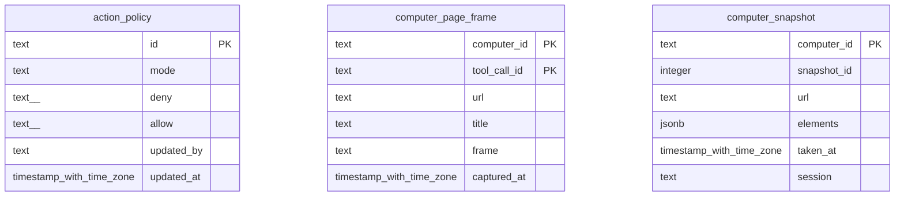

# shell-computer

Generated from Drizzle. External entities in the diagram are foreign-key targets owned by another module.

## action_policy

Chính sách thao tác computer/shell theo mô hình upstream; không phải quy tắc phê duyệt ActionRequest Vinhomes.

Tenant RLS: **existing shell table; application authorization, no workforce tenant policy**.

| Column | PostgreSQL type | Required | Default | Declared values |
|---|---|---|---|---|
| `id` | `text` | yes | `—` | — |
| `mode` | `text` | yes | `—` | — |
| `deny` | `text[]` | yes | `—` | — |
| `allow` | `text[]` | yes | `—` | — |
| `updated_by` | `text` | no | `—` | — |
| `updated_at` | `timestamp with time zone` | yes | `now()` | — |

Primary key: `id`.

Additional cross-row/temporal rules: [integrity matrix](../DATABASE_DESIGN.md#integrity-matrix) and [coordination review](../COMPLETENESS_REVIEW.md).

## computer_page_frame

Metadata frame/trang chụp trong phiên computer; quản lý retention riêng.

Tenant RLS: **existing shell table; application authorization, no workforce tenant policy**.

| Column | PostgreSQL type | Required | Default | Declared values |
|---|---|---|---|---|
| `computer_id` | `text` | yes | `—` | — |
| `tool_call_id` | `text` | yes | `—` | — |
| `url` | `text` | yes | `—` | — |
| `title` | `text` | no | `—` | — |
| `frame` | `text` | yes | `—` | — |
| `captured_at` | `timestamp with time zone` | yes | `now()` | — |

Primary key: `computer_id`, `tool_call_id`.

Indexes:

- `computer_page_frame_captured_idx`: (`captured_at`).

Additional cross-row/temporal rules: [integrity matrix](../DATABASE_DESIGN.md#integrity-matrix) and [coordination review](../COMPLETENESS_REVIEW.md).

## computer_snapshot

Snapshot phiên computer phục vụ khôi phục hoặc điều tra tương tác desktop/browser.

Tenant RLS: **existing shell table; application authorization, no workforce tenant policy**.

| Column | PostgreSQL type | Required | Default | Declared values |
|---|---|---|---|---|
| `computer_id` | `text` | yes | `—` | — |
| `snapshot_id` | `integer` | yes | `—` | — |
| `url` | `text` | yes | `—` | — |
| `elements` | `jsonb` | yes | `—` | — |
| `taken_at` | `timestamp with time zone` | yes | `now()` | — |
| `session` | `text` | no | `—` | — |

Primary key: `computer_id`.

Additional cross-row/temporal rules: [integrity matrix](../DATABASE_DESIGN.md#integrity-matrix) and [coordination review](../COMPLETENESS_REVIEW.md).
