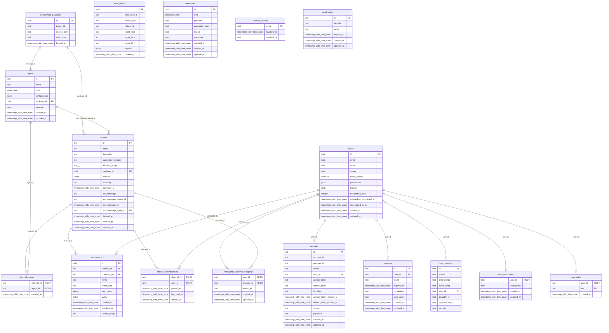

# shell-core

Generated from Drizzle. External entities in the diagram are foreign-key targets owned by another module.

## accounts

Liên kết người dùng với tài khoản nhà cung cấp đăng nhập, issuer và thông tin xác thực do Better Auth quản lý.

Tenant RLS: **existing shell table; application authorization, no workforce tenant policy**.

| Column | PostgreSQL type | Required | Default | Declared values |
|---|---|---|---|---|
| `id` | `text` | yes | `—` | — |
| `account_id` | `text` | yes | `—` | — |
| `provider_id` | `text` | yes | `—` | — |
| `issuer` | `text` | no | `—` | — |
| `user_id` | `text` | yes | `—` | — |
| `access_token` | `text` | no | `—` | — |
| `refresh_token` | `text` | no | `—` | — |
| `id_token` | `text` | no | `—` | — |
| `access_token_expires_at` | `timestamp with time zone` | no | `—` | — |
| `refresh_token_expires_at` | `timestamp with time zone` | no | `—` | — |
| `scope` | `text` | no | `—` | — |
| `password` | `text` | no | `—` | — |
| `created_at` | `timestamp with time zone` | yes | `now()` | — |
| `updated_at` | `timestamp with time zone` | yes | `now()` | — |

Primary key: `id`.

Foreign keys:

- (`user_id`) → `users` (`id`); ON DELETE `cascade`.

Indexes:

- `accounts_provider_account_idx` UNIQUE: (`provider_id`, `account_id`).

Additional cross-row/temporal rules: [integrity matrix](../DATABASE_DESIGN.md#integrity-matrix) and [coordination review](../COMPLETENESS_REVIEW.md).

## agents

Agent được đăng ký trong shell OpenBot và cấu hình kết nối runtime; khác registry phiên bản có governance của platform.

Tenant RLS: **existing shell table; application authorization, no workforce tenant policy**.

| Column | PostgreSQL type | Required | Default | Declared values |
|---|---|---|---|---|
| `id` | `text` | yes | `—` | — |
| `name` | `text` | yes | `—` | — |
| `type` | `agent_type` | yes | `—` | `built_in`, `remote_ag_ui`, `remote_mastra` |
| `configuration` | `jsonb` | yes | `—` | — |
| `package_id` | `uuid` | no | `—` | — |
| `override` | `jsonb` | no | `—` | — |
| `created_at` | `timestamp with time zone` | yes | `now()` | — |
| `updated_at` | `timestamp with time zone` | yes | `now()` | — |

Primary key: `id`.

Foreign keys:

- (`package_id`) → `deployment_packages` (`id`); ON DELETE `set null`.

Additional cross-row/temporal rules: [integrity matrix](../DATABASE_DESIGN.md#integrity-matrix) and [coordination review](../COMPLETENESS_REVIEW.md).

## attachments

File đính kèm trong hội thoại shell với vòng đời staged/sent; không thay evidence nghiệp vụ Vinhomes.

Tenant RLS: **existing shell table; application authorization, no workforce tenant policy**.

| Column | PostgreSQL type | Required | Default | Declared values |
|---|---|---|---|---|
| `id` | `uuid` | yes | `gen_random_uuid()` | — |
| `channel_id` | `text` | yes | `—` | — |
| `uploaded_by` | `text` | yes | `—` | — |
| `name` | `text` | yes | `—` | — |
| `mime_type` | `text` | yes | `—` | — |
| `size_bytes` | `integer` | yes | `—` | — |
| `bytes` | `bytea` | yes | `—` | — |
| `created_at` | `timestamp with time zone` | yes | `now()` | — |
| `attached_at` | `timestamp with time zone` | no | `—` | — |
| `upload_group` | `text` | no | `—` | — |

Primary key: `id`.

Foreign keys:

- (`channel_id`) → `channels` (`id`); ON DELETE `cascade`.
- (`uploaded_by`) → `users` (`id`); ON DELETE `cascade`.

Indexes:

- `attachments_channel_idx`: (`channel_id`).
- `attachments_uploaded_by_idx`: (`uploaded_by`).
- `attachments_upload_group_idx`: (`channel_id`, `uploaded_by`, `upload_group`) WHERE `"attachments"."attached_at" is null`.
- `attachments_staged_idx`: (`created_at`) WHERE `"attachments"."attached_at" is null`.

Additional cross-row/temporal rules: [integrity matrix](../DATABASE_DESIGN.md#integrity-matrix) and [coordination review](../COMPLETENESS_REVIEW.md).

## audit_events

Audit append-only của shell OpenBot; tách với audit quản trị platform và business events Vinhomes.

Tenant RLS: **existing shell table; application authorization, no workforce tenant policy**.

| Column | PostgreSQL type | Required | Default | Declared values |
|---|---|---|---|---|
| `id` | `uuid` | yes | `gen_random_uuid()` | — |
| `actor_user_id` | `text` | no | `—` | — |
| `initiator_kind` | `text` | yes | `person` | — |
| `initiator_id` | `text` | no | `—` | — |
| `event_type` | `text` | yes | `—` | — |
| `target_type` | `text` | yes | `—` | — |
| `target_id` | `text` | no | `—` | — |
| `payload` | `jsonb` | yes | `—` | — |
| `created_at` | `timestamp with time zone` | yes | `now()` | — |

Primary key: `id`.

Indexes:

- `audit_events_created_at_idx`: (`created_at`).
- `audit_events_type_time_idx`: (`event_type`, `created_at`, `id`).
- `audit_events_actor_time_idx`: (`actor_user_id`, `created_at`, `id`).
- `audit_events_target_time_idx`: (`target_type`, `target_id`, `created_at`, `id`).
- `audit_events_initiator_time_idx`: (`initiator_kind`, `created_at`, `id`).

Additional cross-row/temporal rules: [integrity matrix](../DATABASE_DESIGN.md#integrity-matrix) and [coordination review](../COMPLETENESS_REVIEW.md).

## channel_agents

Danh sách agent shell được gắn vào một kênh; không thay roster có phiên bản của workflow.

Tenant RLS: **existing shell table; application authorization, no workforce tenant policy**.

| Column | PostgreSQL type | Required | Default | Declared values |
|---|---|---|---|---|
| `channel_id` | `text` | yes | `—` | — |
| `agent_id` | `text` | yes | `—` | — |
| `created_at` | `timestamp with time zone` | yes | `now()` | — |

Primary key: `channel_id`, `agent_id`.

Foreign keys:

- (`channel_id`) → `channels` (`id`); ON DELETE `cascade`.
- (`agent_id`) → `agents` (`id`); ON DELETE `cascade`.

Additional cross-row/temporal rules: [integrity matrix](../DATABASE_DESIGN.md#integrity-matrix) and [coordination review](../COMPLETENESS_REVIEW.md).

## channel_memberships

Quyền thành viên và dấu đã đọc của người dùng trên từng kênh OpenBot.

Tenant RLS: **existing shell table; application authorization, no workforce tenant policy**.

| Column | PostgreSQL type | Required | Default | Declared values |
|---|---|---|---|---|
| `channel_id` | `text` | yes | `—` | — |
| `user_id` | `text` | yes | `—` | — |
| `pinned_at` | `timestamp with time zone` | no | `—` | — |
| `last_read_at` | `timestamp with time zone` | no | `—` | — |
| `created_at` | `timestamp with time zone` | yes | `now()` | — |

Primary key: `channel_id`, `user_id`.

Foreign keys:

- (`channel_id`) → `channels` (`id`); ON DELETE `cascade`.
- (`user_id`) → `users` (`id`); ON DELETE `cascade`.

Additional cross-row/temporal rules: [integrity matrix](../DATABASE_DESIGN.md#integrity-matrix) and [coordination review](../COMPLETENESS_REVIEW.md).

## channels

Kênh hội thoại của shell, cấu hình hiển thị và trạng thái hoạt động gần nhất; không phải ticket hoặc group chat workflow.

Tenant RLS: **existing shell table; application authorization, no workforce tenant policy**.

| Column | PostgreSQL type | Required | Default | Declared values |
|---|---|---|---|---|
| `id` | `text` | yes | `—` | — |
| `name` | `text` | yes | `—` | — |
| `description` | `text` | yes | `—` | — |
| `suggested_prompts` | `text[]` | yes | `[]` | — |
| `allowed_groups` | `text[]` | yes | `[]` | — |
| `package_id` | `uuid` | no | `—` | — |
| `override` | `jsonb` | no | `—` | — |
| `summary` | `text` | no | `—` | — |
| `summary_at` | `timestamp with time zone` | no | `—` | — |
| `last_message` | `text` | no | `—` | — |
| `last_message_source_id` | `text` | no | `—` | — |
| `last_message_at` | `timestamp with time zone` | no | `—` | — |
| `last_message_agent_id` | `text` | no | `—` | — |
| `deleted_at` | `timestamp with time zone` | no | `—` | — |
| `created_at` | `timestamp with time zone` | yes | `now()` | — |
| `updated_at` | `timestamp with time zone` | yes | `now()` | — |

Primary key: `id`.

Foreign keys:

- (`package_id`) → `deployment_packages` (`id`); ON DELETE `set null`.
- (`last_message_agent_id`) → `agents` (`id`); ON DELETE `set null`.

Indexes:

- `channels_recent_activity_idx`: (`COALESCE("channels"."last_message_at", "channels"."created_at") DESC`).
- `channels_awaiting_summary_idx`: (`id`) WHERE `"channels"."summary" is null and "channels"."deleted_at" is null`.

Additional cross-row/temporal rules: [integrity matrix](../DATABASE_DESIGN.md#integrity-matrix) and [coordination review](../COMPLETENESS_REVIEW.md).

## credentials

Hạ tầng credential của shell cho model, connector, agent và MCP; không đưa secret vào AgentSpec hoặc message.

Tenant RLS: **existing shell table; application authorization, no workforce tenant policy**.

| Column | PostgreSQL type | Required | Default | Declared values |
|---|---|---|---|---|
| `id` | `uuid` | yes | `gen_random_uuid()` | — |
| `kind` | `credential_kind` | yes | `—` | `model`, `connector`, `agent`, `mcp`, `mcp_oauth_client`, `mcp_user_token` |
| `provider` | `text` | yes | `—` | — |
| `encrypted_value` | `text` | yes | `—` | — |
| `key_id` | `text` | yes | `—` | — |
| `metadata` | `jsonb` | yes | `—` | — |
| `revoked_at` | `timestamp with time zone` | no | `—` | — |
| `created_at` | `timestamp with time zone` | yes | `now()` | — |
| `updated_at` | `timestamp with time zone` | yes | `now()` | — |

Primary key: `id`.

Indexes:

- `credentials_active_key_idx` UNIQUE: (`kind`, `provider`, `key_id`) WHERE `"credentials"."revoked_at" IS NULL`.

Additional cross-row/temporal rules: [integrity matrix](../DATABASE_DESIGN.md#integrity-matrix) and [coordination review](../COMPLETENESS_REVIEW.md).

## deployment_packages

Metadata gói cấu hình tenant mà OpenBot đã nạp, kèm đường dẫn/checksum; tenant_id text cũ không mặc nhiên là workforce tenant UUID.

Tenant RLS: **existing shell table; application authorization, no workforce tenant policy**.

| Column | PostgreSQL type | Required | Default | Declared values |
|---|---|---|---|---|
| `id` | `uuid` | yes | `gen_random_uuid()` | — |
| `tenant_id` | `text` | yes | `—` | — |
| `source_path` | `text` | yes | `—` | — |
| `checksum` | `text` | yes | `—` | — |
| `loaded_at` | `timestamp with time zone` | yes | `now()` | — |

Primary key: `id`.

Unique keys:

- `deployment_packages_tenant_id_unique`: (`tenant_id`).

Additional cross-row/temporal rules: [integrity matrix](../DATABASE_DESIGN.md#integrity-matrix) and [coordination review](../COMPLETENESS_REVIEW.md).

## intelligence_channel_mappings

Ánh xạ kênh shell sang tài nguyên hội thoại của integration intelligence.

Tenant RLS: **existing shell table; application authorization, no workforce tenant policy**.

| Column | PostgreSQL type | Required | Default | Declared values |
|---|---|---|---|---|
| `user_id` | `text` | yes | `—` | — |
| `channel_id` | `text` | yes | `—` | — |
| `thread_id` | `text` | yes | `—` | — |
| `created_at` | `timestamp with time zone` | yes | `now()` | — |
| `updated_at` | `timestamp with time zone` | yes | `now()` | — |

Primary key: `user_id`, `channel_id`.

Foreign keys:

- (`user_id`) → `users` (`id`); ON DELETE `cascade`.
- (`channel_id`) → `channels` (`id`); ON DELETE `cascade`.

Indexes:

- `intelligence_channel_mappings_thread_idx` UNIQUE: (`thread_id`).

Additional cross-row/temporal rules: [integrity matrix](../DATABASE_DESIGN.md#integrity-matrix) and [coordination review](../COMPLETENESS_REVIEW.md).

## revoked_access

Ghi nhận quyền truy cập đã thu hồi để shell từ chối các phiên hoặc chủ thể tương ứng.

Tenant RLS: **existing shell table; application authorization, no workforce tenant policy**.

| Column | PostgreSQL type | Required | Default | Declared values |
|---|---|---|---|---|
| `email` | `text` | yes | `—` | — |
| `revoked_at` | `timestamp with time zone` | yes | `now()` | — |
| `revoked_by` | `text` | yes | `—` | — |

Primary key: `email`.

Additional cross-row/temporal rules: [integrity matrix](../DATABASE_DESIGN.md#integrity-matrix) and [coordination review](../COMPLETENESS_REVIEW.md).

## sessions

Phiên đăng nhập của người dùng; khác workflow session xử lý nghiệp vụ của agent.

Tenant RLS: **existing shell table; application authorization, no workforce tenant policy**.

| Column | PostgreSQL type | Required | Default | Declared values |
|---|---|---|---|---|
| `id` | `text` | yes | `—` | — |
| `user_id` | `text` | yes | `—` | — |
| `token` | `text` | yes | `—` | — |
| `expires_at` | `timestamp with time zone` | yes | `—` | — |
| `ip_address` | `text` | no | `—` | — |
| `user_agent` | `text` | no | `—` | — |
| `created_at` | `timestamp with time zone` | yes | `now()` | — |
| `updated_at` | `timestamp with time zone` | yes | `now()` | — |

Primary key: `id`.

Unique keys:

- `sessions_token_unique`: (`token`).

Foreign keys:

- (`user_id`) → `users` (`id`); ON DELETE `cascade`.

Additional cross-row/temporal rules: [integrity matrix](../DATABASE_DESIGN.md#integrity-matrix) and [coordination review](../COMPLETENESS_REVIEW.md).

## sso_providers

Cấu hình nhà cung cấp SSO và miền tổ chức; thuộc hạ tầng đăng nhập.

Tenant RLS: **existing shell table; application authorization, no workforce tenant policy**.

| Column | PostgreSQL type | Required | Default | Declared values |
|---|---|---|---|---|
| `id` | `text` | yes | `—` | — |
| `issuer` | `text` | yes | `—` | — |
| `oidc_config` | `text` | no | `—` | — |
| `saml_config` | `text` | no | `—` | — |
| `user_id` | `text` | no | `—` | — |
| `provider_id` | `text` | yes | `—` | — |
| `organization_id` | `text` | no | `—` | — |
| `domain` | `text` | yes | `—` | — |

Primary key: `id`.

Unique keys:

- `sso_providers_provider_id_unique`: (`provider_id`).

Foreign keys:

- (`user_id`) → `users` (`id`); ON DELETE `set null`.

Additional cross-row/temporal rules: [integrity matrix](../DATABASE_DESIGN.md#integrity-matrix) and [coordination review](../COMPLETENESS_REVIEW.md).

## user_instructions

Hướng dẫn cá nhân do người dùng cấu hình cho trợ lý trong shell.

Tenant RLS: **existing shell table; application authorization, no workforce tenant policy**.

| Column | PostgreSQL type | Required | Default | Declared values |
|---|---|---|---|---|
| `user_id` | `text` | yes | `—` | — |
| `instructions` | `text` | yes | `—` | — |
| `created_at` | `timestamp with time zone` | yes | `now()` | — |
| `updated_at` | `timestamp with time zone` | yes | `now()` | — |

Primary key: `user_id`.

Foreign keys:

- (`user_id`) → `users` (`id`); ON DELETE `cascade`.

Additional cross-row/temporal rules: [integrity matrix](../DATABASE_DESIGN.md#integrity-matrix) and [coordination review](../COMPLETENESS_REVIEW.md).

## user_roles

Vai trò quản trị/người dùng của shell OpenBot; không thay quyền tenant/property của workforce.

Tenant RLS: **existing shell table; application authorization, no workforce tenant policy**.

| Column | PostgreSQL type | Required | Default | Declared values |
|---|---|---|---|---|
| `user_id` | `text` | yes | `—` | — |
| `role` | `role` | yes | `—` | `admin`, `user` |
| `created_at` | `timestamp with time zone` | yes | `now()` | — |

Primary key: `user_id`, `role`.

Foreign keys:

- (`user_id`) → `users` (`id`); ON DELETE `cascade`.

Additional cross-row/temporal rules: [integrity matrix](../DATABASE_DESIGN.md#integrity-matrix) and [coordination review](../COMPLETENESS_REVIEW.md).

## users

Danh tính người dùng dùng chung của OpenBot/Better Auth; Vinhomes và platform tham chiếu ID text này, không tạo tài khoản song song.

Tenant RLS: **existing shell table; application authorization, no workforce tenant policy**.

| Column | PostgreSQL type | Required | Default | Declared values |
|---|---|---|---|---|
| `id` | `text` | yes | `—` | — |
| `email` | `text` | yes | `—` | — |
| `name` | `text` | no | `—` | — |
| `image` | `text` | no | `—` | — |
| `email_verified` | `boolean` | yes | `false` | — |
| `preferences` | `jsonb` | yes | `{}` | — |
| `groups` | `text[]` | yes | `[]` | — |
| `onboarding_step` | `integer` | yes | `0` | — |
| `onboarding_completed_at` | `timestamp with time zone` | no | `—` | — |
| `last_signed_in_at` | `timestamp with time zone` | no | `—` | — |
| `created_at` | `timestamp with time zone` | yes | `now()` | — |
| `updated_at` | `timestamp with time zone` | yes | `now()` | — |

Primary key: `id`.

Unique keys:

- `users_email_unique`: (`email`).

Additional cross-row/temporal rules: [integrity matrix](../DATABASE_DESIGN.md#integrity-matrix) and [coordination review](../COMPLETENESS_REVIEW.md).

## verifications

Dữ liệu xác minh có thời hạn phục vụ các luồng xác thực.

Tenant RLS: **existing shell table; application authorization, no workforce tenant policy**.

| Column | PostgreSQL type | Required | Default | Declared values |
|---|---|---|---|---|
| `id` | `text` | yes | `—` | — |
| `identifier` | `text` | yes | `—` | — |
| `value` | `text` | yes | `—` | — |
| `expires_at` | `timestamp with time zone` | yes | `—` | — |
| `created_at` | `timestamp with time zone` | yes | `now()` | — |
| `updated_at` | `timestamp with time zone` | yes | `now()` | — |

Primary key: `id`.

Additional cross-row/temporal rules: [integrity matrix](../DATABASE_DESIGN.md#integrity-matrix) and [coordination review](../COMPLETENESS_REVIEW.md).
