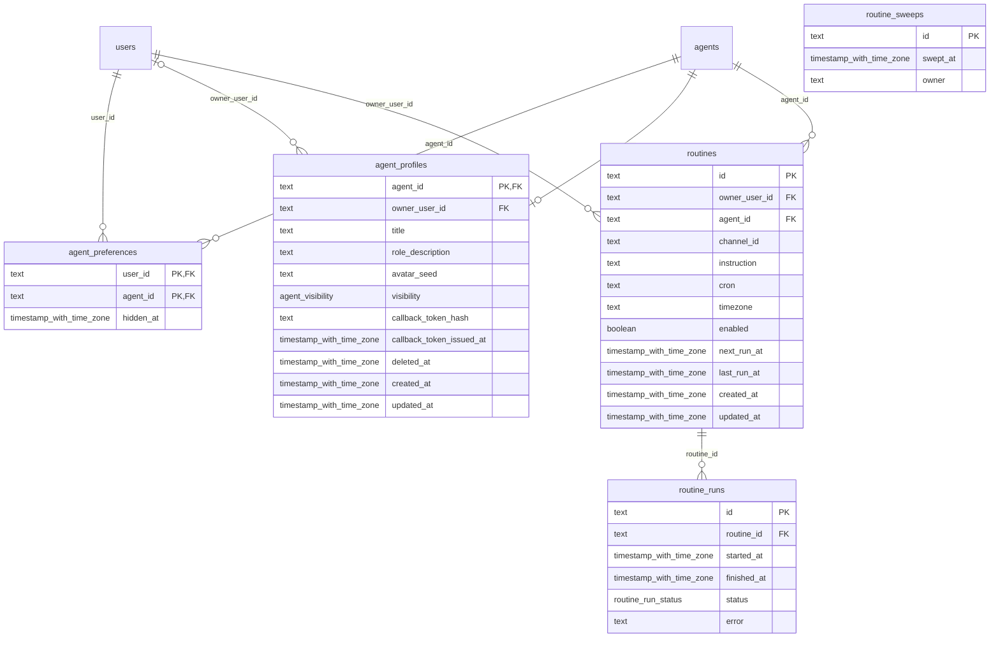

# shell-coworker

Generated from Drizzle. External entities in the diagram are foreign-key targets owned by another module.

## agent_preferences

Tùy chọn riêng của người dùng đối với agent shell, như ẩn agent khỏi danh sách.

Tenant RLS: **existing shell table; application authorization, no workforce tenant policy**.

| Column | PostgreSQL type | Required | Default | Declared values |
|---|---|---|---|---|
| `user_id` | `text` | yes | `—` | — |
| `agent_id` | `text` | yes | `—` | — |
| `hidden_at` | `timestamp with time zone` | no | `—` | — |

Primary key: `user_id`, `agent_id`.

Foreign keys:

- (`user_id`) → `users` (`id`); ON DELETE `cascade`.
- (`agent_id`) → `agents` (`id`); ON DELETE `cascade`.

Additional cross-row/temporal rules: [integrity matrix](../DATABASE_DESIGN.md#integrity-matrix) and [coordination review](../COMPLETENESS_REVIEW.md).

## agent_profiles

Hồ sơ hiển thị, ownership, visibility và callback credential hash của agent shell.

Tenant RLS: **existing shell table; application authorization, no workforce tenant policy**.

| Column | PostgreSQL type | Required | Default | Declared values |
|---|---|---|---|---|
| `agent_id` | `text` | yes | `—` | — |
| `owner_user_id` | `text` | no | `—` | — |
| `title` | `text` | yes | `—` | — |
| `role_description` | `text` | yes | `—` | — |
| `avatar_seed` | `text` | yes | `—` | — |
| `visibility` | `agent_visibility` | yes | `—` | `public`, `private` |
| `callback_token_hash` | `text` | no | `—` | — |
| `callback_token_issued_at` | `timestamp with time zone` | no | `—` | — |
| `deleted_at` | `timestamp with time zone` | no | `—` | — |
| `created_at` | `timestamp with time zone` | yes | `now()` | — |
| `updated_at` | `timestamp with time zone` | yes | `now()` | — |

Primary key: `agent_id`.

Foreign keys:

- (`agent_id`) → `agents` (`id`); ON DELETE `cascade`.
- (`owner_user_id`) → `users` (`id`); ON DELETE `set null`.

Indexes:

- `agent_profiles_visibility_deleted_idx`: (`visibility`, `deleted_at`).

Additional cross-row/temporal rules: [integrity matrix](../DATABASE_DESIGN.md#integrity-matrix) and [coordination review](../COMPLETENESS_REVIEW.md).

## routine_runs

Lịch sử kết quả mỗi lần thực hiện routine, gồm thành công/thất bại/bỏ qua.

Tenant RLS: **existing shell table; application authorization, no workforce tenant policy**.

| Column | PostgreSQL type | Required | Default | Declared values |
|---|---|---|---|---|
| `id` | `text` | yes | `—` | — |
| `routine_id` | `text` | yes | `—` | — |
| `started_at` | `timestamp with time zone` | yes | `now()` | — |
| `finished_at` | `timestamp with time zone` | no | `—` | — |
| `status` | `routine_run_status` | no | `—` | `succeeded`, `failed`, `skipped` |
| `error` | `text` | no | `—` | — |

Primary key: `id`.

Foreign keys:

- (`routine_id`) → `routines` (`id`); ON DELETE `cascade`.

Indexes:

- `routine_runs_by_routine_idx`: (`routine_id`, `started_at`).

Additional cross-row/temporal rules: [integrity matrix](../DATABASE_DESIGN.md#integrity-matrix) and [coordination review](../COMPLETENESS_REVIEW.md).

## routine_sweeps

Dấu xử lý lượt quét lịch routine giúp scheduler tránh chạy trùng hoặc bỏ sót.

Tenant RLS: **existing shell table; application authorization, no workforce tenant policy**.

| Column | PostgreSQL type | Required | Default | Declared values |
|---|---|---|---|---|
| `id` | `text` | yes | `—` | — |
| `swept_at` | `timestamp with time zone` | yes | `now()` | — |
| `owner` | `text` | no | `—` | — |

Primary key: `id`.

Additional cross-row/temporal rules: [integrity matrix](../DATABASE_DESIGN.md#integrity-matrix) and [coordination review](../COMPLETENESS_REVIEW.md).

## routines

Tác vụ định kỳ của shell: cấu hình lịch chạy và chủ sở hữu.

Tenant RLS: **existing shell table; application authorization, no workforce tenant policy**.

| Column | PostgreSQL type | Required | Default | Declared values |
|---|---|---|---|---|
| `id` | `text` | yes | `—` | — |
| `owner_user_id` | `text` | yes | `—` | — |
| `agent_id` | `text` | yes | `—` | — |
| `channel_id` | `text` | yes | `—` | — |
| `instruction` | `text` | yes | `—` | — |
| `cron` | `text` | yes | `—` | — |
| `timezone` | `text` | yes | `UTC` | — |
| `enabled` | `boolean` | yes | `true` | — |
| `next_run_at` | `timestamp with time zone` | yes | `—` | — |
| `last_run_at` | `timestamp with time zone` | no | `—` | — |
| `created_at` | `timestamp with time zone` | yes | `now()` | — |
| `updated_at` | `timestamp with time zone` | yes | `now()` | — |

Primary key: `id`.

Foreign keys:

- (`owner_user_id`) → `users` (`id`); ON DELETE `cascade`.
- (`agent_id`) → `agents` (`id`); ON DELETE `cascade`.

Indexes:

- `routines_due_idx`: (`enabled`, `next_run_at`).
- `routines_by_owner_idx`: (`owner_user_id`, `enabled`).

Additional cross-row/temporal rules: [integrity matrix](../DATABASE_DESIGN.md#integrity-matrix) and [coordination review](../COMPLETENESS_REVIEW.md).
