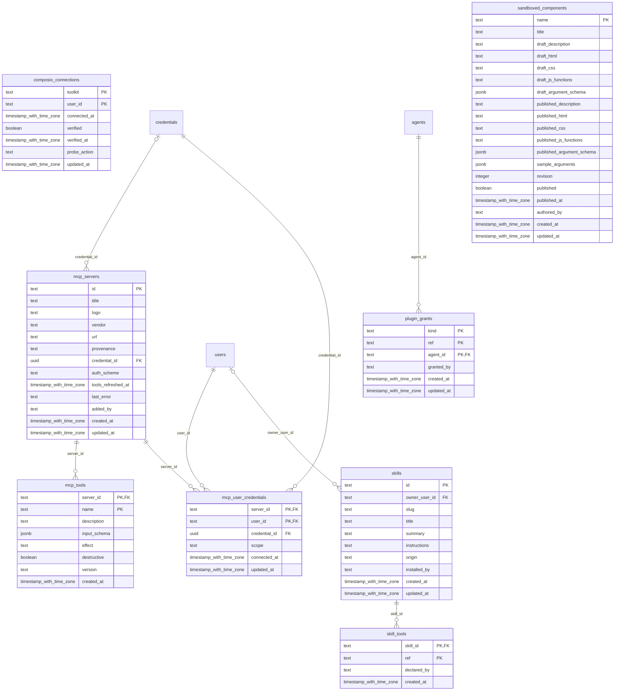

# shell-plugins

Generated from Drizzle. External entities in the diagram are foreign-key targets owned by another module.

## composio_connections

Kết nối Composio đã thiết lập, trạng thái và tham chiếu tài khoản/credential liên quan.

Tenant RLS: **existing shell table; application authorization, no workforce tenant policy**.

| Column | PostgreSQL type | Required | Default | Declared values |
|---|---|---|---|---|
| `toolkit` | `text` | yes | `—` | — |
| `user_id` | `text` | yes | `—` | — |
| `connected_at` | `timestamp with time zone` | yes | `now()` | — |
| `verified` | `boolean` | yes | `false` | — |
| `verified_at` | `timestamp with time zone` | no | `—` | — |
| `probe_action` | `text` | no | `—` | — |
| `updated_at` | `timestamp with time zone` | yes | `now()` | — |

Primary key: `toolkit`, `user_id`.

Indexes:

- `composio_connections_user_idx`: (`user_id`).

Additional cross-row/temporal rules: [integrity matrix](../DATABASE_DESIGN.md#integrity-matrix) and [coordination review](../COMPLETENESS_REVIEW.md).

## mcp_servers

MCP server đã kết nối trong shell; catalog MCP có version/governance của workforce nằm ở platform_mcp_server.

Tenant RLS: **existing shell table; application authorization, no workforce tenant policy**.

| Column | PostgreSQL type | Required | Default | Declared values |
|---|---|---|---|---|
| `id` | `text` | yes | `—` | — |
| `title` | `text` | yes | `—` | — |
| `logo` | `text` | no | `—` | — |
| `vendor` | `text` | yes | `—` | — |
| `url` | `text` | yes | `—` | — |
| `provenance` | `text` | yes | `first-party` | — |
| `credential_id` | `uuid` | no | `—` | — |
| `auth_scheme` | `text` | no | `—` | — |
| `tools_refreshed_at` | `timestamp with time zone` | no | `—` | — |
| `last_error` | `text` | no | `—` | — |
| `added_by` | `text` | no | `—` | — |
| `created_at` | `timestamp with time zone` | yes | `now()` | — |
| `updated_at` | `timestamp with time zone` | yes | `now()` | — |

Primary key: `id`.

Foreign keys:

- (`credential_id`) → `credentials` (`id`); ON DELETE `restrict`.

Additional cross-row/temporal rules: [integrity matrix](../DATABASE_DESIGN.md#integrity-matrix) and [coordination review](../COMPLETENESS_REVIEW.md).

## mcp_tools

Tool được phát hiện từ MCP server của shell.

Tenant RLS: **existing shell table; application authorization, no workforce tenant policy**.

| Column | PostgreSQL type | Required | Default | Declared values |
|---|---|---|---|---|
| `server_id` | `text` | yes | `—` | — |
| `name` | `text` | yes | `—` | — |
| `description` | `text` | yes | `` | — |
| `input_schema` | `jsonb` | yes | `{}` | — |
| `effect` | `text` | no | `—` | — |
| `destructive` | `boolean` | yes | `false` | — |
| `version` | `text` | no | `—` | — |
| `created_at` | `timestamp with time zone` | yes | `now()` | — |

Primary key: `server_id`, `name`.

Foreign keys:

- (`server_id`) → `mcp_servers` (`id`); ON DELETE `cascade`.

Additional cross-row/temporal rules: [integrity matrix](../DATABASE_DESIGN.md#integrity-matrix) and [coordination review](../COMPLETENESS_REVIEW.md).

## mcp_user_credentials

Liên kết người dùng/MCP server/credential cho truy cập thay mặt từng người.

Tenant RLS: **existing shell table; application authorization, no workforce tenant policy**.

| Column | PostgreSQL type | Required | Default | Declared values |
|---|---|---|---|---|
| `server_id` | `text` | yes | `—` | — |
| `user_id` | `text` | yes | `—` | — |
| `credential_id` | `uuid` | yes | `—` | — |
| `scope` | `text` | yes | `—` | — |
| `connected_at` | `timestamp with time zone` | yes | `now()` | — |
| `updated_at` | `timestamp with time zone` | yes | `now()` | — |

Primary key: `server_id`, `user_id`.

Foreign keys:

- (`server_id`) → `mcp_servers` (`id`); ON DELETE `cascade`.
- (`user_id`) → `users` (`id`); ON DELETE `cascade`.
- (`credential_id`) → `credentials` (`id`); ON DELETE `no action`.

Indexes:

- `mcp_user_credentials_user_idx`: (`user_id`).

Additional cross-row/temporal rules: [integrity matrix](../DATABASE_DESIGN.md#integrity-matrix) and [coordination review](../COMPLETENESS_REVIEW.md).

## plugin_grants

Các grant sử dụng plugin/resource trong shell theo ownership upstream.

Tenant RLS: **existing shell table; application authorization, no workforce tenant policy**.

| Column | PostgreSQL type | Required | Default | Declared values |
|---|---|---|---|---|
| `kind` | `text` | yes | `—` | — |
| `ref` | `text` | yes | `—` | — |
| `agent_id` | `text` | yes | `—` | — |
| `granted_by` | `text` | no | `—` | — |
| `created_at` | `timestamp with time zone` | yes | `now()` | — |
| `updated_at` | `timestamp with time zone` | yes | `now()` | — |

Primary key: `kind`, `ref`, `agent_id`.

Foreign keys:

- (`agent_id`) → `agents` (`id`); ON DELETE `cascade`.

Indexes:

- `plugin_grants_agent_idx`: (`agent_id`).

Additional cross-row/temporal rules: [integrity matrix](../DATABASE_DESIGN.md#integrity-matrix) and [coordination review](../COMPLETENESS_REVIEW.md).

## sandboxed_components

Component thực thi trong sandbox cùng cấu hình và metadata an toàn.

Tenant RLS: **existing shell table; application authorization, no workforce tenant policy**.

| Column | PostgreSQL type | Required | Default | Declared values |
|---|---|---|---|---|
| `name` | `text` | yes | `—` | — |
| `title` | `text` | yes | `—` | — |
| `draft_description` | `text` | yes | `` | — |
| `draft_html` | `text` | yes | `` | — |
| `draft_css` | `text` | yes | `` | — |
| `draft_js_functions` | `text` | yes | `` | — |
| `draft_argument_schema` | `jsonb` | yes | `{}` | — |
| `published_description` | `text` | no | `—` | — |
| `published_html` | `text` | no | `—` | — |
| `published_css` | `text` | no | `—` | — |
| `published_js_functions` | `text` | no | `—` | — |
| `published_argument_schema` | `jsonb` | no | `—` | — |
| `sample_arguments` | `jsonb` | yes | `{}` | — |
| `revision` | `integer` | yes | `0` | — |
| `published` | `boolean` | yes | `false` | — |
| `published_at` | `timestamp with time zone` | no | `—` | — |
| `authored_by` | `text` | no | `—` | — |
| `created_at` | `timestamp with time zone` | yes | `now()` | — |
| `updated_at` | `timestamp with time zone` | yes | `now()` | — |

Primary key: `name`.

Additional cross-row/temporal rules: [integrity matrix](../DATABASE_DESIGN.md#integrity-matrix) and [coordination review](../COMPLETENESS_REVIEW.md).

## skill_tools

Ánh xạ skill của shell sang tool mà skill cung cấp.

Tenant RLS: **existing shell table; application authorization, no workforce tenant policy**.

| Column | PostgreSQL type | Required | Default | Declared values |
|---|---|---|---|---|
| `skill_id` | `text` | yes | `—` | — |
| `ref` | `text` | yes | `—` | — |
| `declared_by` | `text` | no | `—` | — |
| `created_at` | `timestamp with time zone` | yes | `now()` | — |

Primary key: `skill_id`, `ref`.

Foreign keys:

- (`skill_id`) → `skills` (`id`); ON DELETE `cascade`.

Indexes:

- `skill_tools_ref_idx`: (`ref`).

Additional cross-row/temporal rules: [integrity matrix](../DATABASE_DESIGN.md#integrity-matrix) and [coordination review](../COMPLETENESS_REVIEW.md).

## skills

Skill cài đặt trong shell; không thay skill revision được agent platform ghim và đánh giá.

Tenant RLS: **existing shell table; application authorization, no workforce tenant policy**.

| Column | PostgreSQL type | Required | Default | Declared values |
|---|---|---|---|---|
| `id` | `text` | yes | `—` | — |
| `owner_user_id` | `text` | no | `—` | — |
| `slug` | `text` | yes | `—` | — |
| `title` | `text` | yes | `—` | — |
| `summary` | `text` | yes | `—` | — |
| `instructions` | `text` | yes | `—` | — |
| `origin` | `text` | yes | `yours` | — |
| `installed_by` | `text` | no | `—` | — |
| `created_at` | `timestamp with time zone` | yes | `now()` | — |
| `updated_at` | `timestamp with time zone` | yes | `now()` | — |

Primary key: `id`.

Foreign keys:

- (`owner_user_id`) → `users` (`id`); ON DELETE `cascade`.

Indexes:

- `skills_slug_key` UNIQUE: (`slug`).
- `skills_owner_idx`: (`owner_user_id`).

Additional cross-row/temporal rules: [integrity matrix](../DATABASE_DESIGN.md#integrity-matrix) and [coordination review](../COMPLETENESS_REVIEW.md).
