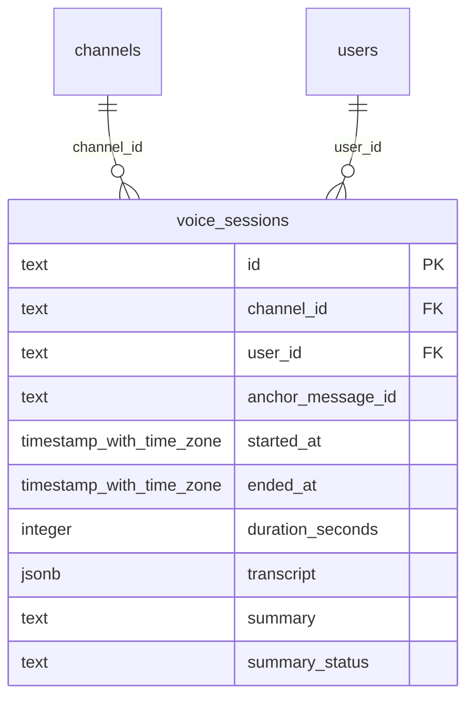

# shell-voice

Generated from Drizzle. External entities in the diagram are foreign-key targets owned by another module.

## voice_sessions

Metadata phiên thoại của người dùng/agent trong shell.

Tenant RLS: **existing shell table; application authorization, no workforce tenant policy**.

| Column | PostgreSQL type | Required | Default | Declared values |
|---|---|---|---|---|
| `id` | `text` | yes | `—` | — |
| `channel_id` | `text` | yes | `—` | — |
| `user_id` | `text` | yes | `—` | — |
| `anchor_message_id` | `text` | no | `—` | — |
| `started_at` | `timestamp with time zone` | yes | `—` | — |
| `ended_at` | `timestamp with time zone` | yes | `—` | — |
| `duration_seconds` | `integer` | yes | `—` | — |
| `transcript` | `jsonb` | yes | `—` | — |
| `summary` | `text` | no | `—` | — |
| `summary_status` | `text` | yes | `failed` | — |

Primary key: `id`.

Foreign keys:

- (`channel_id`) → `channels` (`id`); ON DELETE `cascade`.
- (`user_id`) → `users` (`id`); ON DELETE `cascade`.

Indexes:

- `voice_sessions_channel_started_idx`: (`channel_id`, `started_at`, `id`).

Checks:

- `voice_sessions_duration_check`: `"voice_sessions"."duration_seconds" >= 0`.
- `voice_sessions_summary_check`: `("voice_sessions"."summary_status" = 'ready' AND "voice_sessions"."summary" IS NOT NULL) OR ("voice_sessions"."summary_status" = 'failed' AND "voice_sessions"."summary" IS NULL)`.

Additional cross-row/temporal rules: [integrity matrix](../DATABASE_DESIGN.md#integrity-matrix) and [coordination review](../COMPLETENESS_REVIEW.md).
