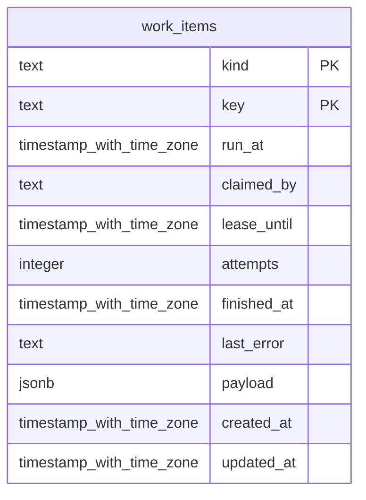

# shell-work

Generated from Drizzle. External entities in the diagram are foreign-key targets owned by another module.

## work_items

Hàng công việc bền vững của worker shell; không phải business Task hay workflow RunStep.

Tenant RLS: **existing shell table; application authorization, no workforce tenant policy**.

| Column | PostgreSQL type | Required | Default | Declared values |
|---|---|---|---|---|
| `kind` | `text` | yes | `—` | — |
| `key` | `text` | yes | `—` | — |
| `run_at` | `timestamp with time zone` | yes | `now()` | — |
| `claimed_by` | `text` | no | `—` | — |
| `lease_until` | `timestamp with time zone` | no | `—` | — |
| `attempts` | `integer` | yes | `0` | — |
| `finished_at` | `timestamp with time zone` | no | `—` | — |
| `last_error` | `text` | no | `—` | — |
| `payload` | `jsonb` | yes | `{}` | — |
| `created_at` | `timestamp with time zone` | yes | `now()` | — |
| `updated_at` | `timestamp with time zone` | yes | `now()` | — |

Primary key: `kind`, `key`.

Indexes:

- `work_items_claimable_idx`: (`kind`, `run_at`).

Additional cross-row/temporal rules: [integrity matrix](../DATABASE_DESIGN.md#integrity-matrix) and [coordination review](../COMPLETENESS_REVIEW.md).
