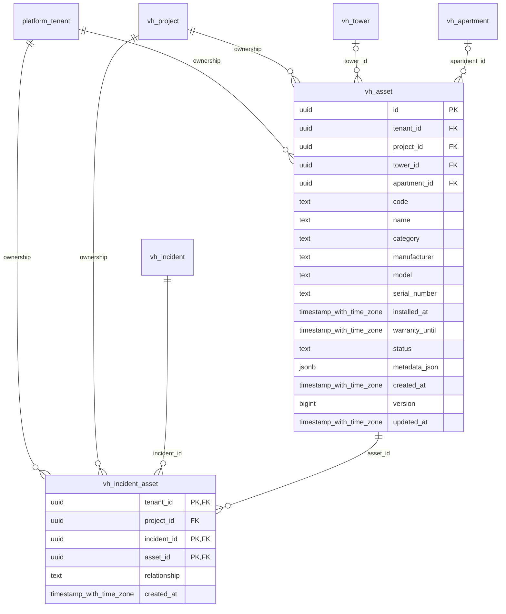

# vinhomes-assets

Generated from Drizzle. External entities in the diagram are foreign-key targets owned by another module.

## vh_asset

Thiết bị/tài sản cần bảo trì trong dự án/tòa/căn hộ, model/serial/bảo hành và metadata.

Tenant RLS: **enabled + forced by integrity migrations 0047/0049/0052**.

| Column | PostgreSQL type | Required | Default | Declared values |
|---|---|---|---|---|
| `id` | `uuid` | yes | `gen_random_uuid()` | — |
| `tenant_id` | `uuid` | yes | `—` | — |
| `project_id` | `uuid` | yes | `—` | — |
| `tower_id` | `uuid` | no | `—` | — |
| `apartment_id` | `uuid` | no | `—` | — |
| `code` | `text` | yes | `—` | — |
| `name` | `text` | yes | `—` | — |
| `category` | `text` | yes | `—` | — |
| `manufacturer` | `text` | no | `—` | — |
| `model` | `text` | no | `—` | — |
| `serial_number` | `text` | no | `—` | — |
| `installed_at` | `timestamp with time zone` | no | `—` | — |
| `warranty_until` | `timestamp with time zone` | no | `—` | — |
| `status` | `text` | yes | `—` | `ACTIVE`, `OUT_OF_SERVICE`, `RETIRED` |
| `metadata_json` | `jsonb` | yes | `—` | — |
| `created_at` | `timestamp with time zone` | yes | `now()` | — |
| `version` | `bigint` | yes | `1` | — |
| `updated_at` | `timestamp with time zone` | yes | `now()` | — |

Primary key: `id`.

Unique keys:

- `vh_asset_uq_0`: (`tenant_id`, `project_id`, `code`).
- `vh_asset_uq_1`: (`tenant_id`, `id`).
- `vh_asset_uq_2`: (`tenant_id`, `project_id`, `id`).

Foreign keys:

- (`tenant_id`) → `platform_tenant` (`id`); ON DELETE `restrict`.
- (`tenant_id`, `project_id`) → `vh_project` (`tenant_id`, `id`); ON DELETE `restrict`.
- (`tenant_id`, `project_id`, `tower_id`) → `vh_tower` (`tenant_id`, `project_id`, `id`); ON DELETE `restrict`.
- (`tenant_id`, `project_id`, `apartment_id`) → `vh_apartment` (`tenant_id`, `project_id`, `id`); ON DELETE `restrict`.

Indexes:

- `vh_asset_ix_1`: (`tenant_id`, `project_id`).
- `vh_asset_ix_2`: (`tenant_id`, `project_id`, `apartment_id`).
- `vh_asset_ix_3`: (`tenant_id`, `project_id`, `tower_id`).

Checks:

- `vh_asset_status_ck`: `"vh_asset"."status" in ('ACTIVE', 'OUT_OF_SERVICE', 'RETIRED')`.
- `vh_asset_ck_0`: `apartment_id IS NULL OR tower_id IS NOT NULL`.
- `vh_asset_ck_1`: `version > 0`.

Cross-row rules and application responsibilities: [database design](../01_DATABASE_ERD_IMPLEMENTATION_COMPLETE.md) and [system flow](../02_BUSINESS_ANALYSIS_IMPLEMENTATION.md).

## vh_incident_asset

Liên kết sự cố với tài sản ảnh hưởng/nghi ngờ/nguyên nhân, tránh nhét asset IDs tự do trong mô tả.

Tenant RLS: **enabled + forced by integrity migrations 0047/0049/0052**.

| Column | PostgreSQL type | Required | Default | Declared values |
|---|---|---|---|---|
| `tenant_id` | `uuid` | yes | `—` | — |
| `project_id` | `uuid` | yes | `—` | — |
| `incident_id` | `uuid` | yes | `—` | — |
| `asset_id` | `uuid` | yes | `—` | — |
| `relationship` | `text` | yes | `—` | `AFFECTED`, `SUSPECTED`, `CAUSAL` |
| `created_at` | `timestamp with time zone` | yes | `now()` | — |

Primary key: `tenant_id`, `incident_id`, `asset_id`.

Foreign keys:

- (`tenant_id`) → `platform_tenant` (`id`); ON DELETE `restrict`.
- (`tenant_id`, `project_id`) → `vh_project` (`tenant_id`, `id`); ON DELETE `restrict`.
- (`tenant_id`, `project_id`, `incident_id`) → `vh_incident` (`tenant_id`, `project_id`, `id`); ON DELETE `restrict`.
- (`tenant_id`, `project_id`, `asset_id`) → `vh_asset` (`tenant_id`, `project_id`, `id`); ON DELETE `restrict`.

Indexes:

- `vh_incident_asset_ix_1`: (`tenant_id`, `project_id`).
- `vh_incident_asset_ix_2`: (`tenant_id`, `project_id`, `asset_id`).
- `vh_incident_asset_ix_3`: (`tenant_id`, `project_id`, `incident_id`).

Checks:

- `vh_incident_asset_relationship_ck`: `"vh_incident_asset"."relationship" in ('AFFECTED', 'SUSPECTED', 'CAUSAL')`.

Cross-row rules and application responsibilities: [database design](../01_DATABASE_ERD_IMPLEMENTATION_COMPLETE.md) and [system flow](../02_BUSINESS_ANALYSIS_IMPLEMENTATION.md).
