# vinhomes-attachments

Generated from Drizzle. External entities in the diagram are foreign-key targets owned by another module.

```mermaid
erDiagram
  vh_membership_application_file {
    uuid tenant_id PK, FK
    uuid project_id FK
    uuid application_id PK, FK
    uuid file_id PK, FK
    timestamp_with_time_zone created_at
  }
  platform_tenant ||--o{ vh_membership_application_file : "ownership"
  vh_project ||--o{ vh_membership_application_file : "ownership"
  vh_membership_application ||--o{ vh_membership_application_file : "application_id"
  vh_file_object ||--o{ vh_membership_application_file : "file_id"
  vh_pet_document {
    uuid tenant_id PK, FK
    uuid project_id FK
    uuid pet_id PK, FK
    uuid file_id PK, FK
    timestamp_with_time_zone created_at
  }
  platform_tenant ||--o{ vh_pet_document : "ownership"
  vh_project ||--o{ vh_pet_document : "ownership"
  vh_pet_profile ||--o{ vh_pet_document : "pet_id"
  vh_file_object ||--o{ vh_pet_document : "file_id"
  vh_report_attachment {
    uuid tenant_id PK, FK
    uuid project_id FK
    uuid report_id PK, FK
    uuid file_id PK, FK
    timestamp_with_time_zone created_at
  }
  platform_tenant ||--o{ vh_report_attachment : "ownership"
  vh_project ||--o{ vh_report_attachment : "ownership"
  vh_resident_report ||--o{ vh_report_attachment : "report_id"
  vh_file_object ||--o{ vh_report_attachment : "file_id"
  vh_request_attachment {
    uuid tenant_id PK, FK
    uuid project_id FK
    uuid request_id PK, FK
    uuid file_id PK, FK
    text caption
    timestamp_with_time_zone created_at
  }
  platform_tenant ||--o{ vh_request_attachment : "ownership"
  vh_project ||--o{ vh_request_attachment : "ownership"
  vh_resident_request ||--o{ vh_request_attachment : "request_id"
  vh_file_object ||--o{ vh_request_attachment : "file_id"
  vh_service_request_file {
    uuid tenant_id PK, FK
    uuid project_id FK
    uuid request_id PK, FK
    uuid file_id PK, FK
    timestamp_with_time_zone created_at
  }
  platform_tenant ||--o{ vh_service_request_file : "ownership"
  vh_project ||--o{ vh_service_request_file : "ownership"
  vh_service_request ||--o{ vh_service_request_file : "request_id"
  vh_file_object ||--o{ vh_service_request_file : "file_id"
```

## vh_membership_application_file

Liên kết bằng chứng riêng tư với hồ sơ xin membership.

Tenant RLS: **enabled + forced by integrity migrations 0047/0049/0052**.

| Column | PostgreSQL type | Required | Default | Declared values |
|---|---|---|---|---|
| `tenant_id` | `uuid` | yes | `—` | — |
| `project_id` | `uuid` | yes | `—` | — |
| `application_id` | `uuid` | yes | `—` | — |
| `file_id` | `uuid` | yes | `—` | — |
| `created_at` | `timestamp with time zone` | yes | `now()` | — |

Primary key: `tenant_id`, `application_id`, `file_id`.

Foreign keys:

- (`tenant_id`) → `platform_tenant` (`id`); ON DELETE `restrict`.
- (`tenant_id`, `project_id`) → `vh_project` (`tenant_id`, `id`); ON DELETE `restrict`.
- (`tenant_id`, `project_id`, `application_id`) → `vh_membership_application` (`tenant_id`, `project_id`, `id`); ON DELETE `restrict`.
- (`tenant_id`, `file_id`) → `vh_file_object` (`tenant_id`, `id`); ON DELETE `restrict`.

Indexes:

- `vh_membership_application_file_ix_0`: (`tenant_id`, `project_id`, `application_id`).
- `vh_membership_application_file_ix_1`: (`tenant_id`, `project_id`).
- `vh_membership_application_file_ix_2`: (`tenant_id`, `file_id`).

Cross-row rules and application responsibilities: [database design](../01_DATABASE_ERD_IMPLEMENTATION_COMPLETE.md) and [system flow](../02_BUSINESS_ANALYSIS_IMPLEMENTATION.md).

## vh_pet_document

Tài liệu chứng minh cho hồ sơ vật nuôi, tham chiếu file object.

Tenant RLS: **enabled + forced by integrity migrations 0047/0049/0052**.

| Column | PostgreSQL type | Required | Default | Declared values |
|---|---|---|---|---|
| `tenant_id` | `uuid` | yes | `—` | — |
| `project_id` | `uuid` | yes | `—` | — |
| `pet_id` | `uuid` | yes | `—` | — |
| `file_id` | `uuid` | yes | `—` | — |
| `created_at` | `timestamp with time zone` | yes | `now()` | — |

Primary key: `tenant_id`, `pet_id`, `file_id`.

Foreign keys:

- (`tenant_id`) → `platform_tenant` (`id`); ON DELETE `restrict`.
- (`tenant_id`, `project_id`) → `vh_project` (`tenant_id`, `id`); ON DELETE `restrict`.
- (`tenant_id`, `project_id`, `pet_id`) → `vh_pet_profile` (`tenant_id`, `project_id`, `id`); ON DELETE `restrict`.
- (`tenant_id`, `file_id`) → `vh_file_object` (`tenant_id`, `id`); ON DELETE `restrict`.

Indexes:

- `vh_pet_document_ix_0`: (`tenant_id`, `file_id`).
- `vh_pet_document_ix_1`: (`tenant_id`, `project_id`).
- `vh_pet_document_ix_2`: (`tenant_id`, `project_id`, `pet_id`).

Cross-row rules and application responsibilities: [database design](../01_DATABASE_ERD_IMPLEMENTATION_COMPLETE.md) and [system flow](../02_BUSINESS_ANALYSIS_IMPLEMENTATION.md).

## vh_report_attachment

Liên kết file với phản ánh chính thức, dùng lại file object thay vì sao chép binary.

Tenant RLS: **enabled + forced by integrity migrations 0047/0049/0052**.

| Column | PostgreSQL type | Required | Default | Declared values |
|---|---|---|---|---|
| `tenant_id` | `uuid` | yes | `—` | — |
| `project_id` | `uuid` | yes | `—` | — |
| `report_id` | `uuid` | yes | `—` | — |
| `file_id` | `uuid` | yes | `—` | — |
| `created_at` | `timestamp with time zone` | yes | `now()` | — |

Primary key: `tenant_id`, `report_id`, `file_id`.

Foreign keys:

- (`tenant_id`) → `platform_tenant` (`id`); ON DELETE `restrict`.
- (`tenant_id`, `project_id`) → `vh_project` (`tenant_id`, `id`); ON DELETE `restrict`.
- (`tenant_id`, `project_id`, `report_id`) → `vh_resident_report` (`tenant_id`, `project_id`, `id`); ON DELETE `restrict`.
- (`tenant_id`, `file_id`) → `vh_file_object` (`tenant_id`, `id`); ON DELETE `restrict`.

Indexes:

- `vh_report_attachment_ix_0`: (`tenant_id`, `project_id`, `report_id`).
- `vh_report_attachment_ix_1`: (`tenant_id`, `project_id`).
- `vh_report_attachment_ix_2`: (`tenant_id`, `file_id`).

Cross-row rules and application responsibilities: [database design](../01_DATABASE_ERD_IMPLEMENTATION_COMPLETE.md) and [system flow](../02_BUSINESS_ANALYSIS_IMPLEMENTATION.md).

## vh_request_attachment

Giữ file của request ngay khi chưa có incident, không làm mất bằng chứng trong intake.

Tenant RLS: **enabled + forced by integrity migrations 0047/0049/0052**.

| Column | PostgreSQL type | Required | Default | Declared values |
|---|---|---|---|---|
| `tenant_id` | `uuid` | yes | `—` | — |
| `project_id` | `uuid` | yes | `—` | — |
| `request_id` | `uuid` | yes | `—` | — |
| `file_id` | `uuid` | yes | `—` | — |
| `caption` | `text` | no | `—` | — |
| `created_at` | `timestamp with time zone` | yes | `now()` | — |

Primary key: `tenant_id`, `request_id`, `file_id`.

Foreign keys:

- (`tenant_id`) → `platform_tenant` (`id`); ON DELETE `restrict`.
- (`tenant_id`, `project_id`) → `vh_project` (`tenant_id`, `id`); ON DELETE `restrict`.
- (`tenant_id`, `project_id`, `request_id`) → `vh_resident_request` (`tenant_id`, `project_id`, `id`); ON DELETE `restrict`.
- (`tenant_id`, `file_id`) → `vh_file_object` (`tenant_id`, `id`); ON DELETE `restrict`.

Indexes:

- `vh_request_attachment_ix_0`: (`tenant_id`, `project_id`, `request_id`).
- `vh_request_attachment_ix_1`: (`tenant_id`, `project_id`).
- `vh_request_attachment_ix_2`: (`tenant_id`, `file_id`).

Cross-row rules and application responsibilities: [database design](../01_DATABASE_ERD_IMPLEMENTATION_COMPLETE.md) and [system flow](../02_BUSINESS_ANALYSIS_IMPLEMENTATION.md).

## vh_service_request_file

Các hồ sơ/file kèm đăng ký dịch vụ hoặc thi công.

Tenant RLS: **enabled + forced by integrity migrations 0047/0049/0052**.

| Column | PostgreSQL type | Required | Default | Declared values |
|---|---|---|---|---|
| `tenant_id` | `uuid` | yes | `—` | — |
| `project_id` | `uuid` | yes | `—` | — |
| `request_id` | `uuid` | yes | `—` | — |
| `file_id` | `uuid` | yes | `—` | — |
| `created_at` | `timestamp with time zone` | yes | `now()` | — |

Primary key: `tenant_id`, `request_id`, `file_id`.

Foreign keys:

- (`tenant_id`) → `platform_tenant` (`id`); ON DELETE `restrict`.
- (`tenant_id`, `project_id`) → `vh_project` (`tenant_id`, `id`); ON DELETE `restrict`.
- (`tenant_id`, `project_id`, `request_id`) → `vh_service_request` (`tenant_id`, `project_id`, `id`); ON DELETE `restrict`.
- (`tenant_id`, `file_id`) → `vh_file_object` (`tenant_id`, `id`); ON DELETE `restrict`.

Indexes:

- `vh_service_request_file_ix_0`: (`tenant_id`, `project_id`, `request_id`).
- `vh_service_request_file_ix_1`: (`tenant_id`, `project_id`).
- `vh_service_request_file_ix_2`: (`tenant_id`, `file_id`).

Cross-row rules and application responsibilities: [database design](../01_DATABASE_ERD_IMPLEMENTATION_COMPLETE.md) and [system flow](../02_BUSINESS_ANALYSIS_IMPLEMENTATION.md).
