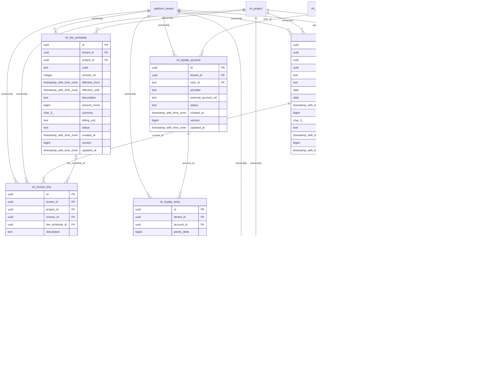

# vinhomes-billing

Generated from Drizzle. External entities in the diagram are foreign-key targets owned by another module.

## vh_fee_schedule

Phiên bản biểu phí và hiệu lực áp dụng; nội dung bản đã publish được giữ bất biến.

Tenant RLS: **enabled + forced by integrity migrations 0047/0049**.

| Column | PostgreSQL type | Required | Default | Declared values |
|---|---|---|---|---|
| `id` | `uuid` | yes | `gen_random_uuid()` | — |
| `tenant_id` | `uuid` | yes | `—` | — |
| `project_id` | `uuid` | yes | `—` | — |
| `code` | `text` | yes | `—` | — |
| `version_no` | `integer` | yes | `—` | — |
| `effective_from` | `timestamp with time zone` | yes | `—` | — |
| `effective_until` | `timestamp with time zone` | no | `—` | — |
| `description` | `text` | yes | `—` | — |
| `amount_minor` | `bigint` | yes | `—` | — |
| `currency` | `char(3)` | yes | `—` | — |
| `billing_unit` | `text` | yes | `—` | — |
| `status` | `text` | yes | `—` | `DRAFT`, `PUBLISHED`, `RETIRED` |
| `created_at` | `timestamp with time zone` | yes | `now()` | — |
| `version` | `bigint` | yes | `1` | — |
| `updated_at` | `timestamp with time zone` | yes | `now()` | — |

Primary key: `id`.

Unique keys:

- `vh_fee_schedule_uq_0`: (`tenant_id`, `project_id`, `code`, `version_no`).
- `vh_fee_schedule_uq_1`: (`tenant_id`, `id`).
- `vh_fee_schedule_uq_2`: (`tenant_id`, `project_id`, `id`).

Foreign keys:

- (`tenant_id`) → `platform_tenant` (`id`); ON DELETE `restrict`.
- (`tenant_id`, `project_id`) → `vh_project` (`tenant_id`, `id`); ON DELETE `restrict`.

Indexes:

- `vh_fee_schedule_ix_0`: (`tenant_id`, `project_id`).

Checks:

- `vh_fee_schedule_status_ck`: `"vh_fee_schedule"."status" in ('DRAFT', 'PUBLISHED', 'RETIRED')`.
- `vh_fee_schedule_ck_0`: `version_no > 0`.
- `vh_fee_schedule_ck_1`: `amount_minor >= 0`.
- `vh_fee_schedule_ck_2`: `effective_until IS NULL OR effective_until > effective_from`.
- `vh_fee_schedule_ck_3`: `currency ~ '^[A-Z]{3}$'`.
- `vh_fee_schedule_ck_4`: `version > 0`.

Additional cross-row/temporal rules: [integrity matrix](../DATABASE_DESIGN.md#integrity-matrix) and [coordination review](../COMPLETENESS_REVIEW.md).

## vh_invoice

Hóa đơn của căn hộ/người nhận với kỳ, hạn, tiền tệ và tổng tiền đối chiếu các dòng/phân bổ.

Tenant RLS: **enabled + forced by integrity migrations 0047/0049**.

| Column | PostgreSQL type | Required | Default | Declared values |
|---|---|---|---|---|
| `id` | `uuid` | yes | `gen_random_uuid()` | — |
| `tenant_id` | `uuid` | yes | `—` | — |
| `project_id` | `uuid` | yes | `—` | — |
| `apartment_id` | `uuid` | yes | `—` | — |
| `billed_to_user_id` | `text` | yes | `—` | — |
| `invoice_number` | `text` | yes | `—` | — |
| `period_start` | `date` | yes | `—` | — |
| `period_end` | `date` | yes | `—` | — |
| `due_at` | `timestamp with time zone` | yes | `—` | — |
| `total_minor` | `bigint` | yes | `—` | — |
| `currency` | `char(3)` | yes | `—` | — |
| `status` | `text` | yes | `—` | `DRAFT`, `ISSUED`, `PARTIALLY_PAID`, `PAID`, `VOID` |
| `created_at` | `timestamp with time zone` | yes | `now()` | — |
| `version` | `bigint` | yes | `1` | — |
| `updated_at` | `timestamp with time zone` | yes | `now()` | — |

Primary key: `id`.

Unique keys:

- `vh_invoice_uq_0`: (`tenant_id`, `invoice_number`).
- `vh_invoice_uq_1`: (`tenant_id`, `id`).
- `vh_invoice_uq_2`: (`tenant_id`, `project_id`, `id`).

Foreign keys:

- (`tenant_id`) → `platform_tenant` (`id`); ON DELETE `restrict`.
- (`tenant_id`, `project_id`) → `vh_project` (`tenant_id`, `id`); ON DELETE `restrict`.
- (`tenant_id`, `project_id`, `apartment_id`) → `vh_apartment` (`tenant_id`, `project_id`, `id`); ON DELETE `restrict`.
- (`billed_to_user_id`) → `users` (`id`); ON DELETE `restrict`.

Indexes:

- `vh_invoice_ix_0`: (`billed_to_user_id`).
- `vh_invoice_ix_1`: (`tenant_id`, `apartment_id`, `status`, `due_at`).
- `vh_invoice_ix_2`: (`tenant_id`, `project_id`, `apartment_id`).
- `vh_invoice_ix_3`: (`tenant_id`, `project_id`).

Checks:

- `vh_invoice_status_ck`: `"vh_invoice"."status" in ('DRAFT', 'ISSUED', 'PARTIALLY_PAID', 'PAID', 'VOID')`.
- `vh_invoice_ck_0`: `period_end >= period_start`.
- `vh_invoice_ck_1`: `total_minor >= 0`.
- `vh_invoice_ck_2`: `currency ~ '^[A-Z]{3}$'`.
- `vh_invoice_ck_3`: `version > 0`.

Additional cross-row/temporal rules: [integrity matrix](../DATABASE_DESIGN.md#integrity-matrix) and [coordination review](../COMPLETENESS_REVIEW.md).

## vh_invoice_line

Dòng hóa đơn có quantity/đơn giá/tổng làm tròn; không sửa sau khi hóa đơn issue.

Tenant RLS: **enabled + forced by integrity migrations 0047/0049**.

| Column | PostgreSQL type | Required | Default | Declared values |
|---|---|---|---|---|
| `id` | `uuid` | yes | `gen_random_uuid()` | — |
| `tenant_id` | `uuid` | yes | `—` | — |
| `project_id` | `uuid` | yes | `—` | — |
| `invoice_id` | `uuid` | yes | `—` | — |
| `fee_schedule_id` | `uuid` | no | `—` | — |
| `description` | `text` | yes | `—` | — |
| `quantity` | `numeric` | yes | `—` | — |
| `unit_price_minor` | `bigint` | yes | `—` | — |
| `total_minor` | `bigint` | yes | `—` | — |
| `created_at` | `timestamp with time zone` | yes | `now()` | — |
| `version` | `bigint` | yes | `1` | — |
| `updated_at` | `timestamp with time zone` | yes | `now()` | — |

Primary key: `id`.

Unique keys:

- `vh_invoice_line_uq_0`: (`tenant_id`, `id`).
- `vh_invoice_line_uq_1`: (`tenant_id`, `project_id`, `id`).

Foreign keys:

- (`tenant_id`) → `platform_tenant` (`id`); ON DELETE `restrict`.
- (`tenant_id`, `project_id`) → `vh_project` (`tenant_id`, `id`); ON DELETE `restrict`.
- (`tenant_id`, `project_id`, `invoice_id`) → `vh_invoice` (`tenant_id`, `project_id`, `id`); ON DELETE `restrict`.
- (`tenant_id`, `project_id`, `fee_schedule_id`) → `vh_fee_schedule` (`tenant_id`, `project_id`, `id`); ON DELETE `restrict`.

Indexes:

- `vh_invoice_line_ix_0`: (`tenant_id`, `project_id`, `invoice_id`).
- `vh_invoice_line_ix_1`: (`tenant_id`, `project_id`).
- `vh_invoice_line_ix_2`: (`tenant_id`, `project_id`, `fee_schedule_id`).

Checks:

- `vh_invoice_line_ck_0`: `quantity > 0`.
- `vh_invoice_line_ck_1`: `unit_price_minor >= 0`.
- `vh_invoice_line_ck_2`: `total_minor >= 0`.
- `vh_invoice_line_ck_3`: `total_minor = round(quantity * unit_price_minor)`.
- `vh_invoice_line_ck_4`: `version > 0`.

Additional cross-row/temporal rules: [integrity matrix](../DATABASE_DESIGN.md#integrity-matrix) and [coordination review](../COMPLETENESS_REVIEW.md).

## vh_loyalty_account

Tài khoản tích điểm của user theo nhà cung cấp.

Tenant RLS: **enabled + forced by integrity migrations 0047/0049**.

| Column | PostgreSQL type | Required | Default | Declared values |
|---|---|---|---|---|
| `id` | `uuid` | yes | `gen_random_uuid()` | — |
| `tenant_id` | `uuid` | yes | `—` | — |
| `user_id` | `text` | yes | `—` | — |
| `provider` | `text` | yes | `—` | — |
| `external_account_ref` | `text` | no | `—` | — |
| `status` | `text` | yes | `—` | `ACTIVE`, `SUSPENDED`, `CLOSED` |
| `created_at` | `timestamp with time zone` | yes | `now()` | — |
| `version` | `bigint` | yes | `1` | — |
| `updated_at` | `timestamp with time zone` | yes | `now()` | — |

Primary key: `id`.

Unique keys:

- `vh_loyalty_account_uq_0`: (`tenant_id`, `user_id`, `provider`).
- `vh_loyalty_account_uq_1`: (`tenant_id`, `id`).

Foreign keys:

- (`tenant_id`) → `platform_tenant` (`id`); ON DELETE `restrict`.
- (`user_id`) → `users` (`id`); ON DELETE `restrict`.

Indexes:

- `vh_loyalty_account_ix_0`: (`user_id`).

Checks:

- `vh_loyalty_account_status_ck`: `"vh_loyalty_account"."status" in ('ACTIVE', 'SUSPENDED', 'CLOSED')`.
- `vh_loyalty_account_ck_0`: `version > 0`.

Additional cross-row/temporal rules: [integrity matrix](../DATABASE_DESIGN.md#integrity-matrix) and [coordination review](../COMPLETENESS_REVIEW.md).

## vh_loyalty_entry

Bút toán cộng/trừ điểm append-only; số dư là tổng ledger, không do client nhập.

Tenant RLS: **enabled + forced by integrity migrations 0047/0049**.

| Column | PostgreSQL type | Required | Default | Declared values |
|---|---|---|---|---|
| `id` | `uuid` | yes | `gen_random_uuid()` | — |
| `tenant_id` | `uuid` | yes | `—` | — |
| `account_id` | `uuid` | yes | `—` | — |
| `points_delta` | `bigint` | yes | `—` | — |
| `reason` | `text` | yes | `—` | — |
| `provider_event_id` | `text` | yes | `—` | — |
| `occurred_at` | `timestamp with time zone` | yes | `—` | — |
| `created_at` | `timestamp with time zone` | yes | `now()` | — |

Primary key: `id`.

Unique keys:

- `vh_loyalty_entry_uq_0`: (`tenant_id`, `provider_event_id`).
- `vh_loyalty_entry_uq_1`: (`tenant_id`, `id`).

Foreign keys:

- (`tenant_id`) → `platform_tenant` (`id`); ON DELETE `restrict`.
- (`tenant_id`, `account_id`) → `vh_loyalty_account` (`tenant_id`, `id`); ON DELETE `restrict`.

Indexes:

- `vh_loyalty_entry_ix_0`: (`tenant_id`, `account_id`).

Checks:

- `vh_loyalty_entry_ck_0`: `points_delta <> 0`.

Additional cross-row/temporal rules: [integrity matrix](../DATABASE_DESIGN.md#integrity-matrix) and [coordination review](../COMPLETENESS_REVIEW.md).

## vh_payment_allocation

Sổ phân bổ thanh toán thành công vào hóa đơn, bất biến và không cho vượt dư nợ/giá trị payment.

Tenant RLS: **enabled + forced by integrity migrations 0047/0049**.

| Column | PostgreSQL type | Required | Default | Declared values |
|---|---|---|---|---|
| `tenant_id` | `uuid` | yes | `—` | — |
| `project_id` | `uuid` | yes | `—` | — |
| `payment_attempt_id` | `uuid` | yes | `—` | — |
| `invoice_id` | `uuid` | yes | `—` | — |
| `amount_minor` | `bigint` | yes | `—` | — |
| `created_at` | `timestamp with time zone` | yes | `now()` | — |

Primary key: `tenant_id`, `payment_attempt_id`, `invoice_id`.

Foreign keys:

- (`tenant_id`) → `platform_tenant` (`id`); ON DELETE `restrict`.
- (`tenant_id`, `project_id`) → `vh_project` (`tenant_id`, `id`); ON DELETE `restrict`.
- (`tenant_id`, `project_id`, `invoice_id`, `payment_attempt_id`) → `vh_payment_attempt` (`tenant_id`, `project_id`, `invoice_id`, `id`); ON DELETE `restrict`.
- (`tenant_id`, `project_id`, `invoice_id`) → `vh_invoice` (`tenant_id`, `project_id`, `id`); ON DELETE `restrict`.

Indexes:

- `vh_payment_allocation_ix_0`: (`tenant_id`, `project_id`, `invoice_id`, `payment_attempt_id`).
- `vh_payment_allocation_ix_1`: (`tenant_id`, `project_id`, `invoice_id`).
- `vh_payment_allocation_ix_2`: (`tenant_id`, `project_id`).

Checks:

- `vh_payment_allocation_ck_0`: `amount_minor > 0`.

Additional cross-row/temporal rules: [integrity matrix](../DATABASE_DESIGN.md#integrity-matrix) and [coordination review](../COMPLETENESS_REVIEW.md).

## vh_payment_attempt

Một lần thử thanh toán có idempotency/provider ref; SIMULATED không được quyết toán hóa đơn.

Tenant RLS: **enabled + forced by integrity migrations 0047/0049**.

| Column | PostgreSQL type | Required | Default | Declared values |
|---|---|---|---|---|
| `id` | `uuid` | yes | `gen_random_uuid()` | — |
| `tenant_id` | `uuid` | yes | `—` | — |
| `project_id` | `uuid` | yes | `—` | — |
| `invoice_id` | `uuid` | yes | `—` | — |
| `initiated_by_user_id` | `text` | yes | `—` | — |
| `amount_minor` | `bigint` | yes | `—` | — |
| `currency` | `char(3)` | yes | `—` | — |
| `provider` | `text` | yes | `—` | — |
| `provider_payment_ref` | `text` | no | `—` | — |
| `idempotency_key` | `text` | yes | `—` | — |
| `status` | `text` | yes | `—` | `PENDING`, `REQUIRES_ACTION`, `SUCCEEDED`, `FAILED`, `CANCELLED`, `SIMULATED` |
| `confirmed_at` | `timestamp with time zone` | no | `—` | — |
| `created_at` | `timestamp with time zone` | yes | `now()` | — |
| `version` | `bigint` | yes | `1` | — |
| `updated_at` | `timestamp with time zone` | yes | `now()` | — |

Primary key: `id`.

Unique keys:

- `vh_payment_attempt_uq_0`: (`tenant_id`, `idempotency_key`).
- `vh_payment_attempt_uq_1`: (`provider`, `provider_payment_ref`).
- `vh_payment_attempt_uq_2`: (`tenant_id`, `id`).
- `vh_payment_attempt_uq_3`: (`tenant_id`, `project_id`, `id`).
- `vh_payment_attempt_uq_4`: (`tenant_id`, `project_id`, `invoice_id`, `id`).

Foreign keys:

- (`tenant_id`) → `platform_tenant` (`id`); ON DELETE `restrict`.
- (`tenant_id`, `project_id`) → `vh_project` (`tenant_id`, `id`); ON DELETE `restrict`.
- (`tenant_id`, `project_id`, `invoice_id`) → `vh_invoice` (`tenant_id`, `project_id`, `id`); ON DELETE `restrict`.
- (`initiated_by_user_id`) → `users` (`id`); ON DELETE `restrict`.

Indexes:

- `vh_payment_attempt_ix_0`: (`tenant_id`, `project_id`, `invoice_id`).
- `vh_payment_attempt_ix_1`: (`tenant_id`, `project_id`).
- `vh_payment_attempt_ix_2`: (`initiated_by_user_id`).

Checks:

- `vh_payment_attempt_status_ck`: `"vh_payment_attempt"."status" in ('PENDING', 'REQUIRES_ACTION', 'SUCCEEDED', 'FAILED', 'CANCELLED', 'SIMULATED')`.
- `vh_payment_attempt_ck_0`: `amount_minor > 0`.
- `vh_payment_attempt_ck_1`: `status <> 'SUCCEEDED' OR (provider_payment_ref IS NOT NULL AND confirmed_at IS NOT NULL)`.
- `vh_payment_attempt_ck_2`: `currency ~ '^[A-Z]{3}$'`.
- `vh_payment_attempt_ck_3`: `version > 0`.

Additional cross-row/temporal rules: [integrity matrix](../DATABASE_DESIGN.md#integrity-matrix) and [coordination review](../COMPLETENESS_REVIEW.md).
