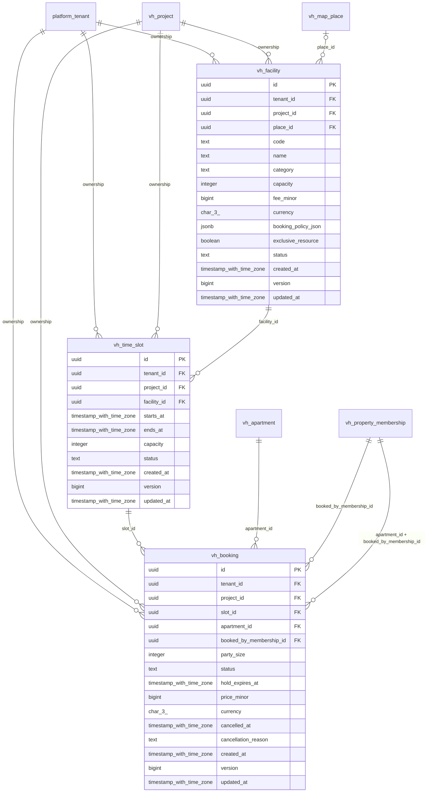

# vinhomes-booking

Generated from Drizzle. External entities in the diagram are foreign-key targets owned by another module.

## vh_booking

Đặt/giữ chỗ tiện ích cho membership/căn hộ với snapshot giá và vòng đời hủy/hết hạn/hoàn thành.

Tenant RLS: **enabled + forced by integrity migrations 0047/0049**.

| Column | PostgreSQL type | Required | Default | Declared values |
|---|---|---|---|---|
| `id` | `uuid` | yes | `gen_random_uuid()` | — |
| `tenant_id` | `uuid` | yes | `—` | — |
| `project_id` | `uuid` | yes | `—` | — |
| `slot_id` | `uuid` | yes | `—` | — |
| `apartment_id` | `uuid` | yes | `—` | — |
| `booked_by_membership_id` | `uuid` | yes | `—` | — |
| `party_size` | `integer` | yes | `—` | — |
| `status` | `text` | yes | `—` | `HELD`, `CONFIRMED`, `CANCELLED`, `EXPIRED`, `COMPLETED` |
| `hold_expires_at` | `timestamp with time zone` | no | `—` | — |
| `price_minor` | `bigint` | yes | `—` | — |
| `currency` | `char(3)` | yes | `—` | — |
| `cancelled_at` | `timestamp with time zone` | no | `—` | — |
| `cancellation_reason` | `text` | no | `—` | — |
| `created_at` | `timestamp with time zone` | yes | `now()` | — |
| `version` | `bigint` | yes | `1` | — |
| `updated_at` | `timestamp with time zone` | yes | `now()` | — |

Primary key: `id`.

Unique keys:

- `vh_booking_uq_0`: (`tenant_id`, `id`).
- `vh_booking_uq_1`: (`tenant_id`, `project_id`, `id`).

Foreign keys:

- (`tenant_id`) → `platform_tenant` (`id`); ON DELETE `restrict`.
- (`tenant_id`, `project_id`) → `vh_project` (`tenant_id`, `id`); ON DELETE `restrict`.
- (`tenant_id`, `project_id`, `slot_id`) → `vh_time_slot` (`tenant_id`, `project_id`, `id`); ON DELETE `restrict`.
- (`tenant_id`, `project_id`, `apartment_id`) → `vh_apartment` (`tenant_id`, `project_id`, `id`); ON DELETE `restrict`.
- (`tenant_id`, `project_id`, `booked_by_membership_id`) → `vh_property_membership` (`tenant_id`, `project_id`, `id`); ON DELETE `restrict`.
- (`tenant_id`, `project_id`, `apartment_id`, `booked_by_membership_id`) → `vh_property_membership` (`tenant_id`, `project_id`, `apartment_id`, `id`); ON DELETE `restrict`.

Indexes:

- `vh_booking_ix_0`: (`tenant_id`, `apartment_id`, `created_at`).
- `vh_booking_ix_1`: (`tenant_id`, `slot_id`, `status`, `hold_expires_at`).
- `vh_booking_ix_2`: (`tenant_id`, `project_id`).
- `vh_booking_ix_3`: (`tenant_id`, `project_id`, `slot_id`).
- `vh_booking_ix_4`: (`tenant_id`, `project_id`, `booked_by_membership_id`).
- `vh_booking_ix_5`: (`tenant_id`, `project_id`, `apartment_id`).
- `vh_booking_live_member_slot_uq` UNIQUE: (`tenant_id`, `slot_id`, `booked_by_membership_id`) WHERE `"vh_booking"."status" IN ('HELD', 'CONFIRMED')`.

Checks:

- `vh_booking_status_ck`: `"vh_booking"."status" in ('HELD', 'CONFIRMED', 'CANCELLED', 'EXPIRED', 'COMPLETED')`.
- `vh_booking_ck_0`: `party_size > 0`.
- `vh_booking_ck_1`: `price_minor >= 0`.
- `vh_booking_ck_2`: `status <> 'HELD' OR hold_expires_at IS NOT NULL`.
- `vh_booking_ck_3`: `currency ~ '^[A-Z]{3}$'`.
- `vh_booking_ck_4`: `version > 0`.

Additional cross-row/temporal rules: [integrity matrix](../DATABASE_DESIGN.md#integrity-matrix) and [coordination review](../COMPLETENESS_REVIEW.md).

## vh_facility

Tiện ích có capacity, biểu phí và booking policy của dự án.

Tenant RLS: **enabled + forced by integrity migrations 0047/0049**.

| Column | PostgreSQL type | Required | Default | Declared values |
|---|---|---|---|---|
| `id` | `uuid` | yes | `gen_random_uuid()` | — |
| `tenant_id` | `uuid` | yes | `—` | — |
| `project_id` | `uuid` | yes | `—` | — |
| `place_id` | `uuid` | no | `—` | — |
| `code` | `text` | yes | `—` | — |
| `name` | `text` | yes | `—` | — |
| `category` | `text` | yes | `—` | — |
| `capacity` | `integer` | yes | `—` | — |
| `fee_minor` | `bigint` | yes | `—` | — |
| `currency` | `char(3)` | yes | `—` | — |
| `booking_policy_json` | `jsonb` | yes | `—` | — |
| `exclusive_resource` | `boolean` | yes | `—` | — |
| `status` | `text` | yes | `—` | `ACTIVE`, `MAINTENANCE`, `RETIRED` |
| `created_at` | `timestamp with time zone` | yes | `now()` | — |
| `version` | `bigint` | yes | `1` | — |
| `updated_at` | `timestamp with time zone` | yes | `now()` | — |

Primary key: `id`.

Unique keys:

- `vh_facility_uq_0`: (`tenant_id`, `project_id`, `code`).
- `vh_facility_uq_1`: (`tenant_id`, `id`).
- `vh_facility_uq_2`: (`tenant_id`, `project_id`, `id`).

Foreign keys:

- (`tenant_id`) → `platform_tenant` (`id`); ON DELETE `restrict`.
- (`tenant_id`, `project_id`) → `vh_project` (`tenant_id`, `id`); ON DELETE `restrict`.
- (`tenant_id`, `project_id`, `place_id`) → `vh_map_place` (`tenant_id`, `project_id`, `id`); ON DELETE `restrict`.

Indexes:

- `vh_facility_ix_0`: (`tenant_id`, `project_id`, `place_id`).
- `vh_facility_ix_1`: (`tenant_id`, `project_id`).

Checks:

- `vh_facility_status_ck`: `"vh_facility"."status" in ('ACTIVE', 'MAINTENANCE', 'RETIRED')`.
- `vh_facility_ck_0`: `capacity > 0`.
- `vh_facility_ck_1`: `fee_minor >= 0`.
- `vh_facility_ck_2`: `currency ~ '^[A-Z]{3}$'`.
- `vh_facility_ck_3`: `version > 0`.

Additional cross-row/temporal rules: [integrity matrix](../DATABASE_DESIGN.md#integrity-matrix) and [coordination review](../COMPLETENESS_REVIEW.md).

## vh_time_slot

Khung giờ của tiện ích; không chồng thời gian cùng facility và có capacity riêng.

Tenant RLS: **enabled + forced by integrity migrations 0047/0049**.

| Column | PostgreSQL type | Required | Default | Declared values |
|---|---|---|---|---|
| `id` | `uuid` | yes | `gen_random_uuid()` | — |
| `tenant_id` | `uuid` | yes | `—` | — |
| `project_id` | `uuid` | yes | `—` | — |
| `facility_id` | `uuid` | yes | `—` | — |
| `starts_at` | `timestamp with time zone` | yes | `—` | — |
| `ends_at` | `timestamp with time zone` | yes | `—` | — |
| `capacity` | `integer` | yes | `—` | — |
| `status` | `text` | yes | `—` | `OPEN`, `BLOCKED` |
| `created_at` | `timestamp with time zone` | yes | `now()` | — |
| `version` | `bigint` | yes | `1` | — |
| `updated_at` | `timestamp with time zone` | yes | `now()` | — |

Primary key: `id`.

Unique keys:

- `vh_time_slot_uq_0`: (`tenant_id`, `facility_id`, `starts_at`, `ends_at`).
- `vh_time_slot_uq_1`: (`tenant_id`, `id`).
- `vh_time_slot_uq_2`: (`tenant_id`, `project_id`, `id`).

Foreign keys:

- (`tenant_id`) → `platform_tenant` (`id`); ON DELETE `restrict`.
- (`tenant_id`, `project_id`) → `vh_project` (`tenant_id`, `id`); ON DELETE `restrict`.
- (`tenant_id`, `project_id`, `facility_id`) → `vh_facility` (`tenant_id`, `project_id`, `id`); ON DELETE `restrict`.

Indexes:

- `vh_time_slot_ix_0`: (`tenant_id`, `project_id`, `facility_id`).
- `vh_time_slot_ix_1`: (`tenant_id`, `project_id`).

Checks:

- `vh_time_slot_status_ck`: `"vh_time_slot"."status" in ('OPEN', 'BLOCKED')`.
- `vh_time_slot_ck_0`: `ends_at > starts_at`.
- `vh_time_slot_ck_1`: `capacity > 0`.
- `vh_time_slot_ck_2`: `version > 0`.

Additional cross-row/temporal rules: [integrity matrix](../DATABASE_DESIGN.md#integrity-matrix) and [coordination review](../COMPLETENESS_REVIEW.md).
