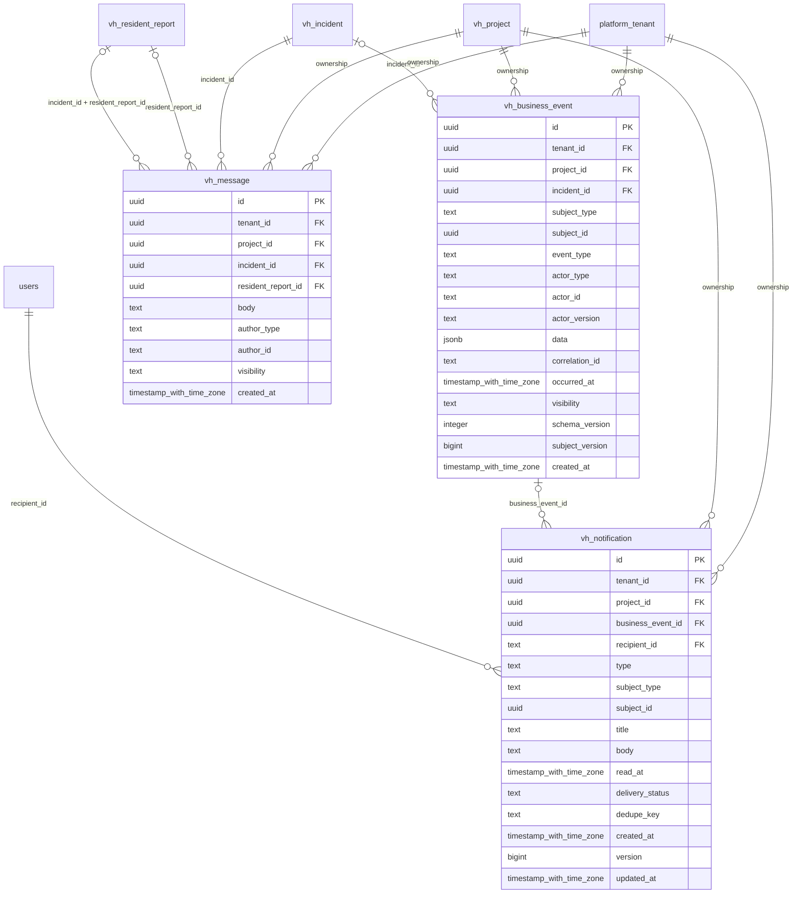

# vinhomes-communication

Generated from Drizzle. External entities in the diagram are foreign-key targets owned by another module.

## vh_business_event

Sự kiện nghiệp vụ append-only, lưu actor và subject version để tạo timeline/outbox/projection.

Tenant RLS: **enabled + forced by integrity migrations 0047/0049/0052**.

| Column | PostgreSQL type | Required | Default | Declared values |
|---|---|---|---|---|
| `id` | `uuid` | yes | `gen_random_uuid()` | — |
| `tenant_id` | `uuid` | yes | `—` | — |
| `project_id` | `uuid` | yes | `—` | — |
| `incident_id` | `uuid` | no | `—` | — |
| `subject_type` | `text` | yes | `—` | — |
| `subject_id` | `uuid` | yes | `—` | — |
| `event_type` | `text` | yes | `—` | — |
| `actor_type` | `text` | yes | `—` | `HUMAN`, `SYSTEM`, `AUTOMATION`, `AGENT`, `EXTERNAL_SERVICE` |
| `actor_id` | `text` | yes | `—` | — |
| `actor_version` | `text` | no | `—` | — |
| `data` | `jsonb` | yes | `—` | — |
| `correlation_id` | `text` | yes | `—` | — |
| `occurred_at` | `timestamp with time zone` | yes | `—` | — |
| `visibility` | `text` | yes | `—` | `INTERNAL`, `RESIDENT_VISIBLE` |
| `schema_version` | `integer` | yes | `—` | — |
| `subject_version` | `bigint` | yes | `—` | — |
| `created_at` | `timestamp with time zone` | yes | `now()` | — |

Primary key: `id`.

Unique keys:

- `vh_business_event_uq_0`: (`tenant_id`, `id`).
- `vh_business_event_uq_1`: (`tenant_id`, `project_id`, `id`).

Foreign keys:

- (`tenant_id`) → `platform_tenant` (`id`); ON DELETE `restrict`.
- (`tenant_id`, `project_id`) → `vh_project` (`tenant_id`, `id`); ON DELETE `restrict`.
- (`tenant_id`, `project_id`, `incident_id`) → `vh_incident` (`tenant_id`, `project_id`, `id`); ON DELETE `restrict`.

Indexes:

- `vh_business_event_ix_0`: (`tenant_id`, `incident_id`, `occurred_at`).
- `vh_business_event_ix_1`: (`tenant_id`, `project_id`).
- `vh_business_event_ix_2`: (`tenant_id`, `project_id`, `incident_id`).

Checks:

- `vh_business_event_actor_type_ck`: `"vh_business_event"."actor_type" in ('HUMAN', 'SYSTEM', 'AUTOMATION', 'AGENT', 'EXTERNAL_SERVICE')`.
- `vh_business_event_visibility_ck`: `"vh_business_event"."visibility" in ('INTERNAL', 'RESIDENT_VISIBLE')`.
- `vh_business_event_ck_0`: `schema_version > 0`.
- `vh_business_event_ck_1`: `subject_version > 0`.

Cross-row rules and application responsibilities: [database design](../01_DATABASE_ERD_IMPLEMENTATION_COMPLETE.md) and [system flow](../02_BUSINESS_ANALYSIS_IMPLEMENTATION.md).

## vh_message

Trao đổi nghiệp vụ gắn incident/report, phân biệt nội bộ và cư dân được xem; không phải command.

Tenant RLS: **enabled + forced by integrity migrations 0047/0049/0052**.

| Column | PostgreSQL type | Required | Default | Declared values |
|---|---|---|---|---|
| `id` | `uuid` | yes | `gen_random_uuid()` | — |
| `tenant_id` | `uuid` | yes | `—` | — |
| `project_id` | `uuid` | yes | `—` | — |
| `incident_id` | `uuid` | yes | `—` | — |
| `resident_report_id` | `uuid` | no | `—` | — |
| `body` | `text` | yes | `—` | — |
| `author_type` | `text` | yes | `—` | `HUMAN`, `SYSTEM`, `AGENT` |
| `author_id` | `text` | yes | `—` | — |
| `visibility` | `text` | yes | `—` | `INTERNAL`, `RESIDENT_VISIBLE` |
| `created_at` | `timestamp with time zone` | yes | `now()` | — |

Primary key: `id`.

Unique keys:

- `vh_message_uq_0`: (`tenant_id`, `id`).
- `vh_message_uq_1`: (`tenant_id`, `project_id`, `id`).

Foreign keys:

- (`tenant_id`) → `platform_tenant` (`id`); ON DELETE `restrict`.
- (`tenant_id`, `project_id`) → `vh_project` (`tenant_id`, `id`); ON DELETE `restrict`.
- (`tenant_id`, `project_id`, `incident_id`) → `vh_incident` (`tenant_id`, `project_id`, `id`); ON DELETE `restrict`.
- (`tenant_id`, `project_id`, `resident_report_id`) → `vh_resident_report` (`tenant_id`, `project_id`, `id`); ON DELETE `restrict`.
- (`tenant_id`, `incident_id`, `resident_report_id`) → `vh_resident_report` (`tenant_id`, `incident_id`, `id`); ON DELETE `restrict`.

Indexes:

- `vh_message_ix_0`: (`tenant_id`, `project_id`, `resident_report_id`).
- `vh_message_ix_1`: (`tenant_id`, `project_id`).
- `vh_message_ix_2`: (`tenant_id`, `project_id`, `incident_id`).

Checks:

- `vh_message_author_type_ck`: `"vh_message"."author_type" in ('HUMAN', 'SYSTEM', 'AGENT')`.
- `vh_message_visibility_ck`: `"vh_message"."visibility" in ('INTERNAL', 'RESIDENT_VISIBLE')`.

Cross-row rules and application responsibilities: [database design](../01_DATABASE_ERD_IMPLEMENTATION_COMPLETE.md) and [system flow](../02_BUSINESS_ANALYSIS_IMPLEMENTATION.md).

## vh_notification

Thông báo đã lọc cho một recipient, có dedupe key và read state; không phải toàn bộ timeline nội bộ.

Tenant RLS: **enabled + forced by integrity migrations 0047/0049/0052**.

| Column | PostgreSQL type | Required | Default | Declared values |
|---|---|---|---|---|
| `id` | `uuid` | yes | `gen_random_uuid()` | — |
| `tenant_id` | `uuid` | yes | `—` | — |
| `project_id` | `uuid` | yes | `—` | — |
| `business_event_id` | `uuid` | no | `—` | — |
| `recipient_id` | `text` | yes | `—` | — |
| `type` | `text` | yes | `—` | — |
| `subject_type` | `text` | yes | `—` | — |
| `subject_id` | `uuid` | yes | `—` | — |
| `title` | `text` | yes | `—` | — |
| `body` | `text` | yes | `—` | — |
| `read_at` | `timestamp with time zone` | no | `—` | — |
| `delivery_status` | `text` | yes | `—` | `QUEUED`, `DELIVERED`, `FAILED` |
| `dedupe_key` | `text` | yes | `—` | — |
| `created_at` | `timestamp with time zone` | yes | `now()` | — |
| `version` | `bigint` | yes | `1` | — |
| `updated_at` | `timestamp with time zone` | yes | `now()` | — |

Primary key: `id`.

Unique keys:

- `vh_notification_uq_0`: (`tenant_id`, `recipient_id`, `dedupe_key`).
- `vh_notification_uq_1`: (`tenant_id`, `id`).
- `vh_notification_uq_2`: (`tenant_id`, `project_id`, `id`).

Foreign keys:

- (`tenant_id`) → `platform_tenant` (`id`); ON DELETE `restrict`.
- (`tenant_id`, `project_id`) → `vh_project` (`tenant_id`, `id`); ON DELETE `restrict`.
- (`tenant_id`, `project_id`, `business_event_id`) → `vh_business_event` (`tenant_id`, `project_id`, `id`); ON DELETE `restrict`.
- (`recipient_id`) → `users` (`id`); ON DELETE `restrict`.

Indexes:

- `vh_notification_ix_0`: (`recipient_id`).
- `vh_notification_ix_1`: (`tenant_id`, `project_id`, `business_event_id`).
- `vh_notification_ix_2`: (`tenant_id`, `recipient_id`, `read_at`, `created_at`).
- `vh_notification_ix_3`: (`tenant_id`, `project_id`).

Checks:

- `vh_notification_delivery_status_ck`: `"vh_notification"."delivery_status" in ('QUEUED', 'DELIVERED', 'FAILED')`.
- `vh_notification_ck_0`: `version > 0`.

Cross-row rules and application responsibilities: [database design](../01_DATABASE_ERD_IMPLEMENTATION_COMPLETE.md) and [system flow](../02_BUSINESS_ANALYSIS_IMPLEMENTATION.md).
