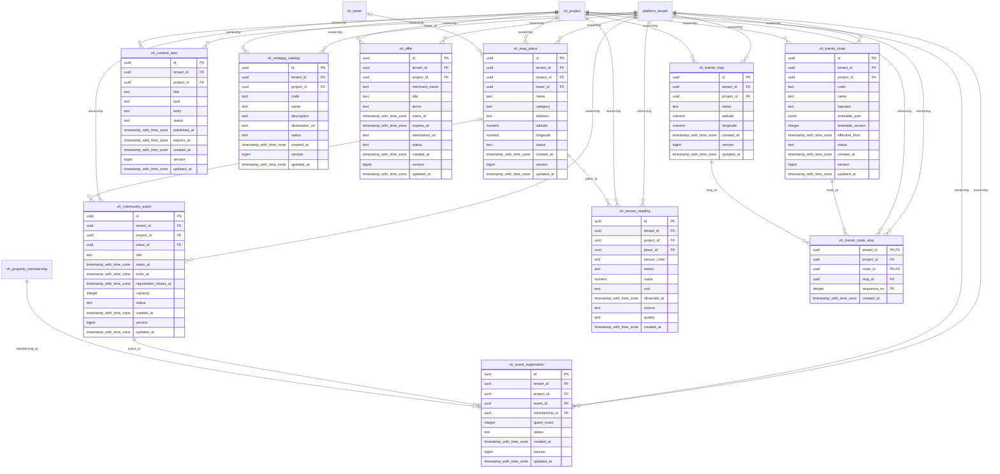

# vinhomes-content

Generated from Drizzle. External entities in the diagram are foreign-key targets owned by another module.

## vh_community_event

Sự kiện cộng đồng có lịch, nơi tổ chức, hạn đăng ký và capacity.

Tenant RLS: **enabled + forced by integrity migrations 0047/0049**.

| Column | PostgreSQL type | Required | Default | Declared values |
|---|---|---|---|---|
| `id` | `uuid` | yes | `gen_random_uuid()` | — |
| `tenant_id` | `uuid` | yes | `—` | — |
| `project_id` | `uuid` | yes | `—` | — |
| `place_id` | `uuid` | no | `—` | — |
| `title` | `text` | yes | `—` | — |
| `starts_at` | `timestamp with time zone` | yes | `—` | — |
| `ends_at` | `timestamp with time zone` | yes | `—` | — |
| `registration_closes_at` | `timestamp with time zone` | yes | `—` | — |
| `capacity` | `integer` | yes | `—` | — |
| `status` | `text` | yes | `—` | `DRAFT`, `PUBLISHED`, `CANCELLED`, `COMPLETED` |
| `created_at` | `timestamp with time zone` | yes | `now()` | — |
| `version` | `bigint` | yes | `1` | — |
| `updated_at` | `timestamp with time zone` | yes | `now()` | — |

Primary key: `id`.

Unique keys:

- `vh_community_event_uq_0`: (`tenant_id`, `id`).
- `vh_community_event_uq_1`: (`tenant_id`, `project_id`, `id`).

Foreign keys:

- (`tenant_id`) → `platform_tenant` (`id`); ON DELETE `restrict`.
- (`tenant_id`, `project_id`) → `vh_project` (`tenant_id`, `id`); ON DELETE `restrict`.
- (`tenant_id`, `project_id`, `place_id`) → `vh_map_place` (`tenant_id`, `project_id`, `id`); ON DELETE `restrict`.

Indexes:

- `vh_community_event_ix_0`: (`tenant_id`, `project_id`, `place_id`).
- `vh_community_event_ix_1`: (`tenant_id`, `project_id`).

Checks:

- `vh_community_event_status_ck`: `"vh_community_event"."status" in ('DRAFT', 'PUBLISHED', 'CANCELLED', 'COMPLETED')`.
- `vh_community_event_ck_0`: `ends_at > starts_at`.
- `vh_community_event_ck_1`: `capacity > 0`.
- `vh_community_event_ck_2`: `registration_closes_at <= starts_at`.
- `vh_community_event_ck_3`: `version > 0`.

Additional cross-row/temporal rules: [integrity matrix](../DATABASE_DESIGN.md#integrity-matrix) and [coordination review](../COMPLETENESS_REVIEW.md).

## vh_content_item

Tin tức/sổ tay/thông báo của dự án với lịch publish/hết hạn.

Tenant RLS: **enabled + forced by integrity migrations 0047/0049**.

| Column | PostgreSQL type | Required | Default | Declared values |
|---|---|---|---|---|
| `id` | `uuid` | yes | `gen_random_uuid()` | — |
| `tenant_id` | `uuid` | yes | `—` | — |
| `project_id` | `uuid` | yes | `—` | — |
| `title` | `text` | yes | `—` | — |
| `kind` | `text` | yes | `—` | `NEWS`, `HANDBOOK`, `NOTICE` |
| `body` | `text` | yes | `—` | — |
| `status` | `text` | yes | `—` | `DRAFT`, `PUBLISHED`, `ARCHIVED` |
| `published_at` | `timestamp with time zone` | no | `—` | — |
| `expires_at` | `timestamp with time zone` | no | `—` | — |
| `created_at` | `timestamp with time zone` | yes | `now()` | — |
| `version` | `bigint` | yes | `1` | — |
| `updated_at` | `timestamp with time zone` | yes | `now()` | — |

Primary key: `id`.

Unique keys:

- `vh_content_item_uq_0`: (`tenant_id`, `id`).
- `vh_content_item_uq_1`: (`tenant_id`, `project_id`, `id`).

Foreign keys:

- (`tenant_id`) → `platform_tenant` (`id`); ON DELETE `restrict`.
- (`tenant_id`, `project_id`) → `vh_project` (`tenant_id`, `id`); ON DELETE `restrict`.

Indexes:

- `vh_content_item_ix_0`: (`tenant_id`, `project_id`).
- `vh_content_item_ix_1`: (`tenant_id`, `project_id`, `status`, `published_at`).

Checks:

- `vh_content_item_kind_ck`: `"vh_content_item"."kind" in ('NEWS', 'HANDBOOK', 'NOTICE')`.
- `vh_content_item_status_ck`: `"vh_content_item"."status" in ('DRAFT', 'PUBLISHED', 'ARCHIVED')`.
- `vh_content_item_ck_0`: `status <> 'PUBLISHED' OR published_at IS NOT NULL`.
- `vh_content_item_ck_1`: `expires_at IS NULL OR expires_at > published_at`.
- `vh_content_item_ck_2`: `version > 0`.

Additional cross-row/temporal rules: [integrity matrix](../DATABASE_DESIGN.md#integrity-matrix) and [coordination review](../COMPLETENESS_REVIEW.md).

## vh_event_registration

Đăng ký sự kiện theo membership, số khách và trạng thái tham dự/hủy.

Tenant RLS: **enabled + forced by integrity migrations 0047/0049**.

| Column | PostgreSQL type | Required | Default | Declared values |
|---|---|---|---|---|
| `id` | `uuid` | yes | `gen_random_uuid()` | — |
| `tenant_id` | `uuid` | yes | `—` | — |
| `project_id` | `uuid` | yes | `—` | — |
| `event_id` | `uuid` | yes | `—` | — |
| `membership_id` | `uuid` | yes | `—` | — |
| `guest_count` | `integer` | yes | `—` | — |
| `status` | `text` | yes | `—` | `REGISTERED`, `CANCELLED`, `ATTENDED` |
| `created_at` | `timestamp with time zone` | yes | `now()` | — |
| `version` | `bigint` | yes | `1` | — |
| `updated_at` | `timestamp with time zone` | yes | `now()` | — |

Primary key: `id`.

Unique keys:

- `vh_event_registration_uq_0`: (`tenant_id`, `event_id`, `membership_id`).
- `vh_event_registration_uq_1`: (`tenant_id`, `id`).
- `vh_event_registration_uq_2`: (`tenant_id`, `project_id`, `id`).

Foreign keys:

- (`tenant_id`) → `platform_tenant` (`id`); ON DELETE `restrict`.
- (`tenant_id`, `project_id`) → `vh_project` (`tenant_id`, `id`); ON DELETE `restrict`.
- (`tenant_id`, `project_id`, `event_id`) → `vh_community_event` (`tenant_id`, `project_id`, `id`); ON DELETE `restrict`.
- (`tenant_id`, `project_id`, `membership_id`) → `vh_property_membership` (`tenant_id`, `project_id`, `id`); ON DELETE `restrict`.

Indexes:

- `vh_event_registration_ix_0`: (`tenant_id`, `project_id`, `event_id`).
- `vh_event_registration_ix_1`: (`tenant_id`, `project_id`, `membership_id`).
- `vh_event_registration_ix_2`: (`tenant_id`, `project_id`).
- `vh_event_registration_ix_3`: (`tenant_id`, `event_id`, `status`).

Checks:

- `vh_event_registration_status_ck`: `"vh_event_registration"."status" in ('REGISTERED', 'CANCELLED', 'ATTENDED')`.
- `vh_event_registration_ck_0`: `guest_count >= 0`.
- `vh_event_registration_ck_1`: `version > 0`.

Additional cross-row/temporal rules: [integrity matrix](../DATABASE_DESIGN.md#integrity-matrix) and [coordination review](../COMPLETENESS_REVIEW.md).

## vh_map_place

Địa điểm/điểm dịch vụ trên bản đồ, có thể gắn tòa và tọa độ.

Tenant RLS: **enabled + forced by integrity migrations 0047/0049**.

| Column | PostgreSQL type | Required | Default | Declared values |
|---|---|---|---|---|
| `id` | `uuid` | yes | `gen_random_uuid()` | — |
| `tenant_id` | `uuid` | yes | `—` | — |
| `project_id` | `uuid` | yes | `—` | — |
| `tower_id` | `uuid` | no | `—` | — |
| `name` | `text` | yes | `—` | — |
| `category` | `text` | yes | `—` | — |
| `address` | `text` | yes | `—` | — |
| `latitude` | `numeric` | no | `—` | — |
| `longitude` | `numeric` | no | `—` | — |
| `status` | `text` | yes | `—` | `ACTIVE`, `RETIRED` |
| `created_at` | `timestamp with time zone` | yes | `now()` | — |
| `version` | `bigint` | yes | `1` | — |
| `updated_at` | `timestamp with time zone` | yes | `now()` | — |

Primary key: `id`.

Unique keys:

- `vh_map_place_uq_0`: (`tenant_id`, `id`).
- `vh_map_place_uq_1`: (`tenant_id`, `project_id`, `id`).

Foreign keys:

- (`tenant_id`) → `platform_tenant` (`id`); ON DELETE `restrict`.
- (`tenant_id`, `project_id`) → `vh_project` (`tenant_id`, `id`); ON DELETE `restrict`.
- (`tenant_id`, `project_id`, `tower_id`) → `vh_tower` (`tenant_id`, `project_id`, `id`); ON DELETE `restrict`.

Indexes:

- `vh_map_place_ix_0`: (`tenant_id`, `project_id`, `tower_id`).
- `vh_map_place_ix_1`: (`tenant_id`, `project_id`).

Checks:

- `vh_map_place_status_ck`: `"vh_map_place"."status" in ('ACTIVE', 'RETIRED')`.
- `vh_map_place_ck_0`: `(latitude IS NULL) = (longitude IS NULL)`.
- `vh_map_place_ck_1`: `latitude IS NULL OR latitude BETWEEN -90 AND 90`.
- `vh_map_place_ck_2`: `longitude IS NULL OR longitude BETWEEN -180 AND 180`.
- `vh_map_place_ck_3`: `version > 0`.

Additional cross-row/temporal rules: [integrity matrix](../DATABASE_DESIGN.md#integrity-matrix) and [coordination review](../COMPLETENESS_REVIEW.md).

## vh_miniapp_catalog

Danh mục ứng dụng/dịch vụ liên kết được phép hiển thị trong dự án.

Tenant RLS: **enabled + forced by integrity migrations 0047/0049**.

| Column | PostgreSQL type | Required | Default | Declared values |
|---|---|---|---|---|
| `id` | `uuid` | yes | `gen_random_uuid()` | — |
| `tenant_id` | `uuid` | yes | `—` | — |
| `project_id` | `uuid` | yes | `—` | — |
| `code` | `text` | yes | `—` | — |
| `name` | `text` | yes | `—` | — |
| `description` | `text` | yes | `—` | — |
| `destination_url` | `text` | yes | `—` | — |
| `status` | `text` | yes | `—` | `ACTIVE`, `DISABLED` |
| `created_at` | `timestamp with time zone` | yes | `now()` | — |
| `version` | `bigint` | yes | `1` | — |
| `updated_at` | `timestamp with time zone` | yes | `now()` | — |

Primary key: `id`.

Unique keys:

- `vh_miniapp_catalog_uq_0`: (`tenant_id`, `project_id`, `code`).
- `vh_miniapp_catalog_uq_1`: (`tenant_id`, `id`).
- `vh_miniapp_catalog_uq_2`: (`tenant_id`, `project_id`, `id`).

Foreign keys:

- (`tenant_id`) → `platform_tenant` (`id`); ON DELETE `restrict`.
- (`tenant_id`, `project_id`) → `vh_project` (`tenant_id`, `id`); ON DELETE `restrict`.

Indexes:

- `vh_miniapp_catalog_ix_0`: (`tenant_id`, `project_id`).

Checks:

- `vh_miniapp_catalog_status_ck`: `"vh_miniapp_catalog"."status" in ('ACTIVE', 'DISABLED')`.
- `vh_miniapp_catalog_ck_0`: `version > 0`.

Additional cross-row/temporal rules: [integrity matrix](../DATABASE_DESIGN.md#integrity-matrix) and [coordination review](../COMPLETENESS_REVIEW.md).

## vh_offer

Ưu đãi đối tác có điều kiện, thời hạn và URL đích cần được kiểm duyệt.

Tenant RLS: **enabled + forced by integrity migrations 0047/0049**.

| Column | PostgreSQL type | Required | Default | Declared values |
|---|---|---|---|---|
| `id` | `uuid` | yes | `gen_random_uuid()` | — |
| `tenant_id` | `uuid` | yes | `—` | — |
| `project_id` | `uuid` | yes | `—` | — |
| `merchant_name` | `text` | yes | `—` | — |
| `title` | `text` | yes | `—` | — |
| `terms` | `text` | yes | `—` | — |
| `starts_at` | `timestamp with time zone` | yes | `—` | — |
| `expires_at` | `timestamp with time zone` | yes | `—` | — |
| `destination_url` | `text` | no | `—` | — |
| `status` | `text` | yes | `—` | `DRAFT`, `PUBLISHED`, `EXPIRED`, `RETIRED` |
| `created_at` | `timestamp with time zone` | yes | `now()` | — |
| `version` | `bigint` | yes | `1` | — |
| `updated_at` | `timestamp with time zone` | yes | `now()` | — |

Primary key: `id`.

Unique keys:

- `vh_offer_uq_0`: (`tenant_id`, `id`).
- `vh_offer_uq_1`: (`tenant_id`, `project_id`, `id`).

Foreign keys:

- (`tenant_id`) → `platform_tenant` (`id`); ON DELETE `restrict`.
- (`tenant_id`, `project_id`) → `vh_project` (`tenant_id`, `id`); ON DELETE `restrict`.

Indexes:

- `vh_offer_ix_0`: (`tenant_id`, `project_id`).

Checks:

- `vh_offer_status_ck`: `"vh_offer"."status" in ('DRAFT', 'PUBLISHED', 'EXPIRED', 'RETIRED')`.
- `vh_offer_ck_0`: `expires_at > starts_at`.
- `vh_offer_ck_1`: `version > 0`.

Additional cross-row/temporal rules: [integrity matrix](../DATABASE_DESIGN.md#integrity-matrix) and [coordination review](../COMPLETENESS_REVIEW.md).

## vh_sensor_reading

Quan trắc cảm biến bất biến theo vị trí/thời gian và chất lượng dữ liệu.

Tenant RLS: **enabled + forced by integrity migrations 0047/0049**.

| Column | PostgreSQL type | Required | Default | Declared values |
|---|---|---|---|---|
| `id` | `uuid` | yes | `gen_random_uuid()` | — |
| `tenant_id` | `uuid` | yes | `—` | — |
| `project_id` | `uuid` | yes | `—` | — |
| `place_id` | `uuid` | yes | `—` | — |
| `sensor_code` | `text` | yes | `—` | — |
| `metric` | `text` | yes | `—` | — |
| `value` | `numeric` | yes | `—` | — |
| `unit` | `text` | yes | `—` | — |
| `observed_at` | `timestamp with time zone` | yes | `—` | — |
| `source` | `text` | yes | `—` | — |
| `quality` | `text` | yes | `—` | `VALID`, `STALE`, `INVALID` |
| `created_at` | `timestamp with time zone` | yes | `now()` | — |

Primary key: `id`.

Unique keys:

- `vh_sensor_reading_uq_0`: (`tenant_id`, `project_id`, `sensor_code`, `metric`, `observed_at`).
- `vh_sensor_reading_uq_1`: (`tenant_id`, `id`).
- `vh_sensor_reading_uq_2`: (`tenant_id`, `project_id`, `id`).

Foreign keys:

- (`tenant_id`) → `platform_tenant` (`id`); ON DELETE `restrict`.
- (`tenant_id`, `project_id`) → `vh_project` (`tenant_id`, `id`); ON DELETE `restrict`.
- (`tenant_id`, `project_id`, `place_id`) → `vh_map_place` (`tenant_id`, `project_id`, `id`); ON DELETE `restrict`.

Indexes:

- `vh_sensor_reading_ix_0`: (`tenant_id`, `project_id`, `place_id`).
- `vh_sensor_reading_ix_1`: (`tenant_id`, `project_id`).

Checks:

- `vh_sensor_reading_quality_ck`: `"vh_sensor_reading"."quality" in ('VALID', 'STALE', 'INVALID')`.

Additional cross-row/temporal rules: [integrity matrix](../DATABASE_DESIGN.md#integrity-matrix) and [coordination review](../COMPLETENESS_REVIEW.md).

## vh_transit_route

Tuyến xe và phiên bản lịch chạy; không mặc nhiên là thời gian đến realtime.

Tenant RLS: **enabled + forced by integrity migrations 0047/0049**.

| Column | PostgreSQL type | Required | Default | Declared values |
|---|---|---|---|---|
| `id` | `uuid` | yes | `gen_random_uuid()` | — |
| `tenant_id` | `uuid` | yes | `—` | — |
| `project_id` | `uuid` | yes | `—` | — |
| `code` | `text` | yes | `—` | — |
| `name` | `text` | yes | `—` | — |
| `operator` | `text` | yes | `—` | — |
| `timetable_json` | `jsonb` | yes | `—` | — |
| `timetable_version` | `integer` | yes | `—` | — |
| `effective_from` | `timestamp with time zone` | yes | `—` | — |
| `status` | `text` | yes | `—` | `ACTIVE`, `SUSPENDED`, `RETIRED` |
| `created_at` | `timestamp with time zone` | yes | `now()` | — |
| `version` | `bigint` | yes | `1` | — |
| `updated_at` | `timestamp with time zone` | yes | `now()` | — |

Primary key: `id`.

Unique keys:

- `vh_transit_route_uq_0`: (`tenant_id`, `project_id`, `code`).
- `vh_transit_route_uq_1`: (`tenant_id`, `id`).
- `vh_transit_route_uq_2`: (`tenant_id`, `project_id`, `id`).

Foreign keys:

- (`tenant_id`) → `platform_tenant` (`id`); ON DELETE `restrict`.
- (`tenant_id`, `project_id`) → `vh_project` (`tenant_id`, `id`); ON DELETE `restrict`.

Indexes:

- `vh_transit_route_ix_0`: (`tenant_id`, `project_id`).

Checks:

- `vh_transit_route_status_ck`: `"vh_transit_route"."status" in ('ACTIVE', 'SUSPENDED', 'RETIRED')`.
- `vh_transit_route_ck_0`: `timetable_version > 0`.
- `vh_transit_route_ck_1`: `version > 0`.

Additional cross-row/temporal rules: [integrity matrix](../DATABASE_DESIGN.md#integrity-matrix) and [coordination review](../COMPLETENESS_REVIEW.md).

## vh_transit_route_stop

Thứ tự các điểm dừng trên một tuyến, bảo đảm cùng project.

Tenant RLS: **enabled + forced by integrity migrations 0047/0049**.

| Column | PostgreSQL type | Required | Default | Declared values |
|---|---|---|---|---|
| `tenant_id` | `uuid` | yes | `—` | — |
| `project_id` | `uuid` | yes | `—` | — |
| `route_id` | `uuid` | yes | `—` | — |
| `stop_id` | `uuid` | yes | `—` | — |
| `sequence_no` | `integer` | yes | `—` | — |
| `created_at` | `timestamp with time zone` | yes | `now()` | — |

Primary key: `tenant_id`, `route_id`, `sequence_no`.

Foreign keys:

- (`tenant_id`) → `platform_tenant` (`id`); ON DELETE `restrict`.
- (`tenant_id`, `project_id`) → `vh_project` (`tenant_id`, `id`); ON DELETE `restrict`.
- (`tenant_id`, `project_id`, `route_id`) → `vh_transit_route` (`tenant_id`, `project_id`, `id`); ON DELETE `restrict`.
- (`tenant_id`, `project_id`, `stop_id`) → `vh_transit_stop` (`tenant_id`, `project_id`, `id`); ON DELETE `restrict`.

Indexes:

- `vh_transit_route_stop_ix_0`: (`tenant_id`, `project_id`).
- `vh_transit_route_stop_ix_1`: (`tenant_id`, `project_id`, `stop_id`).
- `vh_transit_route_stop_ix_2`: (`tenant_id`, `project_id`, `route_id`).

Checks:

- `vh_transit_route_stop_ck_0`: `sequence_no > 0`.

Additional cross-row/temporal rules: [integrity matrix](../DATABASE_DESIGN.md#integrity-matrix) and [coordination review](../COMPLETENESS_REVIEW.md).

## vh_transit_stop

Điểm dừng trong dự án với tọa độ đã kiểm tra miền giá trị.

Tenant RLS: **enabled + forced by integrity migrations 0047/0049**.

| Column | PostgreSQL type | Required | Default | Declared values |
|---|---|---|---|---|
| `id` | `uuid` | yes | `gen_random_uuid()` | — |
| `tenant_id` | `uuid` | yes | `—` | — |
| `project_id` | `uuid` | yes | `—` | — |
| `name` | `text` | yes | `—` | — |
| `latitude` | `numeric` | yes | `—` | — |
| `longitude` | `numeric` | yes | `—` | — |
| `created_at` | `timestamp with time zone` | yes | `now()` | — |
| `version` | `bigint` | yes | `1` | — |
| `updated_at` | `timestamp with time zone` | yes | `now()` | — |

Primary key: `id`.

Unique keys:

- `vh_transit_stop_uq_0`: (`tenant_id`, `id`).
- `vh_transit_stop_uq_1`: (`tenant_id`, `project_id`, `id`).

Foreign keys:

- (`tenant_id`) → `platform_tenant` (`id`); ON DELETE `restrict`.
- (`tenant_id`, `project_id`) → `vh_project` (`tenant_id`, `id`); ON DELETE `restrict`.

Indexes:

- `vh_transit_stop_ix_0`: (`tenant_id`, `project_id`).

Checks:

- `vh_transit_stop_ck_0`: `latitude BETWEEN -90 AND 90`.
- `vh_transit_stop_ck_1`: `longitude BETWEEN -180 AND 180`.
- `vh_transit_stop_ck_2`: `version > 0`.

Additional cross-row/temporal rules: [integrity matrix](../DATABASE_DESIGN.md#integrity-matrix) and [coordination review](../COMPLETENESS_REVIEW.md).
