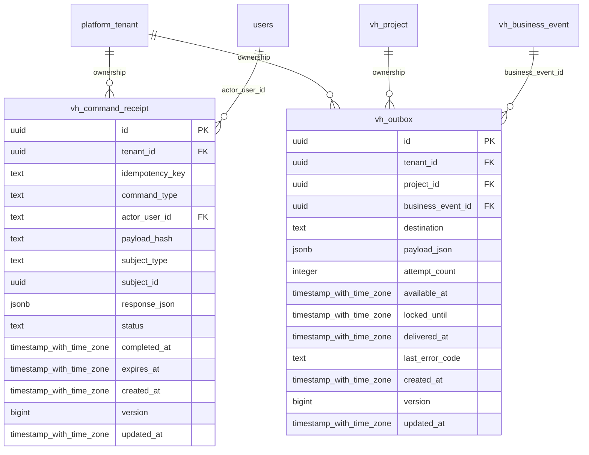

# vinhomes-delivery

Generated from Drizzle. External entities in the diagram are foreign-key targets owned by another module.

## vh_command_receipt

Kết quả command theo tenant/user/loại/key, ghim payload hash; retry trả kết quả đã commit.

Tenant RLS: **enabled + forced by integrity migrations 0047/0049/0052**.

| Column | PostgreSQL type | Required | Default | Declared values |
|---|---|---|---|---|
| `id` | `uuid` | yes | `gen_random_uuid()` | — |
| `tenant_id` | `uuid` | yes | `—` | — |
| `idempotency_key` | `text` | yes | `—` | — |
| `command_type` | `text` | yes | `—` | — |
| `actor_user_id` | `text` | yes | `—` | — |
| `payload_hash` | `text` | yes | `—` | — |
| `subject_type` | `text` | yes | `—` | — |
| `subject_id` | `uuid` | no | `—` | — |
| `response_json` | `jsonb` | no | `—` | — |
| `status` | `text` | yes | `—` | `IN_PROGRESS`, `COMPLETED` |
| `completed_at` | `timestamp with time zone` | no | `—` | — |
| `expires_at` | `timestamp with time zone` | no | `—` | — |
| `created_at` | `timestamp with time zone` | yes | `now()` | — |
| `version` | `bigint` | yes | `1` | — |
| `updated_at` | `timestamp with time zone` | yes | `now()` | — |

Primary key: `id`.

Unique keys:

- `vh_command_receipt_uq_0`: (`tenant_id`, `actor_user_id`, `command_type`, `idempotency_key`).
- `vh_command_receipt_uq_1`: (`tenant_id`, `id`).

Foreign keys:

- (`tenant_id`) → `platform_tenant` (`id`); ON DELETE `restrict`.
- (`actor_user_id`) → `users` (`id`); ON DELETE `restrict`.

Checks:

- `vh_command_receipt_status_ck`: `"vh_command_receipt"."status" in ('IN_PROGRESS', 'COMPLETED')`.
- `vh_command_receipt_completed_ck`: `status <> 'COMPLETED' OR (completed_at IS NOT NULL AND response_json IS NOT NULL)`.
- `vh_command_receipt_version_ck`: `version > 0`.

Cross-row rules and application responsibilities: [database design](../01_DATABASE_ERD_IMPLEMENTATION_COMPLETE.md) and [system flow](../02_BUSINESS_ANALYSIS_IMPLEMENTATION.md).

## vh_outbox

Hàng gửi business event tới đích, có retry/lease/delivery state và unique event/destination.

Tenant RLS: **enabled + forced by integrity migrations 0047/0049/0052**.

| Column | PostgreSQL type | Required | Default | Declared values |
|---|---|---|---|---|
| `id` | `uuid` | yes | `gen_random_uuid()` | — |
| `tenant_id` | `uuid` | yes | `—` | — |
| `project_id` | `uuid` | yes | `—` | — |
| `business_event_id` | `uuid` | yes | `—` | — |
| `destination` | `text` | yes | `—` | — |
| `payload_json` | `jsonb` | yes | `—` | — |
| `attempt_count` | `integer` | yes | `—` | — |
| `available_at` | `timestamp with time zone` | yes | `—` | — |
| `locked_until` | `timestamp with time zone` | no | `—` | — |
| `delivered_at` | `timestamp with time zone` | no | `—` | — |
| `last_error_code` | `text` | no | `—` | — |
| `created_at` | `timestamp with time zone` | yes | `now()` | — |
| `version` | `bigint` | yes | `1` | — |
| `updated_at` | `timestamp with time zone` | yes | `now()` | — |

Primary key: `id`.

Unique keys:

- `vh_outbox_uq_0`: (`tenant_id`, `business_event_id`, `destination`).
- `vh_outbox_uq_1`: (`tenant_id`, `id`).
- `vh_outbox_uq_2`: (`tenant_id`, `project_id`, `id`).

Foreign keys:

- (`tenant_id`) → `platform_tenant` (`id`); ON DELETE `restrict`.
- (`tenant_id`, `project_id`) → `vh_project` (`tenant_id`, `id`); ON DELETE `restrict`.
- (`tenant_id`, `project_id`, `business_event_id`) → `vh_business_event` (`tenant_id`, `project_id`, `id`); ON DELETE `restrict`.

Indexes:

- `vh_outbox_ix_0`: (`tenant_id`, `project_id`, `business_event_id`).
- `vh_outbox_ix_1`: (`tenant_id`, `project_id`).
- `vh_outbox_pending_ix`: (`available_at`) WHERE `"vh_outbox"."delivered_at" IS NULL`.

Checks:

- `vh_outbox_ck_0`: `attempt_count >= 0`.
- `vh_outbox_ck_1`: `version > 0`.

Cross-row rules and application responsibilities: [database design](../01_DATABASE_ERD_IMPLEMENTATION_COMPLETE.md) and [system flow](../02_BUSINESS_ANALYSIS_IMPLEMENTATION.md).
