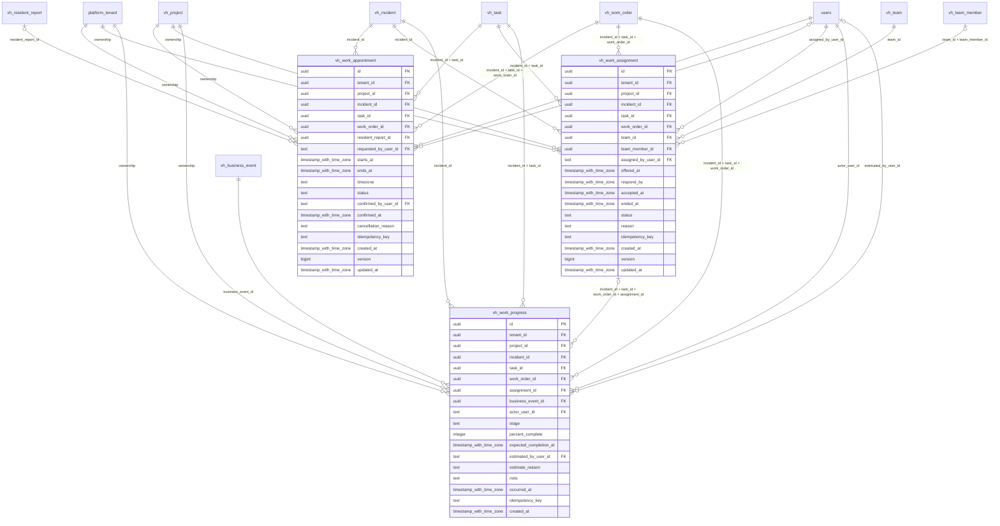

# vinhomes-dispatch

Generated from Drizzle. External entities in the diagram are foreign-key targets owned by another module.

## vh_work_appointment

Lịch hẹn thực hiện work order và xác nhận với cư dân nếu cần, lưu lịch sử đổi lịch bằng bản ghi mới.

Tenant RLS: **enabled + forced by integrity migrations 0047/0049**.

| Column | PostgreSQL type | Required | Default | Declared values |
|---|---|---|---|---|
| `id` | `uuid` | yes | `gen_random_uuid()` | — |
| `tenant_id` | `uuid` | yes | `—` | — |
| `project_id` | `uuid` | yes | `—` | — |
| `incident_id` | `uuid` | yes | `—` | — |
| `task_id` | `uuid` | yes | `—` | — |
| `work_order_id` | `uuid` | yes | `—` | — |
| `resident_report_id` | `uuid` | no | `—` | — |
| `requested_by_user_id` | `text` | yes | `—` | — |
| `starts_at` | `timestamp with time zone` | yes | `—` | — |
| `ends_at` | `timestamp with time zone` | yes | `—` | — |
| `timezone` | `text` | yes | `—` | — |
| `status` | `text` | yes | `—` | `PROPOSED`, `CONFIRMED`, `COMPLETED`, `CANCELLED` |
| `confirmed_by_user_id` | `text` | no | `—` | — |
| `confirmed_at` | `timestamp with time zone` | no | `—` | — |
| `cancellation_reason` | `text` | no | `—` | — |
| `idempotency_key` | `text` | yes | `—` | — |
| `created_at` | `timestamp with time zone` | yes | `now()` | — |
| `version` | `bigint` | yes | `1` | — |
| `updated_at` | `timestamp with time zone` | yes | `now()` | — |

Primary key: `id`.

Unique keys:

- `vh_work_appointment_uq_0`: (`tenant_id`, `idempotency_key`).
- `vh_work_appointment_uq_1`: (`tenant_id`, `id`).
- `vh_work_appointment_uq_2`: (`tenant_id`, `project_id`, `id`).

Foreign keys:

- (`tenant_id`) → `platform_tenant` (`id`); ON DELETE `restrict`.
- (`tenant_id`, `project_id`) → `vh_project` (`tenant_id`, `id`); ON DELETE `restrict`.
- (`tenant_id`, `project_id`, `incident_id`) → `vh_incident` (`tenant_id`, `project_id`, `id`); ON DELETE `restrict`.
- (`tenant_id`, `project_id`, `incident_id`, `task_id`) → `vh_task` (`tenant_id`, `project_id`, `incident_id`, `id`); ON DELETE `restrict`.
- (`tenant_id`, `project_id`, `incident_id`, `task_id`, `work_order_id`) → `vh_work_order` (`tenant_id`, `project_id`, `incident_id`, `task_id`, `id`); ON DELETE `restrict`.
- (`tenant_id`, `project_id`, `resident_report_id`) → `vh_resident_report` (`tenant_id`, `project_id`, `id`); ON DELETE `restrict`.
- (`requested_by_user_id`) → `users` (`id`); ON DELETE `restrict`.
- (`confirmed_by_user_id`) → `users` (`id`); ON DELETE `restrict`.

Indexes:

- `vh_work_appointment_ix_0`: (`confirmed_by_user_id`).
- `vh_work_appointment_ix_1`: (`requested_by_user_id`).
- `vh_work_appointment_ix_3`: (`tenant_id`, `project_id`).
- `vh_work_appointment_ix_4`: (`tenant_id`, `project_id`, `incident_id`).
- `vh_work_appointment_ix_5`: (`tenant_id`, `project_id`, `incident_id`, `task_id`).
- `vh_work_appointment_ix_6`: (`tenant_id`, `project_id`, `incident_id`, `task_id`, `work_order_id`).
- `vh_work_appointment_ix_7`: (`tenant_id`, `project_id`, `resident_report_id`).

Checks:

- `vh_work_appointment_status_ck`: `"vh_work_appointment"."status" in ('PROPOSED', 'CONFIRMED', 'COMPLETED', 'CANCELLED')`.
- `vh_work_appointment_ck_0`: `ends_at > starts_at`.
- `vh_work_appointment_ck_1`: `status NOT IN ('CONFIRMED','COMPLETED') OR (confirmed_by_user_id IS NOT NULL AND confirmed_at IS NOT NULL)`.
- `vh_work_appointment_ck_2`: `version > 0`.

Additional cross-row/temporal rules: [integrity matrix](../DATABASE_DESIGN.md#integrity-matrix) and [coordination review](../COMPLETENESS_REVIEW.md).

## vh_work_assignment

Lịch sử giao/nhận/từ chối/thu hồi/hoàn tất work order cho đội hoặc nhân viên; mỗi work order tối đa một assignment đang hiệu lực.

Tenant RLS: **enabled + forced by integrity migrations 0047/0049**.

| Column | PostgreSQL type | Required | Default | Declared values |
|---|---|---|---|---|
| `id` | `uuid` | yes | `gen_random_uuid()` | — |
| `tenant_id` | `uuid` | yes | `—` | — |
| `project_id` | `uuid` | yes | `—` | — |
| `incident_id` | `uuid` | yes | `—` | — |
| `task_id` | `uuid` | yes | `—` | — |
| `work_order_id` | `uuid` | yes | `—` | — |
| `team_id` | `uuid` | yes | `—` | — |
| `team_member_id` | `uuid` | no | `—` | — |
| `assigned_by_user_id` | `text` | yes | `—` | — |
| `offered_at` | `timestamp with time zone` | yes | `—` | — |
| `respond_by` | `timestamp with time zone` | no | `—` | — |
| `accepted_at` | `timestamp with time zone` | no | `—` | — |
| `ended_at` | `timestamp with time zone` | no | `—` | — |
| `status` | `text` | yes | `—` | `OFFERED`, `ACCEPTED`, `REJECTED`, `RELEASED`, `COMPLETED` |
| `reason` | `text` | no | `—` | — |
| `idempotency_key` | `text` | yes | `—` | — |
| `created_at` | `timestamp with time zone` | yes | `now()` | — |
| `version` | `bigint` | yes | `1` | — |
| `updated_at` | `timestamp with time zone` | yes | `now()` | — |

Primary key: `id`.

Unique keys:

- `vh_work_assignment_uq_0`: (`tenant_id`, `idempotency_key`).
- `vh_work_assignment_uq_1`: (`tenant_id`, `id`).
- `vh_work_assignment_uq_2`: (`tenant_id`, `project_id`, `id`).
- `vh_work_assignment_uq_3`: (`tenant_id`, `project_id`, `incident_id`, `task_id`, `work_order_id`, `id`).

Foreign keys:

- (`tenant_id`) → `platform_tenant` (`id`); ON DELETE `restrict`.
- (`tenant_id`, `project_id`) → `vh_project` (`tenant_id`, `id`); ON DELETE `restrict`.
- (`tenant_id`, `project_id`, `incident_id`) → `vh_incident` (`tenant_id`, `project_id`, `id`); ON DELETE `restrict`.
- (`tenant_id`, `project_id`, `incident_id`, `task_id`) → `vh_task` (`tenant_id`, `project_id`, `incident_id`, `id`); ON DELETE `restrict`.
- (`tenant_id`, `project_id`, `incident_id`, `task_id`, `work_order_id`) → `vh_work_order` (`tenant_id`, `project_id`, `incident_id`, `task_id`, `id`); ON DELETE `restrict`.
- (`tenant_id`, `project_id`, `team_id`) → `vh_team` (`tenant_id`, `project_id`, `id`); ON DELETE `restrict`.
- (`tenant_id`, `project_id`, `team_id`, `team_member_id`) → `vh_team_member` (`tenant_id`, `project_id`, `team_id`, `id`); ON DELETE `restrict`.
- (`assigned_by_user_id`) → `users` (`id`); ON DELETE `restrict`.

Indexes:

- `vh_work_assignment_ix_0`: (`assigned_by_user_id`).
- `vh_work_assignment_ix_2`: (`tenant_id`, `project_id`).
- `vh_work_assignment_ix_3`: (`tenant_id`, `project_id`, `incident_id`).
- `vh_work_assignment_ix_4`: (`tenant_id`, `project_id`, `incident_id`, `task_id`).
- `vh_work_assignment_ix_5`: (`tenant_id`, `project_id`, `incident_id`, `task_id`, `work_order_id`).
- `vh_work_assignment_ix_6`: (`tenant_id`, `project_id`, `team_id`).
- `vh_work_assignment_ix_7`: (`tenant_id`, `project_id`, `team_id`, `team_member_id`).
- `vh_work_assignment_live_0` UNIQUE: (`tenant_id`, `work_order_id`) WHERE `status IN ('OFFERED','ACCEPTED')`.

Checks:

- `vh_work_assignment_status_ck`: `"vh_work_assignment"."status" in ('OFFERED', 'ACCEPTED', 'REJECTED', 'RELEASED', 'COMPLETED')`.
- `vh_work_assignment_ck_0`: `respond_by IS NULL OR respond_by > offered_at`.
- `vh_work_assignment_ck_1`: `status<>'ACCEPTED' OR accepted_at IS NOT NULL`.
- `vh_work_assignment_ck_2`: `status NOT IN ('REJECTED','RELEASED','COMPLETED') OR ended_at IS NOT NULL`.
- `vh_work_assignment_ck_3`: `version > 0`.

Additional cross-row/temporal rules: [integrity matrix](../DATABASE_DESIGN.md#integrity-matrix) and [coordination review](../COMPLETENESS_REVIEW.md).

## vh_work_progress

Cập nhật hiện trường bất biến của kỹ thuật, giai đoạn/ETA có người xác nhận và business event nguồn; là nguồn tiến độ thực tế.

Tenant RLS: **enabled + forced by integrity migrations 0047/0049**.

| Column | PostgreSQL type | Required | Default | Declared values |
|---|---|---|---|---|
| `id` | `uuid` | yes | `gen_random_uuid()` | — |
| `tenant_id` | `uuid` | yes | `—` | — |
| `project_id` | `uuid` | yes | `—` | — |
| `incident_id` | `uuid` | yes | `—` | — |
| `task_id` | `uuid` | yes | `—` | — |
| `work_order_id` | `uuid` | yes | `—` | — |
| `assignment_id` | `uuid` | no | `—` | — |
| `business_event_id` | `uuid` | yes | `—` | — |
| `actor_user_id` | `text` | yes | `—` | — |
| `stage` | `text` | yes | `—` | `ACKNOWLEDGED`, `EN_ROUTE`, `ON_SITE`, `DIAGNOSING`, `WAITING_PARTS`, `WAITING_ACCESS`, `REPAIRING`, `READY_FOR_QC`, `COMPLETED` |
| `percent_complete` | `integer` | no | `—` | — |
| `expected_completion_at` | `timestamp with time zone` | no | `—` | — |
| `estimated_by_user_id` | `text` | no | `—` | — |
| `estimate_reason` | `text` | no | `—` | — |
| `note` | `text` | yes | `—` | — |
| `occurred_at` | `timestamp with time zone` | yes | `—` | — |
| `idempotency_key` | `text` | yes | `—` | — |
| `created_at` | `timestamp with time zone` | yes | `now()` | — |

Primary key: `id`.

Unique keys:

- `vh_work_progress_uq_0`: (`tenant_id`, `idempotency_key`).
- `vh_work_progress_uq_1`: (`tenant_id`, `business_event_id`).
- `vh_work_progress_uq_2`: (`tenant_id`, `id`).
- `vh_work_progress_uq_3`: (`tenant_id`, `project_id`, `id`).
- `vh_work_progress_uq_4`: (`tenant_id`, `project_id`, `incident_id`, `id`).

Foreign keys:

- (`tenant_id`) → `platform_tenant` (`id`); ON DELETE `restrict`.
- (`tenant_id`, `project_id`) → `vh_project` (`tenant_id`, `id`); ON DELETE `restrict`.
- (`tenant_id`, `project_id`, `incident_id`) → `vh_incident` (`tenant_id`, `project_id`, `id`); ON DELETE `restrict`.
- (`tenant_id`, `project_id`, `incident_id`, `task_id`) → `vh_task` (`tenant_id`, `project_id`, `incident_id`, `id`); ON DELETE `restrict`.
- (`tenant_id`, `project_id`, `incident_id`, `task_id`, `work_order_id`) → `vh_work_order` (`tenant_id`, `project_id`, `incident_id`, `task_id`, `id`); ON DELETE `restrict`.
- (`tenant_id`, `project_id`, `incident_id`, `task_id`, `work_order_id`, `assignment_id`) → `vh_work_assignment` (`tenant_id`, `project_id`, `incident_id`, `task_id`, `work_order_id`, `id`); ON DELETE `restrict`.
- (`tenant_id`, `project_id`, `business_event_id`) → `vh_business_event` (`tenant_id`, `project_id`, `id`); ON DELETE `restrict`.
- (`actor_user_id`) → `users` (`id`); ON DELETE `restrict`.
- (`estimated_by_user_id`) → `users` (`id`); ON DELETE `restrict`.

Indexes:

- `vh_work_progress_ix_0`: (`actor_user_id`).
- `vh_work_progress_ix_1`: (`estimated_by_user_id`).
- `vh_work_progress_ix_3`: (`tenant_id`, `project_id`).
- `vh_work_progress_ix_4`: (`tenant_id`, `project_id`, `business_event_id`).
- `vh_work_progress_ix_5`: (`tenant_id`, `project_id`, `incident_id`).
- `vh_work_progress_ix_6`: (`tenant_id`, `project_id`, `incident_id`, `task_id`).
- `vh_work_progress_ix_7`: (`tenant_id`, `project_id`, `incident_id`, `task_id`, `work_order_id`).
- `vh_work_progress_ix_8`: (`tenant_id`, `project_id`, `incident_id`, `task_id`, `work_order_id`, `assignment_id`).

Checks:

- `vh_work_progress_stage_ck`: `"vh_work_progress"."stage" in ('ACKNOWLEDGED', 'EN_ROUTE', 'ON_SITE', 'DIAGNOSING', 'WAITING_PARTS', 'WAITING_ACCESS', 'REPAIRING', 'READY_FOR_QC', 'COMPLETED')`.
- `vh_work_progress_ck_0`: `percent_complete IS NULL OR percent_complete BETWEEN 0 AND 100`.
- `vh_work_progress_ck_1`: `expected_completion_at IS NULL OR (estimated_by_user_id IS NOT NULL AND estimate_reason IS NOT NULL)`.

Additional cross-row/temporal rules: [integrity matrix](../DATABASE_DESIGN.md#integrity-matrix) and [coordination review](../COMPLETENESS_REVIEW.md).
