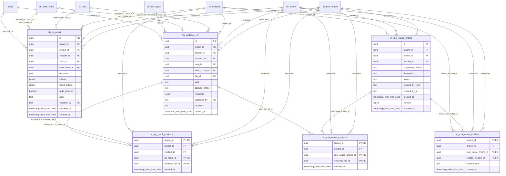

# vinhomes-evidence

Generated from Drizzle. External entities in the diagram are foreign-key targets owned by another module.

## vh_evidence_ref

Bằng chứng file gắn vào incident/task/work order và giai đoạn BEFORE/AFTER/QC.

Tenant RLS: **enabled + forced by integrity migrations 0047/0049/0052**.

| Column | PostgreSQL type | Required | Default | Declared values |
|---|---|---|---|---|
| `id` | `uuid` | yes | `gen_random_uuid()` | — |
| `tenant_id` | `uuid` | yes | `—` | — |
| `project_id` | `uuid` | yes | `—` | — |
| `incident_id` | `uuid` | yes | `—` | — |
| `task_id` | `uuid` | no | `—` | — |
| `work_order_id` | `uuid` | no | `—` | — |
| `file_id` | `uuid` | yes | `—` | — |
| `kind` | `text` | yes | `—` | — |
| `capture_phase` | `text` | yes | `—` | `BEFORE`, `AFTER`, `QC`, `OTHER` |
| `metadata` | `jsonb` | yes | `—` | — |
| `uploaded_by` | `text` | yes | `—` | — |
| `visibility` | `text` | yes | `—` | `INTERNAL`, `RESIDENT_VISIBLE` |
| `created_at` | `timestamp with time zone` | yes | `now()` | — |

Primary key: `id`.

Unique keys:

- `vh_evidence_ref_uq_0`: (`tenant_id`, `id`).
- `vh_evidence_ref_uq_1`: (`tenant_id`, `project_id`, `id`).
- `vh_evidence_ref_uq_2`: (`tenant_id`, `project_id`, `incident_id`, `id`).

Foreign keys:

- (`tenant_id`) → `platform_tenant` (`id`); ON DELETE `restrict`.
- (`tenant_id`, `project_id`) → `vh_project` (`tenant_id`, `id`); ON DELETE `restrict`.
- (`tenant_id`, `project_id`, `incident_id`) → `vh_incident` (`tenant_id`, `project_id`, `id`); ON DELETE `restrict`.
- (`tenant_id`, `project_id`, `incident_id`, `task_id`) → `vh_task` (`tenant_id`, `project_id`, `incident_id`, `id`); ON DELETE `restrict`.
- (`tenant_id`, `project_id`, `incident_id`, `task_id`, `work_order_id`) → `vh_work_order` (`tenant_id`, `project_id`, `incident_id`, `task_id`, `id`); ON DELETE `restrict`.
- (`tenant_id`, `file_id`) → `vh_file_object` (`tenant_id`, `id`); ON DELETE `restrict`.
- (`uploaded_by`) → `users` (`id`); ON DELETE `restrict`.

Indexes:

- `vh_evidence_ref_ix_0`: (`tenant_id`, `project_id`, `incident_id`, `task_id`, `work_order_id`).
- `vh_evidence_ref_ix_1`: (`tenant_id`, `project_id`).
- `vh_evidence_ref_ix_2`: (`tenant_id`, `project_id`, `incident_id`, `task_id`).
- `vh_evidence_ref_ix_3`: (`tenant_id`, `project_id`, `incident_id`).
- `vh_evidence_ref_ix_4`: (`uploaded_by`).
- `vh_evidence_ref_ix_5`: (`tenant_id`, `file_id`).

Checks:

- `vh_evidence_ref_capture_phase_ck`: `"vh_evidence_ref"."capture_phase" in ('BEFORE', 'AFTER', 'QC', 'OTHER')`.
- `vh_evidence_ref_visibility_ck`: `"vh_evidence_ref"."visibility" in ('INTERNAL', 'RESIDENT_VISIBLE')`.
- `vh_evidence_ref_ck_0`: `work_order_id IS NULL OR task_id IS NOT NULL`.

Cross-row rules and application responsibilities: [database design](../01_DATABASE_ERD_IMPLEMENTATION_COMPLETE.md) and [system flow](../02_BUSINESS_ANALYSIS_IMPLEMENTATION.md).

## vh_qc_result

Quyết định kiểm tra chất lượng bất biến cho một work order, gồm tiêu chí không đạt và yêu cầu redo.

Tenant RLS: **enabled + forced by integrity migrations 0047/0049/0052**.

| Column | PostgreSQL type | Required | Default | Declared values |
|---|---|---|---|---|
| `id` | `uuid` | yes | `gen_random_uuid()` | — |
| `tenant_id` | `uuid` | yes | `—` | — |
| `project_id` | `uuid` | yes | `—` | — |
| `incident_id` | `uuid` | yes | `—` | — |
| `task_id` | `uuid` | yes | `—` | — |
| `work_order_id` | `uuid` | yes | `—` | — |
| `outcome` | `text` | yes | `—` | `PASS`, `FAIL`, `INCONCLUSIVE` |
| `criteria` | `jsonb` | yes | `—` | — |
| `failed_criteria` | `jsonb` | yes | `—` | — |
| `redo_required` | `boolean` | yes | `—` | — |
| `note` | `text` | no | `—` | — |
| `checked_by` | `text` | yes | `—` | — |
| `checked_at` | `timestamp with time zone` | yes | `—` | — |
| `created_at` | `timestamp with time zone` | yes | `now()` | — |

Primary key: `id`.

Unique keys:

- `vh_qc_result_uq_0`: (`tenant_id`, `id`).
- `vh_qc_result_uq_1`: (`tenant_id`, `project_id`, `id`).
- `vh_qc_result_uq_2`: (`tenant_id`, `project_id`, `incident_id`, `id`).

Foreign keys:

- (`tenant_id`) → `platform_tenant` (`id`); ON DELETE `restrict`.
- (`tenant_id`, `project_id`) → `vh_project` (`tenant_id`, `id`); ON DELETE `restrict`.
- (`tenant_id`, `project_id`, `incident_id`) → `vh_incident` (`tenant_id`, `project_id`, `id`); ON DELETE `restrict`.
- (`tenant_id`, `project_id`, `incident_id`, `task_id`) → `vh_task` (`tenant_id`, `project_id`, `incident_id`, `id`); ON DELETE `restrict`.
- (`tenant_id`, `project_id`, `incident_id`, `task_id`, `work_order_id`) → `vh_work_order` (`tenant_id`, `project_id`, `incident_id`, `task_id`, `id`); ON DELETE `restrict`.
- (`checked_by`) → `users` (`id`); ON DELETE `restrict`.

Indexes:

- `vh_qc_result_ix_0`: (`tenant_id`, `project_id`, `incident_id`, `task_id`, `work_order_id`).
- `vh_qc_result_ix_1`: (`tenant_id`, `project_id`).
- `vh_qc_result_ix_2`: (`tenant_id`, `project_id`, `incident_id`, `task_id`).
- `vh_qc_result_ix_3`: (`tenant_id`, `project_id`, `incident_id`).
- `vh_qc_result_ix_4`: (`checked_by`).

Checks:

- `vh_qc_result_outcome_ck`: `"vh_qc_result"."outcome" in ('PASS', 'FAIL', 'INCONCLUSIVE')`.
- `vh_qc_result_ck_0`: `NOT redo_required OR outcome = 'FAIL'`.

Cross-row rules and application responsibilities: [database design](../01_DATABASE_ERD_IMPLEMENTATION_COMPLETE.md) and [system flow](../02_BUSINESS_ANALYSIS_IMPLEMENTATION.md).

## vh_qc_result_evidence

Liên kết quyết định QC với bằng chứng hỗ trợ.

Tenant RLS: **enabled + forced by integrity migrations 0047/0049/0052**.

| Column | PostgreSQL type | Required | Default | Declared values |
|---|---|---|---|---|
| `tenant_id` | `uuid` | yes | `—` | — |
| `project_id` | `uuid` | yes | `—` | — |
| `incident_id` | `uuid` | yes | `—` | — |
| `qc_result_id` | `uuid` | yes | `—` | — |
| `evidence_ref_id` | `uuid` | yes | `—` | — |
| `created_at` | `timestamp with time zone` | yes | `now()` | — |

Primary key: `tenant_id`, `qc_result_id`, `evidence_ref_id`.

Foreign keys:

- (`tenant_id`) → `platform_tenant` (`id`); ON DELETE `restrict`.
- (`tenant_id`, `project_id`) → `vh_project` (`tenant_id`, `id`); ON DELETE `restrict`.
- (`tenant_id`, `project_id`, `incident_id`) → `vh_incident` (`tenant_id`, `project_id`, `id`); ON DELETE `restrict`.
- (`tenant_id`, `project_id`, `incident_id`, `qc_result_id`) → `vh_qc_result` (`tenant_id`, `project_id`, `incident_id`, `id`); ON DELETE `restrict`.
- (`tenant_id`, `project_id`, `incident_id`, `evidence_ref_id`) → `vh_evidence_ref` (`tenant_id`, `project_id`, `incident_id`, `id`); ON DELETE `restrict`.

Indexes:

- `vh_qc_result_evidence_ix_0`: (`tenant_id`, `project_id`, `incident_id`, `evidence_ref_id`).
- `vh_qc_result_evidence_ix_1`: (`tenant_id`, `project_id`, `incident_id`, `qc_result_id`).
- `vh_qc_result_evidence_ix_2`: (`tenant_id`, `project_id`).
- `vh_qc_result_evidence_ix_3`: (`tenant_id`, `project_id`, `incident_id`).

Cross-row rules and application responsibilities: [database design](../01_DATABASE_ERD_IMPLEMENTATION_COMPLETE.md) and [system flow](../02_BUSINESS_ANALYSIS_IMPLEMENTATION.md).

## vh_root_cause_evidence

Bằng chứng hỗ trợ nhận định nguyên nhân gốc.

Tenant RLS: **enabled + forced by integrity migrations 0047/0049/0052**.

| Column | PostgreSQL type | Required | Default | Declared values |
|---|---|---|---|---|
| `tenant_id` | `uuid` | yes | `—` | — |
| `project_id` | `uuid` | yes | `—` | — |
| `root_cause_finding_id` | `uuid` | yes | `—` | — |
| `evidence_ref_id` | `uuid` | yes | `—` | — |
| `created_at` | `timestamp with time zone` | yes | `now()` | — |

Primary key: `tenant_id`, `root_cause_finding_id`, `evidence_ref_id`.

Foreign keys:

- (`tenant_id`) → `platform_tenant` (`id`); ON DELETE `restrict`.
- (`tenant_id`, `project_id`) → `vh_project` (`tenant_id`, `id`); ON DELETE `restrict`.
- (`tenant_id`, `project_id`, `root_cause_finding_id`) → `vh_root_cause_finding` (`tenant_id`, `project_id`, `id`); ON DELETE `restrict`.
- (`tenant_id`, `project_id`, `evidence_ref_id`) → `vh_evidence_ref` (`tenant_id`, `project_id`, `id`); ON DELETE `restrict`.

Indexes:

- `vh_root_cause_evidence_ix_0`: (`tenant_id`, `project_id`, `evidence_ref_id`).
- `vh_root_cause_evidence_ix_1`: (`tenant_id`, `project_id`).
- `vh_root_cause_evidence_ix_2`: (`tenant_id`, `project_id`, `root_cause_finding_id`).

Cross-row rules and application responsibilities: [database design](../01_DATABASE_ERD_IMPLEMENTATION_COMPLETE.md) and [system flow](../02_BUSINESS_ANALYSIS_IMPLEMENTATION.md).

## vh_root_cause_finding

Nhận định nguyên nhân gốc của sự cố, có trạng thái xác nhận và chủ thể tạo.

Tenant RLS: **enabled + forced by integrity migrations 0047/0049/0052**.

| Column | PostgreSQL type | Required | Default | Declared values |
|---|---|---|---|---|
| `id` | `uuid` | yes | `gen_random_uuid()` | — |
| `tenant_id` | `uuid` | yes | `—` | — |
| `project_id` | `uuid` | yes | `—` | — |
| `incident_id` | `uuid` | yes | `—` | — |
| `suspected_domain` | `text` | yes | `—` | `TECHNICAL`, `SECURITY`, `PROCESS`, `SANITATION`, `UNKNOWN` |
| `description` | `text` | yes | `—` | — |
| `status` | `text` | yes | `—` | `PROPOSED`, `CONFIRMED`, `REJECTED` |
| `created_by_type` | `text` | yes | `—` | `HUMAN`, `SYSTEM`, `AGENT` |
| `created_by_id` | `text` | yes | `—` | — |
| `created_at` | `timestamp with time zone` | yes | `now()` | — |
| `version` | `bigint` | yes | `1` | — |
| `updated_at` | `timestamp with time zone` | yes | `now()` | — |

Primary key: `id`.

Unique keys:

- `vh_root_cause_finding_uq_0`: (`tenant_id`, `id`).
- `vh_root_cause_finding_uq_1`: (`tenant_id`, `project_id`, `id`).

Foreign keys:

- (`tenant_id`) → `platform_tenant` (`id`); ON DELETE `restrict`.
- (`tenant_id`, `project_id`) → `vh_project` (`tenant_id`, `id`); ON DELETE `restrict`.
- (`tenant_id`, `project_id`, `incident_id`) → `vh_incident` (`tenant_id`, `project_id`, `id`); ON DELETE `restrict`.

Indexes:

- `vh_root_cause_finding_ix_0`: (`tenant_id`, `project_id`).
- `vh_root_cause_finding_ix_1`: (`tenant_id`, `project_id`, `incident_id`).

Checks:

- `vh_root_cause_finding_suspected_domain_ck`: `"vh_root_cause_finding"."suspected_domain" in ('TECHNICAL', 'SECURITY', 'PROCESS', 'SANITATION', 'UNKNOWN')`.
- `vh_root_cause_finding_status_ck`: `"vh_root_cause_finding"."status" in ('PROPOSED', 'CONFIRMED', 'REJECTED')`.
- `vh_root_cause_finding_created_by_type_ck`: `"vh_root_cause_finding"."created_by_type" in ('HUMAN', 'SYSTEM', 'AGENT')`.
- `vh_root_cause_finding_ck_0`: `version > 0`.

Cross-row rules and application responsibilities: [database design](../01_DATABASE_ERD_IMPLEMENTATION_COMPLETE.md) and [system flow](../02_BUSINESS_ANALYSIS_IMPLEMENTATION.md).

## vh_root_cause_incident

Những incident liên quan tới một nhận định nguyên nhân gốc.

Tenant RLS: **enabled + forced by integrity migrations 0047/0049/0052**.

| Column | PostgreSQL type | Required | Default | Declared values |
|---|---|---|---|---|
| `tenant_id` | `uuid` | yes | `—` | — |
| `project_id` | `uuid` | yes | `—` | — |
| `root_cause_finding_id` | `uuid` | yes | `—` | — |
| `related_incident_id` | `uuid` | yes | `—` | — |
| `relation_type` | `text` | yes | `—` | — |
| `created_at` | `timestamp with time zone` | yes | `now()` | — |

Primary key: `tenant_id`, `root_cause_finding_id`, `related_incident_id`.

Foreign keys:

- (`tenant_id`) → `platform_tenant` (`id`); ON DELETE `restrict`.
- (`tenant_id`, `project_id`) → `vh_project` (`tenant_id`, `id`); ON DELETE `restrict`.
- (`tenant_id`, `project_id`, `root_cause_finding_id`) → `vh_root_cause_finding` (`tenant_id`, `project_id`, `id`); ON DELETE `restrict`.
- (`tenant_id`, `project_id`, `related_incident_id`) → `vh_incident` (`tenant_id`, `project_id`, `id`); ON DELETE `restrict`.

Indexes:

- `vh_root_cause_incident_ix_0`: (`tenant_id`, `project_id`, `related_incident_id`).
- `vh_root_cause_incident_ix_1`: (`tenant_id`, `project_id`).
- `vh_root_cause_incident_ix_2`: (`tenant_id`, `project_id`, `root_cause_finding_id`).

Cross-row rules and application responsibilities: [database design](../01_DATABASE_ERD_IMPLEMENTATION_COMPLETE.md) and [system flow](../02_BUSINESS_ANALYSIS_IMPLEMENTATION.md).
