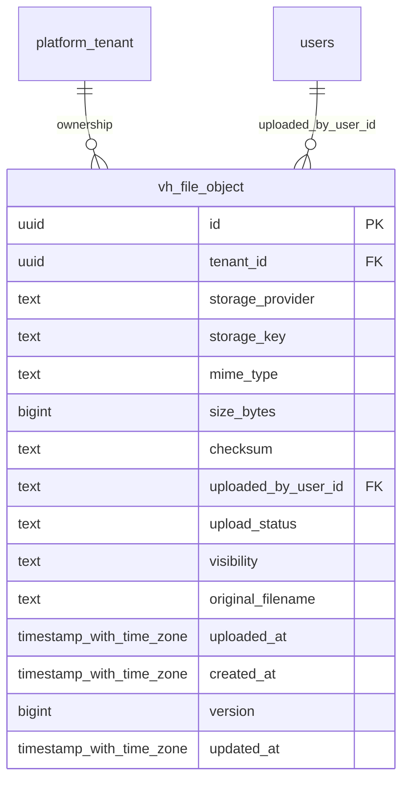

# vinhomes-files

Generated from Drizzle. External entities in the diagram are foreign-key targets owned by another module.

## vh_file_object

Metadata file trong object storage, checksum, người tải, quét an toàn và visibility.

Tenant RLS: **enabled + forced by integrity migrations 0047/0049/0052**.

| Column | PostgreSQL type | Required | Default | Declared values |
|---|---|---|---|---|
| `id` | `uuid` | yes | `gen_random_uuid()` | — |
| `tenant_id` | `uuid` | yes | `—` | — |
| `storage_provider` | `text` | yes | `—` | — |
| `storage_key` | `text` | yes | `—` | — |
| `mime_type` | `text` | yes | `—` | — |
| `size_bytes` | `bigint` | yes | `—` | — |
| `checksum` | `text` | yes | `—` | — |
| `uploaded_by_user_id` | `text` | yes | `—` | — |
| `upload_status` | `text` | yes | `—` | `PENDING`, `UPLOADED`, `QUARANTINED`, `AVAILABLE`, `REJECTED` |
| `visibility` | `text` | yes | `—` | `PRIVATE`, `RESIDENT_VISIBLE`, `INTERNAL` |
| `original_filename` | `text` | yes | `—` | — |
| `uploaded_at` | `timestamp with time zone` | no | `—` | — |
| `created_at` | `timestamp with time zone` | yes | `now()` | — |
| `version` | `bigint` | yes | `1` | — |
| `updated_at` | `timestamp with time zone` | yes | `now()` | — |

Primary key: `id`.

Unique keys:

- `vh_file_object_uq_0`: (`storage_provider`, `storage_key`).
- `vh_file_object_uq_1`: (`tenant_id`, `id`).

Foreign keys:

- (`tenant_id`) → `platform_tenant` (`id`); ON DELETE `restrict`.
- (`uploaded_by_user_id`) → `users` (`id`); ON DELETE `restrict`.

Indexes:

- `vh_file_object_ix_0`: (`uploaded_by_user_id`).

Checks:

- `vh_file_object_upload_status_ck`: `"vh_file_object"."upload_status" in ('PENDING', 'UPLOADED', 'QUARANTINED', 'AVAILABLE', 'REJECTED')`.
- `vh_file_object_visibility_ck`: `"vh_file_object"."visibility" in ('PRIVATE', 'RESIDENT_VISIBLE', 'INTERNAL')`.
- `vh_file_object_ck_0`: `size_bytes >= 0`.
- `vh_file_object_ck_1`: `version > 0`.

Cross-row rules and application responsibilities: [database design](../01_DATABASE_ERD_IMPLEMENTATION_COMPLETE.md) and [system flow](../02_BUSINESS_ANALYSIS_IMPLEMENTATION.md).
