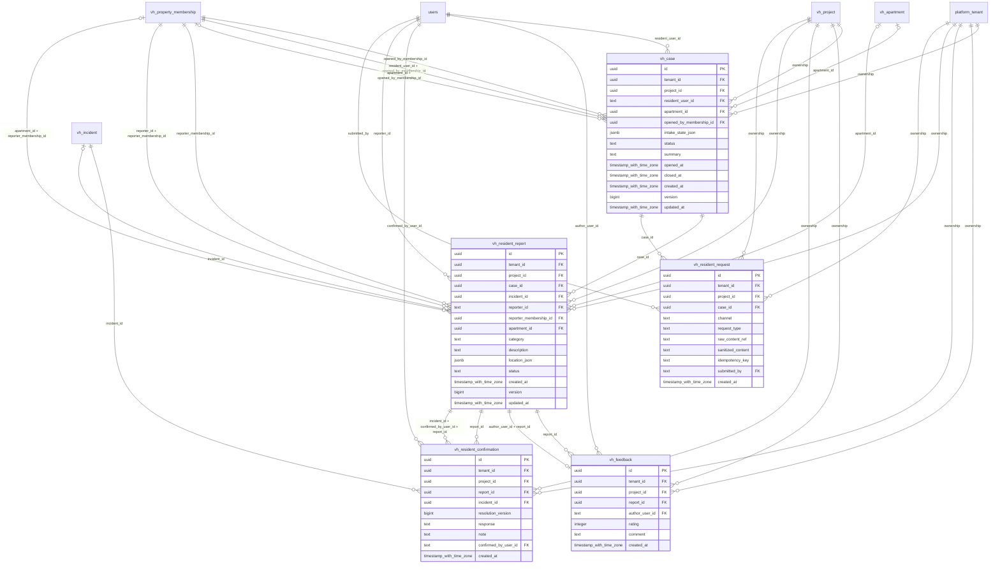

# vinhomes-intake

Generated from Drizzle. External entities in the diagram are foreign-key targets owned by another module.

## vh_case

H? s? ti?p nh?n c? d?n, tr?ng th?i l?m r? v? danh s?ch IssueCandidate P0 trong intake_state_json.

Tenant RLS: **enabled + forced by integrity migrations 0047/0049/0052**.

| Column | PostgreSQL type | Required | Default | Declared values |
|---|---|---|---|---|
| `id` | `uuid` | yes | `gen_random_uuid()` | — |
| `tenant_id` | `uuid` | yes | `—` | — |
| `project_id` | `uuid` | yes | `—` | — |
| `resident_user_id` | `text` | yes | `—` | — |
| `apartment_id` | `uuid` | no | `—` | — |
| `opened_by_membership_id` | `uuid` | yes | `—` | — |
| `intake_state_json` | `jsonb` | yes | `{"issueCandidates":[]}` | — |
| `status` | `text` | yes | `—` | `OPEN`, `CLARIFYING`, `READY`, `TICKETED`, `CLOSED`, `CANCELLED` |
| `summary` | `text` | yes | `—` | — |
| `opened_at` | `timestamp with time zone` | yes | `—` | — |
| `closed_at` | `timestamp with time zone` | no | `—` | — |
| `created_at` | `timestamp with time zone` | yes | `now()` | — |
| `version` | `bigint` | yes | `1` | — |
| `updated_at` | `timestamp with time zone` | yes | `now()` | — |

Primary key: `id`.

Unique keys:

- `vh_case_uq_0`: (`tenant_id`, `id`).
- `vh_case_uq_1`: (`tenant_id`, `project_id`, `id`).

Foreign keys:

- (`tenant_id`) → `platform_tenant` (`id`); ON DELETE `restrict`.
- (`tenant_id`, `project_id`) → `vh_project` (`tenant_id`, `id`); ON DELETE `restrict`.
- (`resident_user_id`) → `users` (`id`); ON DELETE `restrict`.
- (`tenant_id`, `project_id`, `apartment_id`) → `vh_apartment` (`tenant_id`, `project_id`, `id`); ON DELETE `restrict`.
- (`tenant_id`, `project_id`, `opened_by_membership_id`) → `vh_property_membership` (`tenant_id`, `project_id`, `id`); ON DELETE `restrict`.
- (`tenant_id`, `project_id`, `resident_user_id`, `opened_by_membership_id`) → `vh_property_membership` (`tenant_id`, `project_id`, `user_id`, `id`); ON DELETE `restrict`.
- (`tenant_id`, `project_id`, `apartment_id`, `opened_by_membership_id`) → `vh_property_membership` (`tenant_id`, `project_id`, `apartment_id`, `id`); ON DELETE `restrict`.

Indexes:

- `vh_case_ix_0`: (`tenant_id`, `project_id`, `opened_by_membership_id`).
- `vh_case_ix_1`: (`resident_user_id`).
- `vh_case_ix_2`: (`tenant_id`, `project_id`, `apartment_id`).
- `vh_case_ix_3`: (`tenant_id`, `project_id`).

Checks:

- `vh_case_status_ck`: `"vh_case"."status" in ('OPEN', 'CLARIFYING', 'READY', 'TICKETED', 'CLOSED', 'CANCELLED')`.
- `vh_case_ck_0`: `version > 0`.
- `vh_case_intake_state_ck`: `jsonb_typeof("vh_case"."intake_state_json") = 'object' AND jsonb_typeof("vh_case"."intake_state_json"->'issueCandidates') = 'array'`.

Cross-row rules and application responsibilities: [database design](../01_DATABASE_ERD_IMPLEMENTATION_COMPLETE.md) and [system flow](../02_BUSINESS_ANALYSIS_IMPLEMENTATION.md).

## vh_feedback

Đánh giá của cư dân về phản ánh, độc lập với lệnh thay đổi trạng thái incident.

Tenant RLS: **enabled + forced by integrity migrations 0047/0049/0052**.

| Column | PostgreSQL type | Required | Default | Declared values |
|---|---|---|---|---|
| `id` | `uuid` | yes | `gen_random_uuid()` | — |
| `tenant_id` | `uuid` | yes | `—` | — |
| `project_id` | `uuid` | yes | `—` | — |
| `report_id` | `uuid` | yes | `—` | — |
| `author_user_id` | `text` | yes | `—` | — |
| `rating` | `integer` | yes | `—` | — |
| `comment` | `text` | no | `—` | — |
| `created_at` | `timestamp with time zone` | yes | `now()` | — |

Primary key: `id`.

Unique keys:

- `vh_feedback_uq_0`: (`tenant_id`, `report_id`, `author_user_id`).
- `vh_feedback_uq_1`: (`tenant_id`, `id`).
- `vh_feedback_uq_2`: (`tenant_id`, `project_id`, `id`).

Foreign keys:

- (`tenant_id`) → `platform_tenant` (`id`); ON DELETE `restrict`.
- (`tenant_id`, `project_id`) → `vh_project` (`tenant_id`, `id`); ON DELETE `restrict`.
- (`tenant_id`, `project_id`, `report_id`) → `vh_resident_report` (`tenant_id`, `project_id`, `id`); ON DELETE `restrict`.
- (`author_user_id`) → `users` (`id`); ON DELETE `restrict`.
- (`tenant_id`, `author_user_id`, `report_id`) → `vh_resident_report` (`tenant_id`, `reporter_id`, `id`); ON DELETE `restrict`.

Indexes:

- `vh_feedback_ix_0`: (`author_user_id`).
- `vh_feedback_ix_1`: (`tenant_id`, `project_id`, `report_id`).
- `vh_feedback_ix_2`: (`tenant_id`, `project_id`).

Checks:

- `vh_feedback_ck_0`: `rating BETWEEN 1 AND 5`.

Cross-row rules and application responsibilities: [database design](../01_DATABASE_ERD_IMPLEMENTATION_COMPLETE.md) and [system flow](../02_BUSINESS_ANALYSIS_IMPLEMENTATION.md).

## vh_resident_confirmation

Ý kiến chấp nhận/yêu cầu mở lại của reporter theo đúng vòng resolution hiện tại.

Tenant RLS: **enabled + forced by integrity migrations 0047/0049/0052**.

| Column | PostgreSQL type | Required | Default | Declared values |
|---|---|---|---|---|
| `id` | `uuid` | yes | `gen_random_uuid()` | — |
| `tenant_id` | `uuid` | yes | `—` | — |
| `project_id` | `uuid` | yes | `—` | — |
| `report_id` | `uuid` | yes | `—` | — |
| `incident_id` | `uuid` | yes | `—` | — |
| `resolution_version` | `bigint` | yes | `—` | — |
| `response` | `text` | yes | `—` | `ACCEPTED`, `REOPEN_REQUESTED` |
| `note` | `text` | no | `—` | — |
| `confirmed_by_user_id` | `text` | yes | `—` | — |
| `created_at` | `timestamp with time zone` | yes | `now()` | — |

Primary key: `id`.

Unique keys:

- `vh_resident_confirmation_uq_0`: (`tenant_id`, `report_id`, `resolution_version`).
- `vh_resident_confirmation_uq_1`: (`tenant_id`, `id`).
- `vh_resident_confirmation_uq_2`: (`tenant_id`, `project_id`, `id`).

Foreign keys:

- (`tenant_id`) → `platform_tenant` (`id`); ON DELETE `restrict`.
- (`tenant_id`, `project_id`) → `vh_project` (`tenant_id`, `id`); ON DELETE `restrict`.
- (`tenant_id`, `project_id`, `report_id`) → `vh_resident_report` (`tenant_id`, `project_id`, `id`); ON DELETE `restrict`.
- (`tenant_id`, `project_id`, `incident_id`) → `vh_incident` (`tenant_id`, `project_id`, `id`); ON DELETE `restrict`.
- (`confirmed_by_user_id`) → `users` (`id`); ON DELETE `restrict`.
- (`tenant_id`, `incident_id`, `confirmed_by_user_id`, `report_id`) → `vh_resident_report` (`tenant_id`, `incident_id`, `reporter_id`, `id`); ON DELETE `restrict`.

Indexes:

- `vh_resident_confirmation_ix_0`: (`tenant_id`, `incident_id`, `resolution_version`).
- `vh_resident_confirmation_ix_1`: (`tenant_id`, `project_id`).
- `vh_resident_confirmation_ix_2`: (`tenant_id`, `project_id`, `incident_id`).
- `vh_resident_confirmation_ix_3`: (`confirmed_by_user_id`).
- `vh_resident_confirmation_ix_4`: (`tenant_id`, `project_id`, `report_id`).

Checks:

- `vh_resident_confirmation_response_ck`: `"vh_resident_confirmation"."response" in ('ACCEPTED', 'REOPEN_REQUESTED')`.
- `vh_resident_confirmation_ck_0`: `resolution_version > 0`.

Cross-row rules and application responsibilities: [database design](../01_DATABASE_ERD_IMPLEMENTATION_COMPLETE.md) and [system flow](../02_BUSINESS_ANALYSIS_IMPLEMENTATION.md).

## vh_resident_report

Phản ánh chính thức của một cư dân; có thể được gắn vào incident chung với nhiều phản ánh.

Tenant RLS: **enabled + forced by integrity migrations 0047/0049/0052**.

| Column | PostgreSQL type | Required | Default | Declared values |
|---|---|---|---|---|
| `id` | `uuid` | yes | `gen_random_uuid()` | — |
| `tenant_id` | `uuid` | yes | `—` | — |
| `project_id` | `uuid` | yes | `—` | — |
| `case_id` | `uuid` | yes | `—` | — |
| `incident_id` | `uuid` | no | `—` | — |
| `reporter_id` | `text` | yes | `—` | — |
| `reporter_membership_id` | `uuid` | yes | `—` | — |
| `apartment_id` | `uuid` | no | `—` | — |
| `category` | `text` | yes | `—` | — |
| `description` | `text` | yes | `—` | — |
| `location_json` | `jsonb` | yes | `—` | — |
| `status` | `text` | yes | `—` | `SUBMITTED`, `LINKED`, `WITHDRAWN` |
| `created_at` | `timestamp with time zone` | yes | `now()` | — |
| `version` | `bigint` | yes | `1` | — |
| `updated_at` | `timestamp with time zone` | yes | `now()` | — |

Primary key: `id`.

Unique keys:

- `vh_resident_report_uq_1`: (`tenant_id`, `id`).
- `vh_resident_report_uq_2`: (`tenant_id`, `project_id`, `id`).
- `vh_resident_report_uq_3`: (`tenant_id`, `incident_id`, `reporter_id`, `id`).
- `vh_resident_report_uq_4`: (`tenant_id`, `reporter_id`, `id`).
- `vh_resident_report_uq_5`: (`tenant_id`, `incident_id`, `id`).

Foreign keys:

- (`tenant_id`) → `platform_tenant` (`id`); ON DELETE `restrict`.
- (`tenant_id`, `project_id`) → `vh_project` (`tenant_id`, `id`); ON DELETE `restrict`.
- (`tenant_id`, `project_id`, `case_id`) → `vh_case` (`tenant_id`, `project_id`, `id`); ON DELETE `restrict`.
- (`tenant_id`, `project_id`, `incident_id`) → `vh_incident` (`tenant_id`, `project_id`, `id`); ON DELETE `restrict`.
- (`reporter_id`) → `users` (`id`); ON DELETE `restrict`.
- (`tenant_id`, `project_id`, `reporter_membership_id`) → `vh_property_membership` (`tenant_id`, `project_id`, `id`); ON DELETE `restrict`.
- (`tenant_id`, `project_id`, `apartment_id`) → `vh_apartment` (`tenant_id`, `project_id`, `id`); ON DELETE `restrict`.
- (`tenant_id`, `project_id`, `reporter_id`, `reporter_membership_id`) → `vh_property_membership` (`tenant_id`, `project_id`, `user_id`, `id`); ON DELETE `restrict`.
- (`tenant_id`, `project_id`, `apartment_id`, `reporter_membership_id`) → `vh_property_membership` (`tenant_id`, `project_id`, `apartment_id`, `id`); ON DELETE `restrict`.

Indexes:

- `vh_resident_report_ix_0`: (`tenant_id`, `reporter_id`, `created_at`).
- `vh_resident_report_ix_2`: (`tenant_id`, `project_id`).
- `vh_resident_report_ix_3`: (`tenant_id`, `project_id`, `incident_id`).
- `vh_resident_report_ix_4`: (`reporter_id`).
- `vh_resident_report_ix_5`: (`tenant_id`, `project_id`, `case_id`).
- `vh_resident_report_ix_6`: (`tenant_id`, `project_id`, `apartment_id`).
- `vh_resident_report_ix_7`: (`tenant_id`, `project_id`, `reporter_membership_id`).

Checks:

- `vh_resident_report_status_ck`: `"vh_resident_report"."status" in ('SUBMITTED', 'LINKED', 'WITHDRAWN')`.
- `vh_resident_report_ck_0`: `(status = 'LINKED') = (incident_id IS NOT NULL)`.
- `vh_resident_report_ck_1`: `version > 0`.

Cross-row rules and application responsibilities: [database design](../01_DATABASE_ERD_IMPLEMENTATION_COMPLETE.md) and [system flow](../02_BUSINESS_ANALYSIS_IMPLEMENTATION.md).

## vh_resident_request

Một thông điệp/đầu vào đã làm sạch của cư dân trong Case, có idempotency key.

Tenant RLS: **enabled + forced by integrity migrations 0047/0049/0052**.

| Column | PostgreSQL type | Required | Default | Declared values |
|---|---|---|---|---|
| `id` | `uuid` | yes | `gen_random_uuid()` | — |
| `tenant_id` | `uuid` | yes | `—` | — |
| `project_id` | `uuid` | yes | `—` | — |
| `case_id` | `uuid` | yes | `—` | — |
| `channel` | `text` | yes | `—` | — |
| `request_type` | `text` | yes | `—` | — |
| `raw_content_ref` | `text` | no | `—` | — |
| `sanitized_content` | `text` | yes | `—` | — |
| `idempotency_key` | `text` | yes | `—` | — |
| `submitted_by` | `text` | yes | `—` | — |
| `created_at` | `timestamp with time zone` | yes | `now()` | — |

Primary key: `id`.

Unique keys:

- `vh_resident_request_uq_0`: (`tenant_id`, `idempotency_key`).
- `vh_resident_request_uq_1`: (`tenant_id`, `id`).
- `vh_resident_request_uq_2`: (`tenant_id`, `project_id`, `id`).
- `vh_resident_request_uq_3`: (`tenant_id`, `project_id`, `case_id`, `id`).

Foreign keys:

- (`tenant_id`) → `platform_tenant` (`id`); ON DELETE `restrict`.
- (`tenant_id`, `project_id`) → `vh_project` (`tenant_id`, `id`); ON DELETE `restrict`.
- (`tenant_id`, `project_id`, `case_id`) → `vh_case` (`tenant_id`, `project_id`, `id`); ON DELETE `restrict`.
- (`submitted_by`) → `users` (`id`); ON DELETE `restrict`.

Indexes:

- `vh_resident_request_ix_0`: (`tenant_id`, `project_id`, `case_id`).
- `vh_resident_request_ix_1`: (`tenant_id`, `case_id`, `created_at`).
- `vh_resident_request_ix_2`: (`tenant_id`, `project_id`).
- `vh_resident_request_ix_3`: (`submitted_by`).

Cross-row rules and application responsibilities: [database design](../01_DATABASE_ERD_IMPLEMENTATION_COMPLETE.md) and [system flow](../02_BUSINESS_ANALYSIS_IMPLEMENTATION.md).
