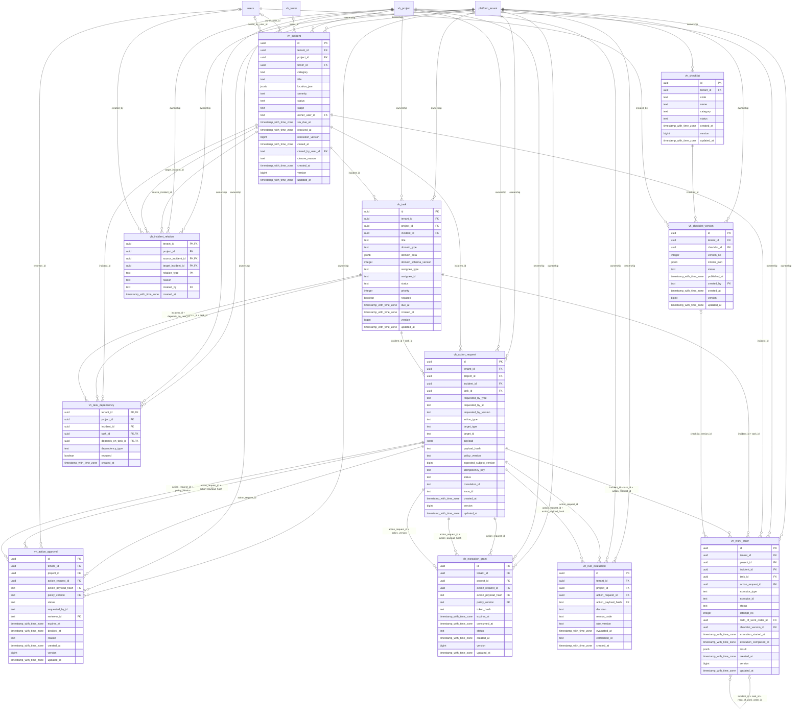

# vinhomes-operations

Generated from Drizzle. External entities in the diagram are foreign-key targets owned by another module.

## vh_action_approval

Quyết định phê duyệt có thời hạn, ghim đúng payload hash và policy version.

Tenant RLS: **enabled + forced by integrity migrations 0047/0049**.

| Column | PostgreSQL type | Required | Default | Declared values |
|---|---|---|---|---|
| `id` | `uuid` | yes | `gen_random_uuid()` | — |
| `tenant_id` | `uuid` | yes | `—` | — |
| `project_id` | `uuid` | yes | `—` | — |
| `action_request_id` | `uuid` | yes | `—` | — |
| `action_payload_hash` | `text` | yes | `—` | — |
| `policy_version` | `text` | yes | `—` | — |
| `status` | `text` | yes | `—` | `PENDING`, `APPROVED`, `REJECTED`, `EXPIRED` |
| `requested_by_id` | `text` | yes | `—` | — |
| `reviewer_id` | `text` | no | `—` | — |
| `expires_at` | `timestamp with time zone` | yes | `—` | — |
| `decided_at` | `timestamp with time zone` | no | `—` | — |
| `reason` | `text` | no | `—` | — |
| `created_at` | `timestamp with time zone` | yes | `now()` | — |
| `version` | `bigint` | yes | `1` | — |
| `updated_at` | `timestamp with time zone` | yes | `now()` | — |

Primary key: `id`.

Unique keys:

- `vh_action_approval_uq_0`: (`tenant_id`, `id`).
- `vh_action_approval_uq_1`: (`tenant_id`, `project_id`, `id`).

Foreign keys:

- (`tenant_id`) → `platform_tenant` (`id`); ON DELETE `restrict`.
- (`tenant_id`, `project_id`) → `vh_project` (`tenant_id`, `id`); ON DELETE `restrict`.
- (`tenant_id`, `project_id`, `action_request_id`) → `vh_action_request` (`tenant_id`, `project_id`, `id`); ON DELETE `restrict`.
- (`reviewer_id`) → `users` (`id`); ON DELETE `restrict`.
- (`tenant_id`, `action_request_id`, `action_payload_hash`) → `vh_action_request` (`tenant_id`, `id`, `payload_hash`); ON DELETE `restrict`.
- (`tenant_id`, `action_request_id`, `policy_version`) → `vh_action_request` (`tenant_id`, `id`, `policy_version`); ON DELETE `restrict`.

Indexes:

- `vh_action_approval_ix_0`: (`tenant_id`, `project_id`, `action_request_id`).
- `vh_action_approval_ix_1`: (`reviewer_id`).
- `vh_action_approval_ix_2`: (`tenant_id`, `status`, `expires_at`).
- `vh_action_approval_ix_3`: (`tenant_id`, `project_id`).

Checks:

- `vh_action_approval_status_ck`: `"vh_action_approval"."status" in ('PENDING', 'APPROVED', 'REJECTED', 'EXPIRED')`.
- `vh_action_approval_ck_0`: `status NOT IN ('APPROVED','REJECTED') OR (reviewer_id IS NOT NULL AND decided_at IS NOT NULL)`.
- `vh_action_approval_ck_1`: `version > 0`.

Additional cross-row/temporal rules: [integrity matrix](../DATABASE_DESIGN.md#integrity-matrix) and [coordination review](../COMPLETENESS_REVIEW.md).

## vh_action_request

Yêu cầu hành động nghiệp vụ được domain tiếp nhận, ghim payload/hash/policy và expected version.

Tenant RLS: **enabled + forced by integrity migrations 0047/0049**.

| Column | PostgreSQL type | Required | Default | Declared values |
|---|---|---|---|---|
| `id` | `uuid` | yes | `gen_random_uuid()` | — |
| `tenant_id` | `uuid` | yes | `—` | — |
| `project_id` | `uuid` | yes | `—` | — |
| `incident_id` | `uuid` | yes | `—` | — |
| `task_id` | `uuid` | yes | `—` | — |
| `requested_by_type` | `text` | yes | `—` | `HUMAN`, `SYSTEM`, `AUTOMATION`, `AGENT`, `EXTERNAL_SERVICE` |
| `requested_by_id` | `text` | yes | `—` | — |
| `requested_by_version` | `text` | no | `—` | — |
| `action_type` | `text` | yes | `—` | — |
| `target_type` | `text` | yes | `—` | — |
| `target_id` | `text` | no | `—` | — |
| `payload` | `jsonb` | yes | `—` | — |
| `payload_hash` | `text` | yes | `—` | — |
| `policy_version` | `text` | yes | `—` | — |
| `expected_subject_version` | `bigint` | yes | `—` | — |
| `idempotency_key` | `text` | yes | `—` | — |
| `status` | `text` | yes | `—` | `PROPOSED`, `DENIED`, `AWAITING_APPROVAL`, `AUTHORIZED`, `REJECTED`, `EXPIRED`, `EXECUTING`, `SUCCEEDED`, `FAILED` |
| `correlation_id` | `text` | yes | `—` | — |
| `trace_id` | `text` | yes | `—` | — |
| `created_at` | `timestamp with time zone` | yes | `now()` | — |
| `version` | `bigint` | yes | `1` | — |
| `updated_at` | `timestamp with time zone` | yes | `now()` | — |

Primary key: `id`.

Unique keys:

- `vh_action_request_uq_0`: (`tenant_id`, `idempotency_key`).
- `vh_action_request_uq_1`: (`tenant_id`, `id`).
- `vh_action_request_uq_2`: (`tenant_id`, `project_id`, `id`).
- `vh_action_request_uq_3`: (`tenant_id`, `project_id`, `incident_id`, `task_id`, `id`).
- `vh_action_request_uq_4`: (`tenant_id`, `id`, `payload_hash`).
- `vh_action_request_uq_5`: (`tenant_id`, `id`, `policy_version`).

Foreign keys:

- (`tenant_id`) → `platform_tenant` (`id`); ON DELETE `restrict`.
- (`tenant_id`, `project_id`) → `vh_project` (`tenant_id`, `id`); ON DELETE `restrict`.
- (`tenant_id`, `project_id`, `incident_id`) → `vh_incident` (`tenant_id`, `project_id`, `id`); ON DELETE `restrict`.
- (`tenant_id`, `project_id`, `incident_id`, `task_id`) → `vh_task` (`tenant_id`, `project_id`, `incident_id`, `id`); ON DELETE `restrict`.

Indexes:

- `vh_action_request_ix_0`: (`tenant_id`, `project_id`, `incident_id`, `task_id`).
- `vh_action_request_ix_1`: (`tenant_id`, `incident_id`, `status`).
- `vh_action_request_ix_2`: (`tenant_id`, `project_id`).
- `vh_action_request_ix_3`: (`tenant_id`, `project_id`, `incident_id`).

Checks:

- `vh_action_request_requested_by_type_ck`: `"vh_action_request"."requested_by_type" in ('HUMAN', 'SYSTEM', 'AUTOMATION', 'AGENT', 'EXTERNAL_SERVICE')`.
- `vh_action_request_status_ck`: `"vh_action_request"."status" in ('PROPOSED', 'DENIED', 'AWAITING_APPROVAL', 'AUTHORIZED', 'REJECTED', 'EXPIRED', 'EXECUTING', 'SUCCEEDED', 'FAILED')`.
- `vh_action_request_ck_0`: `expected_subject_version > 0`.
- `vh_action_request_ck_1`: `version > 0`.

Additional cross-row/temporal rules: [integrity matrix](../DATABASE_DESIGN.md#integrity-matrix) and [coordination review](../COMPLETENESS_REVIEW.md).

## vh_checklist

Danh tính bộ tiêu chí nghiệm thu/công việc theo tenant và category.

Tenant RLS: **enabled + forced by integrity migrations 0047/0049**.

| Column | PostgreSQL type | Required | Default | Declared values |
|---|---|---|---|---|
| `id` | `uuid` | yes | `gen_random_uuid()` | — |
| `tenant_id` | `uuid` | yes | `—` | — |
| `code` | `text` | yes | `—` | — |
| `name` | `text` | yes | `—` | — |
| `category` | `text` | yes | `—` | — |
| `status` | `text` | yes | `—` | `ACTIVE`, `RETIRED` |
| `created_at` | `timestamp with time zone` | yes | `now()` | — |
| `version` | `bigint` | yes | `1` | — |
| `updated_at` | `timestamp with time zone` | yes | `now()` | — |

Primary key: `id`.

Unique keys:

- `vh_checklist_uq_0`: (`tenant_id`, `code`).
- `vh_checklist_uq_1`: (`tenant_id`, `id`).

Foreign keys:

- (`tenant_id`) → `platform_tenant` (`id`); ON DELETE `restrict`.

Checks:

- `vh_checklist_status_ck`: `"vh_checklist"."status" in ('ACTIVE', 'RETIRED')`.
- `vh_checklist_ck_0`: `version > 0`.

Additional cross-row/temporal rules: [integrity matrix](../DATABASE_DESIGN.md#integrity-matrix) and [coordination review](../COMPLETENESS_REVIEW.md).

## vh_checklist_version

Phiên bản tiêu chí được work order ghim; bản đã publish không sửa nội dung.

Tenant RLS: **enabled + forced by integrity migrations 0047/0049**.

| Column | PostgreSQL type | Required | Default | Declared values |
|---|---|---|---|---|
| `id` | `uuid` | yes | `gen_random_uuid()` | — |
| `tenant_id` | `uuid` | yes | `—` | — |
| `checklist_id` | `uuid` | yes | `—` | — |
| `version_no` | `integer` | yes | `—` | — |
| `criteria_json` | `jsonb` | yes | `—` | — |
| `status` | `text` | yes | `—` | `DRAFT`, `PUBLISHED`, `RETIRED` |
| `published_at` | `timestamp with time zone` | no | `—` | — |
| `created_by` | `text` | yes | `—` | — |
| `created_at` | `timestamp with time zone` | yes | `now()` | — |
| `version` | `bigint` | yes | `1` | — |
| `updated_at` | `timestamp with time zone` | yes | `now()` | — |

Primary key: `id`.

Unique keys:

- `vh_checklist_version_uq_0`: (`tenant_id`, `checklist_id`, `version_no`).
- `vh_checklist_version_uq_1`: (`tenant_id`, `id`).

Foreign keys:

- (`tenant_id`) → `platform_tenant` (`id`); ON DELETE `restrict`.
- (`tenant_id`, `checklist_id`) → `vh_checklist` (`tenant_id`, `id`); ON DELETE `restrict`.
- (`created_by`) → `users` (`id`); ON DELETE `restrict`.

Indexes:

- `vh_checklist_version_ix_0`: (`created_by`).
- `vh_checklist_version_ix_1`: (`tenant_id`, `checklist_id`).

Checks:

- `vh_checklist_version_status_ck`: `"vh_checklist_version"."status" in ('DRAFT', 'PUBLISHED', 'RETIRED')`.
- `vh_checklist_version_ck_0`: `version_no > 0`.
- `vh_checklist_version_ck_1`: `version > 0`.

Additional cross-row/temporal rules: [integrity matrix](../DATABASE_DESIGN.md#integrity-matrix) and [coordination review](../COMPLETENESS_REVIEW.md).

## vh_execution_grant

Quyền thực thi do domain phát hành, lưu token hash, hạn và trạng thái tiêu thụ/thu hồi.

Tenant RLS: **enabled + forced by integrity migrations 0047/0049**.

| Column | PostgreSQL type | Required | Default | Declared values |
|---|---|---|---|---|
| `id` | `uuid` | yes | `gen_random_uuid()` | — |
| `tenant_id` | `uuid` | yes | `—` | — |
| `project_id` | `uuid` | yes | `—` | — |
| `action_request_id` | `uuid` | yes | `—` | — |
| `action_payload_hash` | `text` | yes | `—` | — |
| `policy_version` | `text` | yes | `—` | — |
| `token_hash` | `text` | yes | `—` | — |
| `expires_at` | `timestamp with time zone` | yes | `—` | — |
| `consumed_at` | `timestamp with time zone` | no | `—` | — |
| `status` | `text` | yes | `—` | `ACTIVE`, `CONSUMED`, `EXPIRED`, `REVOKED` |
| `created_at` | `timestamp with time zone` | yes | `now()` | — |
| `version` | `bigint` | yes | `1` | — |
| `updated_at` | `timestamp with time zone` | yes | `now()` | — |

Primary key: `id`.

Unique keys:

- `vh_execution_grant_uq_0`: (`tenant_id`, `token_hash`).
- `vh_execution_grant_uq_1`: (`tenant_id`, `id`).
- `vh_execution_grant_uq_2`: (`tenant_id`, `project_id`, `id`).

Foreign keys:

- (`tenant_id`) → `platform_tenant` (`id`); ON DELETE `restrict`.
- (`tenant_id`, `project_id`) → `vh_project` (`tenant_id`, `id`); ON DELETE `restrict`.
- (`tenant_id`, `project_id`, `action_request_id`) → `vh_action_request` (`tenant_id`, `project_id`, `id`); ON DELETE `restrict`.
- (`tenant_id`, `action_request_id`, `action_payload_hash`) → `vh_action_request` (`tenant_id`, `id`, `payload_hash`); ON DELETE `restrict`.
- (`tenant_id`, `action_request_id`, `policy_version`) → `vh_action_request` (`tenant_id`, `id`, `policy_version`); ON DELETE `restrict`.

Indexes:

- `vh_execution_grant_ix_0`: (`tenant_id`, `project_id`, `action_request_id`).
- `vh_execution_grant_ix_1`: (`tenant_id`, `project_id`).

Checks:

- `vh_execution_grant_status_ck`: `"vh_execution_grant"."status" in ('ACTIVE', 'CONSUMED', 'EXPIRED', 'REVOKED')`.
- `vh_execution_grant_ck_0`: `status <> 'CONSUMED' OR consumed_at IS NOT NULL`.
- `vh_execution_grant_ck_1`: `version > 0`.

Additional cross-row/temporal rules: [integrity matrix](../DATABASE_DESIGN.md#integrity-matrix) and [coordination review](../COMPLETENESS_REVIEW.md).

## vh_incident

Sự cố vận hành chuẩn; UI có thể gọi Ticket. Trạng thái sự cố là nguồn thật, không lấy từ agent run.

Tenant RLS: **enabled + forced by integrity migrations 0047/0049**.

| Column | PostgreSQL type | Required | Default | Declared values |
|---|---|---|---|---|
| `id` | `uuid` | yes | `gen_random_uuid()` | — |
| `tenant_id` | `uuid` | yes | `—` | — |
| `project_id` | `uuid` | yes | `—` | — |
| `tower_id` | `uuid` | no | `—` | — |
| `category` | `text` | yes | `—` | — |
| `title` | `text` | yes | `—` | — |
| `location_json` | `jsonb` | yes | `—` | — |
| `severity` | `text` | yes | `—` | `LOW`, `MEDIUM`, `HIGH`, `CRITICAL` |
| `status` | `text` | yes | `—` | `NEW`, `OPEN`, `RESOLVED`, `CLOSED` |
| `stage` | `text` | yes | `—` | `INTAKE`, `TRIAGE`, `PLANNING`, `EXECUTION`, `QC`, `RESIDENT_CONFIRMATION` |
| `owner_user_id` | `text` | no | `—` | — |
| `sla_due_at` | `timestamp with time zone` | no | `—` | — |
| `resolved_at` | `timestamp with time zone` | no | `—` | — |
| `resolution_version` | `bigint` | no | `—` | — |
| `closed_at` | `timestamp with time zone` | no | `—` | — |
| `closed_by_user_id` | `text` | no | `—` | — |
| `closure_reason` | `text` | no | `—` | — |
| `created_at` | `timestamp with time zone` | yes | `now()` | — |
| `version` | `bigint` | yes | `1` | — |
| `updated_at` | `timestamp with time zone` | yes | `now()` | — |

Primary key: `id`.

Unique keys:

- `vh_incident_uq_0`: (`tenant_id`, `id`).
- `vh_incident_uq_1`: (`tenant_id`, `project_id`, `id`).

Foreign keys:

- (`tenant_id`) → `platform_tenant` (`id`); ON DELETE `restrict`.
- (`tenant_id`, `project_id`) → `vh_project` (`tenant_id`, `id`); ON DELETE `restrict`.
- (`tenant_id`, `project_id`, `tower_id`) → `vh_tower` (`tenant_id`, `project_id`, `id`); ON DELETE `restrict`.
- (`owner_user_id`) → `users` (`id`); ON DELETE `restrict`.
- (`closed_by_user_id`) → `users` (`id`); ON DELETE `restrict`.

Indexes:

- `vh_incident_ix_0`: (`tenant_id`, `project_id`, `tower_id`).
- `vh_incident_ix_1`: (`tenant_id`, `project_id`).
- `vh_incident_ix_2`: (`closed_by_user_id`).
- `vh_incident_ix_3`: (`tenant_id`, `project_id`, `status`, `severity`).
- `vh_incident_ix_4`: (`owner_user_id`).
- `vh_incident_ix_5`: (`tenant_id`, `tower_id`, `status`).

Checks:

- `vh_incident_severity_ck`: `"vh_incident"."severity" in ('LOW', 'MEDIUM', 'HIGH', 'CRITICAL')`.
- `vh_incident_status_ck`: `"vh_incident"."status" in ('NEW', 'OPEN', 'RESOLVED', 'CLOSED')`.
- `vh_incident_stage_ck`: `"vh_incident"."stage" in ('INTAKE', 'TRIAGE', 'PLANNING', 'EXECUTION', 'QC', 'RESIDENT_CONFIRMATION')`.
- `vh_incident_ck_0`: `status NOT IN ('RESOLVED','CLOSED') OR (resolved_at IS NOT NULL AND resolution_version IS NOT NULL)`.
- `vh_incident_ck_1`: `status <> 'CLOSED' OR (closed_at IS NOT NULL AND closed_by_user_id IS NOT NULL AND closure_reason IS NOT NULL)`.
- `vh_incident_ck_2`: `version > 0`.

Additional cross-row/temporal rules: [integrity matrix](../DATABASE_DESIGN.md#integrity-matrix) and [coordination review](../COMPLETENESS_REVIEW.md).

## vh_incident_relation

Liên kết các sự cố trùng/lặp/nguyên nhân/chặn/liên quan để hỗ trợ triage và recurrence.

Tenant RLS: **enabled + forced by integrity migrations 0047/0049**.

| Column | PostgreSQL type | Required | Default | Declared values |
|---|---|---|---|---|
| `tenant_id` | `uuid` | yes | `—` | — |
| `project_id` | `uuid` | yes | `—` | — |
| `source_incident_id` | `uuid` | yes | `—` | — |
| `target_incident_id` | `uuid` | yes | `—` | — |
| `relation_type` | `text` | yes | `—` | `RELATED`, `DUPLICATE`, `CAUSED_BY`, `BLOCKS`, `RECURRING_WITH` |
| `reason` | `text` | yes | `—` | — |
| `created_by` | `text` | yes | `—` | — |
| `created_at` | `timestamp with time zone` | yes | `now()` | — |

Primary key: `tenant_id`, `source_incident_id`, `target_incident_id`, `relation_type`.

Foreign keys:

- (`tenant_id`) → `platform_tenant` (`id`); ON DELETE `restrict`.
- (`tenant_id`, `project_id`) → `vh_project` (`tenant_id`, `id`); ON DELETE `restrict`.
- (`tenant_id`, `project_id`, `source_incident_id`) → `vh_incident` (`tenant_id`, `project_id`, `id`); ON DELETE `restrict`.
- (`tenant_id`, `project_id`, `target_incident_id`) → `vh_incident` (`tenant_id`, `project_id`, `id`); ON DELETE `restrict`.
- (`created_by`) → `users` (`id`); ON DELETE `restrict`.

Indexes:

- `vh_incident_relation_ix_0`: (`tenant_id`, `project_id`, `target_incident_id`).
- `vh_incident_relation_ix_1`: (`tenant_id`, `project_id`, `source_incident_id`).
- `vh_incident_relation_ix_2`: (`created_by`).
- `vh_incident_relation_ix_3`: (`tenant_id`, `project_id`).

Checks:

- `vh_incident_relation_relation_type_ck`: `"vh_incident_relation"."relation_type" in ('RELATED', 'DUPLICATE', 'CAUSED_BY', 'BLOCKS', 'RECURRING_WITH')`.
- `vh_incident_relation_ck_0`: `source_incident_id <> target_incident_id`.

Additional cross-row/temporal rules: [integrity matrix](../DATABASE_DESIGN.md#integrity-matrix) and [coordination review](../COMPLETENESS_REVIEW.md).

## vh_rule_evaluation

Kết quả ALLOW/REQUIRE_APPROVAL/DENY bất biến đối với đúng action payload.

Tenant RLS: **enabled + forced by integrity migrations 0047/0049**.

| Column | PostgreSQL type | Required | Default | Declared values |
|---|---|---|---|---|
| `id` | `uuid` | yes | `gen_random_uuid()` | — |
| `tenant_id` | `uuid` | yes | `—` | — |
| `project_id` | `uuid` | yes | `—` | — |
| `action_request_id` | `uuid` | yes | `—` | — |
| `action_payload_hash` | `text` | yes | `—` | — |
| `decision` | `text` | yes | `—` | `ALLOW`, `REQUIRE_APPROVAL`, `DENY` |
| `reason_code` | `text` | yes | `—` | — |
| `rule_version` | `text` | yes | `—` | — |
| `evaluated_at` | `timestamp with time zone` | yes | `—` | — |
| `correlation_id` | `text` | yes | `—` | — |
| `created_at` | `timestamp with time zone` | yes | `now()` | — |

Primary key: `id`.

Unique keys:

- `vh_rule_evaluation_uq_0`: (`tenant_id`, `id`).
- `vh_rule_evaluation_uq_1`: (`tenant_id`, `project_id`, `id`).

Foreign keys:

- (`tenant_id`) → `platform_tenant` (`id`); ON DELETE `restrict`.
- (`tenant_id`, `project_id`) → `vh_project` (`tenant_id`, `id`); ON DELETE `restrict`.
- (`tenant_id`, `project_id`, `action_request_id`) → `vh_action_request` (`tenant_id`, `project_id`, `id`); ON DELETE `restrict`.
- (`tenant_id`, `action_request_id`, `action_payload_hash`) → `vh_action_request` (`tenant_id`, `id`, `payload_hash`); ON DELETE `restrict`.

Indexes:

- `vh_rule_evaluation_ix_0`: (`tenant_id`, `project_id`, `action_request_id`).
- `vh_rule_evaluation_ix_1`: (`tenant_id`, `project_id`).

Checks:

- `vh_rule_evaluation_decision_ck`: `"vh_rule_evaluation"."decision" in ('ALLOW', 'REQUIRE_APPROVAL', 'DENY')`.

Additional cross-row/temporal rules: [integrity matrix](../DATABASE_DESIGN.md#integrity-matrix) and [coordination review](../COMPLETENESS_REVIEW.md).

## vh_task

Công việc nghiệp vụ cần thực hiện cho incident, có assignee, ưu tiên, deadline và domain plan có version.

Tenant RLS: **enabled + forced by integrity migrations 0047/0049**.

| Column | PostgreSQL type | Required | Default | Declared values |
|---|---|---|---|---|
| `id` | `uuid` | yes | `gen_random_uuid()` | — |
| `tenant_id` | `uuid` | yes | `—` | — |
| `project_id` | `uuid` | yes | `—` | — |
| `incident_id` | `uuid` | yes | `—` | — |
| `title` | `text` | yes | `—` | — |
| `domain_type` | `text` | yes | `—` | — |
| `domain_data` | `jsonb` | yes | `—` | — |
| `domain_schema_version` | `integer` | yes | `—` | — |
| `assignee_type` | `text` | yes | `—` | `HUMAN`, `SYSTEM`, `AUTOMATION`, `EXTERNAL_SERVICE` |
| `assignee_id` | `text` | no | `—` | — |
| `status` | `text` | yes | `—` | `OPEN`, `ASSIGNED`, `IN_PROGRESS`, `BLOCKED`, `DONE`, `CANCELLED` |
| `priority` | `integer` | yes | `—` | — |
| `required` | `boolean` | yes | `—` | — |
| `due_at` | `timestamp with time zone` | no | `—` | — |
| `created_at` | `timestamp with time zone` | yes | `now()` | — |
| `version` | `bigint` | yes | `1` | — |
| `updated_at` | `timestamp with time zone` | yes | `now()` | — |

Primary key: `id`.

Unique keys:

- `vh_task_uq_0`: (`tenant_id`, `id`).
- `vh_task_uq_1`: (`tenant_id`, `project_id`, `id`).
- `vh_task_uq_2`: (`tenant_id`, `project_id`, `incident_id`, `id`).

Foreign keys:

- (`tenant_id`) → `platform_tenant` (`id`); ON DELETE `restrict`.
- (`tenant_id`, `project_id`) → `vh_project` (`tenant_id`, `id`); ON DELETE `restrict`.
- (`tenant_id`, `project_id`, `incident_id`) → `vh_incident` (`tenant_id`, `project_id`, `id`); ON DELETE `restrict`.

Indexes:

- `vh_task_ix_0`: (`tenant_id`, `incident_id`, `status`).
- `vh_task_ix_1`: (`tenant_id`, `project_id`).
- `vh_task_ix_2`: (`tenant_id`, `project_id`, `incident_id`).

Checks:

- `vh_task_assignee_type_ck`: `"vh_task"."assignee_type" in ('HUMAN', 'SYSTEM', 'AUTOMATION', 'EXTERNAL_SERVICE')`.
- `vh_task_status_ck`: `"vh_task"."status" in ('OPEN', 'ASSIGNED', 'IN_PROGRESS', 'BLOCKED', 'DONE', 'CANCELLED')`.
- `vh_task_ck_0`: `domain_schema_version > 0`.
- `vh_task_ck_1`: `priority >= 0`.
- `vh_task_ck_2`: `version > 0`.

Additional cross-row/temporal rules: [integrity matrix](../DATABASE_DESIGN.md#integrity-matrix) and [coordination review](../COMPLETENESS_REVIEW.md).

## vh_task_dependency

Phụ thuộc giữa các công việc cùng incident; không cho self-link hoặc chu trình.

Tenant RLS: **enabled + forced by integrity migrations 0047/0049**.

| Column | PostgreSQL type | Required | Default | Declared values |
|---|---|---|---|---|
| `tenant_id` | `uuid` | yes | `—` | — |
| `project_id` | `uuid` | yes | `—` | — |
| `incident_id` | `uuid` | yes | `—` | — |
| `task_id` | `uuid` | yes | `—` | — |
| `depends_on_task_id` | `uuid` | yes | `—` | — |
| `dependency_type` | `text` | yes | `—` | `FINISH_TO_START`, `FINISH_TO_FINISH` |
| `required` | `boolean` | yes | `—` | — |
| `created_at` | `timestamp with time zone` | yes | `now()` | — |

Primary key: `tenant_id`, `task_id`, `depends_on_task_id`.

Foreign keys:

- (`tenant_id`) → `platform_tenant` (`id`); ON DELETE `restrict`.
- (`tenant_id`, `project_id`) → `vh_project` (`tenant_id`, `id`); ON DELETE `restrict`.
- (`tenant_id`, `project_id`, `incident_id`) → `vh_incident` (`tenant_id`, `project_id`, `id`); ON DELETE `restrict`.
- (`tenant_id`, `project_id`, `incident_id`, `task_id`) → `vh_task` (`tenant_id`, `project_id`, `incident_id`, `id`); ON DELETE `restrict`.
- (`tenant_id`, `project_id`, `incident_id`, `depends_on_task_id`) → `vh_task` (`tenant_id`, `project_id`, `incident_id`, `id`); ON DELETE `restrict`.

Indexes:

- `vh_task_dependency_ix_0`: (`tenant_id`, `project_id`, `incident_id`, `task_id`).
- `vh_task_dependency_ix_1`: (`tenant_id`, `project_id`, `incident_id`, `depends_on_task_id`).
- `vh_task_dependency_ix_2`: (`tenant_id`, `project_id`).
- `vh_task_dependency_ix_3`: (`tenant_id`, `project_id`, `incident_id`).

Checks:

- `vh_task_dependency_dependency_type_ck`: `"vh_task_dependency"."dependency_type" in ('FINISH_TO_START', 'FINISH_TO_FINISH')`.
- `vh_task_dependency_ck_0`: `task_id <> depends_on_task_id`.

Additional cross-row/temporal rules: [integrity matrix](../DATABASE_DESIGN.md#integrity-matrix) and [coordination review](../COMPLETENESS_REVIEW.md).

## vh_work_order

Một lần thực hiện task được ActionRequest cho phép; redo tạo attempt mới thay vì reset lần cũ.

Tenant RLS: **enabled + forced by integrity migrations 0047/0049**.

| Column | PostgreSQL type | Required | Default | Declared values |
|---|---|---|---|---|
| `id` | `uuid` | yes | `gen_random_uuid()` | — |
| `tenant_id` | `uuid` | yes | `—` | — |
| `project_id` | `uuid` | yes | `—` | — |
| `incident_id` | `uuid` | yes | `—` | — |
| `task_id` | `uuid` | yes | `—` | — |
| `action_request_id` | `uuid` | yes | `—` | — |
| `executor_type` | `text` | yes | `—` | `HUMAN`, `SYSTEM`, `AUTOMATION`, `EXTERNAL_SERVICE` |
| `executor_id` | `text` | no | `—` | — |
| `status` | `text` | yes | `—` | `OPEN`, `ASSIGNED`, `IN_PROGRESS`, `COMPLETED`, `FAILED`, `CANCELLED` |
| `attempt_no` | `integer` | yes | `—` | — |
| `redo_of_work_order_id` | `uuid` | no | `—` | — |
| `checklist_version_id` | `uuid` | no | `—` | — |
| `execution_started_at` | `timestamp with time zone` | no | `—` | — |
| `execution_completed_at` | `timestamp with time zone` | no | `—` | — |
| `result` | `jsonb` | yes | `—` | — |
| `created_at` | `timestamp with time zone` | yes | `now()` | — |
| `version` | `bigint` | yes | `1` | — |
| `updated_at` | `timestamp with time zone` | yes | `now()` | — |

Primary key: `id`.

Unique keys:

- `vh_work_order_uq_0`: (`tenant_id`, `task_id`, `attempt_no`).
- `vh_work_order_uq_1`: (`tenant_id`, `redo_of_work_order_id`).
- `vh_work_order_uq_2`: (`tenant_id`, `id`).
- `vh_work_order_uq_3`: (`tenant_id`, `project_id`, `id`).
- `vh_work_order_uq_4`: (`tenant_id`, `project_id`, `incident_id`, `task_id`, `id`).

Foreign keys:

- (`tenant_id`) → `platform_tenant` (`id`); ON DELETE `restrict`.
- (`tenant_id`, `project_id`) → `vh_project` (`tenant_id`, `id`); ON DELETE `restrict`.
- (`tenant_id`, `project_id`, `incident_id`) → `vh_incident` (`tenant_id`, `project_id`, `id`); ON DELETE `restrict`.
- (`tenant_id`, `project_id`, `incident_id`, `task_id`) → `vh_task` (`tenant_id`, `project_id`, `incident_id`, `id`); ON DELETE `restrict`.
- (`tenant_id`, `project_id`, `incident_id`, `task_id`, `action_request_id`) → `vh_action_request` (`tenant_id`, `project_id`, `incident_id`, `task_id`, `id`); ON DELETE `restrict`.
- (`tenant_id`, `project_id`, `incident_id`, `task_id`, `redo_of_work_order_id`) → `vh_work_order` (`tenant_id`, `project_id`, `incident_id`, `task_id`, `id`); ON DELETE `restrict`.
- (`tenant_id`, `checklist_version_id`) → `vh_checklist_version` (`tenant_id`, `id`); ON DELETE `restrict`.

Indexes:

- `vh_work_order_ix_0`: (`tenant_id`, `checklist_version_id`).
- `vh_work_order_ix_1`: (`tenant_id`, `project_id`, `incident_id`, `task_id`, `redo_of_work_order_id`).
- `vh_work_order_ix_2`: (`tenant_id`, `project_id`).
- `vh_work_order_ix_3`: (`tenant_id`, `project_id`, `incident_id`, `task_id`).
- `vh_work_order_ix_4`: (`tenant_id`, `project_id`, `incident_id`).
- `vh_work_order_ix_5`: (`tenant_id`, `project_id`, `incident_id`, `task_id`, `action_request_id`).

Checks:

- `vh_work_order_executor_type_ck`: `"vh_work_order"."executor_type" in ('HUMAN', 'SYSTEM', 'AUTOMATION', 'EXTERNAL_SERVICE')`.
- `vh_work_order_status_ck`: `"vh_work_order"."status" in ('OPEN', 'ASSIGNED', 'IN_PROGRESS', 'COMPLETED', 'FAILED', 'CANCELLED')`.
- `vh_work_order_ck_0`: `attempt_no > 0`.
- `vh_work_order_ck_1`: `redo_of_work_order_id IS NULL OR redo_of_work_order_id <> id`.
- `vh_work_order_ck_2`: `execution_completed_at IS NULL OR execution_completed_at >= execution_started_at`.
- `vh_work_order_ck_3`: `version > 0`.

Additional cross-row/temporal rules: [integrity matrix](../DATABASE_DESIGN.md#integrity-matrix) and [coordination review](../COMPLETENESS_REVIEW.md).
