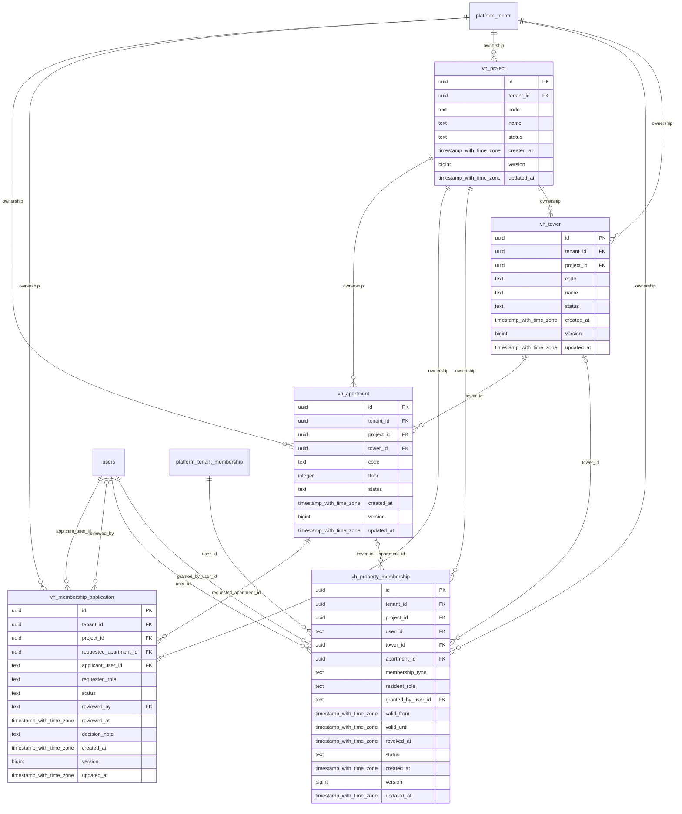

# vinhomes-property

Generated from Drizzle. External entities in the diagram are foreign-key targets owned by another module.

## vh_apartment

Căn hộ thuộc đúng tòa/dự án, với mã, tầng và trạng thái sử dụng.

Tenant RLS: **enabled + forced by integrity migrations 0047/0049**.

| Column | PostgreSQL type | Required | Default | Declared values |
|---|---|---|---|---|
| `id` | `uuid` | yes | `gen_random_uuid()` | — |
| `tenant_id` | `uuid` | yes | `—` | — |
| `project_id` | `uuid` | yes | `—` | — |
| `tower_id` | `uuid` | yes | `—` | — |
| `code` | `text` | yes | `—` | — |
| `floor` | `integer` | yes | `—` | — |
| `status` | `text` | yes | `—` | `ACTIVE`, `VACANT`, `RETIRED` |
| `created_at` | `timestamp with time zone` | yes | `now()` | — |
| `version` | `bigint` | yes | `1` | — |
| `updated_at` | `timestamp with time zone` | yes | `now()` | — |

Primary key: `id`.

Unique keys:

- `vh_apartment_uq_0`: (`tenant_id`, `tower_id`, `code`).
- `vh_apartment_uq_1`: (`tenant_id`, `id`).
- `vh_apartment_uq_2`: (`tenant_id`, `project_id`, `id`).
- `vh_apartment_uq_3`: (`tenant_id`, `project_id`, `tower_id`, `id`).

Foreign keys:

- (`tenant_id`) → `platform_tenant` (`id`); ON DELETE `restrict`.
- (`tenant_id`, `project_id`) → `vh_project` (`tenant_id`, `id`); ON DELETE `restrict`.
- (`tenant_id`, `project_id`, `tower_id`) → `vh_tower` (`tenant_id`, `project_id`, `id`); ON DELETE `restrict`.

Indexes:

- `vh_apartment_ix_0`: (`tenant_id`, `project_id`, `tower_id`).
- `vh_apartment_ix_1`: (`tenant_id`, `project_id`).

Checks:

- `vh_apartment_status_ck`: `"vh_apartment"."status" in ('ACTIVE', 'VACANT', 'RETIRED')`.
- `vh_apartment_ck_0`: `version > 0`.

Additional cross-row/temporal rules: [integrity matrix](../DATABASE_DESIGN.md#integrity-matrix) and [coordination review](../COMPLETENESS_REVIEW.md).

## vh_membership_application

Hồ sơ xin quyền cư dân, căn hộ yêu cầu và quyết định xét duyệt; hồ sơ không tự cấp quyền.

Tenant RLS: **enabled + forced by integrity migrations 0047/0049**.

| Column | PostgreSQL type | Required | Default | Declared values |
|---|---|---|---|---|
| `id` | `uuid` | yes | `gen_random_uuid()` | — |
| `tenant_id` | `uuid` | yes | `—` | — |
| `project_id` | `uuid` | yes | `—` | — |
| `requested_apartment_id` | `uuid` | yes | `—` | — |
| `applicant_user_id` | `text` | yes | `—` | — |
| `requested_role` | `text` | yes | `—` | `OWNER`, `TENANT`, `HOUSEHOLD` |
| `status` | `text` | yes | `—` | `PENDING`, `APPROVED`, `REJECTED`, `WITHDRAWN` |
| `reviewed_by` | `text` | no | `—` | — |
| `reviewed_at` | `timestamp with time zone` | no | `—` | — |
| `decision_note` | `text` | no | `—` | — |
| `created_at` | `timestamp with time zone` | yes | `now()` | — |
| `version` | `bigint` | yes | `1` | — |
| `updated_at` | `timestamp with time zone` | yes | `now()` | — |

Primary key: `id`.

Unique keys:

- `vh_membership_application_uq_0`: (`tenant_id`, `id`).
- `vh_membership_application_uq_1`: (`tenant_id`, `project_id`, `id`).

Foreign keys:

- (`tenant_id`) → `platform_tenant` (`id`); ON DELETE `restrict`.
- (`tenant_id`, `project_id`) → `vh_project` (`tenant_id`, `id`); ON DELETE `restrict`.
- (`tenant_id`, `project_id`, `requested_apartment_id`) → `vh_apartment` (`tenant_id`, `project_id`, `id`); ON DELETE `restrict`.
- (`applicant_user_id`) → `users` (`id`); ON DELETE `restrict`.
- (`reviewed_by`) → `users` (`id`); ON DELETE `restrict`.

Indexes:

- `vh_membership_application_ix_0`: (`applicant_user_id`).
- `vh_membership_application_ix_1`: (`reviewed_by`).
- `vh_membership_application_ix_2`: (`tenant_id`, `project_id`).
- `vh_membership_application_ix_3`: (`tenant_id`, `project_id`, `requested_apartment_id`).

Checks:

- `vh_membership_application_requested_role_ck`: `"vh_membership_application"."requested_role" in ('OWNER', 'TENANT', 'HOUSEHOLD')`.
- `vh_membership_application_status_ck`: `"vh_membership_application"."status" in ('PENDING', 'APPROVED', 'REJECTED', 'WITHDRAWN')`.
- `vh_membership_application_ck_0`: `version > 0`.

Additional cross-row/temporal rules: [integrity matrix](../DATABASE_DESIGN.md#integrity-matrix) and [coordination review](../COMPLETENESS_REVIEW.md).

## vh_project

Dự án/khu đô thị thuộc tenant, gốc phạm vi nghiệp vụ Vinhomes.

Tenant RLS: **enabled + forced by integrity migrations 0047/0049**.

| Column | PostgreSQL type | Required | Default | Declared values |
|---|---|---|---|---|
| `id` | `uuid` | yes | `gen_random_uuid()` | — |
| `tenant_id` | `uuid` | yes | `—` | — |
| `code` | `text` | yes | `—` | — |
| `name` | `text` | yes | `—` | — |
| `status` | `text` | yes | `—` | `ACTIVE`, `SUSPENDED`, `RETIRED` |
| `created_at` | `timestamp with time zone` | yes | `now()` | — |
| `version` | `bigint` | yes | `1` | — |
| `updated_at` | `timestamp with time zone` | yes | `now()` | — |

Primary key: `id`.

Unique keys:

- `vh_project_uq_0`: (`tenant_id`, `code`).
- `vh_project_uq_1`: (`tenant_id`, `id`).

Foreign keys:

- (`tenant_id`) → `platform_tenant` (`id`); ON DELETE `restrict`.

Checks:

- `vh_project_status_ck`: `"vh_project"."status" in ('ACTIVE', 'SUSPENDED', 'RETIRED')`.
- `vh_project_ck_0`: `version > 0`.

Additional cross-row/temporal rules: [integrity matrix](../DATABASE_DESIGN.md#integrity-matrix) and [coordination review](../COMPLETENESS_REVIEW.md).

## vh_property_membership

Quyền cư dân/nhân viên/quản lý/nhà thầu theo project/tower/apartment và khoảng hiệu lực.

Tenant RLS: **enabled + forced by integrity migrations 0047/0049**.

| Column | PostgreSQL type | Required | Default | Declared values |
|---|---|---|---|---|
| `id` | `uuid` | yes | `gen_random_uuid()` | — |
| `tenant_id` | `uuid` | yes | `—` | — |
| `project_id` | `uuid` | yes | `—` | — |
| `user_id` | `text` | yes | `—` | — |
| `tower_id` | `uuid` | no | `—` | — |
| `apartment_id` | `uuid` | no | `—` | — |
| `membership_type` | `text` | yes | `—` | `RESIDENT`, `MANAGER`, `STAFF`, `CONTRACTOR` |
| `resident_role` | `text` | no | `—` | `OWNER`, `TENANT`, `HOUSEHOLD` |
| `granted_by_user_id` | `text` | yes | `—` | — |
| `valid_from` | `timestamp with time zone` | yes | `—` | — |
| `valid_until` | `timestamp with time zone` | no | `—` | — |
| `revoked_at` | `timestamp with time zone` | no | `—` | — |
| `status` | `text` | yes | `—` | `ACTIVE`, `SUSPENDED`, `REVOKED` |
| `created_at` | `timestamp with time zone` | yes | `now()` | — |
| `version` | `bigint` | yes | `1` | — |
| `updated_at` | `timestamp with time zone` | yes | `now()` | — |

Primary key: `id`.

Unique keys:

- `vh_property_membership_uq_0`: (`tenant_id`, `id`).
- `vh_property_membership_uq_1`: (`tenant_id`, `project_id`, `id`).
- `vh_property_membership_uq_2`: (`tenant_id`, `project_id`, `apartment_id`, `id`).
- `vh_property_membership_uq_3`: (`tenant_id`, `project_id`, `user_id`, `id`).

Foreign keys:

- (`tenant_id`) → `platform_tenant` (`id`); ON DELETE `restrict`.
- (`tenant_id`, `project_id`) → `vh_project` (`tenant_id`, `id`); ON DELETE `restrict`.
- (`user_id`) → `users` (`id`); ON DELETE `restrict`.
- (`tenant_id`, `project_id`, `tower_id`) → `vh_tower` (`tenant_id`, `project_id`, `id`); ON DELETE `restrict`.
- (`tenant_id`, `project_id`, `tower_id`, `apartment_id`) → `vh_apartment` (`tenant_id`, `project_id`, `tower_id`, `id`); ON DELETE `restrict`.
- (`granted_by_user_id`) → `users` (`id`); ON DELETE `restrict`.
- (`tenant_id`, `user_id`) → `platform_tenant_membership` (`tenant_id`, `user_id`); ON DELETE `restrict`.

Indexes:

- `vh_property_membership_ix_0`: (`user_id`).
- `vh_property_membership_ix_1`: (`tenant_id`, `project_id`, `tower_id`).
- `vh_property_membership_ix_2`: (`tenant_id`, `user_id`, `status`, `valid_from`, `valid_until`).
- `vh_property_membership_ix_3`: (`tenant_id`, `project_id`).
- `vh_property_membership_ix_4`: (`tenant_id`, `project_id`, `tower_id`, `apartment_id`).
- `vh_property_membership_ix_5`: (`granted_by_user_id`).

Checks:

- `vh_property_membership_membership_type_ck`: `"vh_property_membership"."membership_type" in ('RESIDENT', 'MANAGER', 'STAFF', 'CONTRACTOR')`.
- `vh_property_membership_resident_role_ck`: `"vh_property_membership"."resident_role" in ('OWNER', 'TENANT', 'HOUSEHOLD')`.
- `vh_property_membership_status_ck`: `"vh_property_membership"."status" in ('ACTIVE', 'SUSPENDED', 'REVOKED')`.
- `vh_property_membership_ck_0`: `valid_until IS NULL OR valid_until > valid_from`.
- `vh_property_membership_ck_1`: `(membership_type = 'RESIDENT' AND apartment_id IS NOT NULL AND resident_role IS NOT NULL) OR (membership_type <> 'RESIDENT' AND resident_role IS NULL)`.
- `vh_property_membership_ck_2`: `apartment_id IS NULL OR tower_id IS NOT NULL`.
- `vh_property_membership_ck_3`: `status <> 'REVOKED' OR revoked_at IS NOT NULL`.
- `vh_property_membership_ck_4`: `version > 0`.

Additional cross-row/temporal rules: [integrity matrix](../DATABASE_DESIGN.md#integrity-matrix) and [coordination review](../COMPLETENESS_REVIEW.md).

## vh_tower

Tòa nhà thuộc một dự án, có code unique trong dự án.

Tenant RLS: **enabled + forced by integrity migrations 0047/0049**.

| Column | PostgreSQL type | Required | Default | Declared values |
|---|---|---|---|---|
| `id` | `uuid` | yes | `gen_random_uuid()` | — |
| `tenant_id` | `uuid` | yes | `—` | — |
| `project_id` | `uuid` | yes | `—` | — |
| `code` | `text` | yes | `—` | — |
| `name` | `text` | yes | `—` | — |
| `status` | `text` | yes | `—` | `ACTIVE`, `RETIRED` |
| `created_at` | `timestamp with time zone` | yes | `now()` | — |
| `version` | `bigint` | yes | `1` | — |
| `updated_at` | `timestamp with time zone` | yes | `now()` | — |

Primary key: `id`.

Unique keys:

- `vh_tower_uq_0`: (`tenant_id`, `project_id`, `code`).
- `vh_tower_uq_1`: (`tenant_id`, `id`).
- `vh_tower_uq_2`: (`tenant_id`, `project_id`, `id`).

Foreign keys:

- (`tenant_id`) → `platform_tenant` (`id`); ON DELETE `restrict`.
- (`tenant_id`, `project_id`) → `vh_project` (`tenant_id`, `id`); ON DELETE `restrict`.

Indexes:

- `vh_tower_ix_0`: (`tenant_id`, `project_id`).

Checks:

- `vh_tower_status_ck`: `"vh_tower"."status" in ('ACTIVE', 'RETIRED')`.
- `vh_tower_ck_0`: `version > 0`.

Additional cross-row/temporal rules: [integrity matrix](../DATABASE_DESIGN.md#integrity-matrix) and [coordination review](../COMPLETENESS_REVIEW.md).
