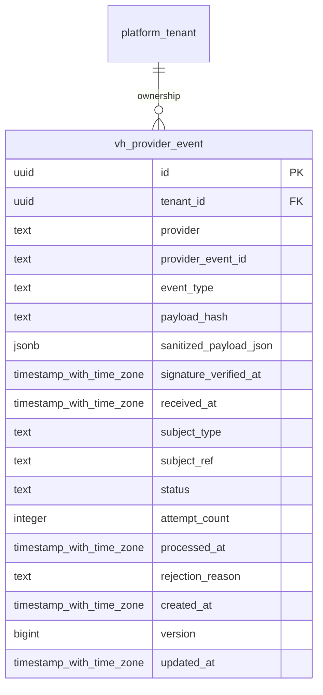

# vinhomes-provider-events

Generated from Drizzle. External entities in the diagram are foreign-key targets owned by another module.

## vh_provider_event

Inbox callback nhà cung cấp đã xác minh chữ ký, hash/dedupe và kết quả xử lý; không tự chứng minh thanh toán nếu chưa qua adapter tin cậy.

Tenant RLS: **enabled + forced by integrity migrations 0047/0049**.

| Column | PostgreSQL type | Required | Default | Declared values |
|---|---|---|---|---|
| `id` | `uuid` | yes | `gen_random_uuid()` | — |
| `tenant_id` | `uuid` | yes | `—` | — |
| `provider` | `text` | yes | `—` | — |
| `provider_event_id` | `text` | yes | `—` | — |
| `event_type` | `text` | yes | `—` | — |
| `payload_hash` | `text` | yes | `—` | — |
| `sanitized_payload_json` | `jsonb` | yes | `—` | — |
| `signature_verified_at` | `timestamp with time zone` | yes | `—` | — |
| `received_at` | `timestamp with time zone` | yes | `—` | — |
| `subject_type` | `text` | no | `—` | — |
| `subject_ref` | `text` | no | `—` | — |
| `status` | `text` | yes | `—` | `RECEIVED`, `PROCESSING`, `PROCESSED`, `REJECTED` |
| `attempt_count` | `integer` | yes | `—` | — |
| `processed_at` | `timestamp with time zone` | no | `—` | — |
| `rejection_reason` | `text` | no | `—` | — |
| `created_at` | `timestamp with time zone` | yes | `now()` | — |
| `version` | `bigint` | yes | `1` | — |
| `updated_at` | `timestamp with time zone` | yes | `now()` | — |

Primary key: `id`.

Unique keys:

- `vh_provider_event_uq_0`: (`tenant_id`, `provider`, `provider_event_id`).
- `vh_provider_event_uq_1`: (`tenant_id`, `id`).

Foreign keys:

- (`tenant_id`) → `platform_tenant` (`id`); ON DELETE `restrict`.

Indexes:

- `vh_provider_event_received_ix`: (`tenant_id`, `status`, `received_at`).

Checks:

- `vh_provider_event_status_ck`: `"vh_provider_event"."status" in ('RECEIVED', 'PROCESSING', 'PROCESSED', 'REJECTED')`.
- `vh_provider_event_ck_0`: `attempt_count >= 0`.
- `vh_provider_event_ck_1`: `status<>'PROCESSED' OR processed_at IS NOT NULL`.
- `vh_provider_event_ck_2`: `signature_verified_at >= received_at`.
- `vh_provider_event_ck_3`: `version > 0`.

Additional cross-row/temporal rules: [integrity matrix](../DATABASE_DESIGN.md#integrity-matrix) and [coordination review](../COMPLETENESS_REVIEW.md).
