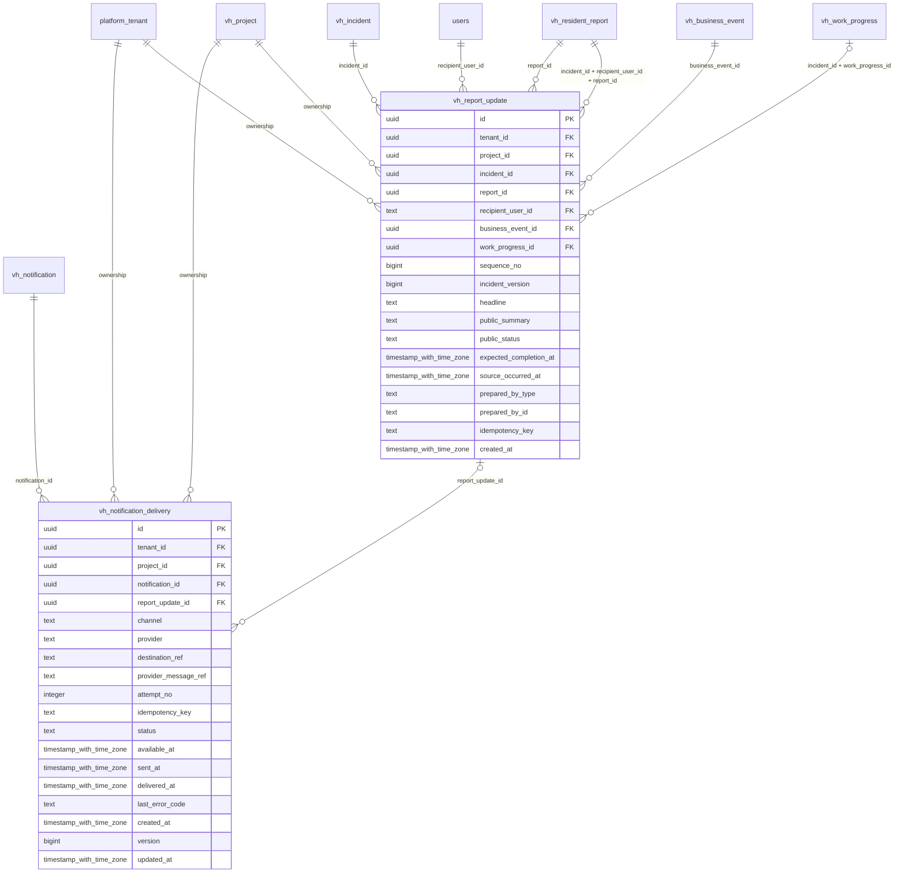

# vinhomes-resident-updates

Generated from Drizzle. External entities in the diagram are foreign-key targets owned by another module.

## vh_notification_delivery

Mỗi lần gửi thông báo qua một channel/provider, có idempotency và receipt giao nhận để theo dõi retry.

Tenant RLS: **enabled + forced by integrity migrations 0047/0049/0052**.

| Column | PostgreSQL type | Required | Default | Declared values |
|---|---|---|---|---|
| `id` | `uuid` | yes | `gen_random_uuid()` | — |
| `tenant_id` | `uuid` | yes | `—` | — |
| `project_id` | `uuid` | yes | `—` | — |
| `notification_id` | `uuid` | yes | `—` | — |
| `report_update_id` | `uuid` | no | `—` | — |
| `channel` | `text` | yes | `—` | `IN_APP`, `EMAIL`, `SMS`, `PUSH`, `CHAT` |
| `provider` | `text` | yes | `—` | — |
| `destination_ref` | `text` | yes | `—` | — |
| `provider_message_ref` | `text` | no | `—` | — |
| `attempt_no` | `integer` | yes | `—` | — |
| `idempotency_key` | `text` | yes | `—` | — |
| `status` | `text` | yes | `—` | `QUEUED`, `SENDING`, `DELIVERED`, `FAILED` |
| `available_at` | `timestamp with time zone` | yes | `—` | — |
| `sent_at` | `timestamp with time zone` | no | `—` | — |
| `delivered_at` | `timestamp with time zone` | no | `—` | — |
| `last_error_code` | `text` | no | `—` | — |
| `created_at` | `timestamp with time zone` | yes | `now()` | — |
| `version` | `bigint` | yes | `1` | — |
| `updated_at` | `timestamp with time zone` | yes | `now()` | — |

Primary key: `id`.

Unique keys:

- `vh_notification_delivery_uq_0`: (`tenant_id`, `notification_id`, `channel`, `attempt_no`).
- `vh_notification_delivery_uq_1`: (`tenant_id`, `idempotency_key`).
- `vh_notification_delivery_uq_2`: (`provider`, `provider_message_ref`).
- `vh_notification_delivery_uq_3`: (`tenant_id`, `id`).
- `vh_notification_delivery_uq_4`: (`tenant_id`, `project_id`, `id`).

Foreign keys:

- (`tenant_id`) → `platform_tenant` (`id`); ON DELETE `restrict`.
- (`tenant_id`, `project_id`) → `vh_project` (`tenant_id`, `id`); ON DELETE `restrict`.
- (`tenant_id`, `project_id`, `notification_id`) → `vh_notification` (`tenant_id`, `project_id`, `id`); ON DELETE `restrict`.
- (`tenant_id`, `project_id`, `report_update_id`) → `vh_report_update` (`tenant_id`, `project_id`, `id`); ON DELETE `restrict`.

Indexes:

- `vh_notification_delivery_ix_1`: (`tenant_id`, `project_id`).
- `vh_notification_delivery_ready_ix`: (`tenant_id`, `status`, `available_at`).
- `vh_notification_delivery_ix_2`: (`tenant_id`, `project_id`, `notification_id`).
- `vh_notification_delivery_ix_3`: (`tenant_id`, `project_id`, `report_update_id`).

Checks:

- `vh_notification_delivery_channel_ck`: `"vh_notification_delivery"."channel" in ('IN_APP', 'EMAIL', 'SMS', 'PUSH', 'CHAT')`.
- `vh_notification_delivery_status_ck`: `"vh_notification_delivery"."status" in ('QUEUED', 'SENDING', 'DELIVERED', 'FAILED')`.
- `vh_notification_delivery_ck_0`: `attempt_no > 0`.
- `vh_notification_delivery_ck_1`: `status<>'DELIVERED' OR (delivered_at IS NOT NULL AND provider_message_ref IS NOT NULL)`.
- `vh_notification_delivery_ck_2`: `version > 0`.

Cross-row rules and application responsibilities: [database design](../01_DATABASE_ERD_IMPLEMENTATION_COMPLETE.md) and [system flow](../02_BUSINESS_ANALYSIS_IMPLEMENTATION.md).

## vh_report_update

Bản tiến độ đã biên soạn riêng cho đúng reporter, ghim event/incident version; lễ tân đọc bản này thay vì đọc toàn group chat.

Tenant RLS: **enabled + forced by integrity migrations 0047/0049/0052**.

| Column | PostgreSQL type | Required | Default | Declared values |
|---|---|---|---|---|
| `id` | `uuid` | yes | `gen_random_uuid()` | — |
| `tenant_id` | `uuid` | yes | `—` | — |
| `project_id` | `uuid` | yes | `—` | — |
| `incident_id` | `uuid` | yes | `—` | — |
| `report_id` | `uuid` | yes | `—` | — |
| `recipient_user_id` | `text` | yes | `—` | — |
| `business_event_id` | `uuid` | yes | `—` | — |
| `work_progress_id` | `uuid` | no | `—` | — |
| `sequence_no` | `bigint` | yes | `—` | — |
| `incident_version` | `bigint` | yes | `—` | — |
| `headline` | `text` | yes | `—` | — |
| `public_summary` | `text` | yes | `—` | — |
| `public_status` | `text` | yes | `—` | `RECEIVED`, `ASSIGNED`, `IN_PROGRESS`, `WAITING`, `RESOLVED`, `CLOSED` |
| `expected_completion_at` | `timestamp with time zone` | no | `—` | — |
| `source_occurred_at` | `timestamp with time zone` | yes | `—` | — |
| `prepared_by_type` | `text` | yes | `—` | `HUMAN`, `SYSTEM`, `AGENT` |
| `prepared_by_id` | `text` | yes | `—` | — |
| `idempotency_key` | `text` | yes | `—` | — |
| `created_at` | `timestamp with time zone` | yes | `now()` | — |

Primary key: `id`.

Unique keys:

- `vh_report_update_uq_0`: (`tenant_id`, `report_id`, `sequence_no`).
- `vh_report_update_uq_1`: (`tenant_id`, `report_id`, `business_event_id`).
- `vh_report_update_uq_2`: (`tenant_id`, `idempotency_key`).
- `vh_report_update_uq_3`: (`tenant_id`, `id`).
- `vh_report_update_uq_4`: (`tenant_id`, `project_id`, `id`).

Foreign keys:

- (`tenant_id`) → `platform_tenant` (`id`); ON DELETE `restrict`.
- (`tenant_id`, `project_id`) → `vh_project` (`tenant_id`, `id`); ON DELETE `restrict`.
- (`tenant_id`, `project_id`, `incident_id`) → `vh_incident` (`tenant_id`, `project_id`, `id`); ON DELETE `restrict`.
- (`tenant_id`, `project_id`, `report_id`) → `vh_resident_report` (`tenant_id`, `project_id`, `id`); ON DELETE `restrict`.
- (`recipient_user_id`) → `users` (`id`); ON DELETE `restrict`.
- (`tenant_id`, `project_id`, `business_event_id`) → `vh_business_event` (`tenant_id`, `project_id`, `id`); ON DELETE `restrict`.
- (`tenant_id`, `project_id`, `incident_id`, `work_progress_id`) → `vh_work_progress` (`tenant_id`, `project_id`, `incident_id`, `id`); ON DELETE `restrict`.
- (`tenant_id`, `incident_id`, `recipient_user_id`, `report_id`) → `vh_resident_report` (`tenant_id`, `incident_id`, `reporter_id`, `id`); ON DELETE `restrict`.

Indexes:

- `vh_report_update_ix_0`: (`recipient_user_id`).
- `vh_report_update_ix_2`: (`tenant_id`, `incident_id`, `recipient_user_id`, `report_id`).
- `vh_report_update_ix_3`: (`tenant_id`, `project_id`).
- `vh_report_update_ix_4`: (`tenant_id`, `project_id`, `business_event_id`).
- `vh_report_update_ix_5`: (`tenant_id`, `project_id`, `incident_id`).
- `vh_report_update_ix_6`: (`tenant_id`, `project_id`, `incident_id`, `work_progress_id`).
- `vh_report_update_ix_7`: (`tenant_id`, `project_id`, `report_id`).

Checks:

- `vh_report_update_public_status_ck`: `"vh_report_update"."public_status" in ('RECEIVED', 'ASSIGNED', 'IN_PROGRESS', 'WAITING', 'RESOLVED', 'CLOSED')`.
- `vh_report_update_prepared_by_type_ck`: `"vh_report_update"."prepared_by_type" in ('HUMAN', 'SYSTEM', 'AGENT')`.
- `vh_report_update_ck_0`: `sequence_no > 0`.
- `vh_report_update_ck_1`: `incident_version > 0`.

Cross-row rules and application responsibilities: [database design](../01_DATABASE_ERD_IMPLEMENTATION_COMPLETE.md) and [system flow](../02_BUSINESS_ANALYSIS_IMPLEMENTATION.md).
