# vinhomes-services

Generated from Drizzle. External entities in the diagram are foreign-key targets owned by another module.

```mermaid
erDiagram
  vh_access_card {
    uuid id PK
    uuid tenant_id FK
    uuid project_id FK
    uuid membership_id FK
    text card_token_ref
    timestamp_with_time_zone issued_at
    timestamp_with_time_zone expires_at
    text status
    timestamp_with_time_zone created_at
    bigint version
    timestamp_with_time_zone updated_at
  }
  platform_tenant ||--o{ vh_access_card : "ownership"
  vh_project ||--o{ vh_access_card : "ownership"
  vh_property_membership ||--o{ vh_access_card : "membership_id"
  vh_camera_request {
    uuid id PK
    uuid tenant_id FK
    uuid project_id FK
    uuid apartment_id FK
    uuid requester_membership_id FK
    uuid location_place_id FK
    timestamp_with_time_zone from_at
    timestamp_with_time_zone to_at
    text purpose
    text status
    text reviewed_by FK
    timestamp_with_time_zone expires_at
    timestamp_with_time_zone created_at
    bigint version
    timestamp_with_time_zone updated_at
  }
  platform_tenant ||--o{ vh_camera_request : "ownership"
  vh_project ||--o{ vh_camera_request : "ownership"
  vh_apartment ||--o{ vh_camera_request : "apartment_id"
  vh_property_membership ||--o{ vh_camera_request : "requester_membership_id"
  vh_map_place ||--o{ vh_camera_request : "location_place_id"
  users |o--o{ vh_camera_request : "reviewed_by"
  vh_property_membership ||--o{ vh_camera_request : "apartment_id + requester_membership_id"
  vh_charging_session {
    uuid id PK
    uuid tenant_id FK
    uuid project_id FK
    uuid apartment_id FK
    uuid requested_by_membership_id FK
    uuid station_place_id FK
    text connector_code
    timestamp_with_time_zone started_at
    timestamp_with_time_zone ended_at
    bigint energy_wh
    bigint amount_minor
    char_3_ currency
    text provider_ref
    text status
    timestamp_with_time_zone created_at
    bigint version
    timestamp_with_time_zone updated_at
  }
  platform_tenant ||--o{ vh_charging_session : "ownership"
  vh_project ||--o{ vh_charging_session : "ownership"
  vh_apartment ||--o{ vh_charging_session : "apartment_id"
  vh_property_membership ||--o{ vh_charging_session : "requested_by_membership_id"
  vh_map_place ||--o{ vh_charging_session : "station_place_id"
  vh_property_membership ||--o{ vh_charging_session : "apartment_id + requested_by_membership_id"
  vh_construction_permit {
    uuid id PK
    uuid tenant_id FK
    uuid project_id FK
    uuid service_request_id FK
    text contractor_name
    date start_date
    date end_date
    jsonb permitted_hours_json
    text status
    timestamp_with_time_zone created_at
    bigint version
    timestamp_with_time_zone updated_at
  }
  platform_tenant ||--o{ vh_construction_permit : "ownership"
  vh_project ||--o{ vh_construction_permit : "ownership"
  vh_service_request ||--o{ vh_construction_permit : "service_request_id"
  vh_face_enrollment {
    uuid id PK
    uuid tenant_id FK
    uuid project_id FK
    uuid membership_id FK
    text consent_version
    timestamp_with_time_zone consented_at
    text provider_subject_ref
    text status
    timestamp_with_time_zone revoked_at
    timestamp_with_time_zone deletion_requested_at
    timestamp_with_time_zone deletion_confirmed_at
    timestamp_with_time_zone created_at
    bigint version
    timestamp_with_time_zone updated_at
  }
  platform_tenant ||--o{ vh_face_enrollment : "ownership"
  vh_project ||--o{ vh_face_enrollment : "ownership"
  vh_property_membership ||--o{ vh_face_enrollment : "membership_id"
  vh_handover {
    uuid id PK
    uuid tenant_id FK
    uuid project_id FK
    uuid apartment_id FK
    uuid resident_membership_id FK
    timestamp_with_time_zone scheduled_at
    timestamp_with_time_zone completed_at
    uuid checklist_version_id FK
    text status
    text note
    timestamp_with_time_zone created_at
    bigint version
    timestamp_with_time_zone updated_at
  }
  platform_tenant ||--o{ vh_handover : "ownership"
  vh_project ||--o{ vh_handover : "ownership"
  vh_apartment ||--o{ vh_handover : "apartment_id"
  vh_property_membership ||--o{ vh_handover : "resident_membership_id"
  vh_checklist_version |o--o{ vh_handover : "checklist_version_id"
  vh_property_membership ||--o{ vh_handover : "apartment_id + resident_membership_id"
  vh_intercom_event {
    uuid id PK
    uuid tenant_id FK
    uuid project_id FK
    uuid apartment_id FK
    uuid visitor_pass_id FK
    text provider_event_id
    text event_type
    timestamp_with_time_zone occurred_at
    text outcome
    timestamp_with_time_zone created_at
  }
  platform_tenant ||--o{ vh_intercom_event : "ownership"
  vh_project ||--o{ vh_intercom_event : "ownership"
  vh_apartment ||--o{ vh_intercom_event : "apartment_id"
  vh_visitor_pass |o--o{ vh_intercom_event : "visitor_pass_id"
  vh_parking_permit {
    uuid id PK
    uuid tenant_id FK
    uuid project_id FK
    uuid apartment_id FK
    uuid membership_id FK
    text vehicle_plate
    text vehicle_type
    timestamp_with_time_zone valid_from
    timestamp_with_time_zone valid_until
    text status
    timestamp_with_time_zone created_at
    bigint version
    timestamp_with_time_zone updated_at
  }
  platform_tenant ||--o{ vh_parking_permit : "ownership"
  vh_project ||--o{ vh_parking_permit : "ownership"
  vh_apartment ||--o{ vh_parking_permit : "apartment_id"
  vh_property_membership ||--o{ vh_parking_permit : "membership_id"
  vh_property_membership ||--o{ vh_parking_permit : "apartment_id + membership_id"
  vh_pet_profile {
    uuid id PK
    uuid tenant_id FK
    uuid project_id FK
    uuid apartment_id FK
    uuid owner_membership_id FK
    text name
    text species
    text breed
    date vaccination_valid_until
    text status
    timestamp_with_time_zone created_at
    bigint version
    timestamp_with_time_zone updated_at
  }
  platform_tenant ||--o{ vh_pet_profile : "ownership"
  vh_project ||--o{ vh_pet_profile : "ownership"
  vh_apartment ||--o{ vh_pet_profile : "apartment_id"
  vh_property_membership ||--o{ vh_pet_profile : "owner_membership_id"
  vh_property_membership ||--o{ vh_pet_profile : "apartment_id + owner_membership_id"
  vh_service_request {
    uuid id PK
    uuid tenant_id FK
    uuid project_id FK
    uuid apartment_id FK
    uuid requester_membership_id FK
    text service_type
    timestamp_with_time_zone requested_start_at
    timestamp_with_time_zone requested_end_at
    jsonb details_json
    integer details_schema_version
    text status
    text decision_reason
    timestamp_with_time_zone created_at
    bigint version
    timestamp_with_time_zone updated_at
  }
  platform_tenant ||--o{ vh_service_request : "ownership"
  vh_project ||--o{ vh_service_request : "ownership"
  vh_apartment ||--o{ vh_service_request : "apartment_id"
  vh_property_membership ||--o{ vh_service_request : "requester_membership_id"
  vh_property_membership ||--o{ vh_service_request : "apartment_id + requester_membership_id"
  vh_visitor_pass {
    uuid id PK
    uuid tenant_id FK
    uuid project_id FK
    uuid service_request_id FK
    text visitor_name
    text vehicle_plate
    timestamp_with_time_zone valid_from
    timestamp_with_time_zone valid_until
    text pass_token_ref
    text status
    timestamp_with_time_zone created_at
    bigint version
    timestamp_with_time_zone updated_at
  }
  platform_tenant ||--o{ vh_visitor_pass : "ownership"
  vh_project ||--o{ vh_visitor_pass : "ownership"
  vh_service_request ||--o{ vh_visitor_pass : "service_request_id"
```

## vh_access_card

Đăng ký/cấp/thu hồi thẻ ra vào, lưu provider token reference thay raw access secret.

Tenant RLS: **enabled + forced by integrity migrations 0047/0049/0052**.

| Column | PostgreSQL type | Required | Default | Declared values |
|---|---|---|---|---|
| `id` | `uuid` | yes | `gen_random_uuid()` | — |
| `tenant_id` | `uuid` | yes | `—` | — |
| `project_id` | `uuid` | yes | `—` | — |
| `membership_id` | `uuid` | yes | `—` | — |
| `card_token_ref` | `text` | yes | `—` | — |
| `issued_at` | `timestamp with time zone` | no | `—` | — |
| `expires_at` | `timestamp with time zone` | no | `—` | — |
| `status` | `text` | yes | `—` | `REQUESTED`, `ACTIVE`, `SUSPENDED`, `REVOKED` |
| `created_at` | `timestamp with time zone` | yes | `now()` | — |
| `version` | `bigint` | yes | `1` | — |
| `updated_at` | `timestamp with time zone` | yes | `now()` | — |

Primary key: `id`.

Unique keys:

- `vh_access_card_uq_0`: (`card_token_ref`).
- `vh_access_card_uq_1`: (`tenant_id`, `id`).
- `vh_access_card_uq_2`: (`tenant_id`, `project_id`, `id`).

Foreign keys:

- (`tenant_id`) → `platform_tenant` (`id`); ON DELETE `restrict`.
- (`tenant_id`, `project_id`) → `vh_project` (`tenant_id`, `id`); ON DELETE `restrict`.
- (`tenant_id`, `project_id`, `membership_id`) → `vh_property_membership` (`tenant_id`, `project_id`, `id`); ON DELETE `restrict`.

Indexes:

- `vh_access_card_ix_0`: (`tenant_id`, `project_id`, `membership_id`).
- `vh_access_card_ix_1`: (`tenant_id`, `project_id`).

Checks:

- `vh_access_card_status_ck`: `"vh_access_card"."status" in ('REQUESTED', 'ACTIVE', 'SUSPENDED', 'REVOKED')`.
- `vh_access_card_ck_0`: `version > 0`.

Cross-row rules and application responsibilities: [database design](../01_DATABASE_ERD_IMPLEMENTATION_COMPLETE.md) and [system flow](../02_BUSINESS_ANALYSIS_IMPLEMENTATION.md).

## vh_camera_request

Yêu cầu xem camera theo vị trí/khoảng thời gian/mục đích, có reviewer và hạn truy cập.

Tenant RLS: **enabled + forced by integrity migrations 0047/0049/0052**.

| Column | PostgreSQL type | Required | Default | Declared values |
|---|---|---|---|---|
| `id` | `uuid` | yes | `gen_random_uuid()` | — |
| `tenant_id` | `uuid` | yes | `—` | — |
| `project_id` | `uuid` | yes | `—` | — |
| `apartment_id` | `uuid` | yes | `—` | — |
| `requester_membership_id` | `uuid` | yes | `—` | — |
| `location_place_id` | `uuid` | yes | `—` | — |
| `from_at` | `timestamp with time zone` | yes | `—` | — |
| `to_at` | `timestamp with time zone` | yes | `—` | — |
| `purpose` | `text` | yes | `—` | — |
| `status` | `text` | yes | `—` | `SUBMITTED`, `APPROVED`, `REJECTED`, `FULFILLED`, `EXPIRED` |
| `reviewed_by` | `text` | no | `—` | — |
| `expires_at` | `timestamp with time zone` | no | `—` | — |
| `created_at` | `timestamp with time zone` | yes | `now()` | — |
| `version` | `bigint` | yes | `1` | — |
| `updated_at` | `timestamp with time zone` | yes | `now()` | — |

Primary key: `id`.

Unique keys:

- `vh_camera_request_uq_0`: (`tenant_id`, `id`).
- `vh_camera_request_uq_1`: (`tenant_id`, `project_id`, `id`).

Foreign keys:

- (`tenant_id`) → `platform_tenant` (`id`); ON DELETE `restrict`.
- (`tenant_id`, `project_id`) → `vh_project` (`tenant_id`, `id`); ON DELETE `restrict`.
- (`tenant_id`, `project_id`, `apartment_id`) → `vh_apartment` (`tenant_id`, `project_id`, `id`); ON DELETE `restrict`.
- (`tenant_id`, `project_id`, `requester_membership_id`) → `vh_property_membership` (`tenant_id`, `project_id`, `id`); ON DELETE `restrict`.
- (`tenant_id`, `project_id`, `location_place_id`) → `vh_map_place` (`tenant_id`, `project_id`, `id`); ON DELETE `restrict`.
- (`reviewed_by`) → `users` (`id`); ON DELETE `restrict`.
- (`tenant_id`, `project_id`, `apartment_id`, `requester_membership_id`) → `vh_property_membership` (`tenant_id`, `project_id`, `apartment_id`, `id`); ON DELETE `restrict`.

Indexes:

- `vh_camera_request_ix_0`: (`tenant_id`, `project_id`, `location_place_id`).
- `vh_camera_request_ix_1`: (`tenant_id`, `project_id`).
- `vh_camera_request_ix_2`: (`tenant_id`, `project_id`, `requester_membership_id`).
- `vh_camera_request_ix_3`: (`tenant_id`, `project_id`, `apartment_id`).
- `vh_camera_request_ix_4`: (`reviewed_by`).

Checks:

- `vh_camera_request_status_ck`: `"vh_camera_request"."status" in ('SUBMITTED', 'APPROVED', 'REJECTED', 'FULFILLED', 'EXPIRED')`.
- `vh_camera_request_ck_0`: `to_at > from_at`.
- `vh_camera_request_ck_1`: `version > 0`.

Cross-row rules and application responsibilities: [database design](../01_DATABASE_ERD_IMPLEMENTATION_COMPLETE.md) and [system flow](../02_BUSINESS_ANALYSIS_IMPLEMENTATION.md).

## vh_charging_session

Phiên sạc xe có thiết bị/connector, năng lượng, phí và provider reference; trạng thái cần receipt thực tế.

Tenant RLS: **enabled + forced by integrity migrations 0047/0049/0052**.

| Column | PostgreSQL type | Required | Default | Declared values |
|---|---|---|---|---|
| `id` | `uuid` | yes | `gen_random_uuid()` | — |
| `tenant_id` | `uuid` | yes | `—` | — |
| `project_id` | `uuid` | yes | `—` | — |
| `apartment_id` | `uuid` | yes | `—` | — |
| `requested_by_membership_id` | `uuid` | yes | `—` | — |
| `station_place_id` | `uuid` | yes | `—` | — |
| `connector_code` | `text` | yes | `—` | — |
| `started_at` | `timestamp with time zone` | no | `—` | — |
| `ended_at` | `timestamp with time zone` | no | `—` | — |
| `energy_wh` | `bigint` | no | `—` | — |
| `amount_minor` | `bigint` | no | `—` | — |
| `currency` | `char(3)` | yes | `—` | — |
| `provider_ref` | `text` | no | `—` | — |
| `status` | `text` | yes | `—` | `REQUESTED`, `ACTIVE`, `COMPLETED`, `FAILED`, `CANCELLED` |
| `created_at` | `timestamp with time zone` | yes | `now()` | — |
| `version` | `bigint` | yes | `1` | — |
| `updated_at` | `timestamp with time zone` | yes | `now()` | — |

Primary key: `id`.

Unique keys:

- `vh_charging_session_uq_0`: (`provider_ref`).
- `vh_charging_session_uq_1`: (`tenant_id`, `id`).
- `vh_charging_session_uq_2`: (`tenant_id`, `project_id`, `id`).

Foreign keys:

- (`tenant_id`) → `platform_tenant` (`id`); ON DELETE `restrict`.
- (`tenant_id`, `project_id`) → `vh_project` (`tenant_id`, `id`); ON DELETE `restrict`.
- (`tenant_id`, `project_id`, `apartment_id`) → `vh_apartment` (`tenant_id`, `project_id`, `id`); ON DELETE `restrict`.
- (`tenant_id`, `project_id`, `requested_by_membership_id`) → `vh_property_membership` (`tenant_id`, `project_id`, `id`); ON DELETE `restrict`.
- (`tenant_id`, `project_id`, `station_place_id`) → `vh_map_place` (`tenant_id`, `project_id`, `id`); ON DELETE `restrict`.
- (`tenant_id`, `project_id`, `apartment_id`, `requested_by_membership_id`) → `vh_property_membership` (`tenant_id`, `project_id`, `apartment_id`, `id`); ON DELETE `restrict`.

Indexes:

- `vh_charging_session_ix_0`: (`tenant_id`, `project_id`, `station_place_id`).
- `vh_charging_session_ix_1`: (`tenant_id`, `project_id`, `apartment_id`).
- `vh_charging_session_ix_2`: (`tenant_id`, `project_id`).
- `vh_charging_session_ix_3`: (`tenant_id`, `project_id`, `requested_by_membership_id`).

Checks:

- `vh_charging_session_status_ck`: `"vh_charging_session"."status" in ('REQUESTED', 'ACTIVE', 'COMPLETED', 'FAILED', 'CANCELLED')`.
- `vh_charging_session_ck_0`: `energy_wh IS NULL OR energy_wh >= 0`.
- `vh_charging_session_ck_1`: `amount_minor IS NULL OR amount_minor >= 0`.
- `vh_charging_session_ck_2`: `ended_at IS NULL OR ended_at >= started_at`.
- `vh_charging_session_ck_3`: `currency ~ '^[A-Z]{3}$'`.
- `vh_charging_session_ck_4`: `version > 0`.

Cross-row rules and application responsibilities: [database design](../01_DATABASE_ERD_IMPLEMENTATION_COMPLETE.md) and [system flow](../02_BUSINESS_ANALYSIS_IMPLEMENTATION.md).

## vh_construction_permit

Giấy phép thi công theo service request, nhà thầu, ngày và giờ được phép.

Tenant RLS: **enabled + forced by integrity migrations 0047/0049/0052**.

| Column | PostgreSQL type | Required | Default | Declared values |
|---|---|---|---|---|
| `id` | `uuid` | yes | `gen_random_uuid()` | — |
| `tenant_id` | `uuid` | yes | `—` | — |
| `project_id` | `uuid` | yes | `—` | — |
| `service_request_id` | `uuid` | yes | `—` | — |
| `contractor_name` | `text` | yes | `—` | — |
| `start_date` | `date` | yes | `—` | — |
| `end_date` | `date` | yes | `—` | — |
| `permitted_hours_json` | `jsonb` | yes | `—` | — |
| `status` | `text` | yes | `—` | `PENDING`, `APPROVED`, `REJECTED`, `EXPIRED`, `REVOKED` |
| `created_at` | `timestamp with time zone` | yes | `now()` | — |
| `version` | `bigint` | yes | `1` | — |
| `updated_at` | `timestamp with time zone` | yes | `now()` | — |

Primary key: `id`.

Unique keys:

- `vh_construction_permit_uq_0`: (`tenant_id`, `service_request_id`).
- `vh_construction_permit_uq_1`: (`tenant_id`, `id`).
- `vh_construction_permit_uq_2`: (`tenant_id`, `project_id`, `id`).

Foreign keys:

- (`tenant_id`) → `platform_tenant` (`id`); ON DELETE `restrict`.
- (`tenant_id`, `project_id`) → `vh_project` (`tenant_id`, `id`); ON DELETE `restrict`.
- (`tenant_id`, `project_id`, `service_request_id`) → `vh_service_request` (`tenant_id`, `project_id`, `id`); ON DELETE `restrict`.

Indexes:

- `vh_construction_permit_ix_0`: (`tenant_id`, `project_id`, `service_request_id`).
- `vh_construction_permit_ix_1`: (`tenant_id`, `project_id`).

Checks:

- `vh_construction_permit_status_ck`: `"vh_construction_permit"."status" in ('PENDING', 'APPROVED', 'REJECTED', 'EXPIRED', 'REVOKED')`.
- `vh_construction_permit_ck_0`: `end_date >= start_date`.
- `vh_construction_permit_ck_1`: `version > 0`.

Cross-row rules and application responsibilities: [database design](../01_DATABASE_ERD_IMPLEMENTATION_COMPLETE.md) and [system flow](../02_BUSINESS_ANALYSIS_IMPLEMENTATION.md).

## vh_face_enrollment

Đồng ý và trạng thái đăng ký nhận diện, chỉ lưu provider reference và dấu yêu cầu/xác nhận xóa.

Tenant RLS: **enabled + forced by integrity migrations 0047/0049/0052**.

| Column | PostgreSQL type | Required | Default | Declared values |
|---|---|---|---|---|
| `id` | `uuid` | yes | `gen_random_uuid()` | — |
| `tenant_id` | `uuid` | yes | `—` | — |
| `project_id` | `uuid` | yes | `—` | — |
| `membership_id` | `uuid` | yes | `—` | — |
| `consent_version` | `text` | yes | `—` | — |
| `consented_at` | `timestamp with time zone` | yes | `—` | — |
| `provider_subject_ref` | `text` | no | `—` | — |
| `status` | `text` | yes | `—` | `PENDING`, `ACTIVE`, `REJECTED`, `REVOKED` |
| `revoked_at` | `timestamp with time zone` | no | `—` | — |
| `deletion_requested_at` | `timestamp with time zone` | no | `—` | — |
| `deletion_confirmed_at` | `timestamp with time zone` | no | `—` | — |
| `created_at` | `timestamp with time zone` | yes | `now()` | — |
| `version` | `bigint` | yes | `1` | — |
| `updated_at` | `timestamp with time zone` | yes | `now()` | — |

Primary key: `id`.

Unique keys:

- `vh_face_enrollment_uq_0`: (`tenant_id`, `id`).
- `vh_face_enrollment_uq_1`: (`tenant_id`, `project_id`, `id`).

Foreign keys:

- (`tenant_id`) → `platform_tenant` (`id`); ON DELETE `restrict`.
- (`tenant_id`, `project_id`) → `vh_project` (`tenant_id`, `id`); ON DELETE `restrict`.
- (`tenant_id`, `project_id`, `membership_id`) → `vh_property_membership` (`tenant_id`, `project_id`, `id`); ON DELETE `restrict`.

Indexes:

- `vh_face_enrollment_ix_0`: (`tenant_id`, `project_id`, `membership_id`).
- `vh_face_enrollment_ix_1`: (`tenant_id`, `project_id`).

Checks:

- `vh_face_enrollment_status_ck`: `"vh_face_enrollment"."status" in ('PENDING', 'ACTIVE', 'REJECTED', 'REVOKED')`.
- `vh_face_enrollment_ck_0`: `version > 0`.

Cross-row rules and application responsibilities: [database design](../01_DATABASE_ERD_IMPLEMENTATION_COMPLETE.md) and [system flow](../02_BUSINESS_ANALYSIS_IMPLEMENTATION.md).

## vh_handover

Lịch bàn giao căn hộ cho membership cư dân, checklist và kết quả hoàn thành.

Tenant RLS: **enabled + forced by integrity migrations 0047/0049/0052**.

| Column | PostgreSQL type | Required | Default | Declared values |
|---|---|---|---|---|
| `id` | `uuid` | yes | `gen_random_uuid()` | — |
| `tenant_id` | `uuid` | yes | `—` | — |
| `project_id` | `uuid` | yes | `—` | — |
| `apartment_id` | `uuid` | yes | `—` | — |
| `resident_membership_id` | `uuid` | yes | `—` | — |
| `scheduled_at` | `timestamp with time zone` | yes | `—` | — |
| `completed_at` | `timestamp with time zone` | no | `—` | — |
| `checklist_version_id` | `uuid` | no | `—` | — |
| `status` | `text` | yes | `—` | `SCHEDULED`, `CONFIRMED`, `COMPLETED`, `CANCELLED` |
| `note` | `text` | no | `—` | — |
| `created_at` | `timestamp with time zone` | yes | `now()` | — |
| `version` | `bigint` | yes | `1` | — |
| `updated_at` | `timestamp with time zone` | yes | `now()` | — |

Primary key: `id`.

Unique keys:

- `vh_handover_uq_0`: (`tenant_id`, `id`).
- `vh_handover_uq_1`: (`tenant_id`, `project_id`, `id`).

Foreign keys:

- (`tenant_id`) → `platform_tenant` (`id`); ON DELETE `restrict`.
- (`tenant_id`, `project_id`) → `vh_project` (`tenant_id`, `id`); ON DELETE `restrict`.
- (`tenant_id`, `project_id`, `apartment_id`) → `vh_apartment` (`tenant_id`, `project_id`, `id`); ON DELETE `restrict`.
- (`tenant_id`, `project_id`, `resident_membership_id`) → `vh_property_membership` (`tenant_id`, `project_id`, `id`); ON DELETE `restrict`.
- (`tenant_id`, `checklist_version_id`) → `vh_checklist_version` (`tenant_id`, `id`); ON DELETE `restrict`.
- (`tenant_id`, `project_id`, `apartment_id`, `resident_membership_id`) → `vh_property_membership` (`tenant_id`, `project_id`, `apartment_id`, `id`); ON DELETE `restrict`.

Indexes:

- `vh_handover_ix_0`: (`tenant_id`, `checklist_version_id`).
- `vh_handover_ix_1`: (`tenant_id`, `project_id`, `apartment_id`).
- `vh_handover_ix_2`: (`tenant_id`, `project_id`, `resident_membership_id`).
- `vh_handover_ix_3`: (`tenant_id`, `project_id`).

Checks:

- `vh_handover_status_ck`: `"vh_handover"."status" in ('SCHEDULED', 'CONFIRMED', 'COMPLETED', 'CANCELLED')`.
- `vh_handover_ck_0`: `version > 0`.

Cross-row rules and application responsibilities: [database design](../01_DATABASE_ERD_IMPLEMENTATION_COMPLETE.md) and [system flow](../02_BUSINESS_ANALYSIS_IMPLEMENTATION.md).

## vh_intercom_event

Receipt sự kiện intercom từ provider, append-only và dedupe provider event.

Tenant RLS: **enabled + forced by integrity migrations 0047/0049/0052**.

| Column | PostgreSQL type | Required | Default | Declared values |
|---|---|---|---|---|
| `id` | `uuid` | yes | `gen_random_uuid()` | — |
| `tenant_id` | `uuid` | yes | `—` | — |
| `project_id` | `uuid` | yes | `—` | — |
| `apartment_id` | `uuid` | yes | `—` | — |
| `visitor_pass_id` | `uuid` | no | `—` | — |
| `provider_event_id` | `text` | yes | `—` | — |
| `event_type` | `text` | yes | `—` | — |
| `occurred_at` | `timestamp with time zone` | yes | `—` | — |
| `outcome` | `text` | yes | `—` | — |
| `created_at` | `timestamp with time zone` | yes | `now()` | — |

Primary key: `id`.

Unique keys:

- `vh_intercom_event_uq_0`: (`tenant_id`, `provider_event_id`).
- `vh_intercom_event_uq_1`: (`tenant_id`, `id`).
- `vh_intercom_event_uq_2`: (`tenant_id`, `project_id`, `id`).

Foreign keys:

- (`tenant_id`) → `platform_tenant` (`id`); ON DELETE `restrict`.
- (`tenant_id`, `project_id`) → `vh_project` (`tenant_id`, `id`); ON DELETE `restrict`.
- (`tenant_id`, `project_id`, `apartment_id`) → `vh_apartment` (`tenant_id`, `project_id`, `id`); ON DELETE `restrict`.
- (`tenant_id`, `project_id`, `visitor_pass_id`) → `vh_visitor_pass` (`tenant_id`, `project_id`, `id`); ON DELETE `restrict`.

Indexes:

- `vh_intercom_event_ix_0`: (`tenant_id`, `project_id`, `visitor_pass_id`).
- `vh_intercom_event_ix_1`: (`tenant_id`, `project_id`, `apartment_id`).
- `vh_intercom_event_ix_2`: (`tenant_id`, `project_id`).

Cross-row rules and application responsibilities: [database design](../01_DATABASE_ERD_IMPLEMENTATION_COMPLETE.md) and [system flow](../02_BUSINESS_ANALYSIS_IMPLEMENTATION.md).

## vh_parking_permit

Quyền đỗ xe theo căn hộ/membership và biển số; unique biển số active trong dự án.

Tenant RLS: **enabled + forced by integrity migrations 0047/0049/0052**.

| Column | PostgreSQL type | Required | Default | Declared values |
|---|---|---|---|---|
| `id` | `uuid` | yes | `gen_random_uuid()` | — |
| `tenant_id` | `uuid` | yes | `—` | — |
| `project_id` | `uuid` | yes | `—` | — |
| `apartment_id` | `uuid` | yes | `—` | — |
| `membership_id` | `uuid` | yes | `—` | — |
| `vehicle_plate` | `text` | yes | `—` | — |
| `vehicle_type` | `text` | yes | `—` | — |
| `valid_from` | `timestamp with time zone` | yes | `—` | — |
| `valid_until` | `timestamp with time zone` | no | `—` | — |
| `status` | `text` | yes | `—` | `PENDING`, `ACTIVE`, `SUSPENDED`, `EXPIRED`, `REVOKED` |
| `created_at` | `timestamp with time zone` | yes | `now()` | — |
| `version` | `bigint` | yes | `1` | — |
| `updated_at` | `timestamp with time zone` | yes | `now()` | — |

Primary key: `id`.

Unique keys:

- `vh_parking_permit_uq_0`: (`tenant_id`, `id`).
- `vh_parking_permit_uq_1`: (`tenant_id`, `project_id`, `id`).

Foreign keys:

- (`tenant_id`) → `platform_tenant` (`id`); ON DELETE `restrict`.
- (`tenant_id`, `project_id`) → `vh_project` (`tenant_id`, `id`); ON DELETE `restrict`.
- (`tenant_id`, `project_id`, `apartment_id`) → `vh_apartment` (`tenant_id`, `project_id`, `id`); ON DELETE `restrict`.
- (`tenant_id`, `project_id`, `membership_id`) → `vh_property_membership` (`tenant_id`, `project_id`, `id`); ON DELETE `restrict`.
- (`tenant_id`, `project_id`, `apartment_id`, `membership_id`) → `vh_property_membership` (`tenant_id`, `project_id`, `apartment_id`, `id`); ON DELETE `restrict`.

Indexes:

- `vh_parking_permit_ix_0`: (`tenant_id`, `project_id`, `membership_id`).
- `vh_parking_permit_ix_1`: (`tenant_id`, `project_id`, `apartment_id`).
- `vh_parking_permit_ix_2`: (`tenant_id`, `project_id`).
- `vh_parking_active_plate_uq` UNIQUE: (`tenant_id`, `project_id`, `vehicle_plate`) WHERE `"vh_parking_permit"."status" = 'ACTIVE'`.

Checks:

- `vh_parking_permit_status_ck`: `"vh_parking_permit"."status" in ('PENDING', 'ACTIVE', 'SUSPENDED', 'EXPIRED', 'REVOKED')`.
- `vh_parking_permit_ck_0`: `valid_until IS NULL OR valid_until > valid_from`.
- `vh_parking_permit_ck_1`: `version > 0`.

Cross-row rules and application responsibilities: [database design](../01_DATABASE_ERD_IMPLEMENTATION_COMPLETE.md) and [system flow](../02_BUSINESS_ANALYSIS_IMPLEMENTATION.md).

## vh_pet_profile

Đăng ký vật nuôi thuộc căn hộ/membership, thông tin tiêm phòng và trạng thái xét duyệt.

Tenant RLS: **enabled + forced by integrity migrations 0047/0049/0052**.

| Column | PostgreSQL type | Required | Default | Declared values |
|---|---|---|---|---|
| `id` | `uuid` | yes | `gen_random_uuid()` | — |
| `tenant_id` | `uuid` | yes | `—` | — |
| `project_id` | `uuid` | yes | `—` | — |
| `apartment_id` | `uuid` | yes | `—` | — |
| `owner_membership_id` | `uuid` | yes | `—` | — |
| `name` | `text` | yes | `—` | — |
| `species` | `text` | yes | `—` | — |
| `breed` | `text` | no | `—` | — |
| `vaccination_valid_until` | `date` | no | `—` | — |
| `status` | `text` | yes | `—` | `PENDING`, `REGISTERED`, `REJECTED`, `ARCHIVED` |
| `created_at` | `timestamp with time zone` | yes | `now()` | — |
| `version` | `bigint` | yes | `1` | — |
| `updated_at` | `timestamp with time zone` | yes | `now()` | — |

Primary key: `id`.

Unique keys:

- `vh_pet_profile_uq_0`: (`tenant_id`, `id`).
- `vh_pet_profile_uq_1`: (`tenant_id`, `project_id`, `id`).

Foreign keys:

- (`tenant_id`) → `platform_tenant` (`id`); ON DELETE `restrict`.
- (`tenant_id`, `project_id`) → `vh_project` (`tenant_id`, `id`); ON DELETE `restrict`.
- (`tenant_id`, `project_id`, `apartment_id`) → `vh_apartment` (`tenant_id`, `project_id`, `id`); ON DELETE `restrict`.
- (`tenant_id`, `project_id`, `owner_membership_id`) → `vh_property_membership` (`tenant_id`, `project_id`, `id`); ON DELETE `restrict`.
- (`tenant_id`, `project_id`, `apartment_id`, `owner_membership_id`) → `vh_property_membership` (`tenant_id`, `project_id`, `apartment_id`, `id`); ON DELETE `restrict`.

Indexes:

- `vh_pet_profile_ix_0`: (`tenant_id`, `project_id`, `apartment_id`).
- `vh_pet_profile_ix_1`: (`tenant_id`, `project_id`).
- `vh_pet_profile_ix_2`: (`tenant_id`, `project_id`, `owner_membership_id`).

Checks:

- `vh_pet_profile_status_ck`: `"vh_pet_profile"."status" in ('PENDING', 'REGISTERED', 'REJECTED', 'ARCHIVED')`.
- `vh_pet_profile_ck_0`: `version > 0`.

Cross-row rules and application responsibilities: [database design](../01_DATABASE_ERD_IMPLEMENTATION_COMPLETE.md) and [system flow](../02_BUSINESS_ANALYSIS_IMPLEMENTATION.md).

## vh_service_request

Đăng ký dịch vụ cư dân có loại và payload có schema version; không tạo ticket giả cho mọi dịch vụ.

Tenant RLS: **enabled + forced by integrity migrations 0047/0049/0052**.

| Column | PostgreSQL type | Required | Default | Declared values |
|---|---|---|---|---|
| `id` | `uuid` | yes | `gen_random_uuid()` | — |
| `tenant_id` | `uuid` | yes | `—` | — |
| `project_id` | `uuid` | yes | `—` | — |
| `apartment_id` | `uuid` | yes | `—` | — |
| `requester_membership_id` | `uuid` | yes | `—` | — |
| `service_type` | `text` | yes | `—` | — |
| `requested_start_at` | `timestamp with time zone` | yes | `—` | — |
| `requested_end_at` | `timestamp with time zone` | no | `—` | — |
| `details_json` | `jsonb` | yes | `—` | — |
| `details_schema_version` | `integer` | yes | `—` | — |
| `status` | `text` | yes | `—` | `DRAFT`, `SUBMITTED`, `APPROVED`, `REJECTED`, `IN_PROGRESS`, `COMPLETED`, `CANCELLED` |
| `decision_reason` | `text` | no | `—` | — |
| `created_at` | `timestamp with time zone` | yes | `now()` | — |
| `version` | `bigint` | yes | `1` | — |
| `updated_at` | `timestamp with time zone` | yes | `now()` | — |

Primary key: `id`.

Unique keys:

- `vh_service_request_uq_0`: (`tenant_id`, `id`).
- `vh_service_request_uq_1`: (`tenant_id`, `project_id`, `id`).

Foreign keys:

- (`tenant_id`) → `platform_tenant` (`id`); ON DELETE `restrict`.
- (`tenant_id`, `project_id`) → `vh_project` (`tenant_id`, `id`); ON DELETE `restrict`.
- (`tenant_id`, `project_id`, `apartment_id`) → `vh_apartment` (`tenant_id`, `project_id`, `id`); ON DELETE `restrict`.
- (`tenant_id`, `project_id`, `requester_membership_id`) → `vh_property_membership` (`tenant_id`, `project_id`, `id`); ON DELETE `restrict`.
- (`tenant_id`, `project_id`, `apartment_id`, `requester_membership_id`) → `vh_property_membership` (`tenant_id`, `project_id`, `apartment_id`, `id`); ON DELETE `restrict`.

Indexes:

- `vh_service_request_ix_0`: (`tenant_id`, `project_id`, `apartment_id`).
- `vh_service_request_ix_1`: (`tenant_id`, `project_id`, `requester_membership_id`).
- `vh_service_request_ix_2`: (`tenant_id`, `project_id`).
- `vh_service_request_ix_3`: (`tenant_id`, `apartment_id`, `status`, `created_at`).

Checks:

- `vh_service_request_status_ck`: `"vh_service_request"."status" in ('DRAFT', 'SUBMITTED', 'APPROVED', 'REJECTED', 'IN_PROGRESS', 'COMPLETED', 'CANCELLED')`.
- `vh_service_request_ck_0`: `details_schema_version > 0`.
- `vh_service_request_ck_1`: `requested_end_at IS NULL OR requested_end_at > requested_start_at`.
- `vh_service_request_ck_2`: `version > 0`.

Cross-row rules and application responsibilities: [database design](../01_DATABASE_ERD_IMPLEMENTATION_COMPLETE.md) and [system flow](../02_BUSINESS_ANALYSIS_IMPLEMENTATION.md).

## vh_visitor_pass

Giấy phép khách thăm có khoảng hiệu lực gắn với service request đã xét duyệt.

Tenant RLS: **enabled + forced by integrity migrations 0047/0049/0052**.

| Column | PostgreSQL type | Required | Default | Declared values |
|---|---|---|---|---|
| `id` | `uuid` | yes | `gen_random_uuid()` | — |
| `tenant_id` | `uuid` | yes | `—` | — |
| `project_id` | `uuid` | yes | `—` | — |
| `service_request_id` | `uuid` | yes | `—` | — |
| `visitor_name` | `text` | yes | `—` | — |
| `vehicle_plate` | `text` | no | `—` | — |
| `valid_from` | `timestamp with time zone` | yes | `—` | — |
| `valid_until` | `timestamp with time zone` | yes | `—` | — |
| `pass_token_ref` | `text` | no | `—` | — |
| `status` | `text` | yes | `—` | `REQUESTED`, `ACTIVE`, `EXPIRED`, `REVOKED` |
| `created_at` | `timestamp with time zone` | yes | `now()` | — |
| `version` | `bigint` | yes | `1` | — |
| `updated_at` | `timestamp with time zone` | yes | `now()` | — |

Primary key: `id`.

Unique keys:

- `vh_visitor_pass_uq_0`: (`tenant_id`, `service_request_id`).
- `vh_visitor_pass_uq_1`: (`pass_token_ref`).
- `vh_visitor_pass_uq_2`: (`tenant_id`, `id`).
- `vh_visitor_pass_uq_3`: (`tenant_id`, `project_id`, `id`).

Foreign keys:

- (`tenant_id`) → `platform_tenant` (`id`); ON DELETE `restrict`.
- (`tenant_id`, `project_id`) → `vh_project` (`tenant_id`, `id`); ON DELETE `restrict`.
- (`tenant_id`, `project_id`, `service_request_id`) → `vh_service_request` (`tenant_id`, `project_id`, `id`); ON DELETE `restrict`.

Indexes:

- `vh_visitor_pass_ix_0`: (`tenant_id`, `project_id`, `service_request_id`).
- `vh_visitor_pass_ix_1`: (`tenant_id`, `project_id`).

Checks:

- `vh_visitor_pass_status_ck`: `"vh_visitor_pass"."status" in ('REQUESTED', 'ACTIVE', 'EXPIRED', 'REVOKED')`.
- `vh_visitor_pass_ck_0`: `valid_until > valid_from`.
- `vh_visitor_pass_ck_1`: `version > 0`.

Cross-row rules and application responsibilities: [database design](../01_DATABASE_ERD_IMPLEMENTATION_COMPLETE.md) and [system flow](../02_BUSINESS_ANALYSIS_IMPLEMENTATION.md).
